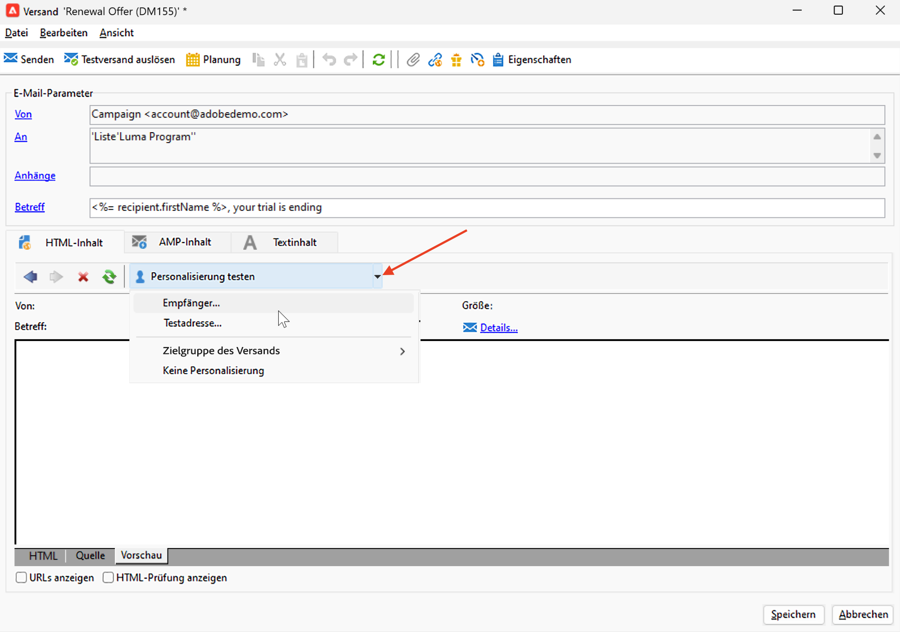
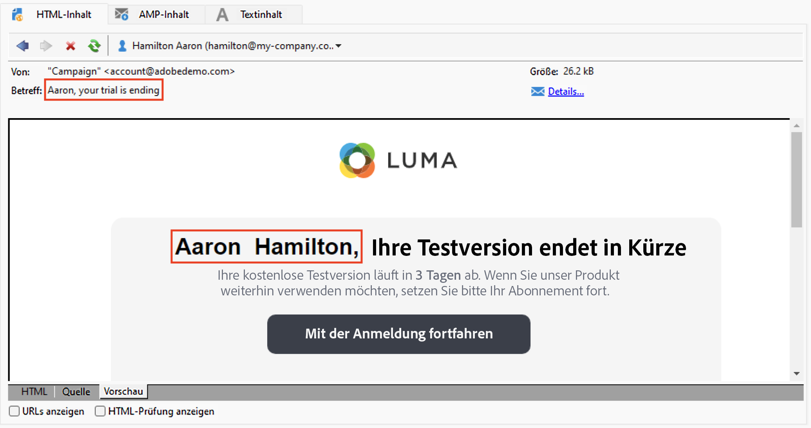
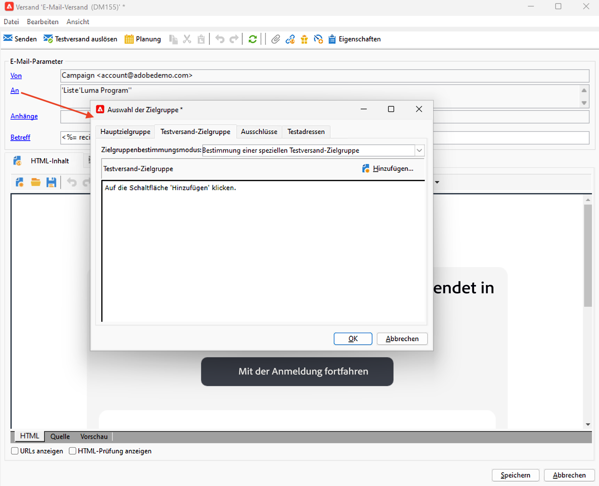
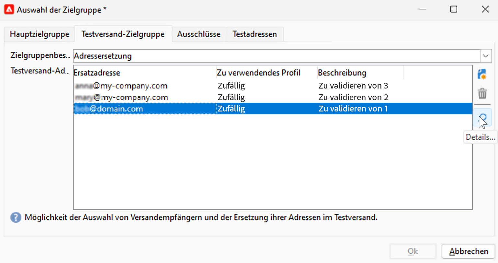
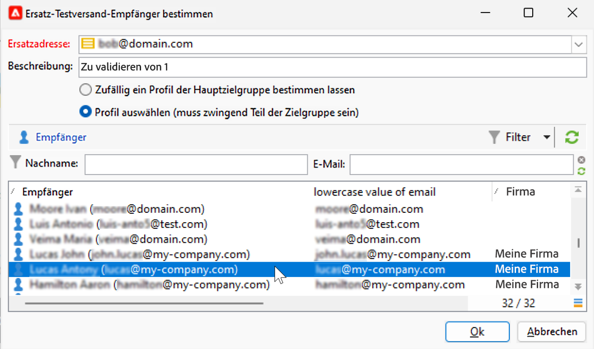
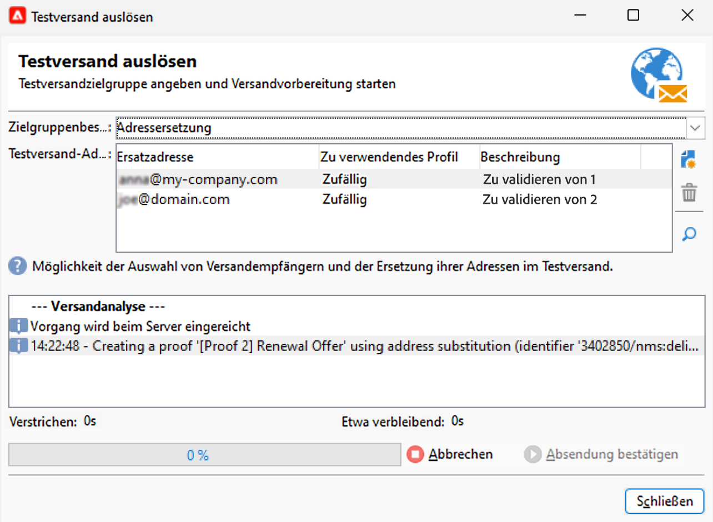
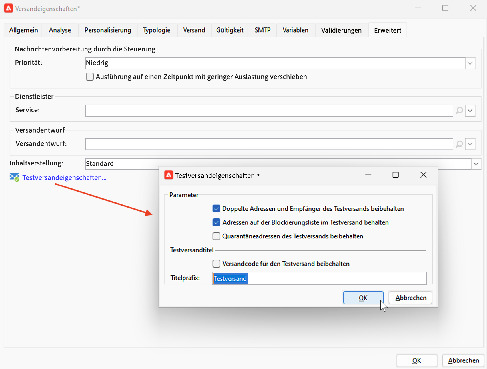

# Erstellen einer E-Mail-Vorschau und Testen einer E-Mail {#preview-test}

Sobald der Nachrichteninhalt definiert worden ist, können Sie ihn mithilfe von Testprofilen in der Vorschau sehen und testen. Wenn Sie [personalisierte Inhalte](personalize.md) eingefügt haben, können Sie mithilfe von Testprofildaten überprüfen, wie diese Inhalte in der Nachricht angezeigt werden. Zusätzlich können Sie Testsendungen an Testprofile durchführen, um mögliche Fehler im Nachrichteninhalt oder in den Personalisierungseinstellungen zu erkennen. Bei jeder Änderung sollte ein Testversand durchgeführt werden, um den aktuellen Inhalt zu validieren.

## Inhaltsvorschau{#preview-content}

Bevor Sie Testsendungen durchführen, sollten Sie den Nachrichteninhalt im Vorschaubereich des Versandfensters überprüfen.

Gehen Sie wie folgt vor, um eine Vorschau des Nachrichteninhalts anzuzeigen:

1. Navigieren Sie zur Registerkarte **Vorschau** des Versands.
1. Klicken Sie auf **[!UICONTROL Personalisierung testen]**, um ein Profil zum Ausfüllen der Personalisierungsdaten auszuwählen. Sie können eine bestimmte Empfängerin bzw. einen Empfänger in der Datenbank oder eine Testadresse auswählen oder ein Profil aus der Zielgruppe auswählen, sofern diese bereits definiert worden ist. Sie können den Inhalt auch ohne Personalisierung überprüfen.

   

1. Die Vorschau wird erzeugt, damit Sie das Rendern der Nachricht überprüfen können. In der Nachrichtenvorschau werden personalisierte Elemente durch die ausgewählten Testprofildaten ersetzt.

   

1. Wählen Sie weitere Testprofile aus, um das E-Mail-Rendering für jede Variante Ihrer Nachricht in der Vorschau anzuzeigen.

## Durchführen eines Testversands {#send-proofs}

Mit Testsendungen können Sie den Abmelde-Link, die Mirrorseite und andere Links testen, die Nachricht validieren, die Anzeige von Bildern überprüfen, mögliche Fehler erkennen etc. Außerdem können Sie Ihr Design und die Darstellung auf verschiedenen Geräten testen.

Ein Testversand dient der Validierung einer Nachricht, bevor sie an die Haupt-Audience gesendet wird. Die Empfängerinnen und Empfänger des Testversands sind für die Validierung der Nachricht verantwortlich: Rendering, Inhalt, Personalisierungseinstellungen, Konfiguration.

### Testversand-Empfängerinnen und -Empfänger {#proofs-recipients}

Die Testversand-Zielgruppe kann in der Versandvorlage oder versandspezifisch definiert werden. Navigieren Sie in beiden Fällen über den Link **[!UICONTROL An]** zum Bildschirm der Zielgruppenbestimmung und wählen Sie die Registerkarte **[!UICONTROL Testversand-Zielgruppe]** aus.

Der Typ der Testversand-Zielgruppe wird aus der Dropdown-Liste **[!UICONTROL Zielgruppenbestimmungsmodus]** ausgewählt.

* Verwenden Sie die Option **[!UICONTROL Bestimmung einer speziellen Testversand-Zielgruppe]**, um die Empfängerinnen und Empfänger in der Datenbank als die Testversand-Zielgruppe auszuwählen.
* Verwenden Sie die Option **[!UICONTROL Adressersetzung]** zur Eingabe der E-Mail-Adressen und zur Validierung des Inhalts mithilfe der Zielgruppen-Empfängerdaten. Die Ersatzadressen können manuell eingegeben oder aus der Dropdown-Liste ausgewählt werden. Die zugehörige Auflistung ist die Ersatzadresse (rcpAddress).
Standardmäßig wird die Ersetzung nach dem Zufallsprinzip durchgeführt. Sie können jedoch eine bestimmte Empfängerin oder einen bestimmten Empfänger aus der Hauptzielgruppe über das **[!UICONTROL Detail]**-Symbol auswählen.

   {width="800" align="left"}

   Wählen Sie die Option **[!UICONTROL Profil auswählen (muss Teil der Zielgruppe sein)]** und wählen Sie eine Empfängerin oder einen Empfänger aus.

   {width="800" align="left"}

* Verwenden Sie die Option **[!UICONTROL Testadressen]** zur Verwendung von Testadressen als Testversand-Zielgruppe. Diese Adressen können aus einer Datei importiert oder manuell eingegeben werden.

   >[!NOTE]
   >
   >Testadressen gehören nicht zur Standard-Empfängertabelle (nms:recipient), sondern werden in einer separaten Tabelle erstellt. Wenn Sie die Empfängertabelle um neue Daten erweitern, müssen Sie die Testadressen-Tabelle ebenfalls um die gleichen Daten erweitern.

   Weitere Informationen über Testadressen finden Sie in der [Dokumentation zu Campaign Classic v7](https://experienceleague.adobe.com/docs/campaign-classic/using/sending-messages/using-seed-addresses/about-seed-addresses.html?lang=de){target="_blank"}.

* Verwenden Sie die Option **[!UICONTROL Spezifische Zielgruppen und Testadressen]** zur Kombination von Testadressen und spezifischen E-Mail-Adressen. Die entsprechenden Konfigurationen werden dann in zwei separaten Unterregisterkarten definiert.

### Durchführen eines Testversands{#proofs-send}

Gehen Sie wie folgt vor, um einen Testversand durchzuführen:

1. Klicken Sie im Bildschirm zur Nachrichtendefinition auf die Schaltfläche **[!UICONTROL Testversand durchführen]**.
1. Überprüfen Sie im Fenster **[!UICONTROL Testversand durchführen]** die Empfängerinnen und Empfänger des Testversands.
1. Klicken Sie auf **[!UICONTROL Analysieren]**, um die Vorbereitung der Testversand-Nachricht zu starten.

   {width="800" align="left"}

1. Sobald die Versandvorbereitung abgeschlossen ist, verwenden Sie die Option **[!UICONTROL Versand bestätigen]**, um mit dem Versand von Testversandnachrichten zu beginnen.

Navigieren Sie zur Registerkarte **[!UICONTROL Audit]** des Versands, um den Versand der Testsendungen zu überprüfen.

Es wird empfohlen, nach jeder Änderung am Nachrichteninhalt Testsendungen durchzuführen.

>[!NOTE]
>
>Bei Testsendungen ist der Link zur Mirrorseite nicht aktiv. Er wird nur in den endgültigen Nachrichten aktiviert.

### Eigenschaften des Testversands{#proofs-properties}

Die Eigenschaften des Testversands werden im Abschnitt **[!UICONTROL Erweitert]** im Fenster der Versandeigenschaften festgelegt. Klicken Sie auf den Link **[!UICONTROL Testversandeigenschaften...]**, um die Parameter und den Titel der Testsendungen zu definieren. Sie können wählen, Folgendes beizubehalten:

* Doppelte Adressen im Testversand
* Adressen auf der Blockierungsliste im Testversand
* In Quarantäne befindliche Adressen im Testversand

Standardmäßig werden Testversandnachrichten durch die Variable `Proof #N` im Betreff identifiziert. Dabei ist `N` die Nummer des Testversands. Diese Nummer wird bei jeder Analyse des Testversands erhöht. Sie können das Präfix `proof` bei Bedarf ändern.

{width="800" align="left"}

## Anleitungsvideo {#video-proof}

Hier erfahren Sie, wie Sie einen E-Mail-Testversand durchführen und validieren.

>[!VIDEO](https://video.tv.adobe.com/v/333404)
