# Überarbeitete Konfiguration für Push-Benachrichtigungen {#push-notifications-config}

Campaign v8.5 führt unseren neuesten Push-Benachrichtigungsdienst ein. Dieser wird durch ein robustes Framework gestützt, das auf moderner Spitzentechnologie aufbaut. Dieser Dienst wurde entwickelt, um neue Ebenen der Skalierbarkeit zu erschließen und sicherzustellen, dass Ihre Benachrichtigungen eine größere Zielgruppe mit nahtloser Effizienz erreichen können. Mit unserer verbesserten Infrastruktur und optimierten Prozessen können Sie höhere Skalierbarkeit und Zuverlässigkeit erwarten, die es Ihnen ermöglicht, mit Ihren App-Nutzenden wie nie zuvor in Kontakt zu treten und Verbindungen herzustellen.

>[!AVAILABILITY]
>
> Diese Funktion steht nur neuen Kundinnen und Kunden ab Campaign v8.5 zur Verfügung und wird schrittweise für ausgewählte Kundinnen und Kunden eingeführt. Wenn Ihre Umgebung vor Juni 2023 bereitgestellt wurde, gilt diese Seite nicht für Sie und Sie müssen die [auf dieser Seite](push-settings.md) erläuterten Verfahren befolgen.

Führen Sie im Kontext dieser aktualisierten Implementierung die folgenden Schritte aus, um Push-Benachrichtigungen in Adobe Campaign zu senden:

1. [Erstellen einer App-Oberfläche in der Adobe Experience Platform-Datenerfassung](#create-app-surface)

1. [Konfigurieren der Anwendungseinstellungen in Adobe Campaign](#push-config-campaign)

1. [Erstellen und Konfigurieren einer Mobile-Eigenschaft in der Adobe Experience Platform-Datenerfassung](#create-mobile-property)

1. [Hinzufügen der Adobe Experience Platform Assurance-Erweiterung von Adobe](https://developer.adobe.com/client-sdks/documentation/platform-assurance-sdk/){target="_blank"}(empfohlen)

1. [Hinzufügen von Campaign Classic zur App](#campaign-mobile-ap)

1. [Erstellen eines Versands sowohl für iOS als auch für Android](##push-create)

>[!NOTE]
>
> Legacy-FCM und APNS p12 werden von der Datenerfassung nicht unterstützt.

## Erstellen einer App-Oberfläche in der Adobe Experience Platform-Datenerfassung {#create-app-surface}

Sie müssen Ihre Push-Anmeldedaten für Apps in der [!DNL Adobe Experience Platform Data Collection] hinzufügen.

Die Registrierung der Push-Anmeldedaten für Apps ist erforderlich, damit Adobe Push-Benachrichtigungen in Ihrem Namen senden kann. Gehen Sie wie folgt vor:

1. Wählen Sie von der [!DNL Adobe Experience Platform Data Collection] aus die Registerkarte **[!UICONTROL App-Oberflächen]** im linken Panel.

1. Klicken Sie auf **[!UICONTROL App-Oberfläche erstellen]**, um eine neue Konfiguration zu erstellen.

   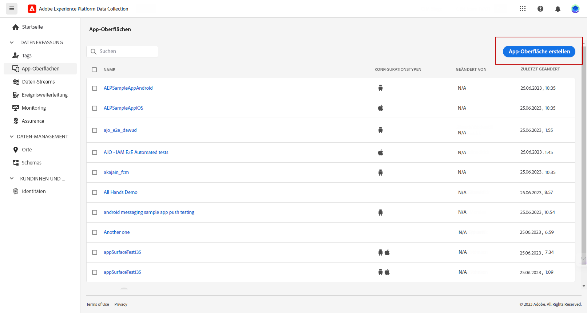

1. Geben Sie einen **[!UICONTROL Namen]** für die Konfiguration ein.

1. Wählen Sie unter **[!UICONTROL App-Konfiguration]** das Betriebssystem:

   * **Für iOS**

     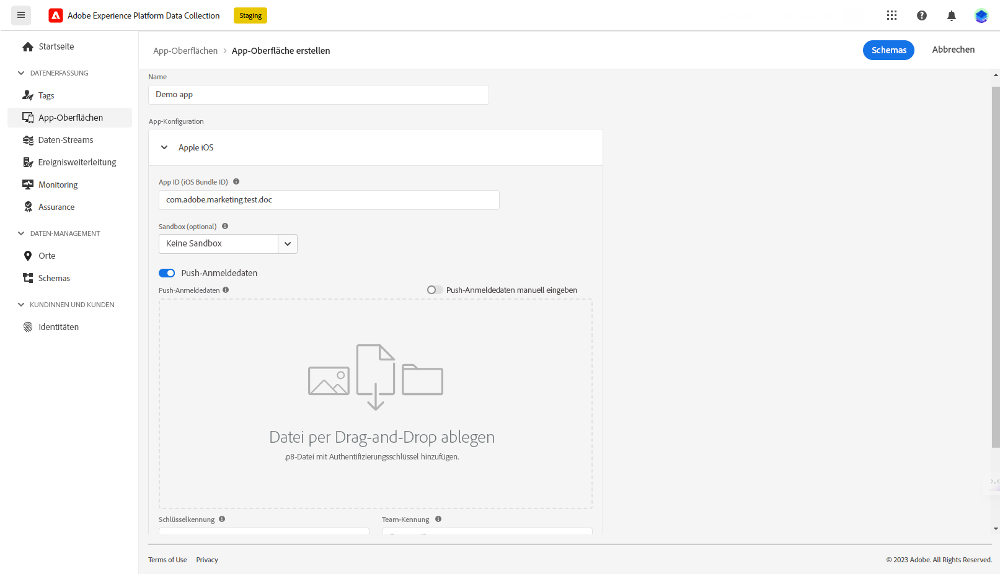

      1. Geben Sie die **Paket-ID** der App in das Feld **[!UICONTROL App ID (iOS Bundle ID)]** ein.

         Die Paket-ID der App finden Sie auf der Registerkarte **Allgemein** des primären Ziels in **XCode** Ihres Apple-Entwicklerkontos.

      1. Schalten Sie **[!UICONTROL Push-Anmeldedaten]** ein, um Ihre Anmeldedaten hinzuzufügen.

      1. Ziehen Sie die .p8-Datei mit dem Apple-Authentifizierungsschlüssel für Push-Benachrichtigungen per Drag-und-Drop in den Arbeitsbereich.

         Dieser Schlüssel kann über die Seite **Zertifikate**, **Kennungen** und **Profile** Ihres Apple-Entwicklerkontos erworben werden.

      1. Stellen Sie die **Schlüssel-ID** bereit. Dies ist eine 10-stellige Zeichenfolge, die bei der Erstellung des p8-Authentifizierungsschlüssels zugewiesen wurde.

         Sie finden diese auf der Registerkarte **Schlüssel** auf der Seite **Zertifikate**, **Kennungen** und **Profile** Ihres Apple-Entwicklerkontos.

      1. Stellen Sie die **Team-ID** bereit. Dies ist ein Zeichenfolgenwert, der auf der Registerkarte **Mitgliedschaft** zu finden ist.

   * **Für Android**

     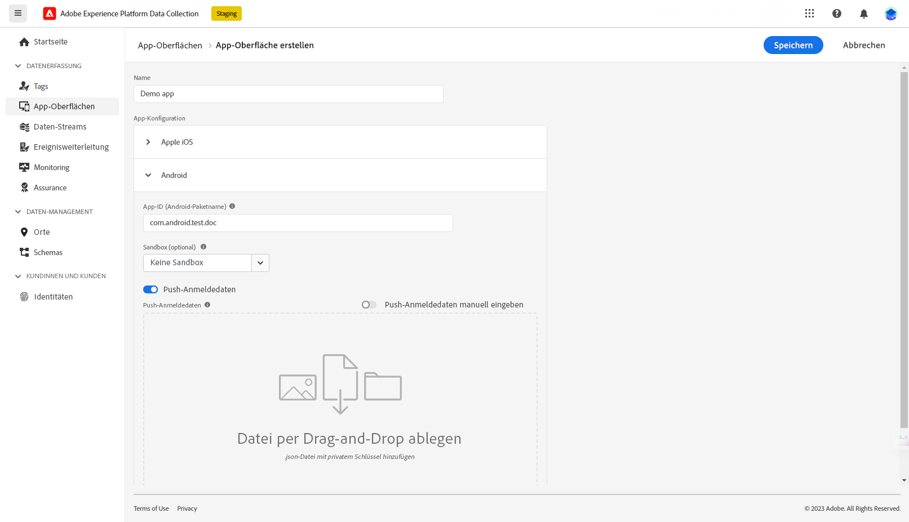

      1. Stellen Sie die **[!UICONTROL App-ID (Android-Paketname)]** bereit. Normalerweise ist der Paketname die App-ID in Ihrer `build.gradle`-Datei.

      1. Wechseln Sie zu **[!UICONTROL Push-Anmeldedaten]**, um Ihre Anmeldedaten hinzuzufügen.

      1. Ziehen Sie die FCM-Push-Anmeldedaten per Drag-und-Drop in den Arbeitsbereich. Weitere Informationen zum Abrufen der Push-Anmeldedaten finden Sie in der [Google-Dokumentation](https://firebase.google.com/docs/admin/setup#initialize-sdk){target="_blank"}.

1. Klicken Sie auf **[!UICONTROL Speichern]**, um Ihre App-Konfiguration zu erstellen.

## Konfigurieren der Anwendungseinstellungen in Adobe Campaign{#push-config-campaign}

### Erstellen eines Dienstes {#create-service}

Bevor Sie Push-Benachrichtigungen senden, müssen Sie Ihre Einstellungen für iOS- und Android-Apps in Adobe Campaign definieren.

Push-Benachrichtigungen werden über einen dedizierten Dienst an die Benutzerinnen und Benutzer Ihrer App gesendet. Wenn Benutzerinnen und Benutzer Ihre Anwendung installieren, abonnieren sie diesen Dienst: Adobe Campaign greift auf diesen Dienst zurück, um nur die Abonnentinnen und Abonnenten Ihrer App anzusprechen. In diesem Dienst müssen Sie Ihre iOS- und Android-Apps hinzufügen, um etwas auf iOS- und Android-Geräten zu senden.

Gehen Sie wie folgt vor, um einen Dienst zum Senden von Push-Benachrichtigungen zu erstellen:

1. Navigieren Sie zu **[!UICONTROL Profile und Zielgruppen > Services und Abonnements]** und klicken Sie auf **[!UICONTROL Erstellen]**.

   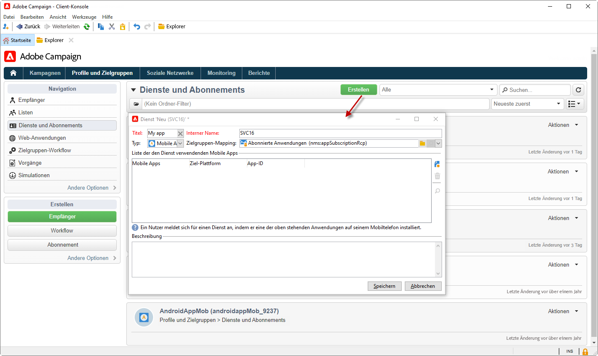{width="800" align="left"}

1. Geben Sie einen **[!UICONTROL Titel]** und einen **[!UICONTROL internen Namen]** ein und wählen Sie den Typ **[!UICONTROL Mobile App]** aus.

   >[!NOTE]
   >
   >Das standardmäßig vorgeschlagene Zielgruppen-Mapping **[!UICONTROL Abonnierte Anwendungen (nms:appSubscriptionRcp)]** bezieht sich auf die Empfängertabelle. Wenn Sie ein anderes Zielgruppen-Mapping verwenden wollen, haben Sie die Möglichkeit, im Feld **[!UICONTROL Zielgruppen-Mapping]** des Service ein neues Zielgruppen-Mapping anzugeben. Weitere Informationen über Zielgruppen-Mapping finden Sie auf [dieser Seite](../audiences/target-mappings.md).

1. Klicken Sie dann auf das Symbol **[!UICONTROL Hinzufügen]** oben rechts, um die Mobile Apps zu definieren, die diesen Dienst verwenden.

   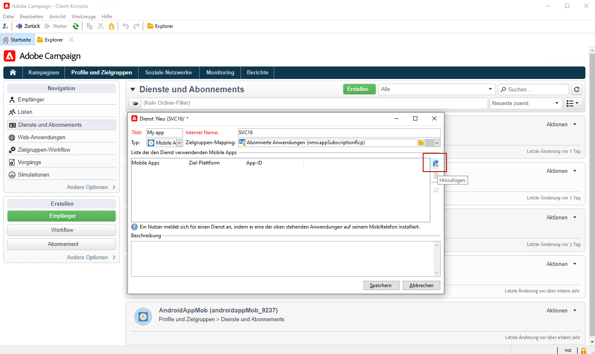

### Erstellen einer App {#create-sapp}

Nachdem Sie Ihren Dienst erstellt haben, müssen Sie jetzt die Apps definieren, die diesen Dienst verwenden werden.

>[!BEGINTABS]

>[!TAB iOS]

Gehen Sie wie folgt vor, um eine App für iOS-Geräte zu erstellen:

1. Klicken Sie in Ihrem Dienst auf **[!UICONTROL Hinzufügen]** und wählen Sie **[!UICONTROL iOS-Anwendung erstellen]**. Klicken Sie auf **[!UICONTROL Weiter]**.

   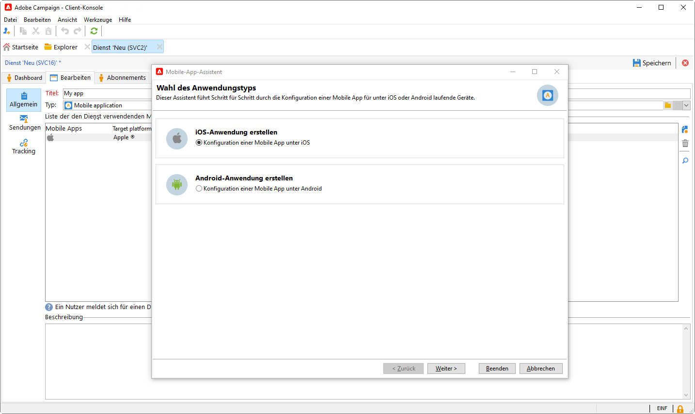

1. Wählen Sie im Fenster **[!UICONTROL Launch-App-Konfigurationsliste]** die zuvor in diesem Abschnitt erstellte App-Oberfläche aus. Klicken Sie auf **[!UICONTROL Weiter]**.

   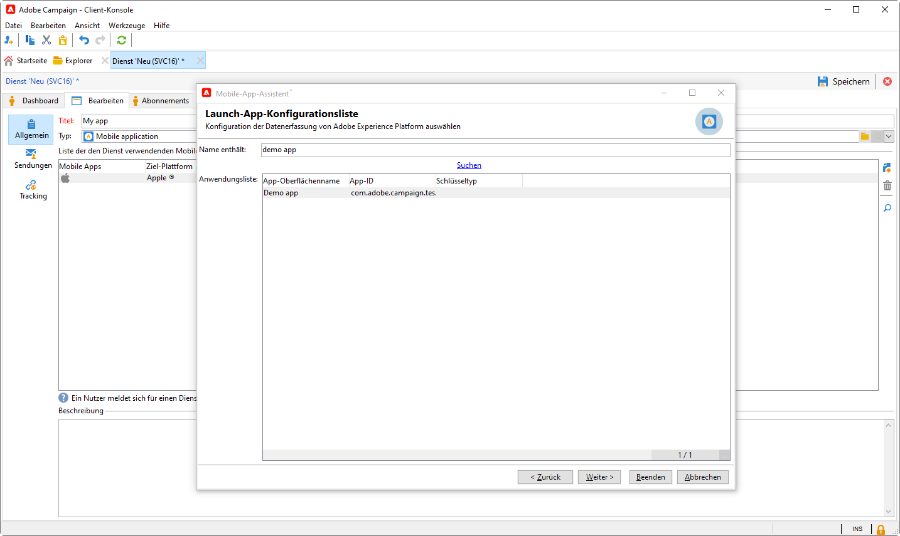

1. (Optional) Sie können den Inhalt einer Push-Nachricht mit einigen **[!UICONTROL Anwendungsvariablen]** anreichern. Diese sind vollständig anpassbar und Teil der an das mobile Gerät gesendeten Nachrichten-Payload.

   Im folgenden Beispiel werden die Variablen **mediaURl** und **mediaExt** hinzugefügt, um eine Rich-Push-Benachrichtigung zu erstellen. Danach wird der App das Bild bereitgestellt, das in der Benachrichtigung angezeigt werden soll.

   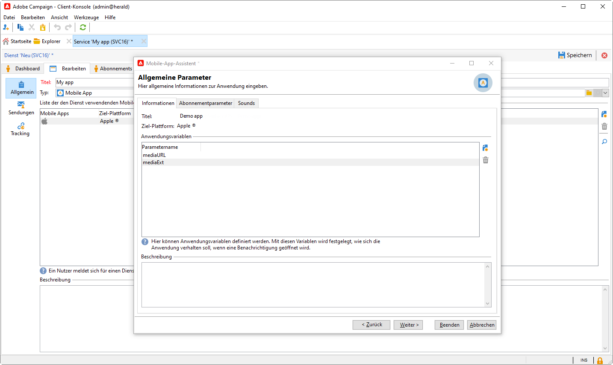

1. Auf der Registerkarte **[!UICONTROL Abonnementparameter]** können Sie das Mapping mit einer Erweiterung des Schemas **[!UICONTROL Abonnierte Anwendungen (nms:appsubscriptionRcp)]** definieren.

1. Navigieren Sie zur Registerkarte **[!UICONTROL Töne]**, um einen Ton festzulegen, der wiedergegeben werden soll. Klicken Sie auf **[!UICONTROL Hinzufügen]** und füllen Sie das Feld **[!UICONTROL Interner Name]** aus, das den Namen der in die Anwendung eingebetteten Datei oder den Namen des Systemtons enthalten muss.

1. Klicken Sie auf **[!UICONTROL Weiter]**, um mit dem Konfigurieren der Entwicklungsanwendung zu beginnen.

1. Der **[!UICONTROL Integrationsschlüssel]** ist für jede Anwendung spezifisch. Er verknüpft die App mit Adobe Campaign und wird bei der Konfiguration der Campaign-Erweiterung verwendet.

   Stellen Sie sicher, dass in Adobe Campaign und im Appcode über das SDK derselbe **[!UICONTROL Integrationsschlüssel]** definiert ist 

   Weitere Informationen finden Sie in der [Developer-Dokumentation](https://developer.adobe.com/client-sdks/documentation/adobe-campaign-classic/#configuration-keys){target="_blank"}

   >[!NOTE]
   >
   > Der **[!UICONTROL Integrationsschlüssel]** kann mit einem Zeichenfolgenwert vollständig angepasst werden, muss jedoch mit dem im SDK angegebenen Schlüssel identisch sein.
   >
   > Sie können nicht dasselbe Zertifikat sowohl für die Entwicklungsversion (Sandbox) als auch für die Produktionsversion der Anwendung verwenden.

   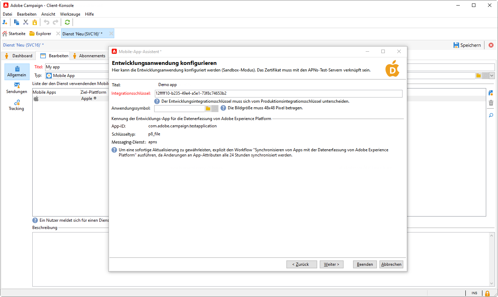

1. Wählen Sie im Feld **[!UICONTROL Anwendungssymbol]** das Symbol aus, um die Mobile App in Ihrem Dienst zu personalisieren.

1. Nun können Sie die Produktions-App konfigurieren, indem Sie auf **[!UICONTROL Weiter]** klicken und nach dem gleichen Verfahren wie oben beschrieben vorgehen. Sie können nicht denselben **[!UICONTROL Integrationsschlüssel]** sowohl für die Entwicklungsversion (Sandbox) als auch für die Produktionsversion der App verwenden.

1. Klicken Sie auf **[!UICONTROL Beenden]**.

Ihre iOS-Anwendung kann jetzt in Campaign verwendet werden.

>[!TAB Android]

Gehen Sie wie folgt vor, um eine App für Android-Geräte zu erstellen:

1. Klicken Sie in Ihrem Dienst auf **[!UICONTROL Hinzufügen]** und wählen Sie **[!UICONTROL Android-Anwendung erstellen]**. Klicken Sie auf **[!UICONTROL Weiter]**.

   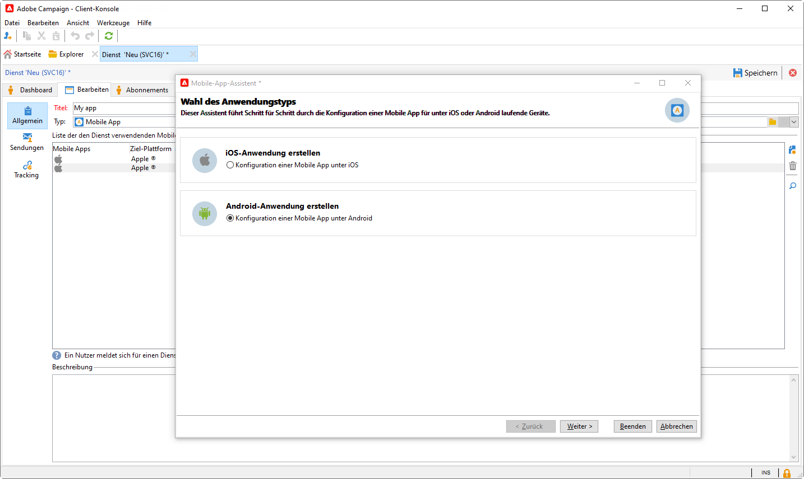

1. Wählen Sie im Fenster **[!UICONTROL Launch-App-Konfigurationsliste]** die in diesem Abschnitt erstellte App-Oberfläche aus und klicken Sie auf **[!UICONTROL Weiter]**.

   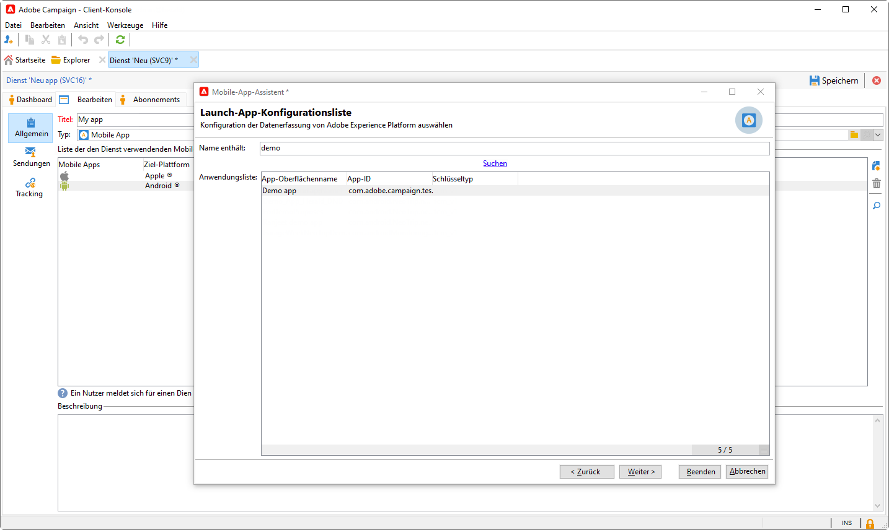

1. Der Integrationsschlüssel ist für jede Anwendung spezifisch. Er verknüpft die App mit Adobe Campaign und wird bei der Konfiguration der Campaign-Erweiterung verwendet.

   Stellen Sie sicher, dass in Adobe Campaign und im Appcode über das SDK derselbe **[!UICONTROL Integrationsschlüssel]** definiert ist 

   Weitere Informationen finden Sie in der [Developer-Dokumentation](https://developer.adobe.com/client-sdks/documentation/adobe-campaign-classic/#configuration-keys){target="_blank"}

   >[!NOTE]
   >
   > Der **[!UICONTROL Integrationsschlüssel]** kann mit einem Zeichenfolgenwert vollständig angepasst werden, muss jedoch mit dem im SDK angegebenen Schlüssel identisch sein.

   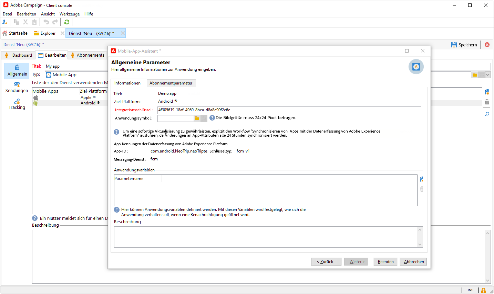

1. Wählen Sie im Feld **[!UICONTROL Anwendungssymbol]** das Symbol aus, um die Mobile App in Ihrem Dienst zu personalisieren.

1. Bei Bedarf können Sie die Inhalte von Push-Nachrichten mit bestimmten **[!UICONTROL Anwendungsvariablen]** anreichern. Diese sind vollständig anpassbar und Teil der an das mobile Gerät gesendeten Nachrichten-Payload.

1. Auf der Registerkarte **[!UICONTROL Abonnementparameter]** können Sie das Mapping mit einer Erweiterung des Schemas **[!UICONTROL Abonnierte Anwendungen (nms:appsubscriptionRcp)]** definieren.

1. Klicken Sie auf **[!UICONTROL Beenden]** und danach auf **[!UICONTROL Speichern]**.

Ihre Android-Anwendung kann jetzt in Campaign verwendet werden.

>[!ENDTABS]

Im Folgenden finden Sie die FCM-Payload-Namen, mit denen Sie Ihre Push-Benachrichtigung weiter personalisieren können:

| Nachrichtentyp | Konfigurierbares Nachrichtenelement (FCM-Payload-Name) | Konfigurierbare Optionen (Name der FCM-Payload) |
|:-:|:-:|:-:|
| Datennachricht | K. A. | validate_only |
| Benachrichtigungsinhalt | title, body, android_channel_id, icon, sound, tag, color, click_action, image, ticker, sticky, visibility, notification_priority, notification_count   | validate_only |

## Einrichten einer Mobile-Eigenschaft in der Adobe Experience Platform-Datenerfassung {#create-mobile-property}

1. Rufen Sie auf der Homepage der Datenerfassung das Menü „Tags“ auf.

1. Klicken Sie auf **[!UICONTROL Neue Eigenschaft]**.

   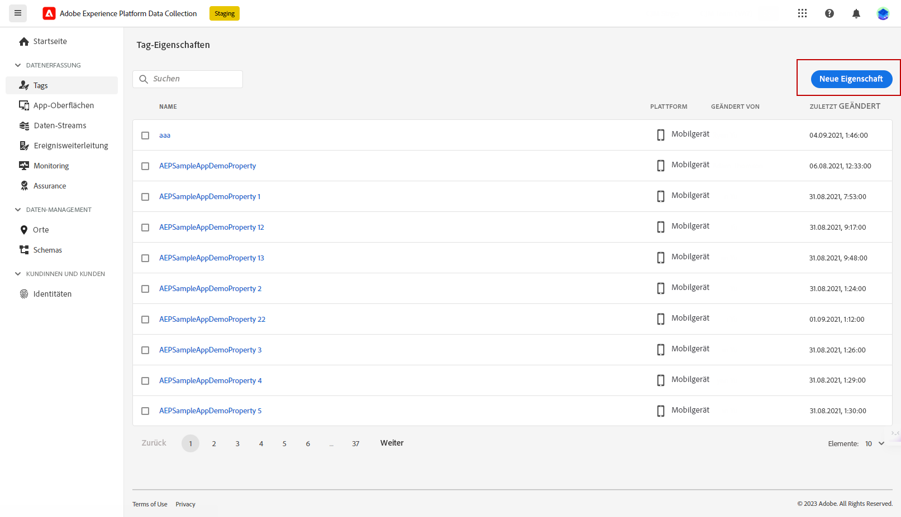

1. Geben Sie einen Namen für die Eigenschaft ein und wählen Sie **[!UICONTROL Mobile]** als Plattform.

   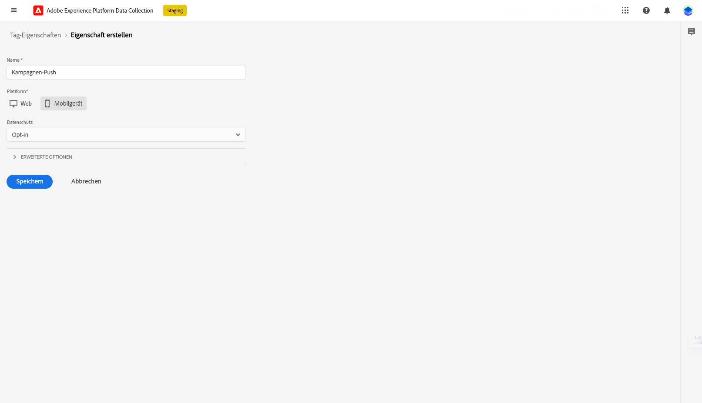

1. Klicken Sie auf **[!UICONTROL Speichern]**, um die Mobile-Eigenschaft zu erstellen.

1. Greifen Sie auf Ihre neu erstellte Mobile-Eigenschaft zu.

1. Rufen Sie über das Dashboard Ihrer Mobile-Eigenschaften erst das Menü **[!UICONTROL Erweiterungen]** und dann die Registerkarte **[!UICONTROL Katalog]** auf.

   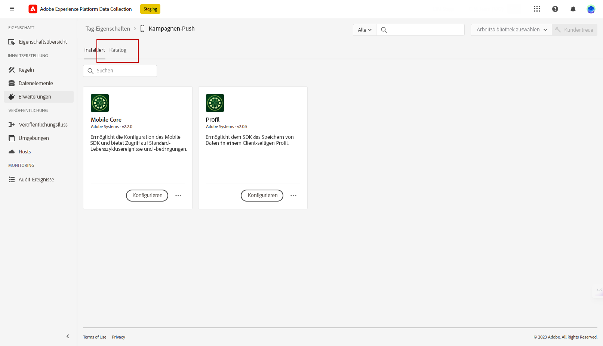

1. Installieren Sie die **[!DNL Adobe Campaign Classic]**-Erweiterung. [Weitere Informationen zur Campaign-Erweiterung](https://developer.adobe.com/client-sdks/documentation/adobe-campaign-classic/#configure-campaign-classic-extension)

   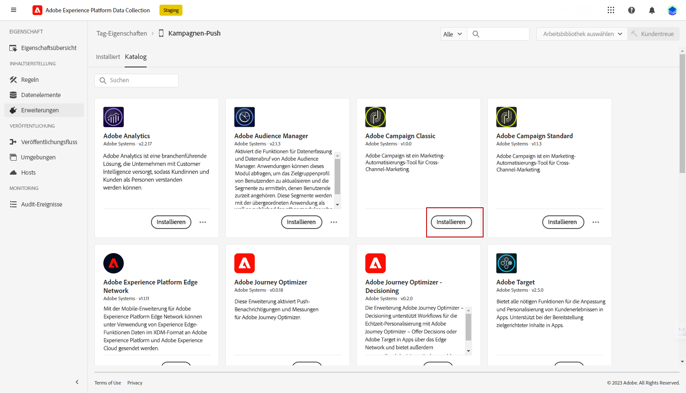

1. Füllen Sie Ihre Instanzdetails aus:

   * Die URLs für den **[!UICONTROL Registrierungs-Endpunkt]** oder **[!UICONTROL Tracking-Endpunkt]** finden Sie im Abschnitt **[!UICONTROL Tools]** > **[!UICONTROL Erweitert]** > **[!UICONTROL Bereitstellungsassistent]** in Campaign.
   * **[!UICONTROL Integrationsschlüssel]** finden Sie in der App, die in [diesem Abschnitt](#create-app) konfiguriert ist.

   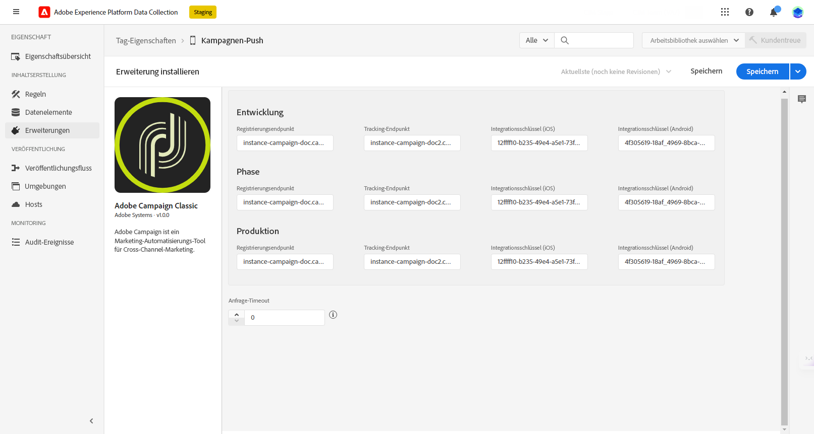

1. Klicken Sie auf **[!UICONTROL Speichern]**.

1. Sie müssen die Konfiguration jetzt über das Menü **[!UICONTROL Veröffentlichungsfluss]** veröffentlichen. [Weitere Informationen](https://developer.adobe.com/client-sdks/documentation/getting-started/create-a-mobile-property/#publish-the-configuration)

Ihre Mobile-Eigenschaft wird jetzt automatisch mit dem technischen Workflow der **[!UICONTROL Adobe Experience Platform-Datenerfassung]** synchronisiert. [Weitere Informationen](../../automation/workflow/technical-workflows.md#list-technical-workflows)

## Hinzufügen von Campaign Classic zur App {#campaign-mobile-app}

Mit dem Adobe Experience Platform Mobile SDK können Sie die Experience Cloud-Lösungen und -Dienste von Adobe in mobilen Apps nutzen. Die SDK-Konfiguration wird über die Datenerfassungs-Benutzeroberfläche verwaltet, um eine flexible Konfiguration und erweiterbare, regelbasierte Integrationen zu ermöglichen.

[Weitere Informationen finden Sie in der Adobe Developer-Dokumentation](https://developer.adobe.com/client-sdks/documentation/adobe-campaign-classic/#add-campaign-classic-to-your-app){target="_blank"}.

## Erstellen der ersten Push-Benachrichtigung{#push-create}

Nachdem Sie Ihre App in der Datenerfassung erfolgreich konfiguriert haben, können Sie jetzt Push-Benachrichtigungen in Adobe Campaign erstellen und senden.

Auf [dieser Seite](push.md#push-create) finden Sie die detaillierten Elemente, die speziell für den Versand von iOS- und Android-Benachrichtigungen gelten.
