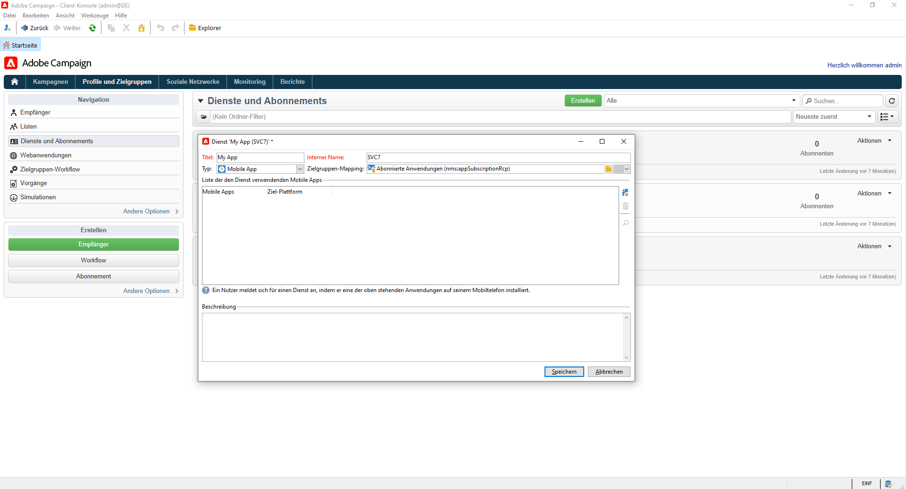
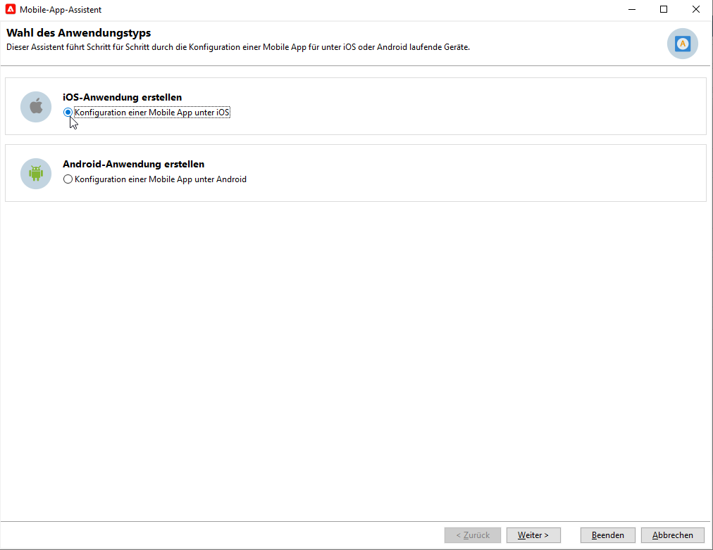
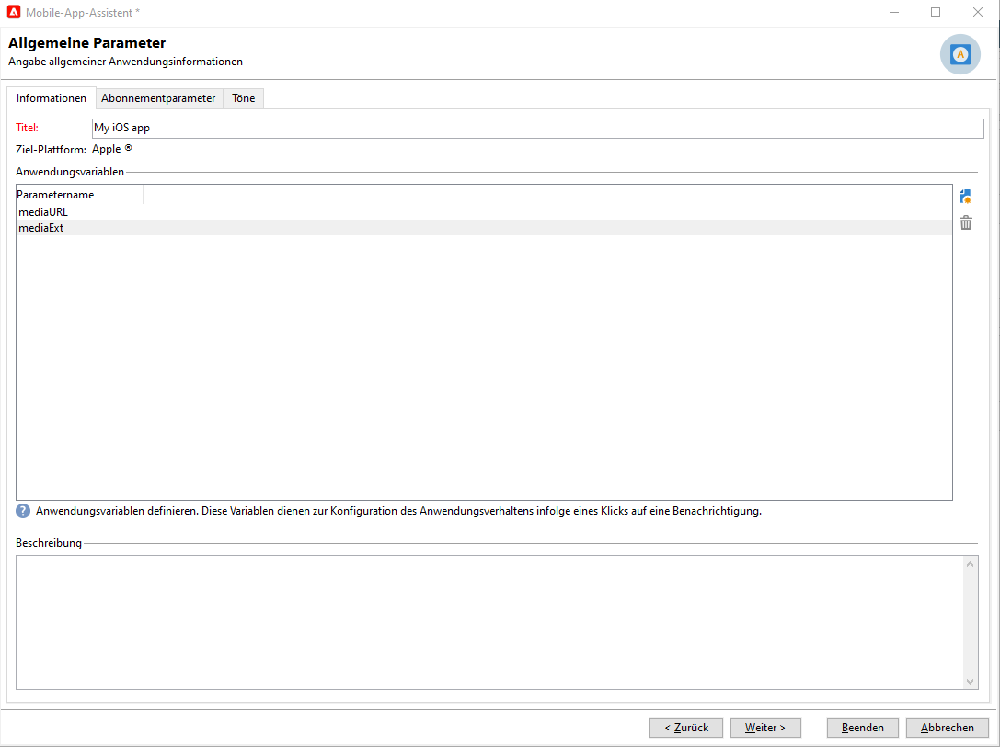
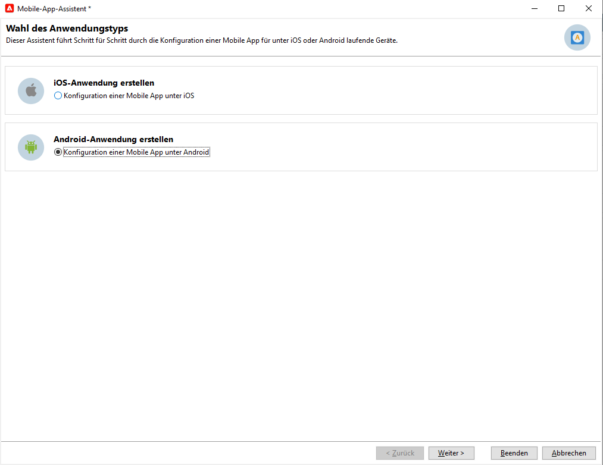

# Konfigurieren des Push-Benachrichtigungskanals {#push-notification-configuration}

Um Push-Benachrichtigungen mit Adobe Campaign zu senden, müssen Sie zunächst Ihre Umgebung und App wie auf dieser Seite beschrieben konfigurieren. In Adobe Campaign ist der Kanal zum Senden von Push-Benachrichtigungen der mobile App-Kanal.

>[!CAUTION]
>
>Einige wichtige Änderungen am FCM-Dienst (Android Firebase Cloud Messaging) werden 2024 veröffentlicht und können sich auf Ihre Implementierung von Adobe Campaign auswirken. Ihre Konfiguration der Anmeldedienste für Android-Push-Nachrichten muss möglicherweise aktualisiert werden, um diese Änderung zu unterstützen. Sie können bereits prüfen und Maßnahmen ergreifen. [Weitere Informationen](../../technotes/upgrades/push-technote.md).

Bevor Sie mit dem Versand von Push-Benachrichtigungen mit Adobe Campaign beginnen, müssen Sie sicherstellen, dass Konfigurationen und Integrationen in der Mobile App sowie für Tags in Adobe Experience Platform vorhanden sind. Das Adobe Experience Platform Mobile SDK bietet Client-seitige Integrations-APIs für Ihre Mobilgeräte über Android- und iOS-kompatible SDKs.

Gehen Sie wie folgt vor, um Ihre App mit Adobe Experience Platform Mobile SDKs einzurichten:

1. Überprüfen Sie die [Voraussetzungen](#before-starting).
1. Richten Sie eine [mobile Tag-Eigenschaft](#launch-property) in der Adobe Experience Platform-Datenerfassung ein.
1. Rufen Sie das Adobe Experience Platform Mobile SDK ab, wie [auf dieser Seite](https://developer.adobe.com/client-sdks/documentation/getting-started/get-the-sdk/) beschrieben{target="_blank"}.
1. (optional) Aktivieren Sie die Protokollierung und Lebenszyklusmetriken, wie [auf dieser Seite](https://developer.adobe.com/client-sdks/documentation/getting-started/enable-debug-logging/) beschrieben{target="_blank"}.
1. (optional) Fügen Sie [Adobe Experience Platform Assurance](https://developer.adobe.com/client-sdks/documentation/getting-started/validate/) zu Ihrer App hinzu{target="_blank"} to validate your implementation. Learn how to implement Adobe Experience Platform Assurance extension [in this page](https://developer.adobe.com/client-sdks/documentation/platform-assurance-sdk/){target="_blank"}.
1. Konfigurieren Sie Ihre Mobile Services für iOS und Android in Adobe Campaign, wie [auf dieser Seite](#push-service) beschrieben.
1. Installieren und konfigurieren Sie die [Adobe Campaign-Erweiterung](#configure-extension) in Ihrer Mobile-Eigenschaft.
1. Folgen Sie der [Dokumentation zum Adobe Experience Platform Mobile SDK](https://developer.adobe.com/client-sdks/documentation/getting-started/){target="_blank"}, um das Adobe Experience Platform Mobile SDK in Ihrer App einzurichten.

## Voraussetzungen {#before-starting}

### Einrichten von Berechtigungen {#setup-permissions}

Bevor Sie eine Mobile App erstellen, müssen Sie zunächst sicherstellen, dass Sie in Adobe Experience Platform über die richtigen Benutzerberechtigungen für Tags verfügen, oder diese Berechtigungen zuweisen. Benutzerberechtigungen für Tags in Adobe Experience Platform werden Benutzerinnen und Benutzern über Adobe Admin Console zugewiesen. Weitere Informationen finden Sie in der [Tags-Dokumentation](https://experienceleague.adobe.com/docs/experience-platform/tags/admin/user-permissions.html?lang=de){target="_blank"}.

>[!CAUTION]
>
>Die Push-Konfiguration muss von einer erfahrenen Person durchgeführt werden. Abhängig von Ihrem Implementierungsmodell und den an dieser Implementierung beteiligten Rollen müssen Sie möglicherweise den gesamten Berechtigungssatz einem einzelnen Produktprofil zuweisen oder Berechtigungen zwischen der Person, die die App entwickelt, und den **Adobe Campaign**-Admins teilen.

Gehen Sie wie folgt vor, um Rechte für **Eigenschaft** und **Firma** zuzuweisen.

1. Greifen Sie auf die **[!DNL Admin Console]** zu.
1. Wählen Sie auf der Registerkarte **[!UICONTROL Produkte]** die Karte **[!UICONTROL Datenerfassung in Adobe Experience Platform]** aus.
1. Wählen Sie ein vorhandenes **[!UICONTROL Produktprofil]** aus oder erstellen Sie mit der Schaltfläche **[!UICONTROL Neues Profil]** ein neues. Wie Sie ein **[!UICONTROL neues Profil]** erstellen, erfahren Sie in der [Dokumentation zu Admin Console](https://experienceleague.adobe.com/docs/experience-platform/access-control/ui/create-profile.html?lang=de#ui){target="_blank"}.
1. Wählen Sie auf der Registerkarte **[!UICONTROL Berechtigungen]** die Option **[!UICONTROL Eigenschaftsrechte]** aus.
1. Klicken Sie auf **[!UICONTROL Alle hinzufügen]**. Dadurch wird Ihrem Produktprofil die folgende Berechtigung hinzugefügt:
   * **[!UICONTROL Genehmigen]**
   * **[!UICONTROL Entwickeln]**
   * **[!UICONTROL Eigenschaft bearbeiten]**
   * **[!UICONTROL Umgebungen verwalten]**
   * **[!UICONTROL Erweiterungen verwalten]**
   * **[!UICONTROL Veröffentlichen]**

   Diese Berechtigungen sind erforderlich, um die Adobe Campaign-Erweiterung zu installieren und zu veröffentlichen und die App-Eigenschaft im **Adobe Experience Platform Mobile SDK** zu veröffentlichen.

1. Wählen Sie anschließend **[!UICONTROL Unternehmensrechte]** im Menü links aus.
1. Fügen Sie die folgenden Rechte hinzu:

   * **[!UICONTROL App-Konfigurationen verwalten]**
   * **[!UICONTROL Eigenschaften verwalten]**

   Diese Berechtigungen sind erforderlich, damit die Entwicklerin bzw. der Entwickler der mobilen App in der **Datenerfassung in Adobe Experience Platform** Push-Anmeldeinformationen einrichten kann.

1. Klicken Sie auf **[!UICONTROL Speichern]**.

Um dieses **[!UICONTROL Produktprofil]** für Benutzerinnen und Benutzer zuzuweisen, gehen Sie folgendermaßen vor.

1. Greifen Sie auf die **[!DNL Admin Console]** zu.
1. Wählen Sie auf der Registerkarte **[!UICONTROL Produkte]** die Karte **[!UICONTROL Datenerfassung in Adobe Experience Platform]** aus.
1. Wählen Sie das zuvor konfigurierte **[!UICONTROL Produktprofil]** aus.
1. Klicken Sie auf der Registerkarte **[!UICONTROL Benutzer]** auf **[!UICONTROL Benutzer hinzufügen]**.
1. Geben Sie den Namen oder die E-Mail-Adresse Ihrer Benutzerin bzw. Ihres Benutzers ein und wählen Sie sie bzw. ihn aus. Klicken Sie anschließend auf **[!UICONTROL Speichern]**.

   >[!NOTE]
   >
   >Wenn die Benutzerin oder der Benutzer nicht zuvor in Admin Console erstellt wurde, lesen Sie den Abschnitt [Dokumentation zum Hinzufügen von Benutzerinnen und Benutzern](https://helpx.adobe.com/de/enterprise/using/manage-users-individually.html#add-users){target="_blank"}.

### Konfigurieren der App {#configure-app}

Die technische Einrichtung erfordert eine enge Zusammenarbeit zwischen der Person, die die App entwickelt, und den Business-Admins. Bevor Sie mit dem Versand von Push-Benachrichtigungen mit [!DNL Adobe Campaign] beginnen, müssen Sie Einstellungen in [!DNL Adobe Experience Platform Data Collection] definieren und Ihre Mobile App mit Adobe Experience Platform Mobile SDKs integrieren.

Folgen Sie den Implementierungsschritten, die in den folgenden Links beschrieben werden:

* Für **Apple iOS**: Erfahren Sie in der [Apple-Dokumentation](https://developer.apple.com/documentation/usernotifications/registering_your_app_with_apns){target="_blank"}, wie Sie Ihre App mit APNs registrieren
* Für **Google Android**: Erfahren Sie in der [Google-Dokumentation](https://firebase.google.com/docs/cloud-messaging/android/client){target="_blank"}, wie Sie eine Firebase Cloud Messaging-Client-App unter Android einrichten

<!--
## Add your app push credentials in Adobe Experience Platform Data Collection {#push-credentials}

After granting the correct user permissions, you now need to add your mobile application push credentials in Adobe Experience Platform Data Collection. 

The mobile app push credential registration is required to authorize Adobe to send push notifications on your behalf. Refer to the steps detailed below:

1. From [!DNL Adobe Experience Platform Data Collection], browse to **[!UICONTROL App Surfaces]** in the left rail.

1. Click **[!UICONTROL Create App Surface]** to create a new configuration.

1. Enter a **[!UICONTROL Name]** for the configuration.

1. From **[!UICONTROL Mobile Application Configuration]**, select the system and enter settings.

    * **For iOS**

        1. Enter the mobile app **Bundle Id** in the **[!UICONTROL App ID (iOS Bundle ID)]** field. The app Bundle ID can be found in the **General** tab of the primary target in **XCode**.
        
        1. Switched on the **[!UICONTROL Push Credentials]** button to add your credentials.
        
        1. Drag and drop your .p8 Apple Push Notification Authentication Key file. This key can be acquired from the **Certificates**, **Identifiers** and **Profiles** page.

        1. Provide the **Key ID**. This is a 10 character string assigned during the creation of p8 auth key. It can be found under **Keys** tab in **Certificates**, **Identifiers** and **Profiles** page.
        
        1. Provide the **Team ID**. This is a string value which can be found under the Membership tab.

    * **For Android**

        1. Provide the **[!UICONTROL App ID (Android package name)]**: usually the package name is the app id in your `build.gradle` file.

        1. Switched on the **[!UICONTROL Push Credentials]** button to add your credentials.

        1. Drag and drop the FCM push credentials. For more details on how to get the push credentials refer to [Google Documentation](https://firebase.google.com/docs/admin/setup#initialize-sdk){target="_blank"}.
    

1. Click **[!UICONTROL Save]** to create your app configuration.
-->

## Einrichten einer Mobile-Tag-Eigenschaft in der Datenerfassung in Adobe Experience Platform {#launch-property}

Durch das Einrichten einer Mobile-Eigenschaft können Entwicklerinnen und Entwickler der Mobile App oder Marketing-Fachleute die Mobile SDKs konfigurieren. Normalerweise erstellen Sie für jede Mobile App, die Sie verwalten möchten, eine Mobile-Eigenschaft. Erfahren Sie in der [Dokumentation zum Adobe Experience Platform Mobile SDK](https://developer.adobe.com/client-sdks/documentation/getting-started/create-a-mobile-property/){target="_blank"}, wie Sie eine Mobile-Eigenschaft erstellen und konfigurieren.
<!--
To get the SDKs needed for push notification to work you will need the following SDK extensions, for both Android and iOS:

* **[!UICONTROL Mobile Core]** (installed automatically)
* **[!UICONTROL Profile]** (installed automatically)
* **[!UICONTROL Adobe Experience Platform Edge]**
* **[!UICONTROL Adobe Experience Platform Assurance]**, optional but recommended to debug the mobile implementation.
-->

Weitere Informationen über [!DNL Adobe Experience Platform Data Collection]-Tags finden Sie in der [Dokumentation zu Adobe Experience Platform](https://experienceleague.adobe.com/docs/platform-learn/implement-mobile-sdk/initial-configuration/configure-tags.html?lang=de){target="_blank"}.

Öffnen Sie nach der Erstellung die neue Tag-Eigenschaft und erstellen Sie eine Bibliothek. Gehen Sie dazu wie folgt vor:

1. Navigieren Sie in der linken Navigation zu **Veröffentlichungsfluss** und wählen Sie **Bibliothek hinzufügen** aus.
1. Geben Sie den Namen der Bibliothek ein und wählen Sie die Umgebung aus.
1. Wählen Sie **Alle geänderten Ressourcen hinzufügen** und **Speichern und für die Entwicklung erstellen** aus.
1. Legen Sie diese Bibliothek mithilfe der Schaltfläche **Arbeitsbibliothek auswählen** als Arbeitsbibliothek fest.

## Konfigurieren Ihrer Mobile Services in Campaign {#push-service}

Wenn Ihre App in [!DNL Adobe Experience Platform Data Collection] eingerichtet ist, müssen Sie zwei Services erstellen (einen für iOS-Geräte, einen für Android-Geräte), um Push-Benachrichtigungen von **[!DNL Adobe Campaign]** senden zu können.

Push-Benachrichtigungen werden über einen dedizierten Dienst an die Benutzerinnen und Benutzer Ihrer App gesendet. Wenn Benutzerinnen und Benutzer Ihre Anwendung installieren, abonnieren sie diesen Dienst: Adobe Campaign greift auf diesen Dienst zurück, um nur die Abonnentinnen und Abonnenten Ihrer App anzusprechen. In diesem Dienst müssen Sie Ihre iOS- und Android-Apps hinzufügen, um etwas auf iOS- und Android-Geräten zu senden.

Gehen Sie wie folgt vor, um einen Dienst zum Senden von Push-Benachrichtigungen zu erstellen:

1. Navigieren Sie zu **[!UICONTROL Profile und Zielgruppen > Services und Abonnements]** und klicken Sie auf **[!UICONTROL Erstellen]**.

   {width="800" align="left"}

1. Geben Sie einen **[!UICONTROL Titel]** und einen **[!UICONTROL internen Namen]** ein und wählen Sie den Typ **[!UICONTROL Mobile App]** aus.

   >[!NOTE]
   >
   >Die Standardeinstellung **[!UICONTROL Abonnierte Anwendungen (nms:appSubscriptionRcp)]** Zielgruppen-Mapping ist mit der Empfängertabelle verknüpft. Wenn Sie ein anderes Zielgruppen-Mapping verwenden möchten, müssen Sie ein neues Zielgruppen-Mapping erstellen und es im **[!UICONTROL Zielgruppen-Mapping]** -Feld des Dienstes. Weitere Informationen über Zielgruppen-Mapping finden Sie auf [dieser Seite](../audiences/target-mappings.md).

1. Klicken Sie dann auf das Symbol **[!UICONTROL Hinzufügen]** oben rechts, um die Mobile Apps zu definieren, die diesen Dienst verwenden.

>[!BEGINTABS]

>[!TAB iOS]

Gehen Sie wie folgt vor, um eine App für iOS-Geräte zu erstellen:

1. Wählen Sie **[!UICONTROL iOS-Anwendung erstellen]** aus und klicken Sie auf **[!UICONTROL Weiter]**.

   {width="600" align="left"}

1. Geben Sie den Namen Ihrer App im Feld **[!UICONTROL Titel]** ein.
1. (Optional) Sie können den Inhalt einer Push-Nachricht mit einigen **[!UICONTROL Anwendungsvariablen]** anreichern. Diese sind vollständig anpassbar und Teil der an das mobile Gerät gesendeten Nachrichten-Payload.

   Im folgenden Beispiel werden die Variablen **mediaURl** und **mediaExt** hinzugefügt, um eine Rich-Push-Benachrichtigung zu erstellen. Danach wird der App das Bild bereitgestellt, das in der Benachrichtigung angezeigt werden soll.

   {width="600" align="left"}

1. Auf der Registerkarte **[!UICONTROL Abonnementparameter]** können Sie das Mapping mit einer Erweiterung des Schemas **[!UICONTROL Abonnierte Anwendungen (nms:appsubscriptionRcp)]** definieren.

1. Navigieren Sie zur Registerkarte **[!UICONTROL Töne]**, um einen Ton festzulegen, der wiedergegeben werden soll. Klicken Sie auf **[!UICONTROL Hinzufügen]** und füllen Sie das Feld **[!UICONTROL Interner Name]** aus, das den Namen der in die Anwendung eingebetteten Datei oder den Namen des Systemtons enthalten muss.

1. Klicken Sie auf **[!UICONTROL Weiter]**, um mit dem Konfigurieren der Entwicklungsanwendung zu beginnen.

1. Der Integrationsschlüssel ist für jede Anwendung spezifisch. Dadurch wird die Mobile App mit Adobe Campaign verknüpft.

   Stellen Sie sicher, dass in Adobe Campaign und im Appcode über das SDK derselbe **[!UICONTROL Integrationsschlüssel]** definiert ist 

   Weitere Informationen finden Sie in der [Developer-Dokumentation](https://developer.adobe.com/client-sdks/documentation/adobe-campaign-classic/#configuration-keys){target="_blank"}

   >[!NOTE]
   >
   > Der **[!UICONTROL Integrationsschlüssel]** kann mit einem Zeichenfolgenwert vollständig angepasst werden, muss jedoch mit dem im SDK angegebenen Schlüssel identisch sein.
   >
   > Sie können nicht dasselbe Zertifikat sowohl für die Entwicklungsversion (Sandbox) als auch für die Produktionsversion der Anwendung verwenden.

1. Wählen Sie im Feld **[!UICONTROL Anwendungssymbol]** das Symbol aus, um die Mobile App in Ihrem Dienst zu personalisieren.

1. Wählen Sie den **[!UICONTROL Authentifizierungsmodus]** aus. Zwei Modi sind verfügbar:

   * (Empfohlen) **[!UICONTROL Token-basierte Authentifizierung]**: Füllen Sie die Verbindungseinstellungen **[!UICONTROL Schlüssel-ID]**, **[!UICONTROL Team-ID]** und **[!UICONTROL Paket-ID]** aus und wählen Sie dann Ihr p8-Zertifikat, indem Sie auf **[!UICONTROL Privaten Schlüssel eingeben...]** klicken. Weitere Informationen zur **[!UICONTROL Token-basierten Authentifizierung]** finden Sie in der [Apple-Dokumentation](https://developer.apple.com/documentation/usernotifications/setting_up_a_remote_notification_server/establishing_a_token-based_connection_to_apns){target="_blank"}.

   * **[!UICONTROL Zertifikatbasierte Authentifizierung]**: Klicken Sie auf **[!UICONTROL Zertifikat eingeben...]**. Wählen Sie dann Ihren p12-Schlüssel und geben Sie das von der Entwicklerin bzw. dem Entwickler der Mobile App bereitgestellte Passwort ein.

   Beachten Sie, dass Sie den Authentifizierungsmodus Ihrer Mobile App jederzeit über die Registerkarte **[!UICONTROL Zertifikat]** ändern können.

1. Klicken Sie auf die Schaltfläche **[!UICONTROL Verbindung testen]**, um Ihre Konfiguration zu validieren.

1. Nun können Sie die Produktionsanwendung konfigurieren, indem Sie auf **[!UICONTROL Weiter]** klicken und nach dem gleichen Verfahren wie oben beschrieben vorgehen.

1. Klicken Sie auf **[!UICONTROL Beenden]**.

Ihre iOS-Anwendung kann jetzt in Campaign verwendet werden.

>[!TAB Android]

Gehen Sie wie folgt vor, um eine App für Android-Geräte zu erstellen:

1. Wählen Sie **[!UICONTROL Android-Anwendung erstellen]** aus und klicken Sie auf **[!UICONTROL Weiter]**.

   {width="600" align="left"}

1. Geben Sie den Namen Ihrer App im Feld **[!UICONTROL Titel]** ein.
1. Der Integrationsschlüssel ist für jede Anwendung spezifisch. Dadurch wird die Mobile App mit Adobe Campaign verknüpft.

   Stellen Sie sicher, dass in Adobe Campaign und im Appcode über das SDK derselbe **[!UICONTROL Integrationsschlüssel]** definiert ist 

   Weitere Informationen finden Sie in der [Developer-Dokumentation](https://developer.adobe.com/client-sdks/documentation/adobe-campaign-classic/#configuration-keys){target="_blank"}

   >[!NOTE]
   >
   > Der **[!UICONTROL Integrationsschlüssel]** kann mit einem Zeichenfolgenwert vollständig angepasst werden, muss jedoch mit dem im SDK angegebenen Schlüssel identisch sein.
   >

1. Wählen Sie im Feld **[!UICONTROL Anwendungssymbol]** das Symbol aus, um die Mobile App in Ihrem Dienst zu personalisieren.
1. Wählen Sie **HTTP v1** in der Dropdown-Liste **[!UICONTROL API-Version]** aus.
1. Klicken Sie auf **[!UICONTROL Projekt-JSON-Datei zum Extrahieren der Projektdetails laden...]**, um Ihre JSON-Schlüsseldatei direkt zu laden. Weitere Informationen dazu, wie Sie die JSON-Datei extrahieren, finden Sie in der [Dokumentation zu Google Firebase](https://firebase.google.com/docs/admin/setup#initialize-sdk){target="_blank"}.

   Sie können auch die folgenden Details manuell eingeben:
   * **[!UICONTROL Projektkennung]**
   * **[!UICONTROL Privater Schlüssel]**
   * **[!UICONTROL Client-E-Mail]**

1. Klicken Sie auf die Schaltfläche **[!UICONTROL Verbindung testen]**, um Ihre Konfiguration zu validieren.

   >[!CAUTION]
   >
   >Mit der Schaltfläche **[!UICONTROL Verbindung testen]** wird nicht geprüft, ob der MID-Server Zugriff auf den FCM-Server hat.

1. Bei Bedarf können Sie die Inhalte von Push-Nachrichten mit bestimmten **[!UICONTROL Anwendungsvariablen]** anreichern. Diese sind vollständig anpassbar und Teil der an das mobile Gerät gesendeten Nachrichten-Payload.

1. Klicken Sie auf **[!UICONTROL Beenden]** und danach auf **[!UICONTROL Speichern]**. Ihre Android-Anwendung kann jetzt in Campaign verwendet werden.

Im Folgenden finden Sie die FCM-Payload-Namen, mit denen Sie Ihre Push-Benachrichtigung weiter personalisieren können:

| Nachrichtentyp | Konfigurierbares Nachrichtenelement (FCM-Payload-Name) | Konfigurierbare Optionen (Name der FCM-Payload) |
|:-:|:-:|:-:|
| Datennachricht | K. A. | validate_only |
| Benachrichtigungsinhalt | title, body, android_channel_id, icon, sound, tag, color, click_action, image, ticker, sticky, visibility, notification_priority, notification_count   | validate_only |

>[!ENDTABS]

## Konfigurieren der Adobe Campaign-Erweiterung in Ihrer Mobile-Eigenschaft {#configure-extension}

Die **Adobe Campaign Classic-Erweiterung** für Adobe Experience Platform Mobile SDKs ermöglicht Push-Benachrichtigungen für Ihre Mobile Apps, unterstützt Sie bei der Erfassung von Benutzer-Push-Token und verwaltet die Messung von Interaktionen mit Adobe Experience Platform-Services.

Diese Erweiterung, die sowohl für Campaign Classic v7 als auch für Campaign v8 gilt, ist in Ihrer Umgebung vorinstalliert und muss konfiguriert werden. Gehen Sie wie folgt vor, um die Erweiterung für Ihre Mobile-Tag-Eigenschaft zu konfigurieren:

1. Öffnen Sie die zuvor erstellte Tag-Eigenschaft.
1. Navigieren Sie in der linken Navigation zu **Erweiterungen** und öffnen Sie die Registerkarte **Katalog**. Verwenden Sie das Suchfeld, um die **Adobe Campaign Classic**-Erweiterung zu finden.
1. Klicken Sie auf der Karte „Campaign Classic“ auf die Schaltfläche **Installieren**.
1. Geben Sie Einstellungen ein, wie in der [Dokumentation zum Adobe Experience Platform Mobile SDK](https://developer.adobe.com/client-sdks/documentation/adobe-campaign-classic/){target="_blank"} beschrieben.

Sie können jetzt Campaign zu Ihrer App hinzufügen, wie in der [Dokumentation zum Adobe Experience Platform Mobile SDK](https://developer.adobe.com/client-sdks/documentation/adobe-campaign-classic/#add-campaign-classic-to-your-app){target="_blank"} beschrieben.
