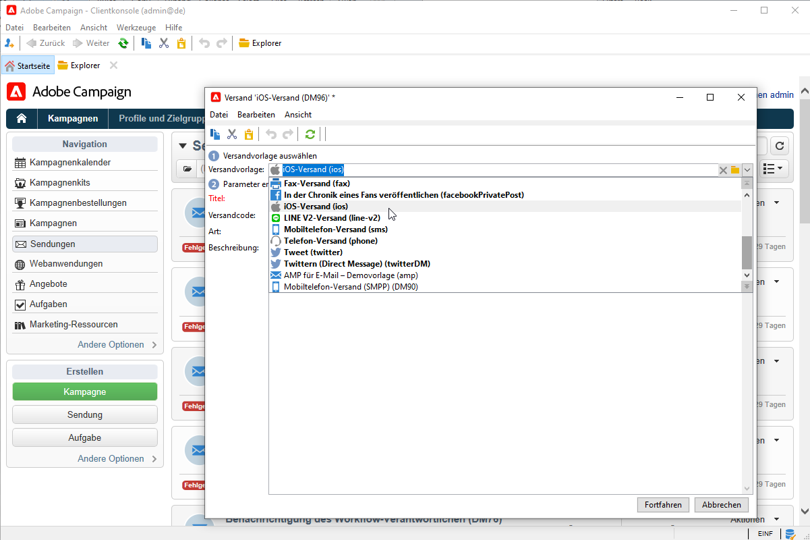
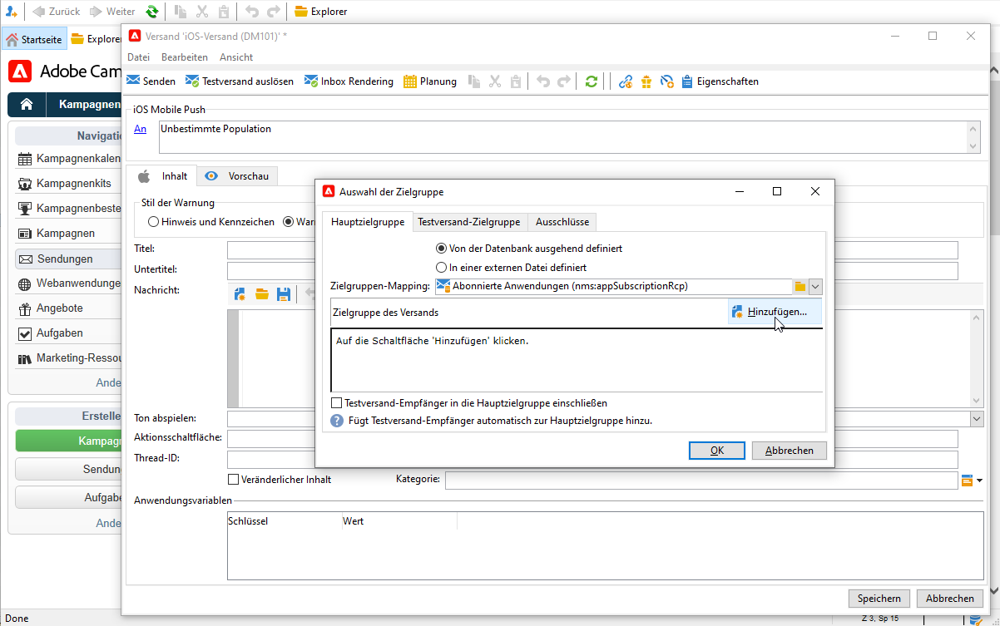
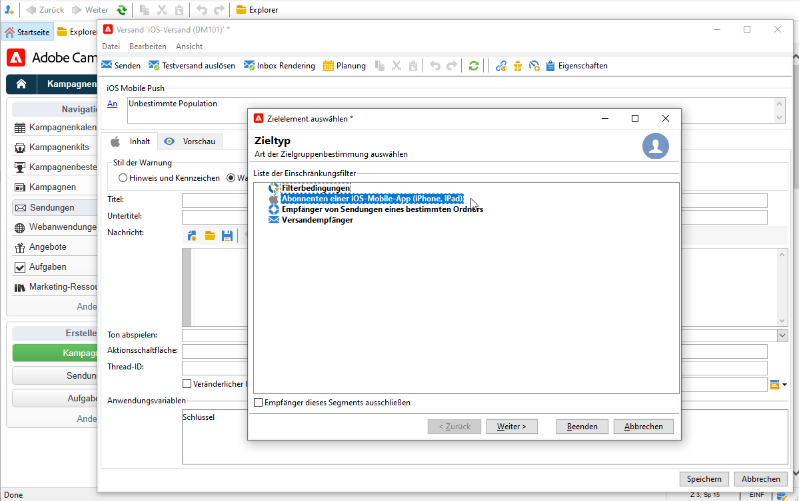
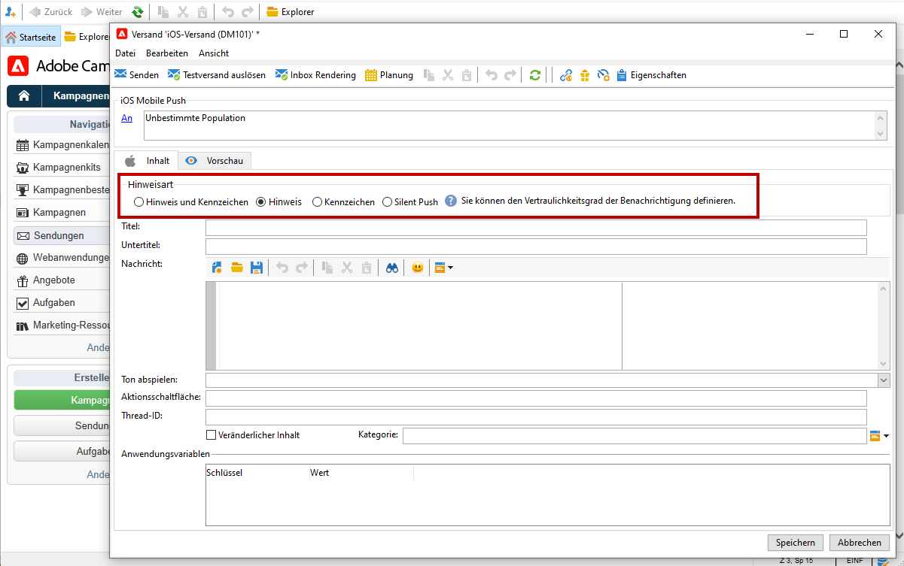

# Push-Benachrichtigungen erstellen und versenden

Sie können mittels Mobile-App-Versand Benachrichtigungen an iOS- und Android-Systeme senden.

Um Push-Benachrichtigungen in Adobe Campaign senden zu können, müssen Sie folgende Schritte befolgen:

1. Campaign-Umgebung konfigurieren
1. Erstellen Sie einen Informations-Service vom Typ &quot;Mobile App&quot; für Ihre Mobile App.
1. Fügen Sie diesem Dienst die iOS- und Android-Versionen der App hinzu.
1. Erstellen Sie je einen Versand für iOS und Android.

[!DNL :arrow_upper_right:] Informationen zu den ersten Schritten mit der mobilen App finden Sie in der Dokumentation zu  [Campaign Classic v7 .](https://experienceleague.adobe.com/docs/campaign-classic/using/sending-messages/sending-push-notifications/about-mobile-app-channel.html?lang=de)

## Mit Adobe SDK integrieren

### Campaign SDK integrieren

Über das Campaign SDK wird die Integration Ihrer Mobile App in die Adobe Campaign-Plattform umgesetzt.

[!DNL :arrow_upper_right:] Informationen zur Integration des Campaign SDK in Ihre App finden Sie in der Dokumentation zu  [Campaign Classic v7 .](https://experienceleague.adobe.com/docs/campaign-classic/using/sending-messages/sending-push-notifications/integrating-campaign-sdk-into-the-mobile-application.html?lang=de#loading-campaign-sdk)

### Campaign-Erweiterung in Launch konfigurieren

Die Integration des Adobe Experience Platform Launch SDK mit Campaign erfolgt über die Campaign Classic-Erweiterung.

[!DNL :arrow_upper_right:] Weitere Informationen finden Sie in der Dokumentation zum Mobile SDK für  [Adobe.](https://aep-sdks.gitbook.io/docs/using-mobile-extensions/adobe-campaignclassic)

## Mobile-App-Einstellungen in Campaign konfigurieren

Sie müssen die Einstellungen Ihrer iOS- bzw. Android-basierten Mobile Apps in Adobe Campaign definieren.

[!DNL :arrow_upper_right:] Die Konfigurationsrichtlinien für iOS werden in der Dokumentation zu  [Campaign Classic v7 beschrieben.](https://experienceleague.adobe.com/docs/campaign-classic/using/sending-messages/sending-push-notifications/configure-the-mobile-app/configuring-the-mobile-application.html?lang=de#sending-messages)

[!DNL :arrow_upper_right:] Die Konfigurationsrichtlinien für Android werden in der Dokumentation zu  [Campaign Classic v7 beschrieben.](https://experienceleague.adobe.com/docs/campaign-classic/using/sending-messages/sending-push-notifications/configure-the-mobile-app/configuring-the-mobile-application-android.html?lang=de#sending-messages)

## Erste Push-Benachrichtigung erstellen

In diesem Abschnitt werden die Elemente beschrieben, die für die Bereitstellung von iOS- und Android-Benachrichtigungen spezifisch sind.

[!DNL :arrow_upper_right:] Alle Schritte zum Erstellen von Push-Benachrichtigungen werden in der Dokumentation zu  [Campaign Classic v7 beschrieben.](https://experienceleague.corp.adobe.com/docs/campaign-classic/using/sending-messages/sending-push-notifications/creating-notifications.html?lang=en)

>[!CAUTION]
>
>Mit Campaign v8 ist die mobile Registrierung jetzt **asynchron**. [Mehr dazu](../dev/staging.md)

Um einen neuen Versand zu erstellen, gehen Sie zum Tab **[!UICONTROL Kampagnen]**, klicken Sie auf **[!UICONTROL Sendungen]** und dann auf die Schaltfläche **[!UICONTROL Erstellen]** oberhalb der Liste der vorhandenen Sendungen.

[!DNL :arrow_upper_right:] Allgemeine Informationen zur Erstellung eines Versands finden Sie in der  [Campaign Classic v7-Dokumentation](https://experienceleague.adobe.com/docs/campaign-classic/using/sending-messages/key-steps-when-creating-a-delivery/steps-about-delivery-creation-steps.html?lang=de#sending-messages).

### Benachrichtigungen unter iOS senden {#send-notifications-on-ios}

1. Wählen Sie die Versandvorlage **[!UICONTROL iOS]** und klicken Sie auf **[!UICONTROL Weiter]**.

   

1. Klicken Sie zur Bestimmung der Zielgruppe der Benachrichtigung auf den Link **[!UICONTROL An]** und anschließend auf **[!UICONTROL Hinzufügen]**.

   

1. Wählen Sie **[!UICONTROL Abonnenten einer iOS-Mobile-App (iPhone, iPad)]**, wählen Sie den für Ihre Mobile App relevanten Dienst und dann die iOS-Version der App aus.

   

1. Wählen Sie den Benachrichtigungstyp aus: **[!UICONTROL Alert]**, **[!UICONTROL Badge]**, **[!UICONTROL Warnhinweis und Badge]** oder **[!UICONTROL Stiller Push]**.

   

1. Geben Sie im Feld **[!UICONTROL Titel]** den Titel ein, der in der Benachrichtigung angezeigt werden soll.

1. Geben Sie die **[!UICONTROL Message]** und den **[!UICONTROL Badge]** entsprechend dem ausgewählten Benachrichtigungstyp ein.

1. Sie können auch die folgenden Elemente definieren:

   * Mit der **[!UICONTROL Aktionsschaltfläche]** können Sie einen Titel für die Aktionsschaltfläche definieren, die in den Warnhinweis-Benachrichtigungen erscheint (**action_loc_key** -Feld der Payload).

   * Wählen Sie im Feld **[!UICONTROL Ton abspielen]** die Melodie aus, die bei Erhalt einer Nachricht abgespielt werden soll.

   * Geben Sie im Feld **[!UICONTROL Anwendungsvariablen]** den Wert jeder Variablen ein. Sie können beispielsweise einen bestimmten Anwendungsbildschirm konfigurieren, der angezeigt wird, wenn der Benutzer die Benachrichtigung aktiviert.

1. Klicken Sie nach Angabe aller erforderlichen Benachrichtigungsparameter auf den **[!UICONTROL Vorschau]**-Tab, um das Rendering der Benachrichtigung zu prüfen.

   

[!DNL :arrow_upper_right:] Alle detaillierten Schritte zum Erstellen und Senden von Push-Benachrichtigungen unter iOS finden Sie in der Dokumentation zu  [Campaign Classic v7](https://experienceleague.adobe.com/docs/campaign-classic/using/sending-messages/sending-push-notifications/creating-notifications.html?lang=de#sending-notifications-on-ios)

### Benachrichtigungen unter Android senden {#send-notifications-on-android}

1. Wählen Sie die Versandvorlage **[!UICONTROL Android-Versand (android)]** aus.

   

1. Klicken Sie zur Bestimmung der Zielgruppe der Benachrichtigung auf den Link **[!UICONTROL An]** und anschließend auf **[!UICONTROL Hinzufügen]**.

   

1. Wählen Sie **[!UICONTROL Abonnenten einer Android-Mobile-App]**, dann den Ihrer Mobile App entsprechenden Dienst (hier Neotrips) und schließlich die Android-Version der App.

   

1. Erfassen Sie den Inhalt der Benachrichtigung.

   

1. Klicken Sie auf das Symbol **[!UICONTROL Emoticon einfügen]**, um Ihrer Push-Benachrichtigung Emoticons hinzuzufügen.

1. Geben Sie im Feld **[!UICONTROL Anwendungsvariablen]** den Wert jeder Variablen ein. Sie können beispielsweise einen bestimmten Anwendungsbildschirm konfigurieren, der angezeigt wird, wenn der Benutzer die Benachrichtigung aktiviert.

1. Klicken Sie nach Angabe aller erforderlichen Benachrichtigungsparameter auf den **[!UICONTROL Vorschau]**-Tab, um das Rendering der Benachrichtigung zu prüfen.

   <!---->

[!DNL :arrow_upper_right:] Alle detaillierten Schritte zum Erstellen und Senden von Push-Benachrichtigungen unter Android finden Sie in der Dokumentation zu  [Campaign Classic v7 .](https://experienceleague.corp.adobe.com/docs/campaign-classic/using/sending-messages/sending-push-notifications/creating-notifications.html?lang=en#sending-notifications-on-android)

## Testen, Senden und Überwachen von Push-Benachrichtigungen

Testsendungen und der endgültige Start des Versands werden analog zum E-Mail-Versand durchgeführt. Weitere Informationen finden Sie in der Campaign Classic v7-Dokumentation:

* Versand validieren und Testsendungen durchführen
   [!DNL :arrow_upper_right:] [Wichtige Schritte zur Validierung eines Versands](https://experienceleague.adobe.com/docs/campaign-classic/using/sending-messages/key-steps-when-creating-a-delivery/steps-validating-the-delivery.html?lang=de)

* Versand bestätigen und versenden
   [!DNL :arrow_upper_right:] [Wichtige Schritte zum Versand](https://experienceleague.corp.adobe.com/docs/campaign-classic/using/sending-messages/key-steps-when-creating-a-delivery/steps-sending-the-delivery.html?lang=en)

Nach dem Nachrichtenversand können Sie Ihre Sendungen beobachten und verfolgen. Weitere Informationen finden Sie in der Campaign Classic v7-Dokumentation:

* Quarantäne für Push-Benachrichtigungen
   [!DNL :arrow_upper_right:] [Weitere Informationen zu Quarantänen für Push-Benachrichtigungen](https://experienceleague.corp.adobe.com/docs/campaign-classic/using/sending-messages/monitoring-deliveries/understanding-quarantine-management.html?lang=en#push-notification-quarantines)

* Fehlerbehebung
   [!DNL :arrow_upper_right:] [Erfahren Sie, wie Sie Ihre Push-Benachrichtigungen beheben können.](https://experienceleague.corp.adobe.com/docs/campaign-classic/using/sending-messages/sending-push-notifications/troubleshooting.html?lang=en)