# Push-Benachrichtigungen erstellen und versenden

Sie können mittels Mobile-App-Versand Benachrichtigungen an iOS- und Android-Systeme senden.

Um Push-Benachrichtigungen in Adobe Campaign senden zu können, müssen Sie folgende Schritte befolgen:

1. Campaign-Umgebung konfigurieren
1. Erstellen Sie einen Informations-Service vom Typ &quot;Mobile App&quot; für Ihre Mobile App.
1. Fügen Sie diesem Dienst die iOS- und Android-Versionen der App hinzu.
1. Erstellen Sie je einen Versand für iOS und Android.

 Weitere Informationen zu den ersten Schritten mit Mobile Apps finden Sie in der [Dokumentation zu Campaign Classic v7](https://experienceleague.adobe.com/docs/campaign-classic/using/sending-messages/sending-push-notifications/about-mobile-app-channel.html?lang=de).{target=&quot;_blank&quot;}

## Campaign SDK integrieren

Über das Campaign SDK wird die Integration Ihrer Mobile App in die Adobe Campaign-Plattform umgesetzt.

Kompatible SDK-Versionen sind in der [Campaign-Kompatibilitätsmatrix](../start/compatibility-matrix.md#MobileSDK) aufgeführt.

 Informationen zur Integration von Campaign Android- und iOS-SDKs in Ihre Mobile App finden Sie [in diesem Abschnitt](../config/push-config.md).

<!--
### Configure Campaign Extension in Launch

You can integrate Adobe Experience Platorm Launch SDK with Campaign, by leveraging Campaign Classic extension.

 Learn more in [Adobe Mobile SDK documentation](https://aep-sdks.gitbook.io/docs/using-mobile-extensions/adobe-campaignclassic){target="_blank"}

-->

## Mobile-App-Einstellungen in Campaign konfigurieren

Sie müssen die Einstellungen Ihrer iOS- bzw. Android-basierten Mobile Apps in Adobe Campaign definieren.

 Nähere Informationen zur Konfiguration für iOS finden Sie in der [Dokumentation zu Campaign Classic v7](https://experienceleague.adobe.com/docs/campaign-classic/using/sending-messages/sending-push-notifications/configure-the-mobile-app/configuring-the-mobile-application.html?lang=de#sending-messages).{target=&quot;_blank&quot;}

 Konfigurationsrichtlinien für Android finden Sie in der [Dokumentation zu Campaign Classic v7](https://experienceleague.adobe.com/docs/campaign-classic/using/sending-messages/sending-push-notifications/configure-the-mobile-app/configuring-the-mobile-application-android.html?lang=de#sending-messages){target=&quot;_blank&quot;}.

## Erstellen der ersten Push-Benachrichtigung

In diesem Abschnitt werden die Elemente beschrieben, die für den Versand von iOS- und Android-Benachrichtigungen erforderlich sind.

>[!CAUTION]
>
>Im Kontext einer [Enterprise (FFDA)-Implementierung](../architecture/enterprise-deployment.md) ist die Mobile-Registrierung jetzt **asynchron**. [Weitere Informationen](../architecture/staging.md)

Um einen neuen Versand zu erstellen, gehen Sie zur Registerkarte **[!UICONTROL Kampagnen]**, klicken Sie auf **[!UICONTROL Sendungen]** und anschließend auf die Schaltfläche **[!UICONTROL Erstellen]** oberhalb der Liste der vorhandenen Sendungen.

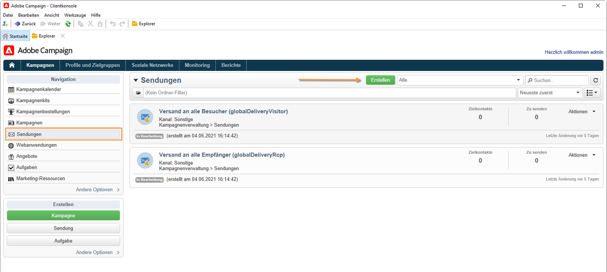

 Allgemeine Informationen zum Erstellen eines Versands finden Sie in der [Dokumentation zu Campaign Classic v7](https://experienceleague.adobe.com/docs/campaign-classic/using/sending-messages/key-steps-when-creating-a-delivery/steps-about-delivery-creation-steps.html?lang=de#sending-messages){target=&quot;_blank&quot;}.

### Benachrichtigungen auf iOS-Geräte senden {#send-notifications-on-ios}

>[!NOTE]
>
>Diese Funktion ist ab Campaign v8.3 verfügbar. Informationen zur Überprüfung Ihrer Version finden Sie in [diesem Abschnitt](../start/compatibility-matrix.md#how-to-check-your-campaign-version-and-buildversion).

1. Wählen Sie die Versandvorlage **[!UICONTROL iOS-Versand]**.

   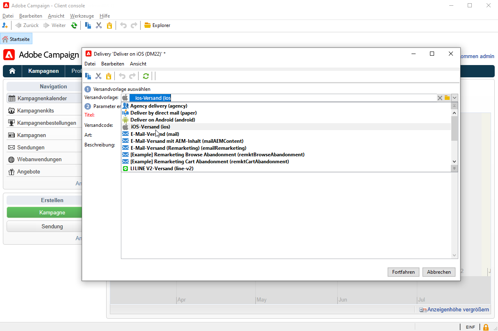

1. Klicken Sie zur Bestimmung der Zielgruppe der Benachrichtigung auf den Link **[!UICONTROL An]** und anschließend auf **[!UICONTROL Hinzufügen]**.

   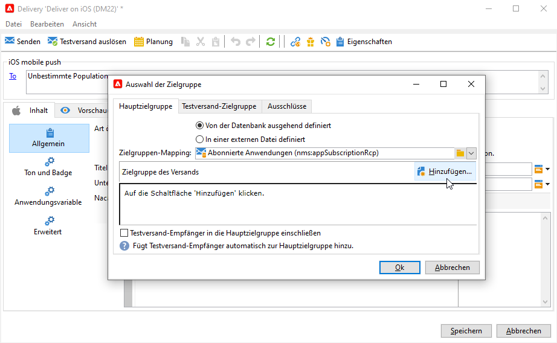

1. Wählen Sie **[!UICONTROL Abonnenten einer iOS-Mobile-App (iPhone, iPad)]**, dann den Ihrer Mobile App entsprechenden Dienst und anschließend die iOS-Version der Mobile App.

   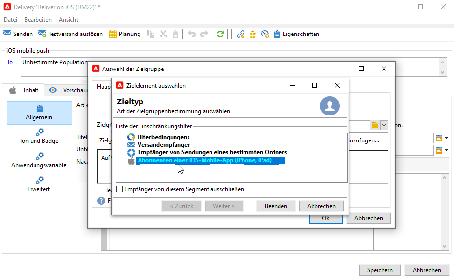

1. Wählen Sie Ihre **[!UICONTROL Art der Benachrichtigung]** aus **[!UICONTROL Allgemeine Benachrichtigung (Warnung, Ton, Badge)]** oder **[!UICONTROL Stille Benachrichtigung]**.

   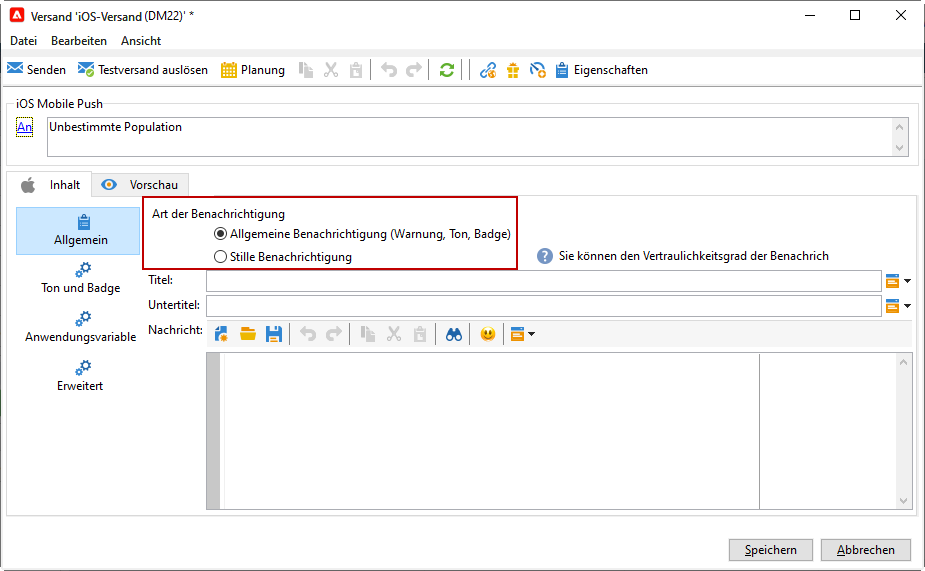

   >[!NOTE]
   >
   >Im Modus **Silent Push** kann eine &quot;stille&quot; Benachrichtigung an eine Mobile App gesendet werden. Dem Benutzer wird das Eintreffen der Benachrichtigung nicht mitgeteilt. Sie wird direkt an die Mobile App übertragen.

1. Geben Sie in das Feld **[!UICONTROL Titel]** die Bezeichnung ein, die in der Liste der im Benachrichtigungscenter verfügbaren Benachrichtigungen erscheinen soll.

   In diesem Feld können Sie den Wert des Parameters **title** der iOS-Benachrichtigungs-Payload definieren.

1. Sie können einen **[!UICONTROL Untertitel]** hinzufügen, den Wert des Parameters **subtitle** der iOS-Benachrichtigungs-Payload.

1. Geben Sie den Inhalt der Nachricht im Abschnitt **[!UICONTROL Nachrichteninhalt]** des Assistenten ein.

1. In der Registerkarte **[!UICONTROL Ton und Badge]** können Sie die folgenden Optionen bearbeiten:

   * **[!UICONTROL Badge entfernen]**: Aktivieren Sie diese Optionen, um den Badge-Wert zu aktualisieren.

   * **[!UICONTROL Wert]**: Legen Sie eine Zahl fest, mit der die Anzahl der neuen ungelesenen Informationen direkt auf dem Anwendungssymbol angezeigt wird.

   * **[!UICONTROL Kritischer Alarmmodus]**: Aktivieren Sie diese Option, um Ihrer Benachrichtigung einen Ton hinzuzufügen, selbst wenn das Handy des Benutzers im Fokusmodus eingestellt ist oder wenn das iPhone stummgeschaltet ist.

   * **[!UICONTROL Name]**: Wählen Sie den Ton aus, der beim Erhalt der Benachrichtigung vom Mobilgerät abgespielt werden soll.

   * **[!UICONTROL Lautstärke]**: Lautstärke Ihres Tons auf einer Skala von 0 bis 100.

      >[!NOTE]
      > 
      >Töne müssen in die App integriert und zum Zeitpunkt der Erstellung des entsprechenden Service konfiguriert werden.
      >
      >Konfigurationsrichtlinien für iOS finden Sie in der [Dokumentation zu Campaign Classic v7](https://experienceleague.adobe.com/docs/campaign-classic/using/sending-messages/sending-push-notifications/configure-the-mobile-app/configuring-the-mobile-application.html?lang=de).
   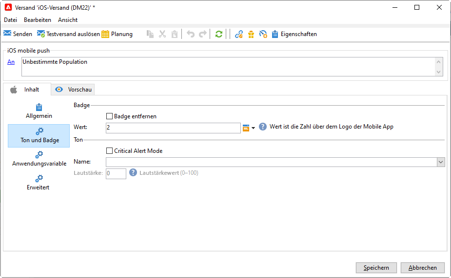

1. Ihre **[!UICONTROL Anwendungsvariablen]** werden automatisch von der Registerkarte **[!UICONTROL Anwendungsvariablen]** hinzugefügt. Damit können Sie beispielsweise das Benachrichtigungsverhalten definieren. So können Sie einen speziellen Anwendungsbildschirm konfigurieren, der angezeigt wird, wenn der Benutzer die Benachrichtigung aktiviert.

   Weiterführende Informationen hierzu finden Sie in [diesem Abschnitt](https://experienceleague.adobe.com/docs/campaign-classic/using/sending-messages/sending-push-notifications/configure-the-mobile-app/configuring-the-mobile-application.html?lang=de).

1. Auf der Registerkarte **[!UICONTROL Erweitert]** können Sie die folgenden allgemeinen Optionen bearbeiten:

   * **[!UICONTROL Veränderlicher Inhalt]**: Aktivieren Sie diese Option, damit die Mobile App Medieninhalte herunterladen kann.

   * **[!UICONTROL Thread-ID]**: Kennung, die verwendet wird, um verknüpfte Benachrichtigungen zu gruppieren.

   * **[!UICONTROL Kategorie]**: Name Ihrer Kategorie-ID, über die Aktionsschaltflächen angezeigt werden. Mit diesen Benachrichtigungen können Benutzer rascher unterschiedliche Aufgaben ausführen, ohne die Anwendung öffnen oder darin navigieren zu müssen.

   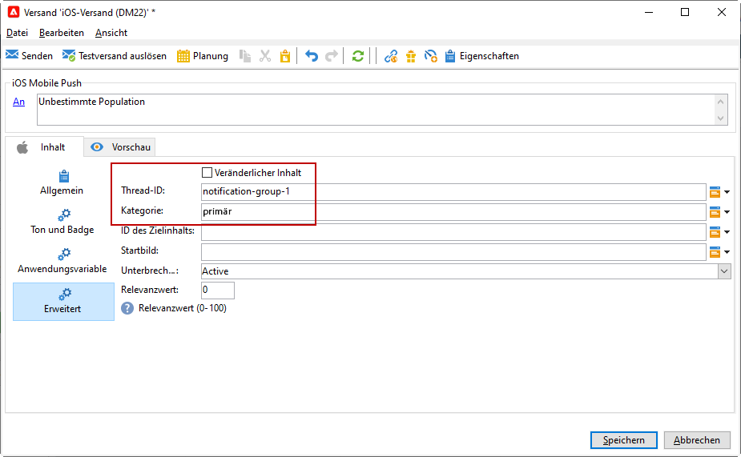

1. Für zeitabhängige Benachrichtigungen können Sie die folgenden Optionen spezifizieren:

   * **[!UICONTROL ID des Zielinhalts]**: Kennung, die angibt, welches Anwendungsfenster beim Öffnen der Benachrichtigung in den Vordergrund gebracht werden soll.

   * **[!UICONTROL Startbild]**: Name der anzuzeigenden Startbilddatei. Wenn der Benutzer Ihre Anwendung starten möchte, wird das ausgewählte Bild anstelle des Startbildschirms Ihrer Anwendung angezeigt.

   * **[!UICONTROL Unterbrechungsgrad]**:

      * **[!UICONTROL Aktiv]**: Ist dies als Standardeinstellung festgelegt, wird die Benachrichtigung sofort angezeigt, der Bildschirm wird beleuchtet und eventuell wird ein Ton abgespielt. Benachrichtigungen umgehen nicht den Fokusmodus.

      * **[!UICONTROL Passiv]**: Die Benachrichtigung wird zur Benachrichtigungsliste hinzugefügt, ohne dass der Bildschirm beleuchtet oder ein Ton abgespielt wird. Benachrichtigungen umgehen nicht den Fokusmodus.

      * **[!UICONTROL Zeitabhängig]**: Die Benachrichtigung wird sofort angezeigt, der Bildschirm wird beleuchtet, eventuell wird ein Ton abgespielt und der Fokusmodus kann umgangen werden. Für diese Stufe ist keine spezielle Berechtigung von Apple erforderlich.

      * **[!UICONTROL Kritisch]**: Die Benachrichtigung wird sofort angezeigt, der Bildschirm wird beleuchtet und der Stummschaltungs- oder Fokusmodus wird umgangen. Beachten Sie, dass für diese Ebene eine spezielle Berechtigung von Apple erforderlich ist.
   * **[!UICONTROL Relevanzwert]**: Legen Sie einen Relevanzwert auf der Skala von 0 bis 100 fest. Das System verwendet diesen Wert, um die Benachrichtigungen in der Benachrichtigungszusammenfassung zu sortieren.

   

1. Klicken Sie nach Angabe aller erforderlichen Benachrichtigungsparameter auf den Tab **[!UICONTROL Vorschau]**, um das Rendering der Benachrichtigung zu prüfen.

   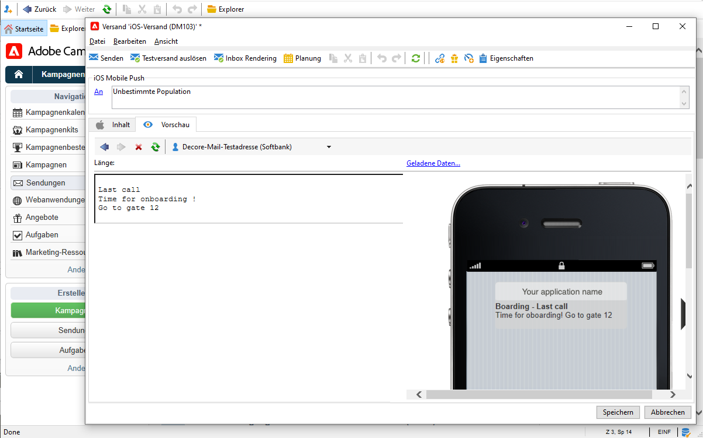

### Benachrichtigungen auf Android-Geräte senden {#send-notifications-on-android}

1. Wählen Sie die Versandvorlage **[!UICONTROL Android-Versand (Android)]**.

   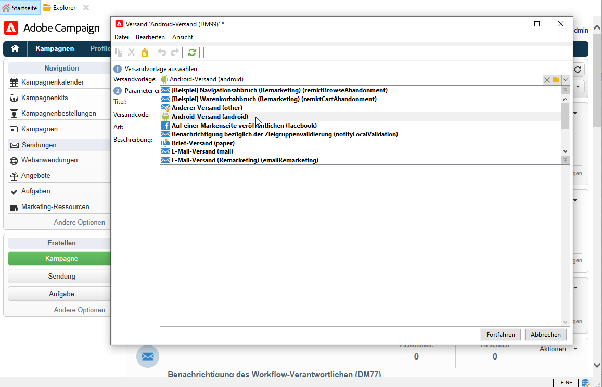

1. Klicken Sie zur Bestimmung der Zielgruppe der Benachrichtigung auf den Link **[!UICONTROL An]** und anschließend auf **[!UICONTROL Hinzufügen]**.

   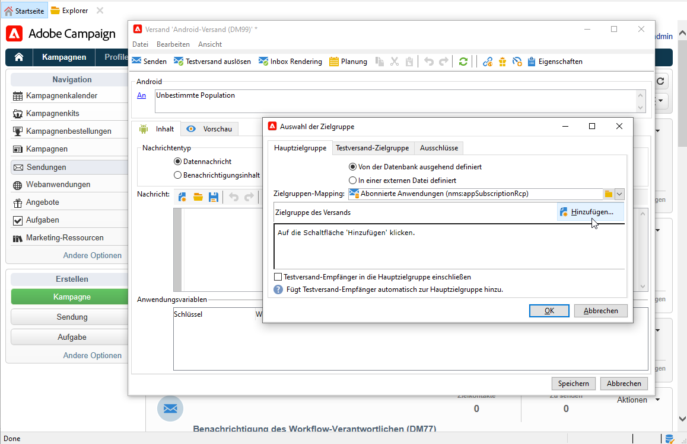

1. Wählen Sie **[!UICONTROL Abonnenten einer Android-Mobile-App]**, dann den Ihrer Mobile App entsprechenden Dienst (hier Neotrips) und schließlich die Android-Version der App.

   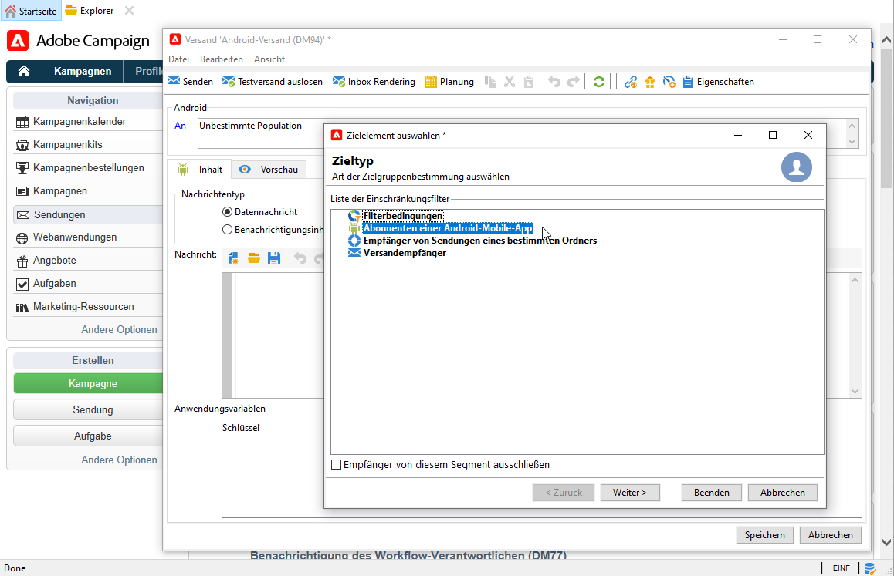

1. Erfassen Sie den Inhalt der Benachrichtigung.

   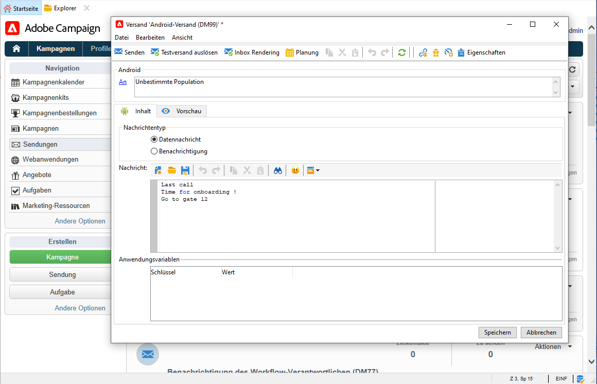

1. Klicken Sie auf das Symbol **[!UICONTROL Emoticon einfügen]**, um Ihrer Push-Benachrichtigung Emoticons hinzuzufügen.

1. Geben Sie im Feld **[!UICONTROL Anwendungsvariablen]** den Wert der einzelnen Variablen ein. Sie können beispielsweise einen bestimmten Anwendungsbildschirm konfigurieren, der angezeigt wird, wenn der Benutzer die Benachrichtigung aktiviert.

1. Klicken Sie nach Angabe aller erforderlichen Benachrichtigungsparameter auf den Tab **[!UICONTROL Vorschau]**, um das Rendering der Benachrichtigung zu prüfen.

   <!---->

## Push-Benachrichtigungen testen, senden und überwachen

Testsendungen und der endgültige Start des Versands werden analog zum E-Mail-Versand durchgeführt. Weitere Informationen finden Sie in der Dokumentation zu Campaign Classic v7:

* Validieren eines Versands und Durchführen von Testsendungen
    [Wichtige Schritte zur Validierung eines Versands](https://experienceleague.adobe.com/docs/campaign-classic/using/sending-messages/key-steps-when-creating-a-delivery/steps-validating-the-delivery.html?lang=de){target=&quot;_blank&quot;}

* Versand bestätigen und versenden
    [Wichtige Schritte zum Durchführen eines Versands](https://experienceleague.adobe.com/docs/campaign-classic/using/sending-messages/key-steps-when-creating-a-delivery/steps-sending-the-delivery.html?lang=de){target=&quot;_blank&quot;}

Nach dem Nachrichtenversand können Sie Ihre Sendungen überwachen und verfolgen. Weitere Informationen finden Sie in der Dokumentation zu Campaign Classic v7:

* Quarantäne für Push-Benachrichtigungen
    [Weitere Informationen zu Quarantänen für Push-Benachrichtigungen](https://experienceleague.adobe.com/docs/campaign-classic/using/sending-messages/monitoring-deliveries/understanding-quarantine-management.html?lang=de#push-notification-quarantines){target=&quot;_blank&quot;}

* Fehlerbehebung
    [Erfahren Sie, wie Sie Probleme mit Ihren Push-Benachrichtigungen beheben können](https://experienceleague.adobe.com/docs/campaign-classic/using/sending-messages/sending-push-notifications/troubleshooting.html?lang=de){target=&quot;_blank&quot;}.
