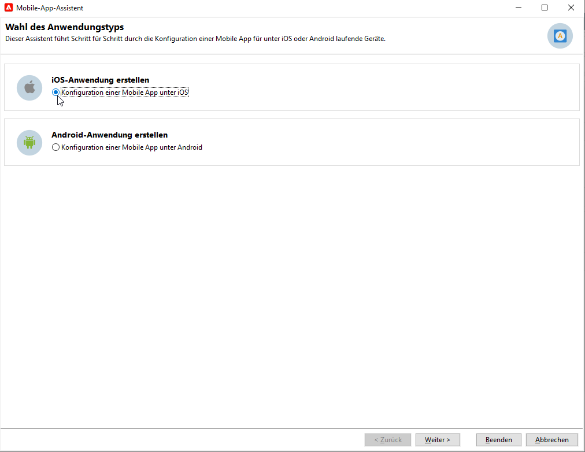
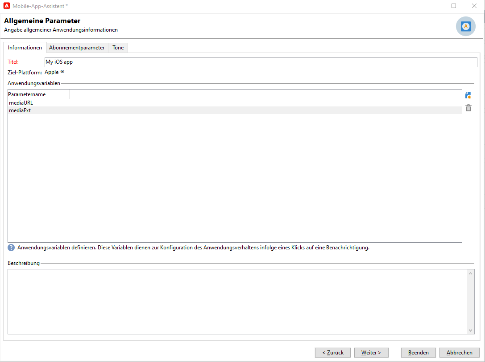

# Erstellen und Versenden von Push-Benachrichtigungen{#push-notifications-create}

Mit Mobile-App-Sendungen können Sie  Benachrichtigungen an iOS- und Android-Geräte senden.

Um Push-Benachrichtigungen in Adobe Campaign senden zu können, müssen Sie folgende Schritte befolgen:

1. Integrieren Sie das SDK in Ihre App. [Weitere Informationen](#push-sdk)
1. Erstellen Sie einen Informationsdienst vom Typ Mobile App für Ihre Mobile App und fügen Sie diesem Dienst die iOS- und Android-Versionen der App hinzu. [Weitere Informationen](#push-config)
1. Erstellen Sie einen Versand sowohl für iOS als auch für Android. [Weitere Informationen](#push-create)

## SDK integrieren {#push-sdk}

Um Push-Benachrichtigungen mit Adobe Campaign zu senden, müssen Sie die Adobe Campaign-Erweiterung in der Benutzeroberfläche „Datenerfassung“ des Adobe Experience Platform Mobile SDK konfigurieren.

Mit dem Adobe Experience Platform Mobile SDK können Sie die Experience Cloud-Lösungen und -Dienste von Adobe in mobilen Apps nutzen. Die SDK-Konfiguration wird über die Datenerfassungs-Benutzeroberfläche verwaltet, um eine flexible Konfiguration und erweiterbare, regelbasierte Integrationen zu ermöglichen.

[Weitere Informationen finden Sie in der Adobe Developer-Dokumentation](https://developer.adobe.com/client-sdks/documentation/adobe-campaign-classic){target="_blank"}.

## Konfigurieren der Mobile-App-Einstellungen in Campaign{#push-config}

Bevor Sie Push-Benachrichtigungen senden, müssen Sie Ihre Einstellungen für iOS- und Android-Apps in Adobe Campaign definieren.

Push-Benachrichtigungen werden über einen dedizierten Dienst an die Benutzerinnen und Benutzer Ihrer App gesendet. Wenn Benutzerinnen und Benutzer Ihre Anwendung installieren, abonnieren sie diesen Dienst: Adobe Campaign greift auf diesen Dienst zurück, um nur die Abonnentinnen und Abonnenten Ihrer App anzusprechen. In diesem Dienst müssen Sie Ihre iOS- und Android-Apps hinzufügen, um etwas auf iOS- und Android-Geräten zu senden.

Gehen Sie wie folgt vor, um einen Dienst zum Senden von Push-Benachrichtigungen zu erstellen:

1. Navigieren Sie zu **[!UICONTROL Profile und Zielgruppen > Services und Abonnements]** und klicken Sie auf **[!UICONTROL Erstellen]**.

   {width="800" align="left"}

1. Geben Sie einen **[!UICONTROL Titel]** und einen **[!UICONTROL internen Namen]** ein und wählen Sie den Typ **[!UICONTROL Mobile App]** aus.

   >[!NOTE]
   >
   >Das standardmäßig vorgeschlagene Zielgruppen-Mapping **[!UICONTROL Abonnierte Anwendungen (nms:appSubscriptionRcp)]** bezieht sich auf die Empfängertabelle. Wenn Sie ein anderes Zielgruppen-Mapping verwenden wollen, haben Sie die Möglichkeit, im Feld **[!UICONTROL Zielgruppen-Mapping]** des Service ein neues Zielgruppen-Mapping anzugeben. Weitere Informationen über Zielgruppen-Mapping finden Sie auf [dieser Seite](../audiences/target-mappings.md).

1. Klicken Sie dann auf das Symbol **[!UICONTROL Hinzufügen]** oben rechts, um die Mobile Apps zu definieren, die diesen Dienst verwenden.

>[!BEGINTABS]

>[!TAB iOS]

Gehen Sie wie folgt vor, um eine App für iOS-Geräte zu erstellen:

1. Wählen Sie **[!UICONTROL iOS-Anwendung erstellen]** aus und klicken Sie auf **[!UICONTROL Weiter]**.

   {width="600" align="left"}

1. Geben Sie den Namen Ihrer App im Feld **[!UICONTROL Titel]** ein.
1. (Optional) Sie können den Inhalt einer Push-Nachricht mit einigen **[!UICONTROL Anwendungsvariablen]** anreichern. Diese sind vollständig anpassbar und Teil der an das mobile Gerät gesendeten Nachrichten-Payload.

   Im folgenden Beispiel werden die Variablen **mediaURl** und **mediaExt** hinzugefügt, um Rich-Push-Benachrichtigungen zu erstellen. Danach wird der Anwendung das Bild bereitgestellt, das in der Benachrichtigung angezeigt werden soll.

   {width="600" align="left"}

1. Auf der Registerkarte **[!UICONTROL Abonnementparameter]** können Sie das Mapping mit einer Erweiterung des Schemas **[!UICONTROL Abonnierte Anwendungen (nms:appsubscriptionRcp)]** definieren.

1. Navigieren Sie zur Registerkarte **[!UICONTROL Töne]**, um einen Ton festzulegen, der wiedergegeben werden soll. Klicken Sie auf **[!UICONTROL Hinzufügen]** und füllen Sie das Feld **[!UICONTROL Interner Name]** aus, das den Namen der in die Anwendung eingebetteten Datei oder den Namen des Systemtons enthalten muss.

1. Klicken Sie auf **[!UICONTROL Weiter]**, um mit dem Konfigurieren der Entwicklungsanwendung zu beginnen.

1. Der Integrationsschlüssel ist für jede Anwendung spezifisch. Dadurch wird die Mobile App mit Adobe Campaign verknüpft.

   Stellen Sie sicher, dass in Adobe Campaign und im Anwendungs-Code über das SDK derselbe **[!UICONTROL Integrationsschlüssel]** definiert ist 

   Weitere Informationen finden Sie in der [Developer-Dokumentation](https://developer.adobe.com/client-sdks/documentation/adobe-campaign-classic/#configuration-keys){target="_blank"}

   >[!NOTE]
   >
   > Der **[!UICONTROL Integrationsschlüssel]** kann mit einem Zeichenfolgenwert vollständig angepasst werden, muss jedoch mit dem im SDK angegebenen Schlüssel identisch sein.
   >
   > Sie können nicht dasselbe Zertifikat sowohl für die Entwicklungsversion (Sandbox) als auch für die Produktionsversion der Anwendung verwenden.

1. Wählen Sie im Feld **[!UICONTROL Anwendungssymbol]** das Symbol aus, um die Mobile App in Ihrem Dienst zu personalisieren.

1. Wählen Sie den **[!UICONTROL Authentifizierungsmodus]** aus. Zwei Modi sind verfügbar:

   * (Empfohlen) **[!UICONTROL Token-basierte Authentifizierung]**: Füllen Sie die Verbindungseinstellungen **[!UICONTROL Schlüssel-ID]**, **[!UICONTROL Team-ID]** und **[!UICONTROL Paket-ID]** aus und wählen Sie dann Ihr p8-Zertifikat, indem Sie auf **[!UICONTROL Privaten Schlüssel eingeben...]** klicken. Weitere Informationen zur **[!UICONTROL Token-basierten Authentifizierung]** finden Sie in der [Apple-Dokumentation](https://developer.apple.com/documentation/usernotifications/setting_up_a_remote_notification_server/establishing_a_token-based_connection_to_apns){target="_blank"}.

   * **[!UICONTROL Zertifikatbasierte Authentifizierung]**: Klicken Sie auf **[!UICONTROL Zertifikat eingeben...]**. Wählen Sie dann Ihren p12-Schlüssel und geben Sie das von der Entwicklerin bzw. dem Entwickler der Mobile App bereitgestellte Passwort ein.
   Beachten Sie, dass Sie den Authentifizierungsmodus Ihrer Mobile App jederzeit über die Registerkarte **[!UICONTROL Zertifikat]** ändern können.

1. Klicken Sie auf die Schaltfläche **[!UICONTROL Verbindung testen]**, um Ihre Konfiguration zu validieren.

1. Nun können Sie die Produktionsanwendung konfigurieren, indem Sie auf **[!UICONTROL Weiter]** klicken und nach dem gleichen Verfahren wie oben beschrieben vorgehen.

1. Klicken Sie auf **[!UICONTROL Beenden]**.

Ihre iOS-Anwendung kann jetzt in Campaign verwendet werden.

>[!TAB Android]

Gehen Sie wie folgt vor, um eine App für Android-Geräte zu erstellen:

1. Wählen Sie **[!UICONTROL Android-Anwendung erstellen]** aus und klicken Sie auf **[!UICONTROL Weiter]**.

   {width="600" align="left"}

1. Geben Sie den Namen Ihrer App im Feld **[!UICONTROL Titel]** ein.
1. Der Integrationsschlüssel ist für jede Anwendung spezifisch. Dadurch wird die Mobile App mit Adobe Campaign verknüpft.

   Stellen Sie sicher, dass in Adobe Campaign und im Anwendungs-Code über das SDK derselbe **[!UICONTROL Integrationsschlüssel]** definiert ist 

   Weitere Informationen finden Sie in der [Developer-Dokumentation](https://developer.adobe.com/client-sdks/documentation/adobe-campaign-classic/#configuration-keys){target="_blank"}

   >[!NOTE]
   >
   > Der **[!UICONTROL Integrationsschlüssel]** kann mit einem Zeichenfolgenwert vollständig angepasst werden, muss jedoch mit dem im SDK angegebenen Schlüssel identisch sein.

1. Wählen Sie im Feld **[!UICONTROL Anwendungssymbol]** das Symbol aus, um die Mobile App in Ihrem Dienst zu personalisieren.
1. Wählen Sie **HTTP v1** in der Dropdown-Liste **[!UICONTROL API-Version]** aus.
1. Klicken Sie auf **[!UICONTROL Projekt-JSON-Datei zum Extrahieren der Projektdetails laden...]**, um Ihre JSON-Schlüsseldatei direkt zu laden. Weitere Informationen dazu, wie Sie die JSON-Datei extrahieren, finden Sie in der [Dokumentation zu Google Firebase](https://firebase.google.com/docs/admin/setup#initialize-sdk){target="_blank"}.

   Sie können auch die folgenden Details manuell eingeben:
   * **[!UICONTROL Projektkennung]**
   * **[!UICONTROL Privater Schlüssel]**
   * **[!UICONTROL Client-E-Mail]**

1. Klicken Sie auf die Schaltfläche **[!UICONTROL Verbindung testen]**, um Ihre Konfiguration zu validieren.

   >[!CAUTION]
   >
   >Mit der Schaltfläche **[!UICONTROL Verbindung testen]** wird nicht geprüft, ob der MID-Server Zugriff auf den FCM-Server hat.

1. Bei Bedarf können Sie die Inhalte von Push-Nachrichten mit bestimmten **[!UICONTROL Anwendungsvariablen]** anreichern. Diese sind vollständig anpassbar und Teil der an das mobile Gerät gesendeten Nachrichten-Payload.

1. Klicken Sie auf **[!UICONTROL Beenden]** und danach auf **[!UICONTROL Speichern]**. Ihre Android-Anwendung kann jetzt in Campaign verwendet werden.

Im Folgenden finden Sie die FCM-Payload-Namen, mit denen Sie Ihre Push-Benachrichtigung weiter personalisieren können:

| Nachrichtentyp | Konfigurierbares Nachrichtenelement (FCM-Payload-Name) | Konfigurierbare Optionen (Name der FCM-Payload) |
|:-:|:-:|:-:|
| Datennachricht | K. A. | validate_only |
| Benachrichtigungsinhalt | title, body, android_channel_id, icon, sound, tag, color, click_action, image, ticker, sticky, visibility, notification_priority, notification_count   | validate_only |

>[!ENDTABS]

## Erstellen der ersten Push-Benachrichtigung{#push-create}

In diesem Abschnitt werden die Elemente beschrieben, die für den Versand von iOS- und Android-Benachrichtigungen erforderlich sind.

>[!CAUTION]
>
>Im Kontext einer [Enterprise (FFDA)-Implementierung](../architecture/enterprise-deployment.md) ist die Mobile-Registrierung jetzt **asynchron**. [Weitere Informationen](../architecture/staging.md)

Um einen neuen Versand zu erstellen, gehen Sie zur Registerkarte **[!UICONTROL Kampagnen]**, klicken Sie auf **[!UICONTROL Sendungen]** und anschließend auf die Schaltfläche **[!UICONTROL Erstellen]** oberhalb der Liste der vorhandenen Sendungen.

>[!BEGINTABS]

>[!TAB iOS]

Gehen Sie wie folgt vor, um Benachrichtigungen auf iOS-Geräten zu senden:

1. Wählen Sie die Versandvorlage **[!UICONTROL iOS-Versand]**.

   

1. Klicken Sie zur Bestimmung der Zielgruppe der Benachrichtigung auf den Link **[!UICONTROL An]** und anschließend auf **[!UICONTROL Hinzufügen]**.

   

1. Wählen Sie **[!UICONTROL Abonnenten einer iOS-Mobile-App (iPhone, iPad)]**, dann den Ihrer Mobile App entsprechenden Dienst und anschließend die iOS-Version der Mobile App.

   

1. Wählen Sie Ihre **[!UICONTROL Art der Benachrichtigung]** aus **[!UICONTROL Allgemeine Benachrichtigung (Warnung, Ton, Badge)]** oder **[!UICONTROL Stille Benachrichtigung]**.

   

   >[!NOTE]
   >
   >Im Modus **Silent Push** kann eine &quot;stille&quot; Benachrichtigung an eine Mobile App gesendet werden. Dem Benutzer wird das Eintreffen der Benachrichtigung nicht mitgeteilt. Sie wird direkt an die Mobile App übertragen.

1. Geben Sie in das Feld **[!UICONTROL Titel]** die Bezeichnung ein, die in der Liste der im Benachrichtigungscenter verfügbaren Benachrichtigungen erscheinen soll.

   In diesem Feld können Sie den Wert des Parameters **title** der iOS-Benachrichtigungs-Payload definieren.

1. Sie können einen **[!UICONTROL Untertitel]** hinzufügen, den Wert des Parameters **subtitle** der iOS-Benachrichtigungs-Payload.

1. Geben Sie den Inhalt der Nachricht im Abschnitt **[!UICONTROL Nachrichteninhalt]** des Assistenten ein.

1. In der Registerkarte **[!UICONTROL Ton und Badge]** können Sie die folgenden Optionen bearbeiten:

   * **[!UICONTROL Badge entfernen]**: Aktivieren Sie diese Optionen, um den Badge-Wert zu aktualisieren.

   * **[!UICONTROL Wert]**: Legen Sie eine Zahl fest, mit der die Anzahl der neuen ungelesenen Informationen direkt auf dem Anwendungssymbol angezeigt wird.

   * **[!UICONTROL Kritischer Alarmmodus]**: Aktivieren Sie diese Option, um Ihrer Benachrichtigung einen Ton hinzuzufügen, selbst wenn das Handy des Benutzers im Fokusmodus eingestellt ist oder wenn das iPhone stummgeschaltet ist.

   * **[!UICONTROL Name]**: Wählen Sie den Ton aus, der beim Erhalt der Benachrichtigung vom Mobilgerät abgespielt werden soll.

   * **[!UICONTROL Lautstärke]**: Lautstärke Ihres Tons auf einer Skala von 0 bis 100.

      >[!NOTE]
      > 
      >Töne müssen in die App integriert und zum Zeitpunkt der Erstellung des entsprechenden Service konfiguriert werden.
   

1. Ihre **[!UICONTROL Anwendungsvariablen]** werden automatisch von der Registerkarte **[!UICONTROL Anwendungsvariablen]** hinzugefügt. Damit können Sie beispielsweise das Benachrichtigungsverhalten definieren. So können Sie einen speziellen Anwendungsbildschirm konfigurieren, der angezeigt wird, wenn der Benutzer die Benachrichtigung aktiviert.

1. Auf der Registerkarte **[!UICONTROL Erweitert]** können Sie die folgenden allgemeinen Optionen bearbeiten:

   * **[!UICONTROL Veränderlicher Inhalt]**: Aktivieren Sie diese Option, damit die Mobile App Medieninhalte herunterladen kann.

   * **[!UICONTROL Thread-ID]**: Kennung, die verwendet wird, um verknüpfte Benachrichtigungen zu gruppieren.

   * **[!UICONTROL Kategorie]**: Name Ihrer Kategorie-ID, über die Aktionsschaltflächen angezeigt werden. Mit diesen Benachrichtigungen können Benutzer rascher unterschiedliche Aufgaben ausführen, ohne die Anwendung öffnen oder darin navigieren zu müssen.

   

1. Für zeitabhängige Benachrichtigungen können Sie die folgenden Optionen spezifizieren:

   * **[!UICONTROL Zielgruppen-Inhalts-ID]**: Bezeichner, mit dem festgelegt wird, welches Anwendungsfenster beim Öffnen der Benachrichtigung vorgezogen werden soll.

   * **[!UICONTROL Startbild]**: Name der anzuzeigenden Startbilddatei. Wenn der Benutzer Ihre Anwendung starten möchte, wird das ausgewählte Bild anstelle des Startbildschirms Ihrer Anwendung angezeigt.

   * **[!UICONTROL Unterbrechungsgrad]**:

      * **[!UICONTROL Aktiv]**: Ist dies als Standardeinstellung festgelegt, wird die Benachrichtigung sofort angezeigt, der Bildschirm wird beleuchtet und eventuell wird ein Ton abgespielt. Benachrichtigungen umgehen nicht den Fokusmodus.

      * **[!UICONTROL Passiv]**: Die Benachrichtigung wird zur Benachrichtigungsliste hinzugefügt, ohne dass der Bildschirm beleuchtet oder ein Ton abgespielt wird. Benachrichtigungen umgehen nicht den Fokusmodus.

      * **[!UICONTROL Zeitabhängig]**: Die Benachrichtigung wird sofort angezeigt, der Bildschirm wird beleuchtet, eventuell wird ein Ton abgespielt und der Fokusmodus kann umgangen werden. Für diese Stufe ist keine spezielle Berechtigung von Apple erforderlich.

      * **[!UICONTROL Kritisch]**: Die Benachrichtigung wird sofort angezeigt, der Bildschirm wird beleuchtet und der Stummschaltungs- oder Fokusmodus wird umgangen. Beachten Sie, dass für diese Ebene eine spezielle Berechtigung von Apple erforderlich ist.
   * **[!UICONTROL Relevanzwert]**: Legen Sie einen Relevanzwert auf der Skala von 0 bis 100 fest. Das System verwendet diesen Wert, um die Benachrichtigungen in der Benachrichtigungszusammenfassung zu sortieren.

   

1. Sobald die Benachrichtigung konfiguriert ist, klicken Sie auf die Registerkarte **[!UICONTROL Vorschau]**, um eine Vorschau der Benachrichtigung anzuzeigen.

   

>[!TAB Android]

Gehen Sie wie folgt vor, um Benachrichtigungen auf Android-Geräten zu senden:

1. Wählen Sie die Versandvorlage **[!UICONTROL Android-Versand (Android)]**.

   

1. Klicken Sie zur Bestimmung der Zielgruppe der Benachrichtigung auf den Link **[!UICONTROL An]** und anschließend auf **[!UICONTROL Hinzufügen]**.

   

1. Wählen Sie **[!UICONTROL Abonnenten einer Android-Mobile-App]**, dann den Ihrer Mobile App entsprechenden Dienst (hier Neotrips) und schließlich die Android-Version der App.

   

1. Erfassen Sie den Inhalt der Benachrichtigung.

   

1. Klicken Sie auf das Symbol **[!UICONTROL Emoticon einfügen]**, um Ihrer Push-Benachrichtigung Emoticons hinzuzufügen.

1. Geben Sie im Feld **[!UICONTROL Anwendungsvariablen]** den Wert der einzelnen Variablen ein. Sie können beispielsweise einen bestimmten Anwendungsbildschirm konfigurieren, der angezeigt wird, wenn der Benutzer die Benachrichtigung aktiviert.

1. Klicken Sie nach Angabe aller erforderlichen Benachrichtigungsparameter auf den Tab **[!UICONTROL Vorschau]**, um das Rendering der Benachrichtigung zu prüfen.

   <!---->

>[!ENDTABS]

## Push-Benachrichtigungen testen, senden und überwachen

Testsendungen und der endgültige Versand werden analog zu anderen Versandmethoden durchgeführt.

Wie Sie einen Versand validieren, erfahren Sie auf [dieser Seite](preview-and-proof.md).

Wie Sie den Versand bestätigen und durchführen können, können Sie auf [dieser Seite](send.md) erfahren.

Nach dem Nachrichtenversand können Sie Ihre Sendungen überwachen und verfolgen. Weitere Informationen zu den Ursachen für den fehlgeschlagenen Versand von Push-Benachrichtigungen finden Sie auf [dieser Seite](delivery-failures.md#push-error-types).

