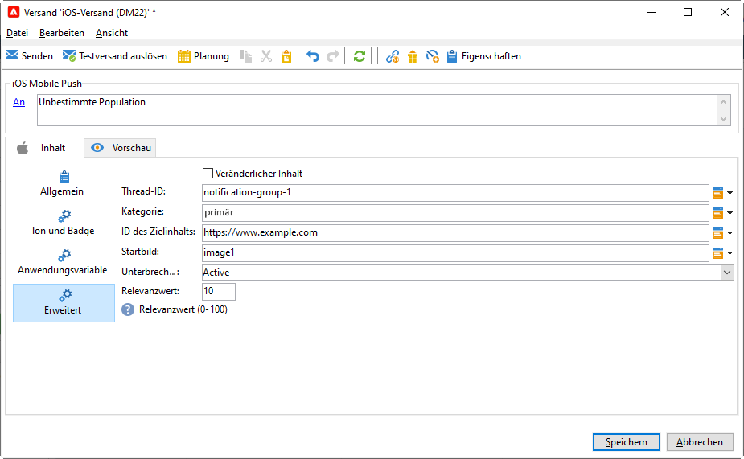

# Erstellen und Versenden von Push-Benachrichtigungen{#push-notifications-create}

Mit Mobile-App-Sendungen können Sie Benachrichtigungen an iOS- und Android-Geräte senden.

Bevor Sie mit dem Versand von Push-Benachrichtigungen mit Adobe Campaign beginnen, müssen Sie sicherstellen, dass Konfigurationen und Integrationen in der Mobile App sowie für Tags in Adobe Experience Platform vorhanden sind. [Erfahren Sie mehr über die Push-Konfiguration](push-settings.md).

>[!CAUTION]
>
>Einige wichtige Änderungen am Android Firebase Cloud Messaging-Dienst (FCM) werden 2024 veröffentlicht und können sich auf Ihre Implementierung von Adobe Campaign auswirken. Ihre Konfiguration der Anmeldedienste für Android-Push-Nachrichten muss möglicherweise aktualisiert werden, um diese Änderung zu unterstützen. Sie können dies bereits überprüfen und Maßnahmen ergreifen. [Weitere Informationen](../../technotes/upgrades/push-technote.md).

## Erstellen der ersten Push-Benachrichtigung {#push-create}

In diesem Abschnitt werden die Elemente beschrieben, die für den Versand von iOS- und Android-Benachrichtigungen erforderlich sind.

>[!IMPORTANT]
>
>Im Kontext einer [Enterprise (FFDA)-Bereitstellung](../architecture/enterprise-deployment.md) ist die Mobile-Registrierung jetzt **asynchron**. [Weitere Informationen](../architecture/staging.md)

Um einen neuen Versand zu erstellen, gehen Sie zur Registerkarte **[!UICONTROL Kampagnen]**, klicken Sie auf **[!UICONTROL Sendungen]** und anschließend auf die Schaltfläche **[!UICONTROL Erstellen]** oberhalb der Liste der vorhandenen Sendungen.

Standardmäßig enthält Adobe Campaign zwei Versandvorlagen: eine für iOS und eine für Android. Sie können sie duplizieren, um Ihre eigenen Einstellungen zu definieren. Die Schritte zum Konfigurieren eines Push-Versands auf der Basis dieser Vorlagen werden nachfolgend beschrieben.

>[!BEGINTABS]

>[!TAB iOS]

Gehen Sie wie folgt vor, um Benachrichtigungen auf iOS-Geräten zu senden:

1. Wählen Sie die Versandvorlage **[!UICONTROL iOS-Versand]**.

   

1. Klicken Sie zur Bestimmung der Zielgruppe der Benachrichtigung auf den Link **[!UICONTROL An]** und anschließend auf **[!UICONTROL Hinzufügen]**.

   

1. Wählen Sie **[!UICONTROL Abonnenten einer iOS-Mobile-App (iPhone, iPad)]**, dann den Ihrer Mobile App entsprechenden Dienst und anschließend die iOS-Version der Mobile App.

   

1. Wählen Sie Ihre **[!UICONTROL Art der Benachrichtigung]** aus **[!UICONTROL Allgemeine Benachrichtigung (Warnung, Ton, Badge)]** oder **[!UICONTROL Stille Benachrichtigung]**.

   

   >[!NOTE]
   >
   >Im Modus **Silent Push** kann eine &quot;stille&quot; Benachrichtigung an eine Mobile App gesendet werden. Dem Benutzer wird das Eintreffen der Benachrichtigung nicht mitgeteilt. Sie wird direkt an die Mobile App übertragen.

1. Geben Sie in das Feld **[!UICONTROL Titel]** die Bezeichnung ein, die in der Liste der im Benachrichtigungscenter verfügbaren Benachrichtigungen erscheinen soll.

   In diesem Feld können Sie den Wert des Parameters **title** der iOS-Benachrichtigungs-Payload definieren.

1. Sie können einen **[!UICONTROL Untertitel]** hinzufügen, den Wert des Parameters **subtitle** der iOS-Benachrichtigungs-Payload.

1. Geben Sie den Inhalt der Nachricht im Abschnitt **[!UICONTROL Nachrichteninhalt]** des Assistenten ein.

1. In der Registerkarte **[!UICONTROL Ton und Badge]** können Sie die folgenden Optionen bearbeiten:

   * **[!UICONTROL Badge entfernen]**: Aktivieren Sie diese Optionen, um den Badge-Wert zu aktualisieren.

   * **[!UICONTROL Wert]**: Legen Sie eine Zahl fest, mit der die Anzahl der neuen ungelesenen Informationen direkt auf dem Anwendungssymbol angezeigt wird.

   * **[!UICONTROL Kritischer Alarmmodus]**: Aktivieren Sie diese Option, um Ihrer Benachrichtigung einen Ton hinzuzufügen, selbst wenn das Handy des Benutzers im Fokusmodus eingestellt ist oder wenn das iPhone stummgeschaltet ist.

   * **[!UICONTROL Name]**: Wählen Sie den Ton aus, der beim Erhalt der Benachrichtigung vom Mobilgerät abgespielt werden soll.

   * **[!UICONTROL Lautstärke]**: Lautstärke Ihres Tons auf einer Skala von 0 bis 100.

     >[!NOTE]
     > 
     >Töne müssen in die App integriert und zum Zeitpunkt der Erstellung des entsprechenden Service konfiguriert werden.
     >

   

1. Ihre **[!UICONTROL Anwendungsvariablen]** werden automatisch von der Registerkarte **[!UICONTROL Anwendungsvariablen]** hinzugefügt. Damit können Sie beispielsweise das Benachrichtigungsverhalten definieren. So können Sie einen speziellen Anwendungsbildschirm konfigurieren, der angezeigt wird, wenn der Benutzer die Benachrichtigung aktiviert.

1. Auf der Registerkarte **[!UICONTROL Erweitert]** können Sie die folgenden allgemeinen Optionen bearbeiten:

   * **[!UICONTROL Veränderlicher Inhalt]**: Aktivieren Sie diese Option, damit die Mobile App Medieninhalte herunterladen kann.

   * **[!UICONTROL Thread-ID]**: Kennung, die verwendet wird, um verknüpfte Benachrichtigungen zu gruppieren.

   * **[!UICONTROL Kategorie]**: Name Ihrer Kategorie-ID, über die Aktionsschaltflächen angezeigt werden. Mit diesen Benachrichtigungen können Benutzer rascher unterschiedliche Aufgaben ausführen, ohne die Anwendung öffnen oder darin navigieren zu müssen.

   

1. Für zeitabhängige Benachrichtigungen können Sie die folgenden Optionen spezifizieren:

   * **[!UICONTROL Zielgruppen-Inhalts-ID]**: Bezeichner, mit dem festgelegt wird, welches Anwendungsfenster beim Öffnen der Benachrichtigung vorgezogen werden soll.

   * **[!UICONTROL Startbild]**: Name der anzuzeigenden Startbilddatei. Wenn der Benutzer Ihre Anwendung starten möchte, wird das ausgewählte Bild anstelle des Startbildschirms Ihrer Anwendung angezeigt.

   * **[!UICONTROL Unterbrechungsgrad]**:

      * **[!UICONTROL Aktiv]**: Ist dies als Standardeinstellung festgelegt, wird die Benachrichtigung sofort angezeigt, der Bildschirm wird beleuchtet und eventuell wird ein Ton abgespielt. Benachrichtigungen umgehen nicht den Fokusmodus.

      * **[!UICONTROL Passiv]**: Die Benachrichtigung wird zur Benachrichtigungsliste hinzugefügt, ohne dass der Bildschirm beleuchtet oder ein Ton abgespielt wird. Benachrichtigungen umgehen nicht den Fokusmodus.

      * **[!UICONTROL Zeitabhängig]**: Die Benachrichtigung wird sofort angezeigt, der Bildschirm wird beleuchtet, eventuell wird ein Ton abgespielt und der Fokusmodus kann umgangen werden. Für diese Stufe ist keine spezielle Berechtigung von Apple erforderlich.

      * **[!UICONTROL Kritisch]**: Die Benachrichtigung wird sofort angezeigt, der Bildschirm wird beleuchtet und der Stummschaltungs- oder Fokusmodus wird umgangen. Beachten Sie, dass für diese Ebene eine spezielle Berechtigung von Apple erforderlich ist.

   * **[!UICONTROL Relevanzwert]**: Legen Sie einen Relevanzwert auf der Skala von 0 bis 100 fest. Das System verwendet diesen Wert, um die Benachrichtigungen in der Benachrichtigungszusammenfassung zu sortieren.

   

1. Sobald die Benachrichtigung konfiguriert ist, klicken Sie auf die Registerkarte **[!UICONTROL Vorschau]**, um eine Vorschau der Benachrichtigung anzuzeigen.

   

>[!TAB Android]

Gehen Sie wie folgt vor, um Benachrichtigungen auf Android-Geräten zu senden:

1. Wählen Sie die Versandvorlage **[!UICONTROL Android-Versand (Android)]**.

   

   >[!NOTE]
   > 
   >Bei den aktuellen FCM-APIs (HTTP v1) müssen Sie Ihre **Versandvorlagen** für Android-Push-Benachrichtigungen aktualisieren, um die Anzahl der Batch-Nachrichten zu erhöhen. Öffnen Sie zu diesem Zweck die Eigenschaften Ihrer Android-Versandvorlage und legen Sie auf der Registerkarte **Versand** für die Einstellung [ Kontingentgröße](../../v8/send/configure-and-send.md#delivery-batch-quantity) den Wert **256** fest. Wenden Sie diese Änderung auf alle Versandvorlagen an, die für Ihre Android-Sendungen verwendet werden, sowie auf alle vorhandenen Android-Sendungen.

1. Klicken Sie zur Bestimmung der Zielgruppe der Benachrichtigung auf den Link **[!UICONTROL An]** und anschließend auf **[!UICONTROL Hinzufügen]**.

   

1. Wählen Sie **[!UICONTROL Abonnenten einer Android-Mobile-App]**, dann den Ihrer Mobile App entsprechenden Dienst (hier Neotrips) und schließlich die Android-Version der App.

   

1. Erfassen Sie den Inhalt der Benachrichtigung.

   

1. Klicken Sie auf das Symbol **[!UICONTROL Emoticon einfügen]**, um Ihrer Push-Benachrichtigung Emoticons hinzuzufügen.

1. Geben Sie im Feld **[!UICONTROL Anwendungsvariablen]** den Wert der einzelnen Variablen ein. Sie können beispielsweise einen bestimmten Anwendungsbildschirm konfigurieren, der angezeigt wird, wenn der Benutzer die Benachrichtigung aktiviert.

1. Klicken Sie nach Angabe aller erforderlichen Benachrichtigungsparameter auf den Tab **[!UICONTROL Vorschau]**, um das Rendering der Benachrichtigung zu prüfen.

   <!---->

>[!ENDTABS]

## Push-Benachrichtigungen testen, senden und überwachen {#push-test}

Testsendungen und der endgültige Versand werden analog zu anderen Versandmethoden durchgeführt.

Wie Sie einen Versand validieren, erfahren Sie auf [dieser Seite](preview-and-proof.md).

Wie Sie den Versand bestätigen und durchführen können, können Sie auf [dieser Seite](send.md) erfahren.

Nach dem Nachrichtenversand können Sie Ihre Sendungen überwachen und verfolgen. Weitere Informationen zu den Ursachen für den fehlgeschlagenen Versand von Push-Benachrichtigungen finden Sie auf [dieser Seite](delivery-failures.md#push-error-types).

