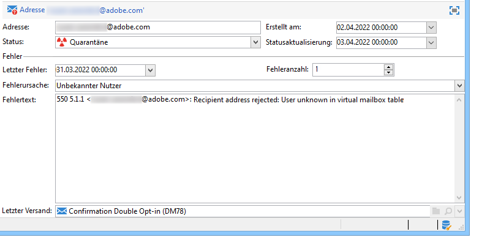
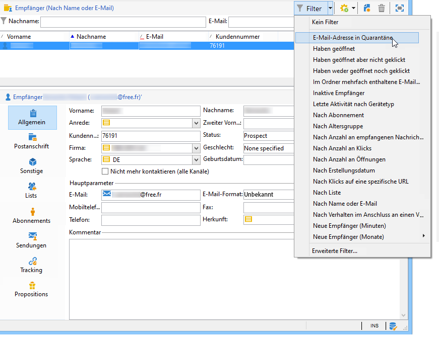
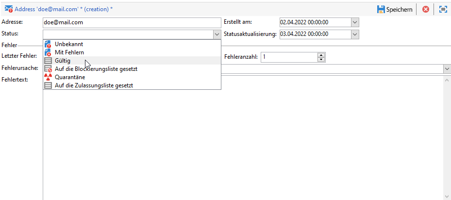

# Quarantänen {#quarantine-management}

Adobe Campaign verwaltet für Online-Kanäle (E-Mail, SMS, Push-Benachrichtigung) eine Liste von unter Quarantäne gestellten Adressen. Teilweise werden E-Mails von Providern automatisch als Spam eingestuft, wenn die Anzahl ungültiger Adressen zu hoch ist. Durch die Quarantäne können Sie also vermeiden, von diesen Providern auf eine Blockierungsliste gesetzt zu werden. Zusätzlich helfen Ihnen Quarantänen, die Kosten des SMS-Versands zu senken, indem fehlerhafte Telefonnummern aus dem Versand ausgeschlossen werden.

Wenn die Adresse oder Telefonnummer von Empfängern in Quarantäne ist, werden diese während der Versandanalyse von der Zielgruppe ausgeschlossen: Dann können Sie diesen Kontakten keine Marketing-Nachrichten, einschließlich automatisierter Workflow-E-Mails, senden. Sind diese in Quarantäne befindlichen Adressen auch in Listen enthalten, werden sie beim Versand an diese Listen ausgeschlossen. Eine E-Mail-Adresse kann unter Quarantäne gestellt werden, wenn beispielsweise das Postfach voll ist, die E-Mail-Adresse nicht existiert oder der E-Mail-Server nicht verfügbar ist.

<!--For more on best practices to secure and optimize your deliveries, refer to [this page](delivery-best-practices.md).-->

**Quarantäne** gilt nur für eine **E-Mail-Adresse**, eine **Telefonnummer** oder ein **Geräte-Token**, aber nicht für das Profil selbst. Wenn beispielsweise ein Profil mit einer in Quarantäne befindlichen E-Mail-Adresse eine neue Adresse angibt, kann es erneut in Versandzielgruppen aufgenommen werden. Wenn zwei Profile dieselbe Telefonnummer haben, sind beide betroffen, wenn die Nummer unter Quarantäne gestellt wird. Die unter Quarantäne gestellten Adressen oder Telefonnummern werden in den [Ausschlusslogs](#delivery-quarantines) (für einen Versand) oder in der [Quarantäneliste](#non-deliverable-bounces) (für die gesamte Plattform) angezeigt.

Profile können auch auf der **Blockierungsliste** für einen bestimmten Kanal stehen, wie etwa nach einer Abmeldung (Opt-out). In diesem Fall werden diese Profile überhaupt nicht mehr kontaktiert. Hat ein Profil auf der Blockierungsliste für den E-Mail-Kanal zwei E-Mail-Adressen, werden folglich beide Adressen vom Versand ausgeschlossen. Im Bereich **[!UICONTROL Nicht mehr kontaktieren]** der Registerkarte **[!UICONTROL Allgemein]** des Profils können Sie überprüfen, ob sich ein Profil auf der Blockierungsliste für einen oder mehrere Kanäle befindet. [Weitere Informationen](../audiences/view-profiles.md).

>[!NOTE]
>
>Wenn Empfänger Ihre Nachricht als Spam melden oder auf eine SMS mit einem Schlüsselwort wie &quot;STOP&quot; antworten, wird ihre Adresse oder Telefonnummer als **[!UICONTROL Auf die Blockierungsliste gesetzt]** unter Quarantäne gestellt. Die jeweiligen Profile werden entsprechend aktualisiert.
>
> Für den E-Mail-Kanal werden E-Mail-Adressen unter Quarantäne gestellt. Für den Mobile-App-Kanal werden Geräte-Token unter Quarantäne gestellt. Für den SMS-Kanal werden Telefonnummern unter Quarantäne gestellt.

## Warum eine E-Mail, eine Telefonnummer oder ein Gerät unter Quarantäne gestellt wird {#quarantine-reason}

Adobe Campaign verwaltet die Quarantäne je nach Art des Versandfehlers und seiner Ursache. Die Fehler und deren Ursache werden während der Qualifizierung der Fehlermeldungen zugewiesen. [Auf dieser Seite](delivery-failures.md) erfahren Sie mehr über die Verwaltung von fehlgeschlagenen Sendungen.

Es können zwei Typen von Fehlern erfasst werden:

* **Hardbounce**: Die E-Mail-Adresse, die Telefonnummer oder das Gerät wird sofort unter Quarantäne gestellt.
* **Softbounce**: Softbounces erhöhen den Fehlerzähler und können E-Mail-Adressen, Telefonnummern oder Geräte-Token unter Quarantäne stellen. Campaign führt [weitere Zustellversuche](delivery-failures.md#retries) durch.Wenn der Fehlerzähler den Grenzwert erreicht, wird die E-Mail-Adresse, die Telefonnummer oder das Geräte-Token unter Quarantäne gestellt. [Weitere Informationen](delivery-failures.md#retries).

Bei Adressen in Quarantäne zeigt das Feld **[!UICONTROL Fehlerursache]** an, was die Quarantäne ausgelöst hat. [Weitere Informationen](#identifying-quarantined-addresses-for-the-entire-platform).

Wenn ein Benutzer eine E-Mail als Spam kennzeichnet, wird die Nachricht automatisch an ein von Adobe verwaltetes technisches Postfach weitergeleitet. Die E-Mail-Adresse des Benutzers wird dann automatisch unter Quarantäne gestellt und der Status in **[!UICONTROL Auf Blockierungsliste]** geändert. Der Status bezieht sich ausschließlich auf die Adresse, und das Profil wird nicht auf die Blockierungsliste gesetzt, sodass der Empfänger nach wie vor SMS-Nachrichten und Push-Benachrichtigungen erhält. Im [Handbuch zu Best Practices beim Versand](https://experienceleague.adobe.com/docs/deliverability-learn/deliverability-best-practice-guide/transition-process/infrastructure.html?lang=de#feedback-loops) erfahren Sie mehr über Feedback-Schleifen.

>[!NOTE]
>
>Bei der Quarantänefunktion in Adobe Campaign wird die Groß-/Kleinschreibung beachtet. Achten Sie darauf, E-Mail-Adressen in Kleinbuchstaben zu importieren, damit sie später nicht erneut verwendet werden.

## Zugriff auf unter Quarantäne gestellte E-Mail-Adressen {#access-quarantined-addresses}

Die in Quarantäne befindlichen Adressen können für einen bestimmten Versand oder für die gesamte Plattform angezeigt werden.

### Quarantänen für einen Versand{#delivery-quarantines}

E-Mail-Adressen in Quarantäne werden während der Versandvorbereitung in den Versand-Logs des Versand-Dashboards aufgeführt.

Die **[!UICONTROL Versandzusammenfassung]** gibt Aufschluss über die Anzahl der Adressen in Quarantäne in der Zielgruppe für jeden Versand. Sie zeigt insbesondere

* die Adressen, die bei der Versandanalyse ausgeschlossen wurden,
* die Adressen, die infolge des Versands neu unter Quarantäne gestellt wurden.

### Nicht zustellbare und Bounce-Adressen{#non-deliverable-bounces}

Um die Liste der in Quarantäne befindlichen Adressen **für die gesamte Plattform** anzuzeigen, können Campaign-Administratoren zu **[!UICONTROL Administration > Kampagnenverwaltung > Unzustellbarkeitsverwaltung > Adressen unzustellbarer Sendungen]** gehen. In diesem Abschnitt werden unter Quarantäne gestellte Elemente für die Kanäle **E-Mail**, **SMS** und **Push-Benachrichtigungen** aufgeführt.

>[!NOTE]
>
>Die Anzahl der Quarantänen steigt mit der Zeit. Wenn man beispielsweise davon ausgeht, dass eine E-Mail-Adresse eine Lebensdauer von etwa drei Jahren hat und die Empfängertabelle pro Jahr um 50 % wächst, lässt sich der Quarantänezuwachs wie folgt berechnen:
>
>Ende 1. Jahr: (1 &#42; 0,33) / (1 + 0,5) = 22 %.
>
>Ende 2. Jahr: ((1,22 &#42; 0,33) + 0,33) / (1,5 + 0,75) = 32,5 %.

Darüber hinaus zeigt der integrierte Bericht **[!UICONTROL Fehler und Bounces]**, der im Abschnitt **Berichte** auf der Startseite verfügbar ist, Informationen zu den in Quarantäne befindlichen E-Mail-Adressen, zu den aufgetretenen Fehlertypen und zur Verteilung von Fehlern nach Domain. Sie können Daten nach einem bestimmten Versand filtern oder diesen Bericht nach Bedarf anpassen.

Im [Handbuch zu Best Practices bei der Zustellbarkeit](https://experienceleague.adobe.com/docs/deliverability-learn/deliverability-best-practice-guide/metrics-for-deliverability/bounces.html?lang=de) erfahren Sie mehr über Bounce-Adressen.

### E-Mail-Adresse in Quarantäne {#quarantined-recipient}

Sie können den Status der E-Mail-Adresse jedes Empfängers aufrufen.

Wählen Sie dazu das Empfängerprofil aus und klicken Sie auf die Registerkarte **[!UICONTROL Sendungen]**. Sie können für alle Sendungen an diesen Empfänger feststellen, ob beispielsweise die Adresse fehlerhaft war, während der Analyse unter Quarantäne gestellt wurde usw.

Sie können für jeden Ordner mit dem integrierten Filter **[!UICONTROL E-Mail-Adresse in Quarantäne]** nur die Empfänger anzeigen, deren E-Mail-Adresse unter Quarantäne steht (siehe unten):

## Entfernen einer Adresse aus der Quarantäne {#remove-a-quarantined-address}

Adressen, die bestimmte Bedingungen erfüllen, werden durch den integrierten Workflow der **Datenbankbereinigung** automatisch aus der Quarantäneliste gelöscht.

In den folgenden Fällen werden die Adressen automatisch aus der Quarantäneliste entfernt:

* Adressen mit dem Status **[!UICONTROL Fehlerhaft]** werden nach einem erfolgreichen Versand aus der Quarantäneliste entfernt.
* Adressen mit dem Status **[!UICONTROL Fehlerhaft]** werden aus der Quarantäneliste entfernt, wenn der letzte Softbounce mehr als 10 Tage zurückliegt. Weitere Informationen zum Umgang mit Softbounces finden Sie in [diesem Abschnitt](#soft-error-management).
* Adressen mit dem Status **[!UICONTROL Fehlerhaft]**, die mit dem Fehler **[!UICONTROL Postfach voll]** zurückkommen, werden nach 30 Tagen aus der Quarantäneliste entfernt.

Ihr Status ändert sich dann in **[!UICONTROL Gültig]**.

>[!CAUTION]
>
>Empfänger mit einer Adresse in **[!UICONTROL Quarantäne]** oder dem Status **[!UICONTROL Auf Blockierungsliste]** werden niemals entfernt, auch wenn sie eine E-Mail erhalten.

Bei Bedarf können Sie eine Adresse auch manuell aus der Quarantäneliste entfernen. Um eine E-Mail-Adresse aus der Quarantäne zu entfernen, haben Sie folgende Möglichkeiten:

* Sie können den Status der Adresse über den Knoten **[!UICONTROL Administration > Kampagnenverwaltung > Unzustellbarkeitsverwaltung > Adressen unzustellbarer Sendungen]** in **[!UICONTROL Gültig]** ändern.

   

* Sie können den Status der Adresse in **[!UICONTROL Auf die Zulassungsliste gesetzt]** ändern. In diesem Fall bleibt die Adresse auf der Quarantäneliste, wird aber als Ziel ausgewählt, selbst wenn ein Fehler auftritt.

>[!CAUTION]
>
>Wenn Sie eine Adresse aus der Quarantäneliste entfernen, wird der Versand an diese Adresse wieder aufgenommen. Dies kann sich erheblich auf die Zustellbarkeit und Ihre IP-Reputation auswirken und letztendlich dazu führen, dass Ihre IP-Adresse oder Versand-Domain blockiert wird. Gehen Sie besonders vorsichtig vor, wenn Sie erwägen, eine Adresse aus der Quarantäne zu nehmen. Wenn Sie Hilfe benötigen, wenden Sie sich an den Support von Adobe.
