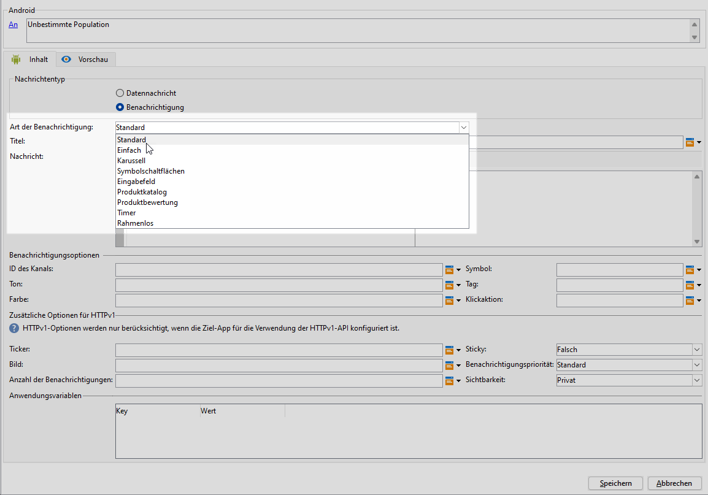
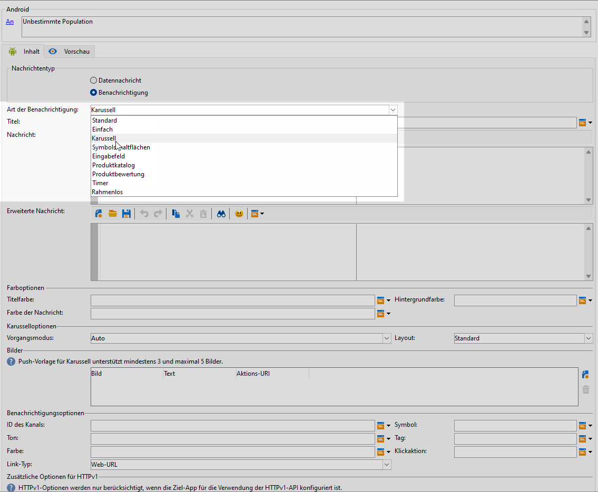
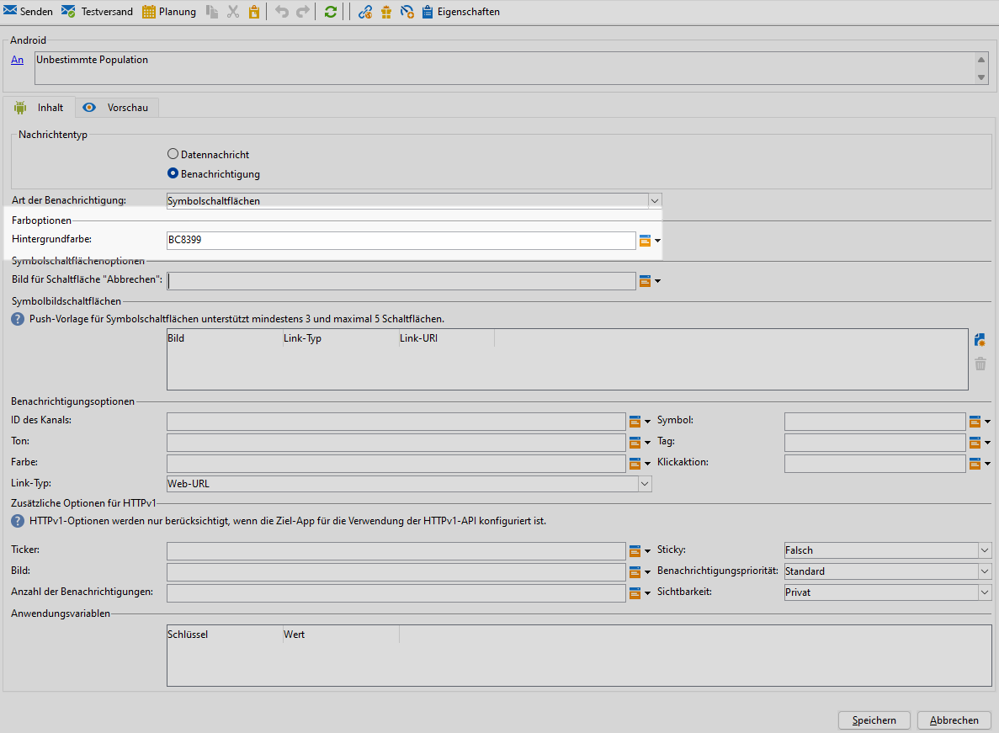
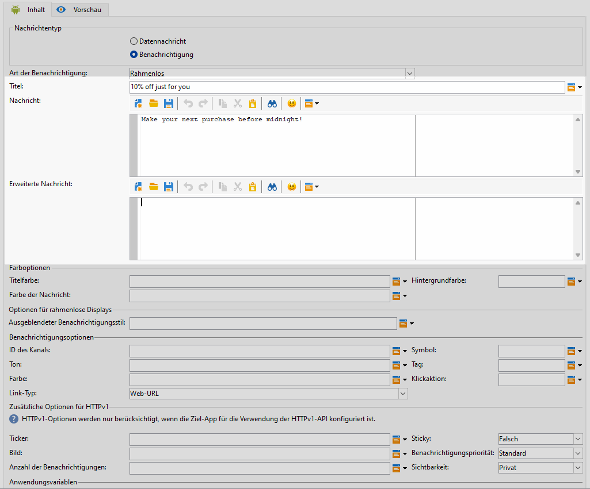

# Erstellen eines Rich-Push-Versands für Android {#rich-push}

>[!IMPORTANT]
>
>Bevor Sie eine Rich-Push-Benachrichtigung entwerfen, müssen Sie zunächst Ihren V2-Connector konfigurieren. Eine detaillierte Vorgehensweise dazu finden Sie auf [dieser Seite](https://experienceleague.adobe.com/de/docs/campaign-classic/using/sending-messages/sending-push-notifications/configure-the-mobile-app/configuring-the-mobile-application-android#configuring-external-account-android).

Bei Firebase Cloud Messaging stehen Ihnen zwei Nachrichtentypen zur Auswahl:

* Die **[!UICONTROL Datenmeldung]** wird von der Client-App verarbeitet. Diese Meldungen werden direkt an die App gesendet, die auf dem Gerät eine Android-Benachrichtigung generiert und anzeigt. Datennachrichten enthalten nur die von Ihnen definierten Anwendungsvariablen.

* Die **[!UICONTROL Benachrichtigungsmeldung]** wird automatisch vom FCM SDK verarbeitet. FCM übernimmt für die Client-App automatisch das Anzeigen der Nachricht auf den Geräten Ihrer Benutzenden. Benachrichtigungsmeldungen enthalten einen vordefinierten Satz von Parametern und Optionen, können aber mit benutzerspezifischen Anwendungsvariablen weiter personalisiert werden.

Wenn die Bildlaufleiste auf Ihrer Benutzeroberfläche deaktiviert ist, greifen Sie auf **[!UICONTROL Administration]** `>` **[!UICONTROL Plattform]** `>` **[!UICONTROL Optionen]** zu und setzen Sie die Option **[!UICONTROL XtkUseScrollBar]** auf &quot;1&quot;.

## Inhalt einer Android-Benachrichtigung definieren {#push-message}

Nach der Erstellung Ihres Push-Versands können Sie dessen Inhalt mit einer der folgenden Vorlagen definieren:

* Mit **Standard** können Sie Benachrichtigungen mit einem einfachen Symbol und einem zugehörigen Bild senden.

* **Standard** kann Text, Bilder und Schaltflächen in Ihre Benachrichtigungen aufnehmen.

* Mit **Karussell** können Sie Benachrichtigungen mit Text und mehreren Bildern senden, durch die Benutzer wischen können.

* Mit den Schaltflächen **Symbol** können Sie Benachrichtigungen mit einem Symbol und einem entsprechenden Bild senden.

* **Eingabefeld** erfasst Benutzereingaben und Feedback direkt über die Benachrichtigung.

* **Produktkatalog** zeigt eine Vielzahl von Produktbildern an.

* Mit der **Produktbewertung** können Benutzer Feedback geben und Produkte bewerten.

* **Timer** enthält einen Live-Countdown-Timer in Ihren Benachrichtigungen.

* **Zero Bezel** verwendet die gesamte Hintergrundfläche für ein Bild, wobei Text nahtlos überlagert wird.

Navigieren Sie durch die folgenden Registerkarten, um mehr über die Personalisierung dieser Vorlagen zu erfahren.

>[!BEGINTABS]

>[!TAB Standard]

1. Wählen Sie **[!UICONTROL Standard]** aus der Dropdown-Liste **[!UICONTROL Art der Benachrichtigung]**.

   

1. Um Ihre Nachricht zu erstellen, geben Sie Ihren Text in die Felder **[!UICONTROL Titel]** und **[!UICONTROL Nachricht]** ein.

   

1. Verwenden Sie dynamische Personalisierungsfelder, um Inhalte zu definieren, Daten zu personalisieren und dynamische Inhalte hinzuzufügen. [Weitere Informationen](../send/personalize.md)

1. Um Ihre Push-Benachrichtigung weiter zu personalisieren, konfigurieren Sie die **[!UICONTROL Benachrichtigungsoptionen]** und die **[!UICONTROL zusätzlichen HTTPv1-Optionen]** Ihrer Push-Benachrichtigung. [Weitere Informationen](#push-advanced)

   

Nachdem Sie den Nachrichteninhalt definiert haben, können Sie Testabonnentinnen und -abonnenten einsetzen, um die Nachricht in einer Vorschau anzuzeigen und zu testen.

>[!TAB Einfach]

1. Wählen Sie **[!UICONTROL Einfach]** aus der Dropdown-Liste **[!UICONTROL Art der Benachrichtigung]**.

   

1. Um Ihre Nachricht zu erstellen, geben Sie Ihren Text in die Felder **[!UICONTROL Titel]**, **[!UICONTROL Nachricht]** und **[!UICONTROL Erweiterte Nachricht]** ein.

   Der Text der **[!UICONTROL Nachricht]** wird in der ausgeblendeten Ansicht angezeigt, während die **[!UICONTROL Erweiterte Nachricht]** angezeigt wird, wenn die Benachrichtigung erweitert wird.

   

1. Verwenden Sie dynamische Personalisierungsfelder, um Inhalte zu definieren, Daten zu personalisieren und dynamische Inhalte hinzuzufügen. [Weitere Informationen](../send/personalize.md)

1. Geben Sie unter dem Menü **[!UICONTROL Farboptionen]** die hexadezimalen Farb-Codes für Ihren **[!UICONTROL Titel]**, Ihre **[!UICONTROL Nachricht]** und den **[!UICONTROL Hintergrund]** ein.

1. Fügen Sie bei Bedarf eine **[!UICONTROL Schaltfläche „Später erinnern“]** hinzu. Geben Sie den **[!UICONTROL Text für die Erinnerung]** und das **Datum** in die entsprechenden Felder ein.

   Das Feld **[!UICONTROL Erinnerungsdatum]** benötigt einen Wert, der eine Zeitspanne in Sekunden darstellt.

1. Klicken Sie auf **[!UICONTROL Schaltfläche hinzufügen]** und füllen Sie folgende Felder aus:

   * **[!UICONTROL Titel]**: Text, der auf der Schaltfläche angezeigt wird.
   * **[!UICONTROL Link-URI]**: Geben Sie den URI an, der beim Klicken auf die Schaltfläche ausgeführt werden soll.

   Sie haben die Möglichkeit, bis zu drei Schaltflächen in Ihre Push-Benachrichtigung einzubauen. Wenn Sie sich für die **[!UICONTROL Schaltfläche „Später erinnern“]** entscheiden, können Sie maximal zwei Schaltflächen einfügen.

1. Wählen Sie den **[!UICONTROL Link-Typ]** für die verlinkte URL Ihrer Schaltfläche:

   * **[!UICONTROL Web-URL]**: Web-URLs leiten Benutzende zu Online-Inhalten weiter. Beim Anklicken öffnen sie den Standard-Webbrowser des Geräts und navigieren zu der angegebenen URL.

   * **[!UICONTROL Deeplink]**: Deeplinks sind URLs, die Benutzende zu bestimmten Abschnitten in einer App führen, selbst wenn die App geschlossen ist. Beim Anklicken kann ein Dialogfeld angezeigt werden, in dem Benutzende aus verschiedenen Apps wählen können, die den Link verarbeiten können.

   * **[!UICONTROL Open App]**: Open App-URLs ermöglichen es Ihnen, sich direkt mit Inhalten innerhalb einer Anwendung zu verbinden. Diese Art von URL ermöglicht es Ihrer Anwendung, sich als Standard-Handler für einen bestimmten Link-Typ zu etablieren und so das Dialogfeld zur Disambiguierung zu umgehen.

   Weitere Informationen über die Handhabung von Android-App-Links finden Sie in der [Entwicklerdokumentation zu Android](https://developer.android.com/training/app-links).

   

1. Um Ihre Push-Benachrichtigung weiter zu personalisieren, konfigurieren Sie die **[!UICONTROL Benachrichtigungsoptionen]** und die **[!UICONTROL zusätzlichen HTTPv1-Optionen]** Ihrer Push-Benachrichtigung. [Weitere Informationen](#push-advanced)

   

Nachdem Sie den Nachrichteninhalt definiert haben, können Sie Testabonnentinnen und -abonnenten einsetzen, um die Nachricht in einer Vorschau anzuzeigen und zu testen.

>[!TAB Karussell]

1. Wählen Sie **[!UICONTROL Karussell]** aus der Dropdown-Liste **[!UICONTROL Art der Benachrichtigung]**.

   

1. Um Ihre Nachricht zu erstellen, geben Sie Ihren Text in die Felder **[!UICONTROL Titel]**, **[!UICONTROL Nachricht]** und **[!UICONTROL Erweiterte Nachricht]** ein.

   Der Text der **[!UICONTROL Nachricht]** wird in der ausgeblendeten Ansicht angezeigt, während die **[!UICONTROL Erweiterte Nachricht]** angezeigt wird, wenn die Benachrichtigung erweitert wird.

   

1. Verwenden Sie den Ausdruckseditor, um Inhalte zu definieren, Daten zu personalisieren und dynamische Inhalte hinzuzufügen. [Weitere Informationen](../send/personalize.md)

1. Geben Sie unter dem Menü **[!UICONTROL Farboptionen]** die hexadezimalen Farb-Codes für Ihren **[!UICONTROL Titel]**, Ihre **[!UICONTROL Nachricht]** und den **[!UICONTROL Hintergrund]** ein.

1. Wählen Sie, wie das **[!UICONTROL Karussell]** bedient werden soll:

   * **[!UICONTROL Automatisch]**: Die Bilder werden automatisch in vordefinierten Intervallen als Folien wiedergegeben.
   * **[!UICONTROL Manuell]**: Benutzende können manuell zwischen den Folien streichen, um durch die Bilder zu navigieren.

1. Aktivieren Sie die Option **[!UICONTROL Filmstreifen]** aus der Dropdown-Liste **[!UICONTROL Layout]**, um die Vorschau der vorherigen und der nächsten Bilder neben der Hauptfolie einzuschließen.

1. Klicken Sie auf **[!UICONTROL Bild hinzufügen]** und geben Sie Ihre Bild-URL, Ihren Text und Ihre Aktions-URL ein.

   Stellen Sie sicher, dass Sie mindestens drei und maximal fünf Bilder einfügen.

   

1. Um Ihre Push-Benachrichtigung weiter zu personalisieren, konfigurieren Sie die **[!UICONTROL Benachrichtigungsoptionen]** und die **[!UICONTROL zusätzlichen HTTPv1-Optionen]** Ihrer Push-Benachrichtigung. [Weitere Informationen](#push-advanced)

   

Nachdem Sie den Nachrichteninhalt definiert haben, können Sie Testabonnentinnen und -abonnenten einsetzen, um die Nachricht in einer Vorschau anzuzeigen und zu testen.

>[!TAB Symbolschaltflächen]

1. Wählen Sie aus der Dropdownliste **[!UICONTROL Benachrichtigungstyp]** die Option **[!UICONTROL Symbolschaltflächen]** aus.

   

1. Geben Sie unter dem Menü **[!UICONTROL Farboptionen]** die hexadezimalen Farbcodes für Ihren **[!UICONTROL Hintergrund]** ein.

   

1. Geben Sie die URL für das Bild der Schaltfläche **[!UICONTROL Abbrechen]** an.

1. Klicken Sie unter den Schaltflächen für das Symbol **[!UICONTROL Bild hinzufügen]** auf **[!UICONTROL Bild hinzufügen]**. Geben Sie dann die **Bild-URL**, den **Link-Typ** und den **Link-URI** ein.

   Stellen Sie sicher, dass Sie mindestens drei Bilder und maximal fünf Schaltflächen einschließen.

   

1. Um Ihre Push-Benachrichtigung weiter zu personalisieren, konfigurieren Sie die **[!UICONTROL Benachrichtigungsoptionen]** und die **[!UICONTROL zusätzlichen HTTPv1-Optionen]** Ihrer Push-Benachrichtigung. [Weitere Informationen](#push-advanced)

   

Nachdem Sie den Nachrichteninhalt definiert haben, können Sie Testabonnentinnen und -abonnenten einsetzen, um die Nachricht in einer Vorschau anzuzeigen und zu testen.

>[!TAB Eingabefeld]

1. Wählen Sie aus der Dropdownliste **[!UICONTROL Benachrichtigungstyp]** die Option **[!UICONTROL Eingabefeld]** aus.

   

1. Um Ihre Nachricht zu erstellen, geben Sie Ihren Text in die Felder **[!UICONTROL Titel]**, **[!UICONTROL Nachricht]** und **[!UICONTROL Erweiterte Nachricht]** ein.

   Der Text der **[!UICONTROL Nachricht]** wird in der ausgeblendeten Ansicht angezeigt, während die **[!UICONTROL Erweiterte Nachricht]** angezeigt wird, wenn die Benachrichtigung erweitert wird.

   

1. Geben Sie unter dem Menü **[!UICONTROL Farboptionen]** die hexadezimalen Farbcodes für die Felder **[!UICONTROL Titel]**, **[!UICONTROL Nachricht]** und **[!UICONTROL Hintergrund]** ein.

1. Geben Sie im Menü **[!UICONTROL Optionen für das Eingabefeld]** die folgende Option ein:

   * **[!UICONTROL Name des Empfängers für die Eingabe]**: Geben Sie den Namen oder die Kennung für den Empfänger der Eingabe ein.
   * **[!UICONTROL Eingabetext]**: Geben Sie den Text für das Feld **Eingabe** ein.
   * **[!UICONTROL Feedback-Text]**: Geben Sie den Text ein, der nach einer Antwort angezeigt werden soll.
   * **[!UICONTROL Feedback-Bild]**: Fügen Sie die URL für das Bild hinzu, das nach einer Antwort angezeigt wird.

   

1. Um Ihre Push-Benachrichtigung weiter zu personalisieren, konfigurieren Sie die **[!UICONTROL Benachrichtigungsoptionen]** und die **[!UICONTROL zusätzlichen HTTPv1-Optionen]** Ihrer Push-Benachrichtigung. [Weitere Informationen](#push-advanced)

   

Nachdem Sie den Nachrichteninhalt definiert haben, können Sie Testabonnentinnen und -abonnenten einsetzen, um die Nachricht in einer Vorschau anzuzeigen und zu testen.

>[!TAB Produktkatalog]

1. Wählen Sie aus der Dropdownliste **[!UICONTROL Benachrichtigungstyp]** die Option **[!UICONTROL Produktkatalog]** aus.

   

1. Um Ihre Nachricht zu erstellen, geben Sie Ihren Text in die Felder **[!UICONTROL Titel]**, **[!UICONTROL Nachricht]** und **[!UICONTROL Erweiterte Nachricht]** ein.

   Der Text der **[!UICONTROL Nachricht]** wird in der ausgeblendeten Ansicht angezeigt, während die **[!UICONTROL Erweiterte Nachricht]** angezeigt wird, wenn die Benachrichtigung erweitert wird.

   

1. Geben Sie unter dem Menü **[!UICONTROL Farboptionen]** die hexadezimalen Farb-Codes für Ihren **[!UICONTROL Titel]**, Ihre **[!UICONTROL Nachricht]** und den **[!UICONTROL Hintergrund]** ein.

1. Füllen Sie unter dem Menü **[!UICONTROL Produktkatalogoptionen]** die folgenden Optionen aus:

   * **[!UICONTROL Aktionsschaltflächen-Text]**: Auf der Schaltfläche angezeigter Text.
   * **[!UICONTROL Textfarbe der Aktionsschaltfläche]**: Farbe des Textes der Aktionsschaltfläche.
   * **[!UICONTROL Farbe der Aktionsschaltfläche]**: Farbe der Aktionsschaltfläche.
   * **[!UICONTROL Aktionsschaltflächen-URI]**: Geben Sie den URI an, der beim Klicken auf die Schaltfläche ausgeführt werden soll.
   * **[!UICONTROL Anzeigetyp]**: Wählen Sie zwischen vertikaler oder horizontaler Anzeige.

   

1. Klicken Sie im Menü **[!UICONTROL Produktkatalogelemente]** auf **[!UICONTROL Hinzufügen]** und geben Sie die folgenden Details für jedes Element ein:

   * **[!UICONTROL Titel]**
   * **[!UICONTROL Beschreibung]**
   * **[!UICONTROL Bild-URL]**
   * **[!UICONTROL Preis]**
   * **[!UICONTROL URI]**

   Stellen Sie sicher, dass Sie maximal drei Elemente angeben.

   

1. Um Ihre Push-Benachrichtigung weiter zu personalisieren, konfigurieren Sie die **[!UICONTROL Benachrichtigungsoptionen]** und die **[!UICONTROL zusätzlichen HTTPv1-Optionen]** Ihrer Push-Benachrichtigung. [Weitere Informationen](#push-advanced)

Nachdem Sie den Nachrichteninhalt definiert haben, können Sie Testabonnentinnen und -abonnenten einsetzen, um die Nachricht in einer Vorschau anzuzeigen und zu testen.

>[!TAB Produktbewertung]

1. Wählen Sie aus der Dropdownliste **[!UICONTROL Benachrichtigungstyp]** die Option **[!UICONTROL Produktbewertung]** aus.

   

1. Um Ihre Nachricht zu erstellen, geben Sie Ihren Text in die Felder **[!UICONTROL Titel]**, **[!UICONTROL Nachricht]** und **[!UICONTROL Erweiterte Nachricht]** ein.

   Der Text der **[!UICONTROL Nachricht]** wird in der ausgeblendeten Ansicht angezeigt, während die **[!UICONTROL Erweiterte Nachricht]** angezeigt wird, wenn die Benachrichtigung erweitert wird.

   

1. Geben Sie unter dem Menü **[!UICONTROL Farboptionen]** die hexadezimalen Farb-Codes für Ihren **[!UICONTROL Titel]**, Ihre **[!UICONTROL Nachricht]** und den **[!UICONTROL Hintergrund]** ein.

1. Geben Sie im Menü **[!UICONTROL Optionen für die Produktbewertung]** die URLs für das Symbol **[!UICONTROL Bewertung mit nicht ausgewähltem Status]** und das Symbol **[!UICONTROL Bewertung mit ausgewähltem Status]** ein.

   

1. Klicken Sie unter dem Menü **[!UICONTROL Produktempfehlungselemente]** auf **[!UICONTROL Hinzufügen]** , geben Sie Ihren **[!UICONTROL Link-URI]** ein und wählen Sie Ihren **[!UICONTROL Linktyp]** aus.

   * **[!UICONTROL Web-URL]**: Web-URLs leiten Benutzende zu Online-Inhalten weiter. Beim Anklicken öffnen sie den Standard-Webbrowser des Geräts und navigieren zu der angegebenen URL.

   * **[!UICONTROL Deeplink]**: Deeplinks sind URLs, die Benutzende zu bestimmten Abschnitten in einer App führen, selbst wenn die App geschlossen ist. Beim Anklicken kann ein Dialogfeld angezeigt werden, in dem Benutzende aus verschiedenen Apps wählen können, die den Link verarbeiten können.

   * **[!UICONTROL Open App]**: Open App-URLs ermöglichen es Ihnen, sich direkt mit Inhalten innerhalb einer Anwendung zu verbinden. Diese Art von URL ermöglicht es Ihrer Anwendung, sich als Standard-Handler für einen bestimmten Link-Typ zu etablieren und so das Dialogfeld zur Disambiguierung zu umgehen.

   * **[!UICONTROL Beenden]**: Der Schaltfläche ist keine URL zugeordnet. Durch Klicken auf wird das Dialogfeld oder die Benutzeroberfläche einfach geschlossen.

   Stellen Sie sicher, dass Sie mindestens drei Werte und maximal fünf Werte angeben.

   

1. Um Ihre Push-Benachrichtigung weiter zu personalisieren, konfigurieren Sie die **[!UICONTROL Benachrichtigungsoptionen]** und die **[!UICONTROL zusätzlichen HTTPv1-Optionen]** Ihrer Push-Benachrichtigung. [Weitere Informationen](#push-advanced)

   

Nachdem Sie den Nachrichteninhalt definiert haben, können Sie Testabonnentinnen und -abonnenten einsetzen, um die Nachricht in einer Vorschau anzuzeigen und zu testen.

>[!TAB Timer]

1. Wählen Sie aus der Dropdownliste **[!UICONTROL Benachrichtigungstyp]** die Option **[!UICONTROL Timer]** aus.

   

1. Um Ihre Nachricht zu erstellen, geben Sie Ihren Text in die Felder **[!UICONTROL Titel]**, **[!UICONTROL Nachricht]** und **[!UICONTROL Erweiterte Nachricht]** ein.

   Der Text der **[!UICONTROL Nachricht]** wird in der ausgeblendeten Ansicht angezeigt, während die **[!UICONTROL Erweiterte Nachricht]** angezeigt wird, wenn die Benachrichtigung erweitert wird.

   

1. Geben Sie den Text ein, der angezeigt werden soll, nachdem der Timer abgelaufen ist, in die Felder **[!UICONTROL Alternativer Titel]**, **[!UICONTROL Alternativnachricht]** und **[!UICONTROL Erweiterte erweiterte alternative Nachricht senden]** ein.

1. Geben Sie unter dem Menü **[!UICONTROL Farboptionen]** die hexadezimalen Farbcodes für Ihren **[!UICONTROL Titel]**, **[!UICONTROL Nachricht]**, **[!UICONTROL Hintergrund]** und Ihren **[!UICONTROL Timer]** ein.

   

1. Setzen Sie Ihre **[!UICONTROL Timer-Dauer]** in Sekunden oder den **[!UICONTROL Timer-Endzeitstempel]** auf einen bestimmten Epoch-Zeitstempel und fügen Sie Ihre URL für das **[!UICONTROL alternative Bild]** hinzu, die nach Ablauf des Timers angezeigt wird.

   

1. Um Ihre Push-Benachrichtigung weiter zu personalisieren, konfigurieren Sie die **[!UICONTROL Benachrichtigungsoptionen]** und die **[!UICONTROL zusätzlichen HTTPv1-Optionen]** Ihrer Push-Benachrichtigung. [Weitere Informationen](#push-advanced)

Nachdem Sie den Nachrichteninhalt definiert haben, können Sie Testabonnentinnen und -abonnenten einsetzen, um die Nachricht in einer Vorschau anzuzeigen und zu testen.

>[!TAB Null-Verkleidung]

1. Wählen Sie aus der Dropdown-Liste **[!UICONTROL Benachrichtigungstyp]** die Option **[!UICONTROL Null-Verkleidung]** aus.

   

1. Um Ihre Nachricht zu erstellen, geben Sie Ihren Text in die Felder **[!UICONTROL Titel]**, **[!UICONTROL Nachricht]** und **[!UICONTROL Erweiterte Nachricht]** ein.

   Der Text der **[!UICONTROL Nachricht]** wird in der ausgeblendeten Ansicht angezeigt, während die **[!UICONTROL Erweiterte Nachricht]** angezeigt wird, wenn die Benachrichtigung erweitert wird.

   

1. Geben Sie unter dem Menü **[!UICONTROL Farboptionen]** die hexadezimalen Farb-Codes für Ihren **[!UICONTROL Titel]**, Ihre **[!UICONTROL Nachricht]** und den **[!UICONTROL Hintergrund]** ein.

1. Fügen Sie im Menü **[!UICONTROL Nullsummenoptionen]** Ihre Bild-URL im Feld **[!UICONTROL Reduzierter Benachrichtigungsstil]** hinzu.

   

1. Um Ihre Push-Benachrichtigung weiter zu personalisieren, konfigurieren Sie die **[!UICONTROL Benachrichtigungsoptionen]** und die **[!UICONTROL zusätzlichen HTTPv1-Optionen]** Ihrer Push-Benachrichtigung. [Weitere Informationen](#push-advanced)

Nachdem Sie den Nachrichteninhalt definiert haben, können Sie Testabonnentinnen und -abonnenten einsetzen, um die Nachricht in einer Vorschau anzuzeigen und zu testen.

>[!ENDTABS]

## Erweiterte Einstellungen für Push-Benachrichtigungen {#push-advanced}

### Benachrichtigungsoptionen {#notification-options}

| Parameter | Beschreibung |
|---------|---------|
| **[!UICONTROL Kanal-ID]** | Legen Sie die Kanal-ID Ihrer Benachrichtigung fest. Die App muss einen Kanal mit dieser Kanal-ID erstellen, bevor eine Benachrichtigung mit dieser Kanal-ID empfangen werden kann. |
| **[!UICONTROL Symbol]** | Legt das Symbol fest, das für die Benachrichtigung auf den Geräten Ihrer Profile angezeigt werden soll. |
| **[!UICONTROL Ton]** | Legt den Ton fest, der abgespielt werden soll, wenn das Gerät Ihre Benachrichtigung erhält. |
| **[!UICONTROL Tag]** | Legt eine Kennung fest, die zum Ersetzen bestehender Benachrichtigungen in der Benachrichtigungsablage verwendet wird. Dadurch wird verhindert, dass sich mehrere Benachrichtigungen ansammeln, und sichergestellt, dass nur die jeweils letzte relevante Benachrichtigung angezeigt wird. |
| **[!UICONTROL Farbe]** | Legt die Farbe des Symbols Ihrer Benachrichtigung mit einem hexadezimalen Farb-Code fest. |
| **[!UICONTROL Klick-Aktion]** | Legt die Aktion fest, die für das Klicken der Benutzenden auf Ihre Benachrichtigung zugewiesen ist. |
| **[!UICONTROL Hintergrundfarbe der Benachrichtigungen]** | Legt die Farbe des Benachrichtigungshintergrunds mit den gewünschten Hexadezimal-Farb-Codes fest. |
| **[!UICONTROL Link-Typ]** | <ul><li>Web-URL: Web-URLs leiten Benutzende zu Online-Inhalten weiter. Beim Anklicken öffnen sie den Standard-Webbrowser des Geräts und navigieren zu der angegebenen URL.</li><li>Deeplink: Deeplinks sind URLs, die Benutzende zu bestimmten Abschnitten in einer App führen, selbst wenn die App geschlossen ist. Beim Anklicken kann ein Dialogfeld angezeigt werden, in dem Benutzende aus verschiedenen Apps wählen können, die den Link verarbeiten können.</li><li> Open App: Open App-URLs ermöglichen es Ihnen, sich direkt mit Inhalten innerhalb einer Anwendung zu verbinden. Diese Art von URL ermöglicht es Ihrer Anwendung, sich als Standard-Handler für einen bestimmten Link-Typ zu etablieren und so das Dialogfeld zur Disambiguierung zu umgehen.</li></ul> |

### Zusätzliche Optionen für HTTPv1 {#additional-options}

| Parameter | Beschreibung |
|---------|---------|
| **[!UICONTROL Ticker]** | Legt den Ticker-Text Ihrer Benachrichtigung fest. Nur verfügbar bei Geräten mit Android 5.0 Lollipop. |
| **[!UICONTROL Sticky]** | Wenn diese Option aktiviert ist, bleibt die Benachrichtigung auch dann sichtbar, wenn darauf geklickt wird.  Wenn sie deaktiviert ist, wird die Benachrichtigung automatisch verworfen, sobald damit interagiert wird. Durch das Sticky-Verhalten können wichtige Benachrichtigungen über längere Zeiträume auf dem Bildschirm beibehalten werden. |
| **[!UICONTROL Bild]** | Legt die URL des Bilds fest, das in Ihrer Benachrichtigung angezeigt werden soll. |
| **[!UICONTROL Benachrichtigungspriorität]** | Legen Sie die Prioritätsstufe Ihrer Benachrichtigung fest. Dies kann „Standard“, „Minimum“, „Niedrig“ oder „Hoch“ sein. Die Prioritätsstufe bestimmt die Wichtigkeit und Dringlichkeit der Benachrichtigung und beeinflusst deren Anzeige sowie die Frage, ob sie bestimmte Systemeinstellungen umgehen kann. Weitere Informationen hierzu finden Sie in der [FCM-Dokumentation](https://firebase.google.com/docs/reference/fcm/rest/v1/projects.messages#notificationpriority). |
| **[!UICONTROL Anzahl der Benachrichtigungen]** | Legt die Zahl der neuen ungelesenen Informationen fest, die direkt auf dem Symbol der App angezeigt werden. Dadurch können die Benutzenden schnell die Anzahl der ausstehenden Benachrichtigungen sehen. |
| **[!UICONTROL Sichtbarkeit]** | Legen Sie die Sichtbarkeitsstufe Ihrer Benachrichtigung fest. Dies kann öffentlich, privat oder geheim sein. Die Sichtbarkeitsstufe bestimmt, wie viel des Benachrichtigungsinhalts auf dem Sperrbildschirm und anderen sensiblen Bereichen angezeigt wird. Weitere Informationen finden Sie in der [FCM-Dokumentation](https://firebase.google.com/docs/reference/fcm/rest/v1/projects.messages#visibility). |
| **[!UICONTROL Anwendungsvariablen]** | Damit können Sie das Verhalten von Benachrichtigungen definieren. Diese Variablen sind vollständig anpassbar und Teil der an das Mobilgerät gesendeten Nachrichten-Payload. |
