# Erstellen eines Rich-Push-Versands für iOS {#rich-push}

>[!IMPORTANT]
>
>Bevor Sie eine Rich-Push-Benachrichtigung entwerfen, müssen Sie zunächst Ihren V2-Connector konfigurieren. Eine detaillierte Vorgehensweise dazu finden Sie auf [dieser Seite](https://experienceleague.adobe.com/de/docs/campaign-classic/using/sending-messages/sending-push-notifications/configure-the-mobile-app/configuring-the-mobile-application).

## Inhalt einer iOS-Benachrichtigung definieren {#push-message}

Nach der Erstellung Ihres Push-Versands können Sie dessen Inhalt mit einer der folgenden Vorlagen definieren:

* Mit **Standard** können Sie Benachrichtigungen mit einem einfachen Symbol und einem zugehörigen Bild senden.

* **Standard** kann Text, Bilder und Schaltflächen in Ihre Benachrichtigungen aufnehmen.

* Mit **Karussell** können Sie Benachrichtigungen mit Text und mehreren Bildern senden, durch die Benutzer wischen können.

Navigieren Sie durch die folgenden Registerkarten, um mehr über die Personalisierung dieser Vorlagen zu erfahren.

>[!BEGINTABS]

>[!TAB Standard]

1. Wählen Sie **[!UICONTROL Allgemeine Benachrichtigung (Warnung, Ton, Badge)]** als Ihren **[!UICONTROL Benachrichtigungstyp]** aus.

1. Wählen Sie aus der Dropdownliste **[!UICONTROL Benachrichtigungstyp]** die Option **[!UICONTROL Standard]** aus.

   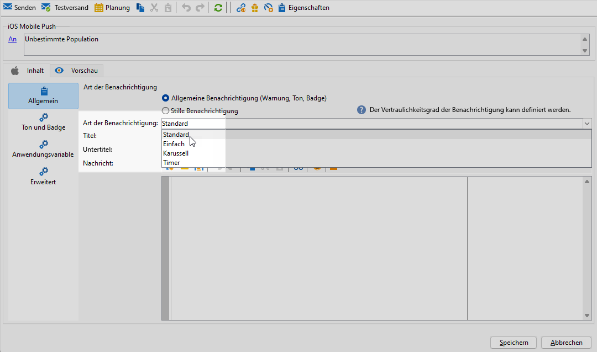

1. Geben Sie in das Feld **[!UICONTROL Titel]** die Bezeichnung ein, die in der Liste der im Benachrichtigungscenter verfügbaren Benachrichtigungen erscheinen soll.

   In diesem Feld können Sie den Wert des Parameters **title** der iOS-Benachrichtigungs-Payload definieren.

1. Fügen Sie optional einen **[!UICONTROL Untertitel]** hinzu, der dem Parameter **subtitle** der iOS-Benachrichtigungs-Payload entspricht.

1. Geben Sie den Inhalt der Nachricht im Abschnitt **[!UICONTROL Nachrichteninhalt]** des Assistenten ein.

   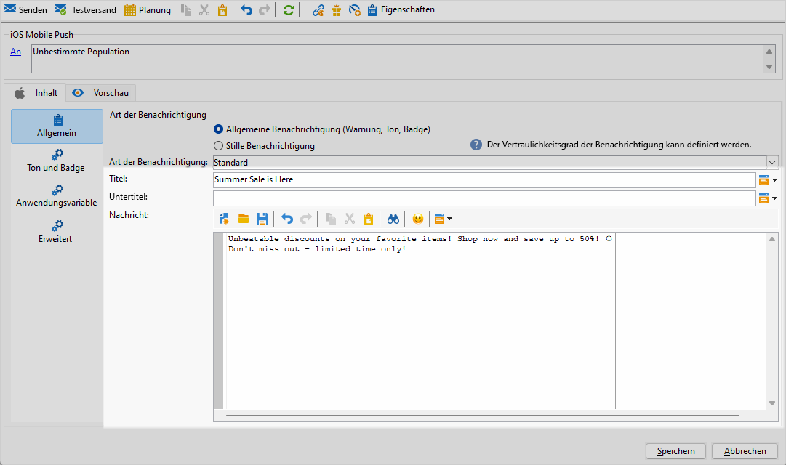

1. Navigieren Sie zur Registerkarte **[!UICONTROL Ton und Badge]** , um zusätzliche Einstellungen wie Ton- und Badge-Optionen für Ihre Benachrichtigungen anzupassen. [Weitere Informationen](#sound-badge)

   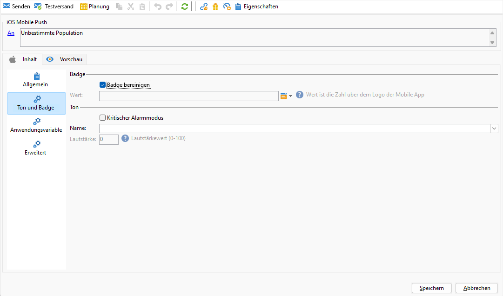

1. Ihre **[!UICONTROL Anwendungsvariablen]** werden automatisch von der Registerkarte **[!UICONTROL Anwendungsvariablen]** hinzugefügt. Damit können Sie beispielsweise das Benachrichtigungsverhalten definieren. So können Sie einen speziellen Anwendungsbildschirm konfigurieren, der angezeigt wird, wenn der Benutzer die Benachrichtigung aktiviert.

1. Weitere Anpassungen finden Sie unter den **[!UICONTROL Erweiterten Optionen]** , die für Ihre Push-Benachrichtigungen verfügbar sind. [Weitere Informationen](#push-advanced)

   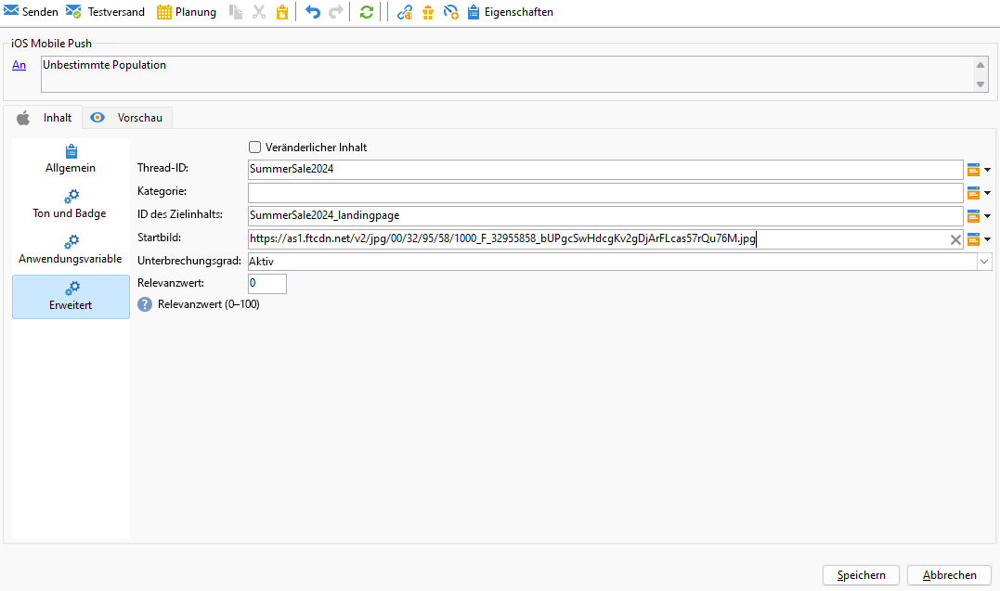

1. Sobald die Benachrichtigung konfiguriert ist, klicken Sie auf die Registerkarte **[!UICONTROL Vorschau]**, um eine Vorschau der Benachrichtigung anzuzeigen.

>[!TAB Einfach]

1. Wählen Sie **[!UICONTROL Allgemeine Benachrichtigung (Warnung, Ton, Badge)]** als Ihren **[!UICONTROL Benachrichtigungstyp]** aus.

1. Wählen Sie **[!UICONTROL Einfach]** aus der Dropdown-Liste **[!UICONTROL Art der Benachrichtigung]**.

   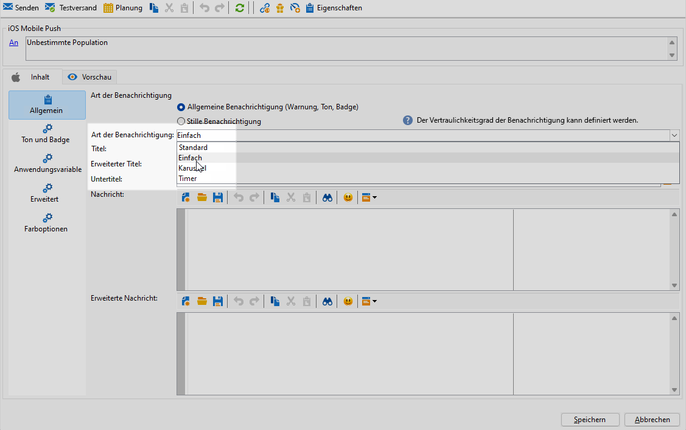

1. Geben Sie zum Erstellen Ihrer Nachricht den Text in die Felder **[!UICONTROL Titel]**, **[!UICONTROL Erweiterte Nachricht]**, **[!UICONTROL Nachricht]** und **[!UICONTROL Erweiterte Nachricht]** ein.

   Der Text der **[!UICONTROL Nachricht]** wird in der ausgeblendeten Ansicht angezeigt, während die **[!UICONTROL Erweiterte Nachricht]** angezeigt wird, wenn die Benachrichtigung erweitert wird.

   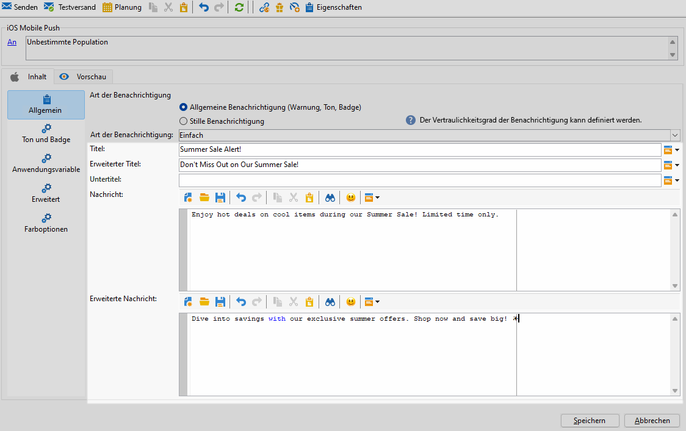

1. Fügen Sie optional einen **[!UICONTROL Untertitel]** hinzu, der dem Parameter **subtitle** der iOS-Benachrichtigungs-Payload entspricht.

1. Navigieren Sie zur Registerkarte **[!UICONTROL Ton und Badge]** , um zusätzliche Einstellungen wie Ton- und Badge-Optionen für Ihre Benachrichtigungen anzupassen. [Weitere Informationen](#sound-badge)

1. Ihre **[!UICONTROL Anwendungsvariablen]** werden automatisch von der Registerkarte **[!UICONTROL Anwendungsvariablen]** hinzugefügt. Damit können Sie beispielsweise das Benachrichtigungsverhalten definieren. So können Sie einen speziellen Anwendungsbildschirm konfigurieren, der angezeigt wird, wenn der Benutzer die Benachrichtigung aktiviert.

1. Weitere Anpassungen finden Sie unter den **[!UICONTROL Erweiterten Optionen]** , die für Ihre Push-Benachrichtigungen verfügbar sind. [Weitere Informationen](#push-advanced)

   

1. Geben Sie im Menü **[!UICONTROL Farboptionen]** hexadezimale Farbcodes für den **[!UICONTROL Titel]**, die **[!UICONTROL Meldung]** und den **[!UICONTROL Hintergrund]** ein.

   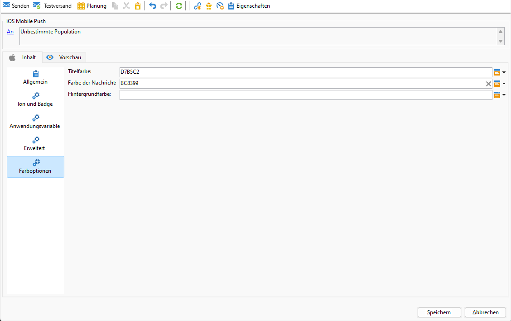

Nachdem Sie den Nachrichteninhalt definiert haben, können Sie Testabonnentinnen und -abonnenten einsetzen, um die Nachricht in einer Vorschau anzuzeigen und zu testen.

>[!TAB Karussell]

1. Wählen Sie **[!UICONTROL Allgemeine Benachrichtigung (Warnung, Ton, Badge)]** als Ihren **[!UICONTROL Benachrichtigungstyp]** aus.

1. Wählen Sie **[!UICONTROL Karussell]** aus der Dropdown-Liste **[!UICONTROL Art der Benachrichtigung]**.

   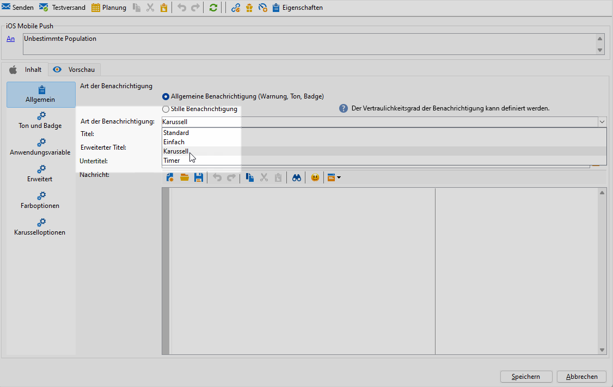

1. Geben Sie zum Erstellen Ihrer Nachricht Ihren Text in die Felder **[!UICONTROL Titel]**, **[!UICONTROL erweiterter Titel]** und **[!UICONTROL Nachricht]** ein.

   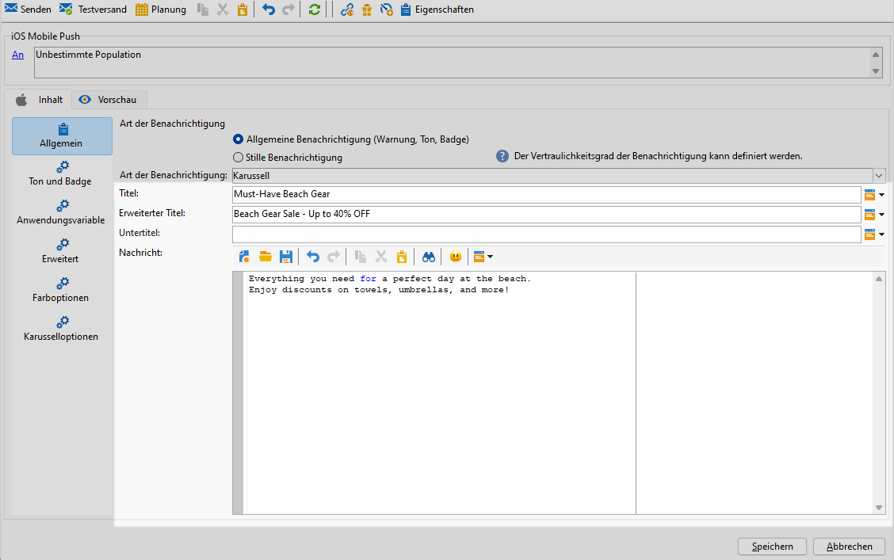

1. Navigieren Sie zur Registerkarte **[!UICONTROL Ton und Badge]** , um zusätzliche Einstellungen wie Ton- und Badge-Optionen für Ihre Benachrichtigungen anzupassen. [Weitere Informationen](#sound-badge)

1. Ihre **[!UICONTROL Anwendungsvariablen]** werden automatisch von der Registerkarte **[!UICONTROL Anwendungsvariablen]** hinzugefügt. Damit können Sie beispielsweise das Benachrichtigungsverhalten definieren. So können Sie einen speziellen Anwendungsbildschirm konfigurieren, der angezeigt wird, wenn der Benutzer die Benachrichtigung aktiviert.

   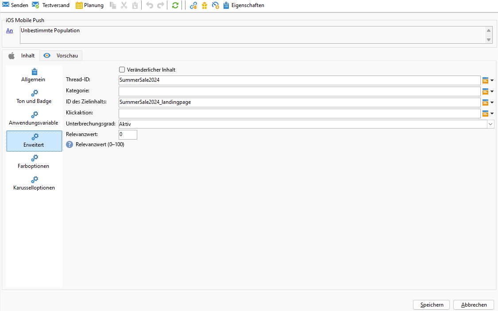

1. Weitere Anpassungen finden Sie unter den **[!UICONTROL Erweiterten Optionen]** , die für Ihre Push-Benachrichtigungen verfügbar sind. [Weitere Informationen](#push-advanced)

1. Geben Sie im Menü **[!UICONTROL Farboptionen]** hexadezimale Farbcodes für den **[!UICONTROL Titel]**, die **[!UICONTROL Meldung]** und den **[!UICONTROL Hintergrund]** ein.

1. Wählen Sie auf der Registerkarte **[!UICONTROL Karusselloptionen]** aus, wie das **[!UICONTROL Karussell]** funktioniert:

   * **[!UICONTROL Automatisch]**: Die Bilder werden automatisch in vordefinierten Intervallen als Folien wiedergegeben.
   * **[!UICONTROL Manuell]**: Benutzende können manuell zwischen den Folien streichen, um durch die Bilder zu navigieren.

1. Klicken Sie auf **[!UICONTROL Bild hinzufügen]** und geben Sie Ihre **[!UICONTROL Bild-URL]**, Ihren **[!UICONTROL Text]** und Ihre **[!UICONTROL Action-URL]** ein.

   Stellen Sie sicher, dass Sie mindestens drei und maximal fünf Bilder einfügen.

   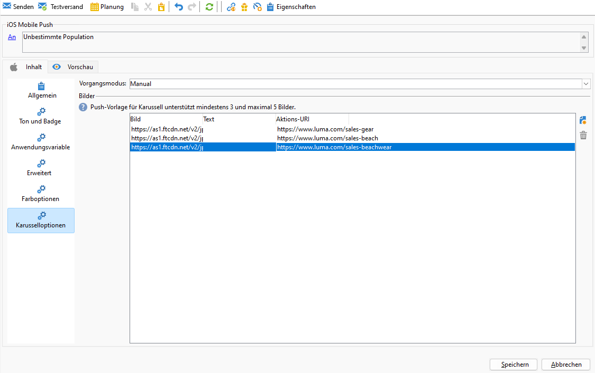

Nachdem Sie den Nachrichteninhalt definiert haben, können Sie Testabonnentinnen und -abonnenten einsetzen, um die Nachricht in einer Vorschau anzuzeigen und zu testen.

>[!TAB Timer]

1. Wählen Sie **[!UICONTROL Allgemeine Benachrichtigung (Warnung, Ton, Badge)]** als Ihren **[!UICONTROL Benachrichtigungstyp]** aus.

1. Wählen Sie aus der Dropdownliste **[!UICONTROL Benachrichtigungstyp]** die Option **[!UICONTROL Timer]** aus.

   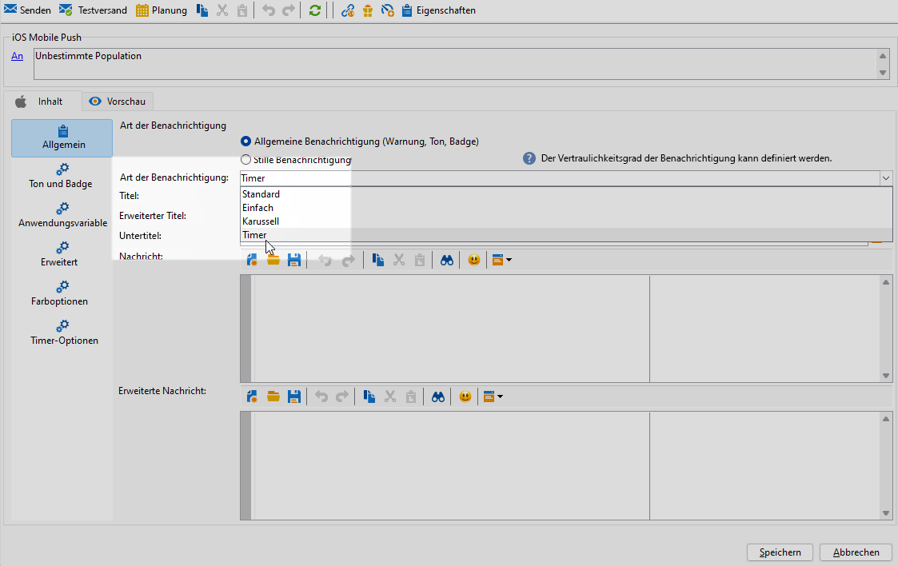

1. Geben Sie zum Erstellen Ihrer Nachricht den Text in die Felder **[!UICONTROL Titel]**, **[!UICONTROL erweiterter Titel]**, **[!UICONTROL Nachricht]** und **[!UICONTROL Erweiterte Nachricht]** ein.

   Der Text der **[!UICONTROL Nachricht]** wird in der ausgeblendeten Ansicht angezeigt, während die **[!UICONTROL Erweiterte Nachricht]** angezeigt wird, wenn die Benachrichtigung erweitert wird.

   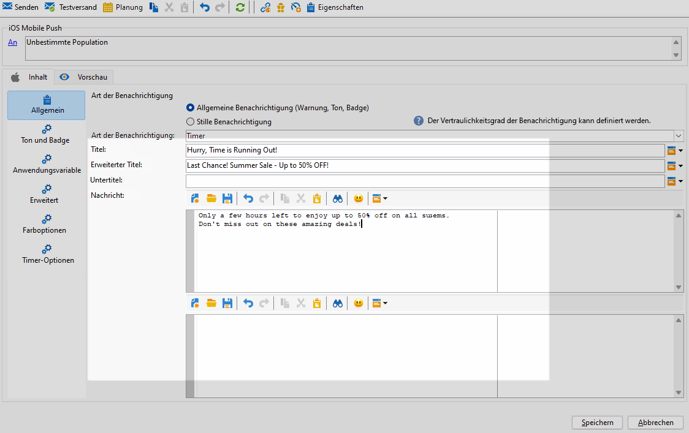

1. Fügen Sie optional einen **[!UICONTROL Untertitel]** hinzu, der dem Parameter **subtitle** der iOS-Benachrichtigungs-Payload entspricht.

1. Navigieren Sie zur Registerkarte **[!UICONTROL Ton und Badge]** , um zusätzliche Einstellungen wie Ton- und Badge-Optionen für Ihre Benachrichtigungen anzupassen. [Weitere Informationen](#sound-badge)

1. Ihre **[!UICONTROL Anwendungsvariablen]** werden automatisch von der Registerkarte **[!UICONTROL Anwendungsvariablen]** hinzugefügt. Damit können Sie beispielsweise das Benachrichtigungsverhalten definieren. So können Sie einen speziellen Anwendungsbildschirm konfigurieren, der angezeigt wird, wenn der Benutzer die Benachrichtigung aktiviert.

1. Weitere Anpassungen finden Sie unter den **[!UICONTROL Erweiterten Optionen]** , die für Ihre Push-Benachrichtigungen verfügbar sind. [Weitere Informationen](#push-advanced)

1. Geben Sie im Menü **[!UICONTROL Farboptionen]** hexadezimale Farbcodes für den **[!UICONTROL Titel]**, die **[!UICONTROL Meldung]** und den **[!UICONTROL Hintergrund]** ein.

   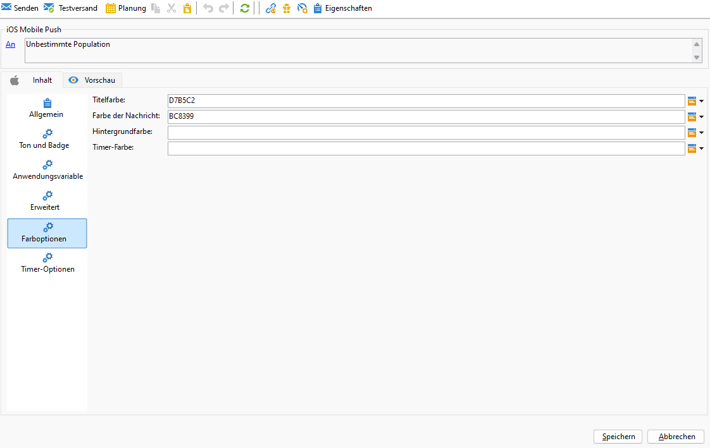

1. Legen Sie auf der Registerkarte **[!UICONTROL Timer]** Ihre **[!UICONTROL Timer-Dauer]** in Sekunden oder den **[!UICONTROL Timer-Endzeitstempel]** auf einen bestimmten Epochenzeitstempel fest.

1. Geben Sie den Text und das Bild ein, die angezeigt werden sollen, nachdem der Timer abgelaufen ist, in die Felder **[!UICONTROL Alternativer Titel]**, **[!UICONTROL Alternativnachricht]** und **[!UICONTROL Alternativbild]** ein.

   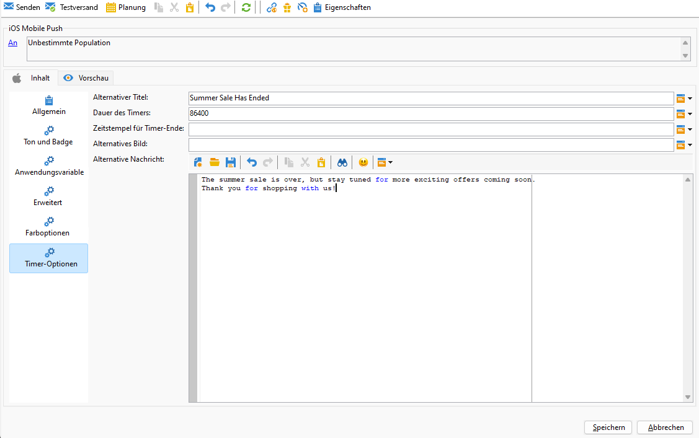

Nachdem Sie den Nachrichteninhalt definiert haben, können Sie Testabonnentinnen und -abonnenten einsetzen, um die Nachricht in einer Vorschau anzuzeigen und zu testen.

>[!ENDTABS]

## Erweiterte Einstellungen für Push-Benachrichtigungen {#push-advanced}

### Audio- und Badge-Optionen {#sound-badge}

| Parameter | Beschreibung |
|---------|---------|
| **[!UICONTROL Badge entfernen]** | Aktivieren Sie diese Optionen, um den Badge-Wert zu aktualisieren. |
| **[!UICONTROL Wert]** | Legen Sie eine Zahl fest, mit der die Anzahl der neuen ungelesenen Informationen direkt auf dem Anwendungssymbol angezeigt wird. |
| **[!UICONTROL Kritischer Alarmmodus]** | Aktivieren Sie diese Option, um Ihrer Benachrichtigung Ton hinzuzufügen, selbst wenn das Handy des Benutzers im Fokusmodus eingestellt ist oder wenn der iPhone stummgeschaltet ist. |
| **[!UICONTROL Name]** | Wählen Sie den Ton aus, der beim Erhalt der Benachrichtigung vom Mobilgerät abgespielt werden soll. |
| **[!UICONTROL Lautstärke]** | Legen Sie die Lautstärke Ihres Tons von 0 auf 100 fest. Töne müssen in die App integriert und zum Zeitpunkt der Erstellung des entsprechenden Service konfiguriert werden. |

### Erweiterte Optionen {#notification-options}

| Parameter | Beschreibung |
|---------|---------|
| **[!UICONTROL Veränderlicher Inhalt]** | Aktivieren Sie diese Option, damit die Mobile App Medieninhalte herunterladen kann. |
| **[!UICONTROL Thread-ID]** | Legen Sie die Kennung fest, die zum Gruppieren verwandter Benachrichtigungen verwendet wird. |
| **[!UICONTROL Kategorie]** | Legen Sie den Namen Ihrer Kategorie-ID fest, mit der Aktionsschaltflächen angezeigt werden. Mit diesen Benachrichtigungen können Benutzer rascher unterschiedliche Aufgaben ausführen, ohne die Anwendung öffnen oder darin navigieren zu müssen. |
| **[!UICONTROL Zielgruppen-Inhalts-ID]** | Legen Sie eine Kennung fest, die bestimmt, welches Anwendungsfenster beim Öffnen der Benachrichtigung vorgezogen werden soll. |
| **[!UICONTROL Startbild]** | Legen Sie den Namen der anzuzeigenden Startbilddatei fest. Wenn der Benutzer Ihre Anwendung starten möchte, wird das ausgewählte Bild anstelle des Startbildschirms Ihrer Anwendung angezeigt. |
| **[!UICONTROL Klick-Aktion]** | Legt die Aktion fest, die für das Klicken der Benutzenden auf Ihre Benachrichtigung zugewiesen ist. |
| **[!UICONTROL Unterbrechungsgrad]** | <ul><li>Aktiv: Standardmäßig zeigt das System die Benachrichtigung sofort an, beleuchtet den Bildschirm und kann einen Ton abspielen. Benachrichtigungen durchbrechen die Fokusmodi nicht.</li><li>Passiv: Das System fügt die Benachrichtigung zur Benachrichtigungsliste hinzu, ohne den Bildschirm anzuzeigen oder einen Ton abzuspielen. Benachrichtigungen umgehen nicht den Fokusmodus.</li><li> Zeitabhängig: Das System stellt die Benachrichtigung sofort vor, beleuchtet den Bildschirm, kann einen Ton abspielen und den Fokusmodus durchbrechen. Für diese Stufe ist keine spezielle Berechtigung von Apple erforderlich.</li><li>Kritisch: Das System zeigt die Benachrichtigung sofort an, beleuchtet den Bildschirm und umgeht den Stummschaltungs- oder Fokusmodus. Beachten Sie, dass für diese Stufe eine spezielle Berechtigung von Apple erforderlich ist.</li></ul> |
| **[!UICONTROL Relevanzwert]** | Legen Sie einen Relevanzwert von 0 bis 100 fest. Das System verwendet diesen Wert, um die Benachrichtigungen in der Benachrichtigungszusammenfassung zu sortieren. |

