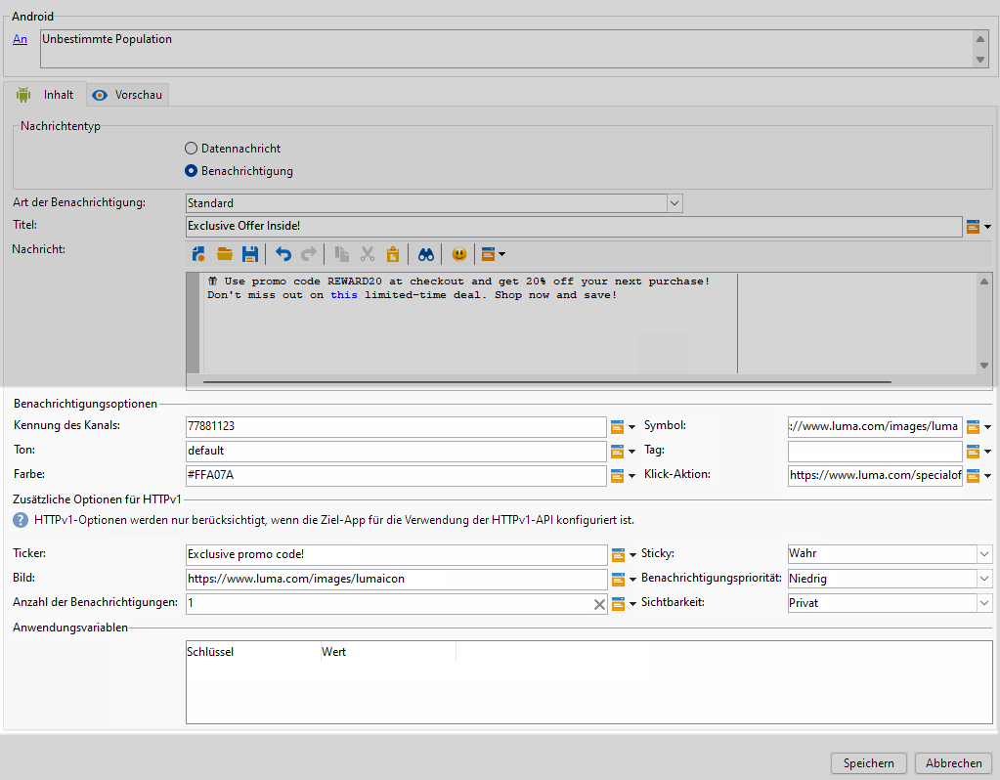
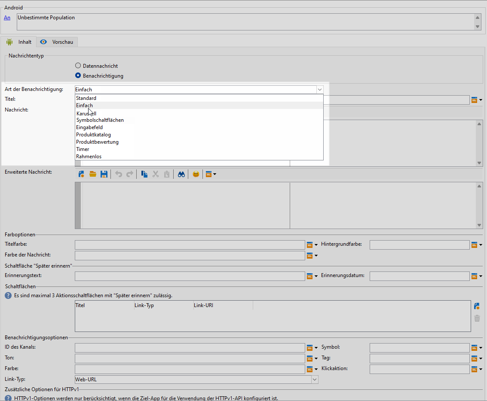
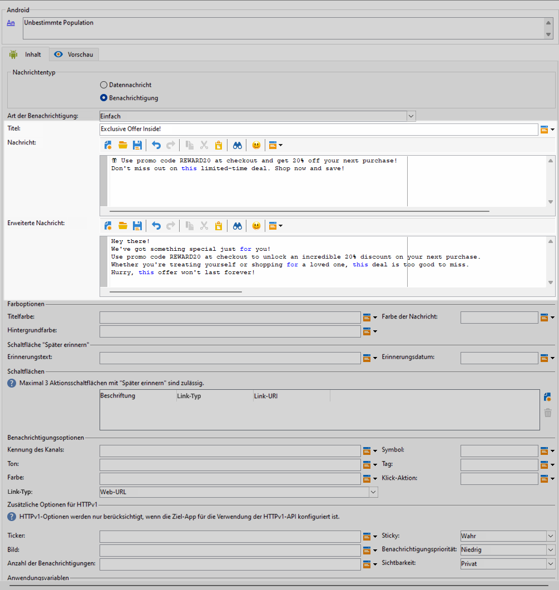
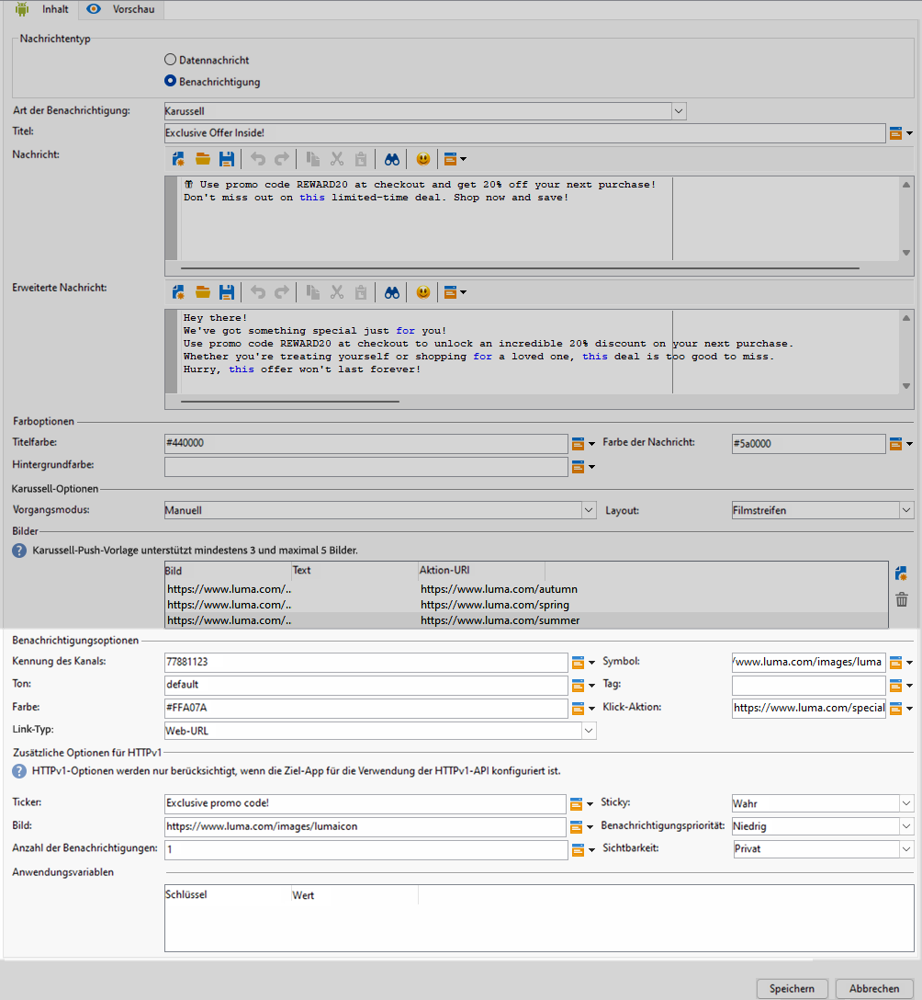

# Erstellen eines Rich-Push-Versands für Android {#rich-push}

Bei Firebase Cloud Messaging stehen Ihnen zwei Nachrichtentypen zur Auswahl:

* Die **[!UICONTROL Datenmeldung]** wird von der Client-App verarbeitet. Diese Meldungen werden direkt an die App gesendet, die auf dem Gerät eine Android-Benachrichtigung generiert und anzeigt. Datennachrichten enthalten nur die von Ihnen definierten Anwendungsvariablen.

* Die **[!UICONTROL Benachrichtigungsmeldung]** wird automatisch vom FCM SDK verarbeitet. FCM übernimmt für die Client-App automatisch das Anzeigen der Nachricht auf den Geräten Ihrer Benutzenden. Benachrichtigungsmeldungen enthalten einen vordefinierten Satz von Parametern und Optionen, können aber mit benutzerspezifischen Anwendungsvariablen weiter personalisiert werden.

## Festlegen des Inhalts der Benachrichtigung {#push-message}

Sobald Ihr Push-Versand erstellt ist, können Sie seinen Inhalt festlegen. Es sind drei Vorlagen verfügbar:

* Die **Standardvorlage** ermöglicht das Senden von Benachrichtigungen mit einem einfachen Symbol und einem zugehörigen Bild.

* Die **Einfache Vorlage** ermöglicht es Ihnen, Text, Bilder und Schaltflächen in Ihre Benachrichtigungen einfügen.

* Die **Karussell-Vorlage** ermöglicht es Ihnen, Benachrichtigungen mit Text und mehreren Bildern zu senden, zwischen denen die Benutzenden hin und her wischen können.

Auf den folgenden Registerkarten erfahren Sie, wie Sie eine Nachricht für jede Vorlage erstellen.

>[!BEGINTABS]

>[!TAB Standardvorlage]

1. Aus dem **[!UICONTROL Benachrichtigungstyp]** Dropdown, wählen Sie **[!UICONTROL Standard]**.

   

1. Um Ihre Nachricht zu erstellen, geben Sie Ihren Text in die Felder **[!UICONTROL Titel]** und **[!UICONTROL Nachricht]** ein.

   

1. Verwenden Sie dynamische Personalisierungsfelder, um Inhalte zu definieren, Daten zu personalisieren und dynamische Inhalte hinzuzufügen. [Weitere Informationen](../send/personalize.md)

1. Um Ihre Push-Benachrichtigung weiter zu personalisieren, konfigurieren Sie die **[!UICONTROL Benachrichtigungsoptionen]** und **[!UICONTROL Zusätzliche HTTPv1-Optionen]** Ihrer Push-Benachrichtigung. [Weitere Informationen](#push-advanced)

   

Nachdem Sie den Nachrichteninhalt definiert haben, können Sie Testabonnentinnen und -abonnenten einsetzen, um die Nachricht in einer Vorschau anzuzeigen und zu testen.

>[!TAB Einfache Vorlage]

1. Aus dem **[!UICONTROL Benachrichtigungstyp]** Dropdown, wählen Sie **[!UICONTROL Einfach]**.

   

1. Um Ihre Nachricht zu erstellen, geben Sie Ihren Text in die Felder **[!UICONTROL Titel]**, **[!UICONTROL Nachricht]** und **[!UICONTROL Erweiterte Nachricht]** ein.

   Der Text der **[!UICONTROL Nachricht]** wird in der ausgeblendeten Ansicht angezeigt, während die **[!UICONTROL Erweiterte Nachricht]** angezeigt wird, wenn die Benachrichtigung erweitert wird.

   

1. Verwenden Sie dynamische Personalisierungsfelder, um Inhalte zu definieren, Daten zu personalisieren und dynamische Inhalte hinzuzufügen. [Weitere Informationen](../send/personalize.md)

1. Unter dem **[!UICONTROL Farboptionen]** die hexadezimalen Farbcodes für Ihre **[!UICONTROL Anrede]**, **[!UICONTROL Nachricht]** und **[!UICONTROL Hintergrund]**.

1. Hinzufügen einer **[!UICONTROL Schaltfläche „Später erinnern“]** bei Bedarf. Geben Sie Ihr **[!UICONTROL Erinnerungstext]** und **Datum** in den entsprechenden Feldern.

   Die **[!UICONTROL Erinnerungsdatum]** Das Feld erwartet einen Wert, der eine Epoche in Sekunden darstellt.

1. Klicken Sie auf **[!UICONTROL Schaltfläche hinzufügen]** und füllen Sie folgende Felder aus:

   * **[!UICONTROL Titel]**: Text, der auf der Schaltfläche angezeigt wird.
   * **[!UICONTROL Link-URI]**: Geben Sie den URI an, der beim Klicken auf die Schaltfläche ausgeführt werden soll.

   Sie haben die Möglichkeit, bis zu drei Schaltflächen in Ihre Push-Benachrichtigung einzubauen. Wenn Sie sich für die **[!UICONTROL Schaltfläche „Später erinnern“]** entscheiden, können Sie maximal zwei Schaltflächen einfügen.

1. Wählen Sie die **[!UICONTROL Verknüpfungstyp]** der verknüpften URL Ihrer Schaltfläche:

   * **[!UICONTROL Web-URL]**: Web-URLs leiten Benutzende zu Online-Inhalten weiter. Beim Anklicken öffnen sie den Standard-Webbrowser des Geräts und navigieren zu der angegebenen URL.

   * **[!UICONTROL Deeplink]**: Deeplinks sind URLs, die Benutzende zu bestimmten Abschnitten in einer App führen, selbst wenn die App geschlossen ist. Beim Anklicken kann ein Dialogfeld angezeigt werden, in dem Benutzende aus verschiedenen Apps wählen können, die den Link verarbeiten können.

   * **[!UICONTROL Open App]**: Open App-URLs ermöglichen es Ihnen, sich direkt mit Inhalten innerhalb einer Anwendung zu verbinden. Diese Art von URL ermöglicht es Ihrer Anwendung, sich als Standard-Handler für einen bestimmten Link-Typ zu etablieren und so das Dialogfeld zur Disambiguierung zu umgehen.

   Weitere Informationen über die Handhabung von Android-App-Links finden Sie in der [Entwicklerdokumentation zu Android](https://developer.android.com/training/app-links).

   

1. Um Ihre Push-Benachrichtigung weiter zu personalisieren, konfigurieren Sie die **[!UICONTROL Benachrichtigungsoptionen]** und **[!UICONTROL Zusätzliche HTTPv1-Optionen]** Ihrer Push-Benachrichtigung. [Weitere Informationen](#push-advanced)

   

Nachdem Sie den Nachrichteninhalt definiert haben, können Sie Testabonnentinnen und -abonnenten einsetzen, um die Nachricht in einer Vorschau anzuzeigen und zu testen.

>[!TAB Karussell-Vorlage]

1. Aus dem **[!UICONTROL Benachrichtigungstyp]** Dropdown, wählen Sie **[!UICONTROL Karussell]**.

   

1. Um Ihre Nachricht zu erstellen, geben Sie Ihren Text in die Felder **[!UICONTROL Titel]**, **[!UICONTROL Nachricht]** und **[!UICONTROL Erweiterte Nachricht]** ein.

   Der Text der **[!UICONTROL Nachricht]** wird in der ausgeblendeten Ansicht angezeigt, während die **[!UICONTROL Erweiterte Nachricht]** angezeigt wird, wenn die Benachrichtigung erweitert wird.

   

1. Verwenden Sie den Ausdruckseditor, um Inhalte zu definieren, Daten zu personalisieren und dynamische Inhalte hinzuzufügen. [Weitere Informationen](../send/personalize.md)

1. Unter dem **[!UICONTROL Farboptionen]** die hexadezimalen Farbcodes für Ihre **[!UICONTROL Anrede]**, **[!UICONTROL Nachricht]** und **[!UICONTROL Hintergrund]**.

1. Auswählen, wie die **[!UICONTROL Karussell]** wird wie folgt betrieben:

   * **[!UICONTROL Automatisch]**: Die Bilder werden automatisch in vordefinierten Intervallen als Folien wiedergegeben.
   * **[!UICONTROL Manuell]**: Benutzende können manuell zwischen den Folien streichen, um durch die Bilder zu navigieren.

1. Aus dem **[!UICONTROL Layout]** Dropdown, wählen Sie **[!UICONTROL Filmstreifen]** Option, um neben der Hauptfolie eine Vorschau der vorherigen und nächsten Bilder anzuzeigen.

1. Klick **[!UICONTROL Bild hinzufügen]** und geben Sie Ihre Bild-URL, Text- und Aktions-URL ein.

   Stellen Sie sicher, dass Sie mindestens drei und maximal fünf Bilder einfügen.

   

1. Um Ihre Push-Benachrichtigung weiter zu personalisieren, konfigurieren Sie die **[!UICONTROL Benachrichtigungsoptionen]** und **[!UICONTROL Zusätzliche HTTPv1-Optionen]** Ihrer Push-Benachrichtigung. [Weitere Informationen](#push-advanced)

   

Nachdem Sie den Nachrichteninhalt definiert haben, können Sie Testabonnentinnen und -abonnenten einsetzen, um die Nachricht in einer Vorschau anzuzeigen und zu testen.

>[!ENDTABS]

## Erweiterte Einstellungen für Push-Benachrichtigungen {#push-advanced}

### Benachrichtigungsoptionen {#notification-options}

| Parameter | Beschreibung |
|---------|---------|
| **[!UICONTROL Kanal-ID]** | Legen Sie die Kanal-ID Ihrer Benachrichtigung fest. Die App muss einen Kanal mit dieser Kanal-ID erstellen, bevor eine Benachrichtigung mit dieser Kanal-ID empfangen werden kann. |
| **[!UICONTROL Symbol]** | Legen Sie das Benachrichtigungssymbol fest, das auf den Geräten Ihrer Profile angezeigt werden soll. |
| **[!UICONTROL Ton]** | Legt den Ton fest, der abgespielt werden soll, wenn das Gerät Ihre Benachrichtigung erhält. |
| **[!UICONTROL Tag]** | Legt eine Kennung fest, die zum Ersetzen bestehender Benachrichtigungen in der Benachrichtigungsablage verwendet wird. Dadurch wird verhindert, dass sich mehrere Benachrichtigungen ansammeln, und sichergestellt, dass nur die jeweils letzte relevante Benachrichtigung angezeigt wird. |
| **[!UICONTROL Farbe]** | Legen Sie die Symbolfarbe Ihrer Benachrichtigung mit dem hexadezimalen Farbcode fest. |
| **[!UICONTROL Klick-Aktion]** | Legen Sie die Aktion fest, die einem Benutzer zugeordnet ist, der auf Ihre Benachrichtigung klickt. |
| **[!UICONTROL Hintergrundfarbe der Benachrichtigungen]** | Legt die Farbe des Benachrichtigungshintergrunds mit den gewünschten Hexadezimal-Farb-Codes fest. |
| **[!UICONTROL Verknüpfungstyp]** | <ul><li>Web-URL: Web-URLs leiten Benutzer zu Online-Inhalten. Beim Anklicken öffnen sie den Standard-Webbrowser des Geräts und navigieren zu der angegebenen URL.</li><li>Deeplink: Deep-Links sind URLs, die Benutzer zu bestimmten Abschnitten innerhalb einer App führen, selbst wenn die App geschlossen ist. Beim Anklicken kann ein Dialogfeld angezeigt werden, in dem Benutzende aus verschiedenen Apps wählen können, die den Link verarbeiten können.</li><li> Mobile App öffnen : Mit Mobile-App-URLs können Sie eine direkte Verbindung zu Inhalten in einer Mobile App herstellen. Diese Art von URL ermöglicht es Ihrer Anwendung, sich als Standard-Handler für einen bestimmten Link-Typ zu etablieren und so das Dialogfeld zur Disambiguierung zu umgehen.</li></ul> |

### Zusätzliche Optionen für HTTPv1 {#additional-options}

| Parameter | Beschreibung |
|---------|---------|
| **[!UICONTROL Ticker]** | Legen Sie den Tickertext Ihrer Benachrichtigung fest. Nur verfügbar bei Geräten mit Android 5.0 Lollipop. |
| **[!UICONTROL Sticky]** | Wenn diese Option aktiviert ist, bleibt die Benachrichtigung auch dann sichtbar, wenn darauf geklickt wird.  Wenn sie deaktiviert ist, wird die Benachrichtigung automatisch verworfen, sobald damit interagiert wird. Durch das Sticky-Verhalten können wichtige Benachrichtigungen über längere Zeiträume auf dem Bildschirm beibehalten werden. |
| **[!UICONTROL Bild]** | Legen Sie die URL des Bildes fest, die in Ihrer Benachrichtigung angezeigt werden soll. |
| **[!UICONTROL Benachrichtigungspriorität]** | Legen Sie die Prioritätsstufe Ihrer Benachrichtigung fest. Dies kann „Standard“, „Minimum“, „Niedrig“ oder „Hoch“ sein. Die Prioritätsstufe bestimmt die Wichtigkeit und Dringlichkeit der Benachrichtigung und beeinflusst deren Anzeige sowie die Frage, ob sie bestimmte Systemeinstellungen umgehen kann. Weitere Informationen hierzu finden Sie in der [FCM-Dokumentation](https://firebase.google.com/docs/reference/fcm/rest/v1/projects.messages#notificationpriority). |
| **[!UICONTROL Anzahl der Benachrichtigungen]** | Legt die Zahl der neuen ungelesenen Informationen fest, die direkt auf dem Symbol der App angezeigt werden. Dadurch können die Benutzenden schnell die Anzahl der ausstehenden Benachrichtigungen sehen. |
| **[!UICONTROL Sichtbarkeit]** | Legen Sie die Sichtbarkeitsstufe Ihrer Benachrichtigung fest. Dies kann öffentlich, privat oder geheim sein. Die Sichtbarkeitsstufe bestimmt, wie viel des Benachrichtigungsinhalts auf dem Sperrbildschirm und anderen sensiblen Bereichen angezeigt wird. Weitere Informationen finden Sie in der [FCM-Dokumentation](https://firebase.google.com/docs/reference/fcm/rest/v1/projects.messages#visibility). |
| **[!UICONTROL Anwendungsvariablen]** | Damit können Sie das Verhalten von Benachrichtigungen definieren. Diese Variablen sind vollständig anpassbar und Teil der an das Mobilgerät gesendeten Nachrichten-Payload. |
