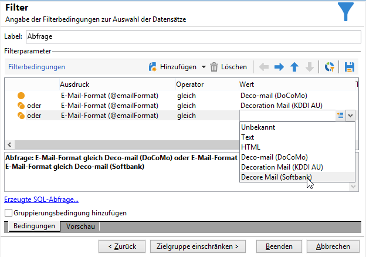

# Senden von E-Mails auf japanischen Mobiltelefonen {#sending-emails-on-japanese-mobiles}

## E-Mail-Formate für japanische Mobiltelefone {#email-formats-for-japanese-mobiles}

Adobe Campaign unterstützt drei spezifische Formate für E-Mails auf japanischen Mobiltelefonen für den japanischen Markt: **Deco-mail** (DoCoMo Mobiltelefone), **Decore Mail** (Softbank Mobiltelefone) und **Decoration Mail** (KDDI AU Mobiltelefone). Diese Formate unterliegen verschiedenen Einschränkungen hinsichtlich Kodierung, Struktur und Größe. Weiterführende Informationen zu Einschränkungen und Empfehlungen finden Sie in [diesem Abschnitt](#limitations-and-recommendations).

Damit ein Empfänger, der eines dieser Formate verwendet, Nachrichten korrekt angezeigt bekommt, wird empfohlen, das entsprechende Format **[!UICONTROL Deco-mail (DoCoMo)]**, **[!UICONTROL Decore Mail (Softbank)]** oder **[!UICONTROL Decoration Mail (KDDI AU)]** im Empfängerprofil auszuwählen:

Wenn Sie hingegen im Feld **[!UICONTROL E-Mail-Format]** eine der Optionen **[!UICONTROL Unbekannt]**, **[!UICONTROL HTML]** oder **[!UICONTROL Text]** auswählen, erkennt Adobe Campaign bei Versand der E-Mail das japanische Format, das zu verwenden ist, um eine korrekte Anzeige zu gewährleisten.

Dieses automatische Erkennungssystem beruht auf der in den E-Mail-Regeln **[!UICONTROL E-Mail-Formatverwaltung]** gespeicherten Domainliste. Weiterführende Informationen zur Verwaltung von E-Mail-Formaten finden Sie in der [Dokumentation zu Campaign Classic](https://experienceleague.adobe.com/docs/campaign-classic/using/installing-campaign-classic/additional-configurations/email-deliverability.html#managing-email-formats).

## Einschränkungen und Empfehlungen {#limitations-and-recommendations}

Der E-Mail-Versand an Mobiltelefone unter Vertrag mit japanischen Anbietern (Softbank, DoCoMo, KDDI AU) unterliegt gewissen Einschränkungen.

Aus diesem Grund müssen Sie:

* ausschließlich Bilder im JPEG- oder GIF-Format verwenden;
* einen Versand erstellen, bei dem die Summe aus Text und HTML in keinem Fall 10.000 Bytes übersteigt (für KDDI AU und DoCoMo);
* Bilder verwenden, deren Gesamtgröße vor der Kodierung weniger als 100 KB beträgt;
* in einer Nachricht nicht mehr als 20 Bilder verwenden;
* ein reduziertes HTML-Format verwenden (für jeden Anbieter steht eine begrenzte Anzahl an Tags zur Verfügung).

>[!NOTE]
>
>Die für jeden Anbieter spezifischen Einschränkungen müssen bei der Erstellung der Nachricht berücksichtigt werden. Informationen dazu finden sich in der jeweiligen Produktdokumentation.

## Testen des E-Mail-Inhalts {#testing-the-email-content}

### Vorschau der Nachricht {#previewing-the-message}

In Adobe Campaign haben Sie die Möglichkeit zu prüfen, ob das Format Ihrer Nachricht dem Versand an japanische Mobiltelefone angepasst ist.

Sobald Sie Ihren Inhalt erstellt und den Betreff der E-Mail angegeben haben, können Sie Anzeige und Formatierung der Nachricht kontrollieren.

Verwenden Sie hierzu im **[!UICONTROL Vorschau]**-Tab des Fensters zur Inhaltsbearbeitung den Link **[!UICONTROL Details...> Deco-Mail-Prüfung]**. Hier können Sie:

* prüfen, ob die Tags des HTML-Inhalts den mit dem japanischen Format einhergehenden Einschränkungen entsprechen;
* prüfen, ob die Anzahl an Bildern in der Nachricht nicht die durch das Format vorgegebene Höchstgrenze von maximal 20 Bildern überschreitet;
* prüfen, ob die Gesamtgröße nicht den Grenzwert von 100 KB übersteigt.

  

### Ausführen der Typologieregel {#running-typology-rule}

Zusätzlich zur Vorschauprüfung wird eine zweite Prüfung durchgeführt, die an einen Testversand oder einen normalen Versand gekoppelt ist: Eine spezifische Typologieregel, die **[!UICONTROL Deco-mail-Analyse]**, kommt im Zuge der Analyse zur Anwendung.

>[!IMPORTANT]
>
>Diese Typologieregel wird nur dann ausgeführt, wenn mindestens ein Empfängerprofil für den Empfang von E-Mails im Format **[!UICONTROL Deco-mail (DoCoMo)]**, **[!UICONTROL Decore Mail (Softbank)]** oder **[!UICONTROL Decoration Mail (KDDI AU)]** konfiguriert wurde.

Mithilfe dieser Regel können Sie sich vergewissern, ob bei der Sendung die von den japanischen Anbietern vorgegebenen [Formateinschränkungen](#limitations-and-recommendations) respektiert werden, insbesondere im Hinblick auf die Gesamtgröße der E-Mail, die jeweilige Größe ihrer HTML- und Textanteile, die Anzahl an Bildern in der Nachricht sowie die Tags des HTML-Inhalts.

### Durchführen eines Testversands {#sending-proofs}

Sie können Testsendungen durchführen, um Ihren Versand zu testen. Wenn Sie dabei Ersatzadressen verwenden, geben Sie bitte die Adressen ein, die dem E-Mail-Format des verwendeten Profils entsprechen.

Beispielsweise können Sie die Adresse eines Profils durch test@softbank.ne.jp ersetzen, wenn das E-Mail-Format für dieses Profil zuvor in **[!UICONTROL Decore Mail (Softbank)]** definiert wurde.

## Senden von Nachrichten {#sending-messages}

Für den Versand einer E-Mail an Empfänger mit japanischen E-Mail-Formaten mit Campaign haben Sie zwei Möglichkeiten:

* Erstellen Sie zwei Sendungen, eine nur für japanische Empfänger und die andere für alle anderen Empfänger. Weitere Informationen dazu finden Sie in [diesem Abschnitt](#designing-a-specific-delivery-for-japanese-formats).
* Erstellen Sie einen einzigen Versand und Adobe Campaign erkennt das Format automatisch. Weitere Informationen dazu finden Sie in [diesem Abschnitt](#designing-a-delivery-for-all-formats).

### Entwerfen eines spezifischen Versands für japanische Formate {#designing-a-specific-delivery-for-japanese-formats}

Erstellen Sie einen Workflow mit zwei Sendungen: einen Versand, der für japanische Mobiltelefone bestimmt ist, und einen zweiten für Empfänger mit einem Standard-E-Mail-Format.

Verwenden Sie hierfür eine **[!UICONTROL Aufspaltung]**-Aktivität in Ihrem Workflow und definieren Sie die japanischen E-Mail-Formate (Deco-mail, Decoration Mail und Decore Mail) als Filterbedingungen.

### Entwerfen eines Versands für alle Formate {#designing-a-delivery-for-all-formats}

Wenn Adobe Campaign die Formate dynamisch in Abhängigkeit von der Domain verwaltet (Profile mit E-Mail-Format **[!UICONTROL Unbekannt]**, **[!UICONTROL HTML]** oder **[!UICONTROL Text]**), können Sie für alle Empfänger denselben Versand verwenden.

Der Nachrichteninhalt wird sowohl für Empfänger mit japanischen Mobiltelefonen als auch für Standardempfänger korrekt angezeigt.

>[!IMPORTANT]
>
>Beachten Sie die Einschränkungen, denen die verschiedenen japanischen Formate (Deco-mail, Decoration Mail und Decore Mail) unterliegen. Weiterführende Informationen zu Einschränkungen finden Sie in [diesem Abschnitt](#limitations-and-recommendations).
