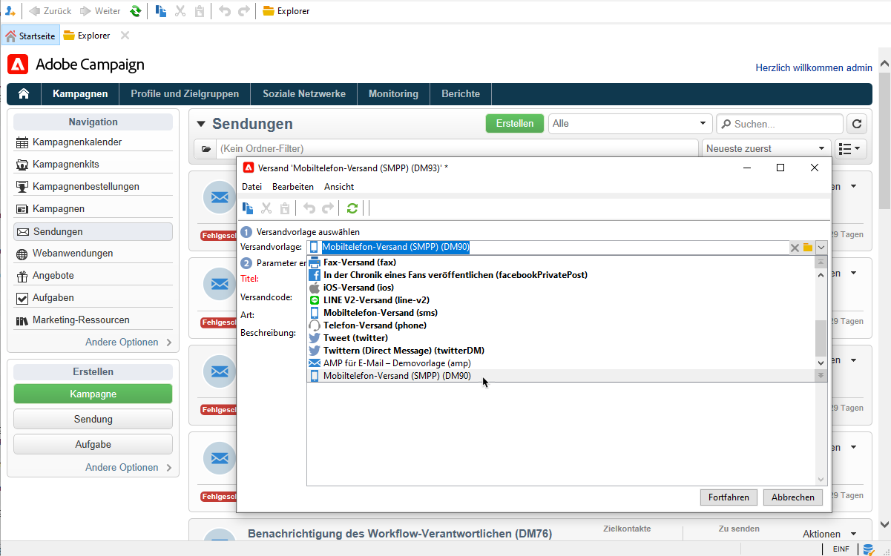
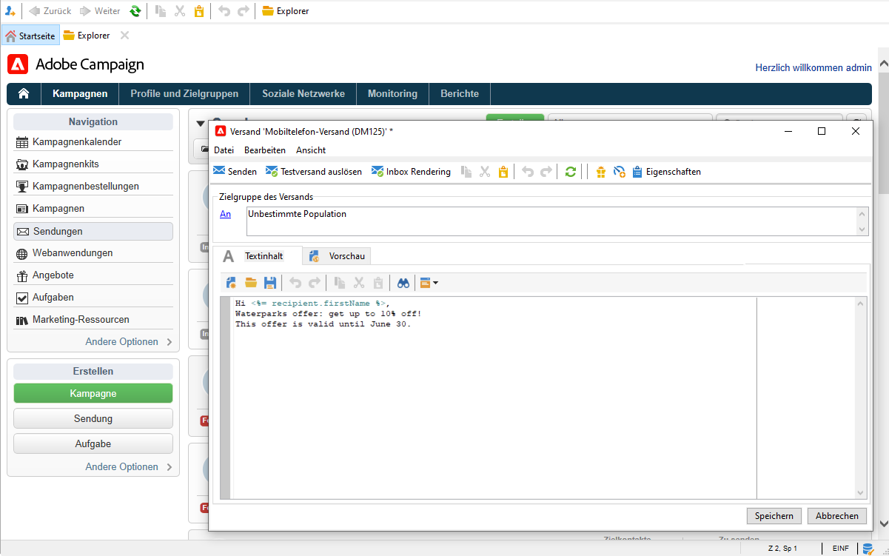
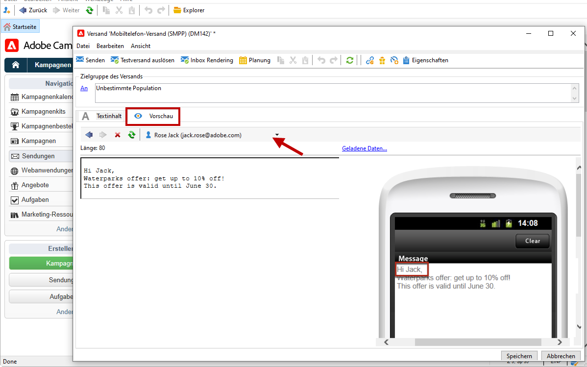

# SMS erstellen und versenden

Verwenden Sie Adobe Campaign, um personalisierte SMS-Nachrichten zu senden.

↗️ Informationen zu den ersten Schritten mit dem SMS-Kanal finden Sie in der [Dokumentation zu Campaign Classic v7](https://experienceleague.adobe.com/docs/campaign-classic/using/sending-messages/sending-messages-on-mobiles/sms-channel.html?lang=de#sending-messages){target=&quot;_blank&quot;}.

>[!NOTE]
>
>Die Option **Mobile App Channel (NMAC)** ermöglicht darüber hinaus den Versand von Push-Benachrichtigungen auf Mobilgeräte. Weiterführende Informationen finden Sie in [diesem Abschnitt](push.md).

## SMS-Kanal konfigurieren

Folgende Voraussetzungen müssen gegeben sein, um Sendungen an Mobiltelefone richten zu können:

* ein externes Konto mit Angabe des Connectors und des Nachrichtentyps;

* Eine Versandvorlage, die auf das externe Konto Bezug nimmt.

↗️ Wie Sie einen SMS-Kanal konfigurieren, erfahren Sie in der [Dokumentation zu Campaign Classic v7](https://experienceleague.adobe.com/docs/campaign-classic/using/sending-messages/sending-messages-on-mobiles/sms-set-up.html?lang=de#sending-messages){target=&quot;_blank&quot;}.

Achten Sie vor dem Versand von SMS-Nachrichten auf Folgendes:

* Stellen Sie sicher, dass die Empfängerprofile mindestens ein Mobiltelefon enthalten.
* Gehen Sie die [Best Practices zum Versand](https://experienceleague.adobe.com/docs/campaign-classic/using/sending-messages/key-steps-when-creating-a-delivery/delivery-bestpractices/delivery-best-practices.html?lang=de#sending-messages){target=&quot;_blank&quot;} in Adobe Campaign Classic durch. Diese gelten auch für Campaign v8.

Außerdem sollten Sie mit dem Protokoll und den Einstellungen für SMS vertraut sein. Lesen Sie über die Einrichtung einer Verbindung zwischen Adobe Campaign und einem SMPP-Provider in [diesem Dokument](https://experienceleague.adobe.com/docs/campaign-classic/using/sending-messages/sending-messages-on-mobiles/sms-protocol.html?lang=de#sending-messages){target=&quot;_blank&quot;}.

## Den ersten SMS-Versand erstellen

1. Um einen neuen Versand zu erstellen, gehen Sie zur Registerkarte **[!UICONTROL Kampagnen]**, klicken Sie auf **[!UICONTROL Sendungen]** und anschließend auf die Schaltfläche **[!UICONTROL Erstellen]** oberhalb der Liste der vorhandenen Sendungen.

   

   ↗️ Allgemeine Informationen zum Erstellen eines Versands finden Sie in der [Dokumentation zu Campaign Classic v7](https://experienceleague.adobe.com/docs/campaign-classic/using/sending-messages/key-steps-when-creating-a-delivery/steps-about-delivery-creation-steps.html?lang=de#sending-messages){target=&quot;_blank&quot;}.

1. Wählen Sie eine Versandvorlage aus, die auf das entsprechende externe Konto verweist, um SMS-Sendungen durchzuführen.

   

   ↗️ Wie Sie ein externes SMPP-Konto erstellen, erfahren Sie in der [Dokumentation zu Campaign Classic v7](https://experienceleague.adobe.com/docs/campaign-classic/using/sending-messages/sending-messages-on-mobiles/sms-set-up.html?lang=de#creating-an-smpp-external-account){target=&quot;_blank&quot;}.

   ↗️ Wie Sie eine Versandvorlage erstellen, die an Mobilgeräte gesendet wird, erfahren Sie in der [Dokumentation zu Campaign Classic v7](https://experienceleague.adobe.com/docs/campaign-classic/using/sending-messages/sending-messages-on-mobiles/sms-set-up.html?lang=de#changing-the-delivery-template){target=&quot;_blank&quot;}.

1. Geben Sie für Ihren Versand einen Titel, einen Code und eine Beschreibung ein.

1. Klicken Sie auf **[!UICONTROL Fortfahren]**, um die Eingaben zu bestätigen und in das Fenster der Nachrichtenkonfiguration zu gelangen.

1. Geben Sie den Inhalt der Nachricht im Abschnitt **[!UICONTROL Textinhalt]** des Assistenten ein, einschließlich der ggf. benötigten Personalisierungsfelder.

   

1. Zielpopulation bestimmen.

Die wichtigsten Schritte zum Erstellen und Entwerfen einer SMS werden in der Dokumentation zu Campaign Classic v7 beschrieben:

* SMS erstellen

   ↗️ [Erfahren Sie, wie Sie einen SMS-Versand erstellen](https://experienceleague.adobe.com/docs/campaign-classic/using/sending-messages/sending-messages-on-mobiles/sms-create.html?lang=de#sending-messages){target=&quot;_blank&quot;}.

* SMS-Inhalt entwerfen

   ↗️ [Erfahren Sie, wie Sie den SMS-Inhalt definieren](https://experienceleague.adobe.com/docs/campaign-classic/using/sending-messages/sending-messages-on-mobiles/sms-create.html?lang=de#defining-the-sms-content){target=&quot;_blank&quot;}.

* Auswählen der Audience für Ihre E-Mail

   ↗️ [Weitere Informationen zur Definition der Zielpopulation](https://experienceleague.adobe.com/docs/campaign-classic/using/sending-messages/key-steps-when-creating-a-delivery/steps-defining-the-target-population.html?lang=de){target=&quot;_blank&quot;}.

?? Die Schritte zum Definieren einer Audience finden Sie auf [dieser Seite](../start/audiences.md).

## Testen Ihrer SMS

Um das Rendering der Nachricht mit der Personalisierung anzuzeigen, klicken Sie auf **[!UICONTROL Vorschau]** und wählen Sie einen Empfänger aus.

Informationen zum Erzeugen eines Testversands finden Sie in den folgenden Abschnitten der Dokumentation zu Campaign Classic v7:

* Validieren eines Versands und Durchführen von Testsendungen
↗️ [Lernen Sie die wichtigsten Schritte zur Validierung eines Versands kennen](https://experienceleague.adobe.com/docs/campaign-classic/using/sending-messages/key-steps-when-creating-a-delivery/steps-validating-the-delivery.html?lang=de){target=&quot;_blank&quot;}.
* Testadressen hinzufügen
↗️ [Erfahren Sie mehr über Testadressen](https://experienceleague.adobe.com/docs/campaign-classic/using/sending-messages/using-seed-addresses/about-seed-addresses.html?lang=de){target=&quot;_blank&quot;}.

## SMS-Sendungen durchführen und überwachen

Die wichtigsten Schritte zum Senden und Überwachen einer SMS werden in der Dokumentation zu Campaign Classic v7 beschrieben:

* SMS-Sendungen ausführen, überwachen und verfolgen

   ↗️ [Erfahren Sie mehr über die Tools zum Senden, Überwachen und Verfolgen von SMS](https://experienceleague.adobe.com/docs/campaign-classic/using/sending-messages/sending-messages-on-mobiles/sms-send.html?lang=de#sending-messages){target=&quot;_blank&quot;}.

* Fehler beheben bei SMS-Sendungen

   ↗️ [Informationen zur Fehlerbehebung bei SMS](https://experienceleague.adobe.com/docs/campaign-classic/using/sending-messages/sending-messages-on-mobiles/troubleshooting-sms.html?lang=de#sending-messages){target=&quot;_blank&quot;}
