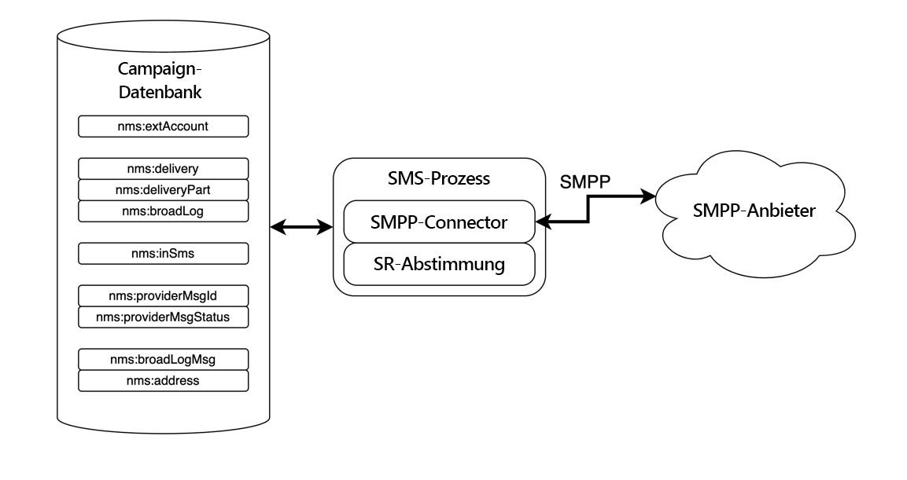
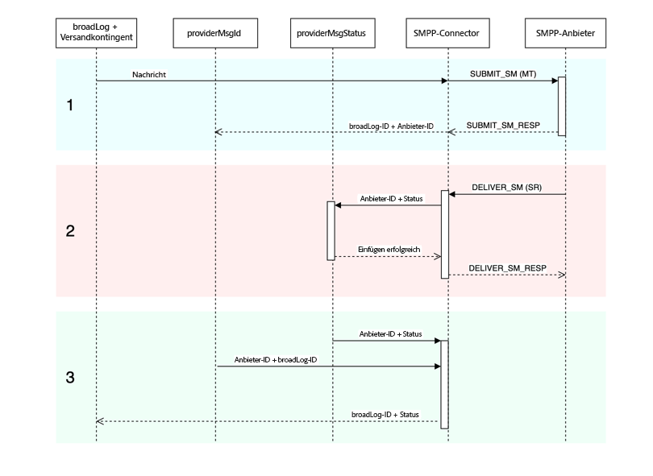

# Beschreibung des SMPP-Connectors {#smpp-connector-desc}

>[!IMPORTANT]
>
>Dies gilt für Adobe Campaign v8.7.2 und höher.
>
>Ältere Versionen finden Sie in der [Dokumentation zu Campaign Classic v7](https://experienceleague.adobe.com/de/docs/campaign-classic/using/sending-messages/sending-messages-on-mobiles/sms-set-up/sms-set-up){target="_blank"}.

## Datenfluss des SMS-Connectors {#sms-data-flow}

In diesem Abschnitt wird beschrieben, wie der SMS-Prozess Daten handhabt.

Im Folgenden finden Sie ein allgemeines Blockdiagramm, in dem zusammengefasst wird, wie der SMS-Prozess mit seiner Umgebung interagiert.

{zoomable="yes"}

Der SMS-Prozess umfasst zwei wichtige Komponenten: den SMPP-Connector selbst, der die Kommunikation mit dem SMPP-Provider verarbeitet, und eine Hintergrundaufgabe für die SR-Abstimmung.

### Datenfluss für SMPP-Konten {#sms-data-flow-smpp-accounts}

Der SMS-Prozess fragt nms:extAccount ab und erzeugt neue Verbindungen in seinem SMPP-Connector, wobei die Einstellungen jedes Kontos weitergegeben werden. Die Abrufhäufigkeit kann in serverConf in der Einstellung *configRefreshMillis* angepasst werden.

Der SMPP-Connector versucht für jedes aktive SMPP-Konto, Verbindungen immer aktiv zu halten. Wenn die Verbindung verloren geht, stellt er die Verbindung wieder her.

### Datenfluss beim Senden der Nachrichten {#sms-data-flow-sending-msg}

* Der SMS-Prozess wählt aktive Sendungen durch Scannen von nms:delivery aus. Ein Versand ist in folgenden Fällen aktiv:
   * Sein Status besagt, dass Nachrichten gesendet werden können.
   * Der Gültigkeitszeitraum ist nicht abgelaufen.
   * Es handelt sich um einen tatsächlichen Versand (es handelt sich beispielsweise nicht um eine Vorlage, er wurde nicht gelöscht)
   * Der SMPP-Connector konnte mindestens eine Verbindung für das externe Konto öffnen, das mit dem Versand verknüpft ist.
* Der SMS-Prozess lädt für jeden Versand Versandteile. Wenn der Versandteil teilweise gesendet wurde, prüft der SMS-Prozess, welche Nachrichten bereits gesendet wurden, indem er das Broadlog überprüft.
* Der SMS-Prozess erweitert die Vorlage mit Personalisierungsdaten aus dem Versandteil.
* Der SMPP-Connector generiert ein MT (SUBMIT_SM-PDU), der dem Inhalt und anderen Einstellungen entspricht.
* Der SMPP-Connector sendet den MT über eine Transmitter- (oder Transceiver-)Verbindung.
* Der Provider gibt eine ID für diesen MT zurück. Sie wird in nms:providerMsgId eingefügt.
* Der SMS-Prozess aktualisiert das Broadlog auf den Versandstatus.
* Im Fall eines endgültigen Fehlers aktualisiert der SMS-Prozess das Broadlog entsprechend und kann eine neue Fehlerart in nms:broadLogMsg erstellen.

### Datenfluss beim Empfangen von SR {#sms-data-flow-sr}

* Der SMPP-Connector empfängt und decodiert den SR (DELIVER_SM-PDU). Er verwendet im externen Konto definierte Regexes, um die Nachrichten-ID und den Status zu erhalten.
* Nachrichten-ID und Status werden in nms:providerMsgStatus eingefügt
* Nach dem Einfügen antwortet der SMPP-Connector mit einer DELIVER_SM_RESP-PDU.
* Wenn während des Prozesses etwas schiefgelaufen ist, sendet der SMPP-Connector eine negative DELIVER_SM_RESP-PDU und protokolliert eine Nachricht.

### Datenfluss beim Empfangen eines MO {#sms-data-flow-mo}

* Der SMPP-Connector empfängt und decodiert den MO (DELIVER_SM-PDU).
* Das Schlüsselwort wird aus der Nachricht extrahiert. Wenn es mit einem deklarierten Schlüsselwort übereinstimmt, werden die entsprechenden Aktionen ausgeführt. Es kann in nms:address geschrieben werden, um die Quarantäne zu aktualisieren.
* Wenn benutzerdefinierte TLV deklariert werden, werden sie entsprechend ihren jeweiligen Einstellungen decodiert.
* Der vollständig decodierte und verarbeitete MO wird in die Tabelle nms:inSms eingefügt.
* Der SMPP-Connector antwortet mit einer DELIVER_SM_RESP-PDU. Wenn ein Fehler erkannt wurde, wird ein Fehler-Code an den Provider zurückgegeben.

### Datenfluss beim Abstimmen von MT und SR {#sms-reconciling-mt-sr}

* Die SR-Abstimmungskomponente liest regelmäßig nms:providerMsgId und nms:providerMsgStatus. Daten aus beiden Tabellen werden zusammengeführt.
* Für alle Nachrichten, die in beiden Tabellen einen Eintrag enthalten, wird der entsprechende nms:broadLog-Eintrag aktualisiert.
* Die Tabelle nms:broadLogMsg kann während des Prozesses aktualisiert werden, wenn eine neue Fehlerart erkannt wird, oder um Zähler für Fehler zu aktualisieren, die nicht manuell qualifiziert wurden.

## Abgleichen von MT-, SR- und Broadlog-Einträgen {#sms-matching-entries}

Im Folgenden finden Sie ein Diagramm, das den gesamten Prozess beschreibt:

{zoomable="yes"}

**Phase 1**

* Die Nachricht wird gescannt, formatiert und dann an den SMPP-Connector übertragen.
* Der SMPP-Connector formatiert sie als SUBMIT_SM MT PDU.
* Der MT wird an den SMPP-Provider gesendet.
* Der Provider antwortet mit SUBMIT_SM_RESP. SUBMIT_SM und SUBMIT_SM_RESP werden durch ihre sequence_number abgeglichen.
* SUBMIT_SM_RESP stellt eine ID bereit, die vom Provider stammt. Diese ID wird zusammen mit der Broadlog-ID in die Tabelle nms:providerMsgId eingefügt.

**Phase 2**

* Der Provider sendet eine DELIVER_SM SR PDU.
* Der SR wird analysiert, um Provider-ID, Status und Fehler-Code zu extrahieren. In diesem Schritt werden Extraktions-Regexes verwendet.
* Die Provider-ID und der entsprechende Status werden in nms:providerMsgStatus eingefügt.
* Wenn alle Daten sicher in die Datenbank eingefügt werden, antwortet der SMPP-Connector mit DELIVER_SM_RESP. DELIVER_SM und DELIVER_SM_RESP werden durch ihre sequence_number abgeglichen.

**Phase 3**

* Die SR-Abstimmungskomponente des SMS-Prozesses scannt die Tabellen nms:providerMsgId und nms:providerMsgStatus regelmäßig.
* Wenn eine Zeile in beiden Tabellen übereinstimmende Anbieter-IDs enthält, werden die beiden Einträge zusammengeführt. Dadurch kann die Broadlog-ID (gespeichert in providerMsgId) mit dem Status (gespeichert in providerMsgStatus) abgeglichen werden.
* Das Broadlog wird mit dem entsprechenden Status aktualisiert.

## Affinitäten und der dedizierte Prozess-Connector {#sms-affinities}

Affinitäten werden vom dedizierten Prozess-Connector ignoriert. Er wird nur innerhalb des SMS-Prozesses ausgeführt.

## serverConf-Optionen {#sms-serverconf-options}

Einige Einstellungen können in serverConf.xml angepasst werden. Wie alle anderen Einstellungen in dieser Datei sollte dies in der Datei config-instance.xml angegeben werden. Alle Einstellungen befinden sich im Element &lt; mta2 > .

Diese Tabelle fasst alle Einstellungen zusammen. Werte, die Min/Max beinhalten, geben eine grobe Vorstellung von dem Bereich, den Sie in den meisten Fällen berücksichtigen sollten. Der Debugging-Wert ist der Wert, den Sie bei der Suche nach Problemen wählen müssen, die nicht mit der Leistung in Zusammenhang stehen.

| Einstellung | Beschreibung | Standard | Sinnvoller Mindestwert | Sinnvoller Höchstwert | Debugging-Wert |
|:-:|:-:|:-:|:-:|:-:|:-:|
| batchUpdateSize | Größe der aktualisierten Mikro-Batches | 5000 | 100: Sehr niedrige Latenz | maxWaitingMessages/updateThreads: Das Überschreiten dieses Werts ist unnötig, da maxWaitingMessages die Pufferung ohnehin beschränkt. | 1: Deaktivieren der Mikro-Batching-Funktion, einzelnes Aktualisieren der Nachrichten. |
| configRefreshMillis | Zeitraum für das Neuladen der Konfiguration in Millisekunden | 10000 | pollPeriodMillis: Geringe Latenz | 600000: Nicht zu schnell neu laden, um Ressourcen zu sparen | 500: Geringe Latenz ermöglicht schnelleres Ausprobieren neuer Einstellungen |
| deliveryPartRetryCount | Maximale Anzahl von Wiederholungsversuchen oder Verschiebungen eines Versandkontingents. Achtung: Das erneute Starten des Sendevorgangs zählt als Wiederholungsversuch. Abstürze können ebenfalls als Wiederholungsversuch zählen. | 20 | 1: Weitere Zustellversuche deaktivieren | 50: Nachrichten persistenter machen, um instabile Provider zu umgehen | 1: Deaktivieren weiterer Zustellversuche. 1000: Vermeiden des Sendens von fehlgeschlagenen Nachrichten. |
| deliveryPartRetryDelaySeconds | Mindestverzögerung, bevor ein Versandkontingent erneut versucht wird. Dies ist Prozess- und Container-übergreifend. Die Verzögerung wird in Sekunden angegeben. | 60 | 0: Sofortige weitere Zustellversuche | 3600: Sehr langsame weitere Zustellversuche (1 Stunde zwischen jedem weiteren Zustellversuch) | 1: Erleichtert das Nachverfolgen von Wiederholungsversuchen in sehr dichten Protokollen. |
| logOutput | Sendet Monitoring- und Profilierungsdaten in der Hauptausgabe der Protokolle. | true | false: Kann den Durchsatz etwas erhöhen. Von dieser Einstellung wird abgeraten. | true: Aktivieren der Protokollierung. | true |
| maxWaitingMessages | Maximale Anzahl an zu jedem Zeitpunkt verarbeiteten Nachrichten | 50000 | 256: Ausreichend für einen einzigen Versandteil | 200000: Begrenzt durch SQL-Abfragelänge (64k) | 1: Nachrichten einzeln verarbeiten |
| pollPeriodMillis | Abrufhäufigkeit der Datenbank (in Millisekunden) für die Überprüfung auf neue Nachrichten | 2000 | 500: Sehr geringe Latenz | 10000: Größere Batches | 500: Geringe Latenz erleichtert das Debugging. |
| prepareThreads | Anzahl der Threads für die Nachrichtenvorbereitung | 3 | 1: Single-Threaded | Anzahl der CPUs. Seien Sie achtsam bei der RAM-Nutzung. Wird der Wert auf über 6 erhöht, ist möglicherweise eine Erhöhung von maxSMSMemoryMb, maxProcessMemoryAlertMb und maxProcessMemoryWarningMb erforderlich. | 1: Single-Threaded generiert sauberere Protokolle. |
| profDeliveryStat | Protokollieren verschiedener aggregierter Statistiken über Interna von SMS-Prozessen | true | false: Kann den Durchsatz etwas erhöhen. Von dieser Einstellung wird abgeraten. | true: Protokoll mit geringer Ausführlichkeit | true |
| profLogPerMessage | Protokollieren jedes Verarbeitungsschritts für jede Nachricht | false | false: Reduzierte Ausführlichkeit der Protokolle. | true: Protokoll mit sehr hoher Ausführlichkeit. **Nur verwenden, wenn unbedingt erforderlich**. Große Leistungseinbußen. **Deaktivieren Sie diese Einstellung, sobald genügend Daten gesammelt wurden**. | true |
| providerIdScanPeriod | Zeitspanne in Sekunden zwischen den Suchvorgängen nach neuen Provider-IDs zum Abgleich. | 10 | 1: Geringe Latenz | 60: Größere Batches für mehr Durchsatz | 1: Geringe Latenz hilft beim Debugging der Nachrichtenverarbeitung. |
| providerIdThreads | Anzahl der Threads für den Abgleich der Anbieter-ID. 1 Thread pro Instanz ist ausreichend. Auf 0 festlegen, um ihn in diesem Container zu deaktivieren. | 1 | 0: In diesem Container deaktivieren | 1 | 1 |
| sendingThreads | Anzahl der Versand-Threads | 1 | 1: Single-Threaded | Anzahl der CPUs. Zu viele Threads beeinträchtigen normalerweise die Leistung. | 1: Single-Threaded generiert sauberere Protokolle. |
| updateThreads | Anzahl der Threads für die Aktualisierung der Datenbank. | 1 | 1: Single-Threaded | Anzahl der CPUs. Jeder Thread erstellt eine eigene DB-Verbindung. | 1: Single-Threaded generiert sauberere Protokolle. |
| verifyMode | Simuliert das Senden von Nachrichten. Es werden nicht wirklich Nachrichten gesendet. Nützlich für das Debugging | false | false | true | false: Das System wird normal ausgeführt. true: Es wird nur DB-Zugriff und Nachrichtenvorbereitung getestet. |
