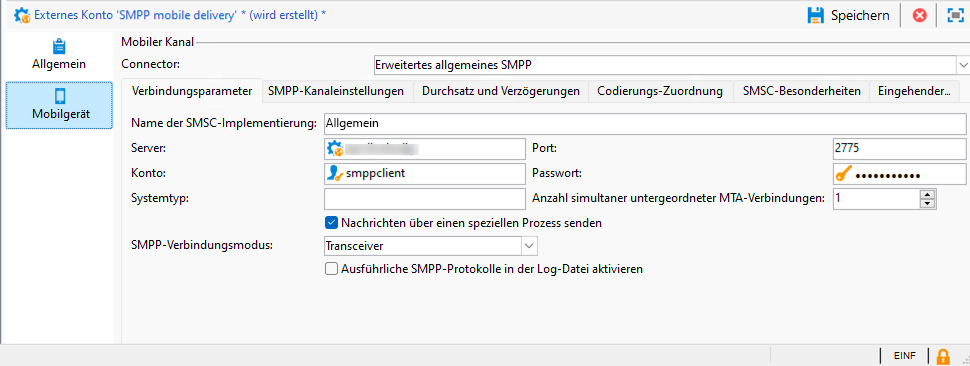
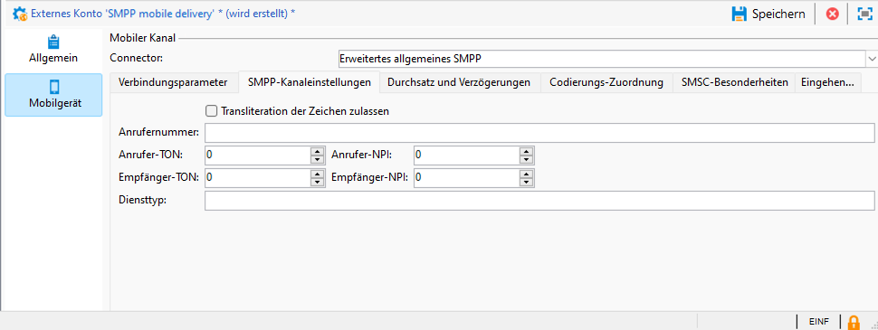
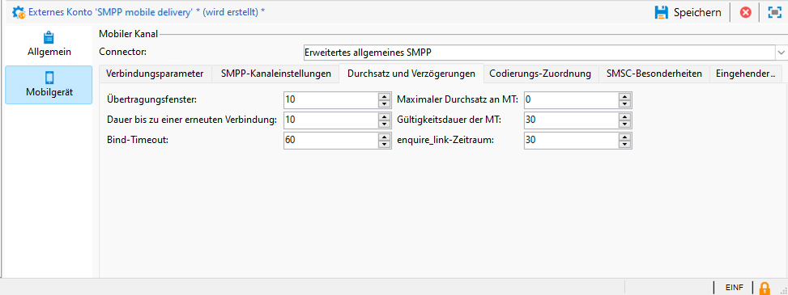
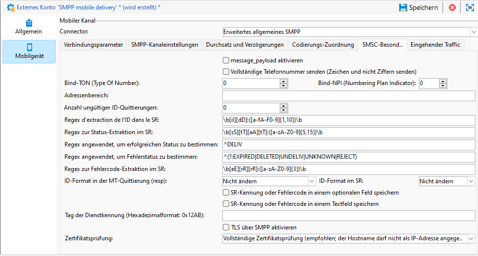
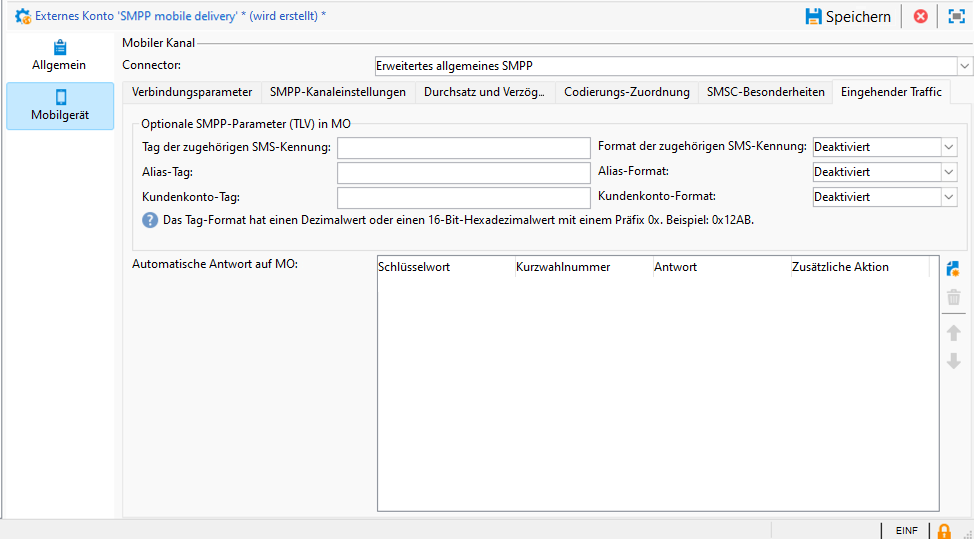

# Einstellungen für externe SMPP-Konten {#smpp-external-account}

Adobe Campaign verwendet das SMPP-Protokoll, um SMS an einen Dienstleister zu senden.

Der SMS-Connector in Adobe Campaign bietet viele Optionen zum Anpassen seines Verhaltens, um die Kompatibilität mit den meisten SMPP-Providern sicherzustellen, die mitunter etwas von der offiziellen Spezifikation abweichen können.

>[!IMPORTANT]
>
>* Adobe Campaign unterstützt die Version 3.4 des SMPP-Protokolls.
>
>* Das Einrichten einer Verbindung zu einem neuen Provider erfordert möglicherweise einige technische Fähigkeiten, Kenntnisse über TCP, die binäre, hexadezimale Darstellung und Textkodierungen. Es erfordert auch eine aktive Zusammenarbeit mit dem Provider.

Die Netzwerkgeräte auf der Seite des SMS-Dienstleisters werden oft als SMSC bezeichnet.

## Verbindungsparameter {#smpp-connection-settings}

{zoomable="yes"}

Die folgenden Parameter samt Rollen sind zum Einrichten der Verbindung erforderlich:

* **Name der SMSC-Implementierung**: Legt den Namen der SMSC-Implementierung fest. Sollte auf den Namen Ihres Providers festgelegt werden. Die Rolle dieses Felds wird im Abschnitt „Umgang mit SMPP-Fehlern“ beschrieben.
* **Server**: Der DNS-Name oder die IP-Adresse des Servers, zu dem eine Verbindung hergestellt werden soll.
* **Port**: Der TCP-Port, zu dem eine Verbindung hergestellt werden soll.
* **Konto**: Der Kontoname für die Verbindung. Wird im Feld „system_id“ der BIND-PDU übergeben.
* **Passwort**: Das Passwort der SMPP-Verbindung. Wird im Passwortfeld der BIND-PDU übergeben.
* **Systemtyp**: Der Wert, der im Feld „system_type“ der BIND-PDU übergeben wird. Einige Provider benötigen hier einen bestimmten Wert.
* **Anzahl simultaner untergeordneter MTA-Verbindungen**: Definiert, wie viele Verbindungen pro Versand-Thread geöffnet werden.
Die Gesamtzahl der Verbindungen kann mithilfe der folgenden Formel berechnet werden:
  *Gesamtanzahl der Verbindungen = Anzahl der SMS-Prozesse × Anzahl der Versand-Threads × Anzahl simultaner untergeordneter MTA-Verbindungen*

   * Die Anzahl der SMS-Prozesse ist normalerweise 1. Bei einigen sehr leistungsstarken Instanzen können mehrere SMS-Prozesse parallel gestartet werden.
   * Die Anzahl der Versand-Threads wird in „serverConf“ festgelegt (sendingThreads-Einstellung). Der Standardwert ist 1.
   * Die Anzahl der simultanen untergeordneten MTA-Verbindungen entspricht dieser Einstellung im externen Konto.

  Bei Standardwerten legt diese Einstellung direkt die Anzahl der Verbindungen fest.

Im Modus **Transceiver** ist dies die Gesamtzahl der Verbindungen.

Im Modus **Transmitter + Receiver** wird dadurch die Anzahl der Transmitter-/Receiver-Paare definiert (ein Paar = ein Transmitter + ein Receiver).
Es gibt keine Möglichkeit, das Gleichgewicht zwischen Transmittern und Receivern zu verändern.

* **Nachrichten über einen speziellen Prozess senden**:
Bei Adobe Campaign v8.7.2 und höher sollte diese Option immer aktiviert sein. Dies hat zahlreiche Auswirkungen auf die Verarbeitung von Nachrichten.
* **SMPP-Verbindungsmodus**:
Legt für die Verbindung den Modus „Transceiver“ oder den getrennten Modus „Transmitter + Receiver“ fest.
   * Transmitter + Receiver (oder TX + RX): Es werden zwei separate TCP-Verbindungen zum Senden und Empfangen von Nachrichten verwendet.
   * Transceiver (oder TRX): Es wird eine einzelne TCP-Verbindung zum Senden und Empfangen von Nachrichten verwendet.
* **Andere Parameter für den Receiver verwenden**:
Nur im Modus „Transmitter + Receiver“ verfügbar.
Wenn das Kontrollkästchen deaktiviert ist, werden für Transmitter und Receiver dieselben Einstellungen verwendet. Wenn das Kontrollkästchen aktiviert ist, gelten die Standardeinstellungen nur für den Transmitter, während die Receiver-Einstellungen nur für den Receiver gelten.
* **Receiver-Server, Port, Konto, Kennwort, Systemtyp**
Diese Einstellungen gelten für den Receiver im Modus „Transmitter + Receiver“. Sie funktionieren wie im Transmitter-Modus. [Weitere Informationen](#smpp-connection-settings) finden Sie oben.
* **Ausführliche SMPP-Protokolle in der Log-Datei aktivieren**
Wenn diese Option aktiviert ist, werden zusätzliche Protokolle in die Log-Datei ausgegeben. Dies ist sehr nützlich für die Fehlerbehebung, sollte jedoch bei Instanzen mit hohem Durchsatz deaktiviert bleiben, wenn keine Fehlerbehebung erforderlich ist.

## Einstellungen des SMPP-Kanals {#smpp-channel-settings}

{zoomable="yes"}

### Transliteration der Zeichen zulassen {#smpp-transliteration}

Bei der Transliteration werden äquivalente Zeichen zu fehlenden Zeichen gefunden. Beispielsweise fehlt das französische Zeichen „ê“ (e mit Zirkumflex-Akzent) in der GSM-Kodierung, es kann jedoch durch„e“ ersetzt werden, ohne die Lesbarkeit zu stark zu beeinträchtigen.

Wenn dieses Kontrollkästchen deaktiviert ist, schlägt die Textkodierung fehl, wenn die Zeichenfolge nicht exakt kodiert werden kann.

Wenn dieses Kontrollkästchen aktiviert ist, versucht die Textkodierung, die Zeichenfolge in eine ungefähre Version zu konvertieren, anstatt fehlzuschlagen. Wenn einige Zeichen in der Zielkodierung keine Entsprechung haben, schlägt die Textkodierung fehl.

Eine allgemeinere Erläuterung des Kodierungsprozesses finden Sie unter dem Parameter [Definieren eines bestimmten Kodierungs-Mapping](#mapping-encodings).

### Anrufernummer

Definiert die Standardquelladresse für Nachrichten. Diese Einstellung gilt nur, wenn die Anrufernummer im Versand leer gelassen wurde. Standardmäßig wird das Feld für die Anrufernummer nicht übergeben, sodass der Provider es durch die Kurzwahlnummer ersetzt.

Damit wird die Funktion zum Überschreiben der Absenderadresse/oADC aktiviert.

### Anrufer-TON/NPI, Empfänger-TON/NPI

TON (Type of Number = Nummerntyp) und NPI (Numbering Plan Indicator = Nummerierungsplanindikator) werden in Abschnitt 5.2.5 der Spezifikation von SMPP Version 3.4 (Seite 117) beschrieben. Diese Werte sollten entsprechend den Anforderungen des Providers festgelegt werden.

Sie werden unverändert in den Feldern „source_addr_ton“, „source_addr_npi“, „dest_addr_ton“ und „dest_addr_npi“ der SUBMIT_SM-PDU übertragen.

### Diensttyp

Dieses Feld wird unverändert im Feld „service_type“ der SUBMIT_SM-PDU übertragen. Stellen Sie den Wert entsprechend den Anforderungen des Providers ein.

## Durchsatz und Verzögerungen {#smpp-delays}

{zoomable="yes"}

Diese Einstellungen steuern alle Zeitaspekte des SMPP-Kanals. Einige Provider erfordern eine sehr genaue Kontrolle der Nachrichtenrate, des Fensters und der Wiederholungszeiten. Diese Einstellungen sollten daher auf Werte gesetzt werden, die der Kapazität des Providers und den in seinem Vertrag angegebenen Bedingungen entsprechen.

### Übertragungsfenster

Das Fenster entspricht der Anzahl der SUBMIT_SM-PDUs, die gesendet werden können, ohne auf eine passende SUBMIT_SM_RESP zu warten.

Beispiel einer Übertragung mit einem maximalen Fenster von 4:

{zoomable="yes"}

Das Fenster hilft, den Durchsatz zu erhöhen, wenn die Netzwerkverbindung eine hohe Latenz aufweist. Der Wert des Fensters muss mindestens der Anzahl der SMS/Sek. entsprechen, multipliziert mit der Latenz des Links (in Sekunden), damit der Connector nie auf eine SUBMIT_SM_RESP wartet, bevor die nächste Nachricht gesendet wird.

Wenn das Fenster zu groß ist, kann es passieren, dass Sie bei Verbindungsproblemen (in seltenen Fällen) mehr doppelte Nachrichten senden. Außerdem haben die meisten Provider ein sehr strenges Limit für das Fenster und lehnen Nachrichten ab, die das Limit überschreiten.

Berechnung der optimalen Formel für das Übertragungsfenster:

Messen Sie die maximale Latenz zwischen SUBMIT_SM und SUBMIT_SM_RESP.
Multiplizieren Sie diesen Wert (in Sekunden) mit dem maximalen Durchsatz an MT: Dies ergibt den optimalen Wert für das Übertragungsfenster.
Beispiel: Wenn Sie für den maximalen MT-Durchsatz 300 SMS/s eingestellt haben und die Latenz zwischen SUBMIT_SM und SUBMIT_SM_RESP im Durchschnitt 100 ms beträgt, wäre der optimale Wert 300×0,1 = 30.

Im Zweifelsfall sollten Sie ein größeres Fenster wählen, um Leistungsprobleme zu vermeiden.

### Maximaler Durchsatz an MT

Maximale Anzahl an MT pro Sekunde und pro Verbindung. Diese Einstellung wird genau eingehalten. Der MTA wird beim Nachrichtenversand diese Grenze nie überschreiten. Diese Einstellung ist nützlich für Provider, die eine genaue Drosselung benötigen.

Um die Gesamtdurchsatzgrenze zu ermitteln, multiplizieren Sie diese Zahl mit der Gesamtzahl der Verbindungen (siehe die obige Formel).

0 bedeutet keine Begrenzung, der MTA sendet dann MT so schnell wie möglich.

Im Allgemeinen wird empfohlen, diese Einstellung unter 1.000 zu halten, da es unmöglich ist, einen genauen Durchsatz oberhalb dieser Zahl zu garantieren, es sei denn, es wurde mit der endgültigen Architektur ordnungsgemäß eine Benchmark durchgeführt. Wenn Sie einen Durchsatz von über 1.000 benötigen, kontaktieren Sie bitte Ihren Provider. Möglicherweise ist es besser, die Anzahl der Verbindungen auf über 1.000 MT/s zu erhöhen.

### Dauer bis zu einer erneuten Verbindung

Wenn die TCP-Verbindung verloren geht, wartet der Connector diese Anzahl von Sekunden, bevor er versucht, eine Verbindung herzustellen.

### Gültigkeitsdauer der MT

Dies ist das Timeout zwischen SUBMIT_SM und der zugehörigen SUBMIT_SM_RESP. Wenn die RESP nicht rechtzeitig empfangen wird, gilt die Nachricht als fehlgeschlagen und die globale Wiederholungsrichtlinie des MTA wird angewendet.

### Bind-Timeout

Timeout zwischen dem TCP-Verbindungsversuch und der BIND_*_RESP-Antwort. Nach Ablauf des Zeitlimits wird die Verbindung durch den Campaign-Connector geschlossen. Erst nach Ablauf der Dauer bis zu einer erneuten Verbindung wird versucht, die Verbindung wiederherzustellen.

### enquire_link-Zeitraum

enquire_link ist eine spezielle Art von PDU, die gesendet wird, um die Verbindung aktiv zu halten. Dieser Zeitraum wird in Sekunden angegeben. Der Kampagnen-Connector führt nur einen enquire_link-Versand durch, wenn die Verbindung inaktiv ist, um Bandbreite zu sparen. Wenn nach der doppelten Dauer dieses Zeitraums keine RESP empfangen wird, wird die Verbindung als unterbrochen betrachtet und ein Wiederverbindungsprozess ausgelöst.

## Codierungs-Zuordnung {#mapping-encodings}

Weitere Informationen zur Textcodierung finden Sie im Abschnitt [Codierung von SMS-Texten](sms-channel.md#sms-text-encoding).

Mit dieser Einstellung können Sie eine benutzerdefinierte Codierungs-Zuordnung definieren, die von der Spezifikation abweicht. Sie können eine Liste von Codierungen zusammen mit ihrem data_coding-Wert deklarieren. Der MTA versucht, die Codierung mit der ersten Codierung in der Liste durchzuführen. Wenn dies fehlschlägt, versucht er, die nächste Codierung in der Liste zu verwenden usw. Wenn keine Codierung zum Codieren der Nachricht verwendet werden kann, tritt ein Fehler auf. Sobald die Codierung gefunden wurde, erstellt der MTA die SUBMIT_SM-PDU mit dem codierten Text und dem Feld „data_coding“ mit dem in der Tabelle angegebenen Wert.

Die Reihenfolge der Elemente in der Tabelle ist wichtig: Codierungen werden von oben nach unten ausprobiert. Sie sollten die günstigste oder am meisten empfohlene Codierung ganz oben auf die Liste setzen, gefolgt von immer teureren (oder weniger wünschenswerten) Codierungen.

Beachten Sie, dass UCS-2 niemals fehlschlägt, da damit alle in Campaign unterstützten Zeichen codiert werden können. Die maximale Länge einer UCS-2-SMS ist deutlich kleiner (nur 70 Zeichen).

Sie können diese Einstellung auch verwenden, um zu erzwingen, dass eine bestimmte Kodierung immer verwendet wird, indem Sie in der Mapping-Tabelle nur eine Zeile deklarieren.

Das standardmäßige Mapping, das verwendet wird, wenn das Kontrollkästchen nicht aktiviert ist, entspricht der folgenden Tabelle:

| data_coding | Kodierung |
|:-:|:-:|
| 0 | GSM |
| 8 | UCS-2 |

Das bedeutet, dass der MTA versucht, die Nachricht im GSM zu codieren. Ist dies erfolgreich, sendet er sie mit dem data_coding-Wert „0“.

Wenn die Nachricht nicht in GSM codiert werden kann, wird sie in UCS-2 codiert und data_coding auf den Wert „8“ gesetzt.

## SMSC-Besonderheiten {#smsc-specificities}

{zoomable="yes"}

### message_payload aktivieren

Wenn diese Option deaktiviert ist, werden lange SMS vom MTA aufgeteilt und in mehreren SUBMIT_SM-PDUs mit UDH gesendet. Die Nachricht wird vom Mobiltelefon entsprechend den UDH-Daten neu zusammengesetzt.

Wenn diese Option aktiviert ist, werden lange SMS in einer einzigen SUBMIT_SM-PDU gesendet, wobei der Text in das optionale Feld „message_payload“ eingefügt wird. (Weitere Informationen dazu finden Sie in den SMPP-Spezifikationen.)

Wenn diese Funktion aktiviert ist, kann Campaign die SMS-Teile nicht einzeln zählen: Alle Nachrichten werden als in einem Teil gesendet gezählt.

### Vollständige Telefonnummer senden

Wenn dieses Kontrollkästchen nicht aktiviert ist, werden nur Ziffern der (nationalen) Telefonnummer an den Provider gesendet (Feld „destination_addr“ des SUBMIT_SM-Felds). Dies ist das Standardverhalten, da das internationale Rufnummernkennzeichen (normalerweise ein „+“-Präfix) in SMPP durch TON- und NPI-Felder ersetzt wird.

Wenn das Kontrollkästchen aktiviert ist, wird die Telefonnummer unverändert gesendet, also ohne Vorverarbeitung (und mögliche Leerzeichen, „+“-Präfix oder Pfund-/Hash-/Sternzeichen).

Diese Funktion wirkt sich auch auf das Verhalten der Quarantänefunktion für automatische Antworten aus: Wenn das Kontrollkästchen nicht aktiviert ist, wird den in die Quarantänetabelle eingefügten Telefonnummern ein „+“-Präfix hinzugefügt, um das „+“-Präfix zu kompensieren, das vom SMPP-Protokoll selbst aus der Telefonnummer entfernt wird.

### Bind TON/NPI

TON (Type of Number = Nummerntyp) und NPI (Numbering Plan Indicator = Nummerierungsplanindikator) werden in Abschnitt 5.2.5 der Spezifikation von SMPP Version 3.4 (Seite 117) beschrieben. Diese Werte sollten entsprechend den Anforderungen des Providers festgelegt werden.

Sie werden unverändert in den Feldern „addr_ton“ und „addr_npi“ der BIND-PDU übertragen.

### Adressenbereich

Wird im Feld address_range der BIND PDU unverändert gesendet. Dieser Wert sollte entsprechend den Anforderungen des Providers eingestellt werden.

### Anzahl ungültiger ID-Quittierungen

Begrenzt die DELIVER_SM_RESP-Anzahl mit ungültiger Nachrichten-ID, die für einen einzelnen SR gesendet werden können. **Dies sollte nur zur Fehlerbehebung als Problemumgehung verwendet** und unter normalen Bedingungen auf 0 gesetzt werden.

Ausführliche Erklärung: Angenommen, Sie legen diese Einstellung auf den Wert „2“ fest:

* Der Provider sendet einen SR (DELIVER_SM) mit der ID „1234“.
* Die ID „1234“ konnte nicht in der Datenbank gefunden werden.
* Der Connector zählt für diese ID einen Fehler vom Typ „Ungültige ID“. Daher wird DELIVER_SM_RESP mit dem Fehler-Code „Nachrichten-ID ungültig“ gesendet (normales Verhalten).
* Der Provider versucht es erneut mit demselben SR mit der ID „1234“.
* Die ID „1234“ konnte immer noch nicht in der Datenbank gefunden werden.
* Der Connector zählt für diese ID zwei Fehler vom Typ „Ungültige ID“. Daher sendet DELIVER_SM_RESP „OK“, auch wenn sie nicht korrekt verarbeitet wurde.

Diese Funktion dient zum Leeren von SR-Puffern auf der Provider-Seite, wenn aufgrund eines ungültigen SR-Blocks Nachrichten nicht verarbeitet werden können.

Wenn dieses Feld auf 0 gesetzt wird, wird der Mechanismus deaktiviert, sodass „Nachrichten-ID ungültig“ immer zurückgegeben wird. Dies ist das normale Verhalten.

Wenn Sie dieses Feld auf 1 setzen, antwortet der Connector immer mit „OK“, auch wenn die ID ungültig ist. Es sollte nur unter Aufsicht, zur Fehlerbehebung und für eine minimale Zeitdauer, z. B. zur Behebung eines Problems auf Provider-Seite, auf 1 gesetzt werden.

### Regex zur ID-Extraktion im SR

Das SR-Format wird von der SMPP-Protokollspezifikation nicht strikt durchgesetzt. Es handelt sich lediglich um eine Empfehlung, die in Anhang B der Spezifikation beschrieben ist. Aus diesem Grund formatieren einige SMPP-Implementierer dieses Feld unterschiedlich, sodass Campaign eine Möglichkeit benötigt, das richtige Feld zu extrahieren.

Standardmäßig werden bis zu 10 alphanumerische Zeichen nach „ID:“ erfasst.

Der Regex muss über genau eine Erfassungsgruppe verfügen (ein Teil, der in Klammern steht). Klammern müssen den Teil umschließen, der der ID entspricht. Das Regex-Format ist PCRE.

Achten Sie beim Anpassen dieser Einstellung darauf, so viel Kontext wie möglich einzubeziehen, um Fehlauslösungen zu vermeiden. Wenn bestimmte Präfixe vorhanden sind (wie „id:“ im standardisierten Präfix), müssen Sie sie in den Regex aufnehmen. Verwenden Sie außerdem so weit wie möglich Worttrennzeichen (\b), um zu vermeiden, dass Text in der Mitte eines Wortes erfasst wird.

Wenn nicht genügend Kontext in den Regex aufgenommen wird, kann es zu einer kleinen Sicherheitslücke kommen: Der tatsächliche Inhalt der Nachricht kann in den SR eingeschlossen werden. Wenn Sie also nur ein bestimmtes ID-Format ohne Kontext verwenden (z. B. eine UUID), wird möglicherweise der eigentliche Textinhalt (z. B. eine UUID, die in das Textfeld eingebettet ist) anstelle der ID analysiert.

### Regex zur Status-Extraktion im SR

Dieser Regex erfasst den Status aus dem Textfeld der SR-Nachrichten.

Standardmäßig werden 5 bis 15 Zeichen nach „stat:“ erfasst.

Der Regex muss über **genau eine Erfassungsgruppe** verfügen (einen Teil, der in Klammern steht). Klammern müssen den Teil umschließen, der dem Status entspricht. Das Regex-Format ist PCRE.

### Regex angewendet, um Erfolgsstatus zu ermitteln

Dieser Regex wird auf das Ergebnis des vorherigen Regex angewendet („Extraktions-Regex des Status“). Wenn der Regex übereinstimmt, wird die Nachricht als erfolgreich betrachtet.

Standardmäßig stimmt er mit allem überein, das mit „DELIV“ beginnt. Er entspricht dem Standardwert „DELIVRD“.

### Regex angewendet, um den Fehlerstatus zu ermitteln

Dieser Regex wird auf das Ergebnis des vorherigen Regex angewendet („Extraktions-Regex des Status“). Wenn der Regex übereinstimmt, wird die Nachricht als fehlerhaft betrachtet.

Standardmäßig werden alle in der Spezifikation beschriebenen Fehlerstatus abgeglichen.

### Regex zur Extraktion von Fehler-Code im SR

Dieser Regex erfasst den Fehler-Code aus dem Textfeld der SR-Nachrichten.

Fehler-Codes können in der Versandlogqualifizierung qualifiziert werden.

Standardmäßig werden 3 Zeichen nach „err:“ erfasst.

### ID-Format in der MT-Quittierung (resp)

Dies zeigt das Format der ID an, die im Feld „message_id“ der SUBMIT_SM_RESP-PDU zurückgegeben wird.

* **Nicht ändern**: Die ID wird unverändert als ASCII-kodierter Text wie in der Datenbank gespeichert. Es findet keine Vorverarbeitung oder Filterung statt.
* **Dezimalzahl**: Die ID wird als Dezimalzahl in ASCII-Form erwartet. Führende und nachfolgende Leerzeichen und führende Nullen werden bei dieser Einstellung entfernt.
* **Hexadezimalzahl**: Die ID wird als Hexadezimalzahl in ASCII-Form erwartet, ohne führendes 0x und nachgestelltes h. Die ID wird dann in eine Dezimalzahl umgewandelt, bevor sie in der Datenbank gespeichert wird.
* **Hexadezimaler String**: Die ID muss ein ASCII-kodierter Text sein, der selbst eine Zeichenfolge ist, die als Hexadezimalwert kodiert wurde. In der PDU finden Sie beispielsweise 0x34 0x31 0x34 0x32 0x34 0x33, was zu ASCII „414243“ führt. Dieser String wird dann als hexadezimaler String von Bytes dekodiert und Sie erhalten „ABC“: Sie speichern die ID. Die ID „ABC“ wird in der Datenbank gespeichert.

### ID-Format im SR

Dies gibt das Format der ID an, die vom Extraktions-Regex der ID im SR erfasst wird. Die Werte haben die gleiche Bedeutung und das gleiche Verhalten wie das Format im MT oben.

### SR-Kennung oder Fehlercode in einem optionalen Feld speichern

Wenn diese Option aktiviert ist, wird der Inhalt der optionalen Felder an den Text angehängt, der durch die oben genannten Regex verarbeitet wird. Der Text hat das Format „0xTAG:VALUE“, wobei 0xTAG der 4-stellige Hexadezimalwert des Tags in Großbuchstaben ist, (z. B. 0x002E).

Sie können beispielsweise die ID im Feld „receipted_message_id“ erfassen. Aktivieren Sie dazu dieses Kontrollkästchen, und dem Status wird folgender Text hinzugefügt:

0x001E:05e3299e-8d37-49d0-97c6-8e4fe60c7739

In diesem Beispiel ist 0x001E das Tag des optionalen Felds und die UUID der Wert des Felds.

Um diesen Wert zu erfassen, können Sie jetzt den folgenden Regex im Feld &quot;Regex zur ID-Extraktion im SR&quot; festlegen:

\b0x001E:([0-9a-f]{8}-[0-9a-f]{4}-[0-9a-f]{4}-[0-9a-f]{4}-[0-9a-f]{12})\b

>[!IMPORTANT]
>
>Sie können nur optionale Felder mit 8-Bit-Textwerten (ASCII/UTF-8) erfassen. Insbesondere können Binärfelder mit dem aktuellen Regex-System nicht zuverlässig erfasst werden.

### SR-Kennung oder Fehlercode in einem Textfeld speichern

Wenn diese Option aktiviert ist, wird das Feld „Text:“ während der Verarbeitung des Statustextes des SR beibehalten. Dies ist nützlich, wenn der Provider wichtige Daten wie die ID oder den Status in dieses Feld eingibt. Normalerweise kann dieses Feld sicher verworfen werden, da es Text mit einer Nicht-ASCII-Kodierung enthalten und die Regex-Verarbeitung stören kann.

Durch Aktivierung dieser Option kann es zu einer sehr kleinen Sicherheitslücke kommen, wenn der Extraktions-Regex der ID im SR-Feld nicht spezifisch genug ist: Der Inhalt des Felds „Text“ kann als eine ID geparst werden, und ein Angreifer könnte diese verwenden, um gefälschte IDs einzuschleusen, was zu einer teilweisen Dienstverweigerung führen kann.

### Tag der Dienstkennung

Ermöglicht das Hinzufügen eines benutzerdefinierten TLV. Dieses Feld legt das Tag fest, das als Hexadezimalwert im Format **0x1234** übergeben wird.

Der Wert des benutzerdefinierten TLV muss im Versand im Feld „Dienst- oder Programm-ID“ in den erweiterten Parametern des Versands festgelegt werden. Der Wert wird als UTF-8-codierter Text gesendet.

Diese Einstellung erlaubt nur das Hinzufügen einer einzigen TLV-Option pro Nachricht.

>[!NOTE]
>
>Diese Option wird durch die deutlich leistungsfähigere Einstellung **Optionale SMPP-Parameter (TLV)** in den Parametern des Versands ersetzt. Diese beiden Funktionen schließen sich gegenseitig aus und können nicht gleichzeitig verwendet werden.

### TLS über SMPP aktivieren

Wenn diese Option aktiviert ist, werden alle Verbindungen zum SMSC mit TLS verschlüsselt.

### Zertifikatsprüfung

* **Vollständige Zertifikatsprüfung**: Beim Herstellen einer Verbindung werden das TLS-Zertifikat und der Name des Remote-Hosts überprüft. Dieser Wert bietet das höchste Sicherheitsniveau.
* **Hostnamen-Prüfung überspringen**: Das Remote-TLS-Zertifikat wird überprüft, es wird jedoch nicht überprüft, ob der Name des Remote-Hosts übereinstimmt. Verringert die Sicherheit geringfügig.
* **Zertifikatsprüfung überspringen**: Das TLS-Zertifikat wird überhaupt nicht überprüft. Die Verbindung ist weiterhin verschlüsselt, aber anfällig für Man-in-the-Middle-Angriffe. Verringert die Sicherheit erheblich.

## Eingehender Traffic {#incoming-traffic}

{zoomable="yes"}

### Optionale SMPP-Parameter (TLV) in MO

Campaign ermöglicht den Empfang von drei zusätzlichen Feldern in einer MO (nms:inSms table): Verknüpfte SMS, Alias und großes Konto. Beim SMPP-Connector können diese Felder mit Daten aus einem beliebigen optionalen SMPP-Parameter (TLV) in einem beliebigen gängigen Format ausgefüllt werden.

Sie können für jedes Feld das zugehörige Tag sowie dessen Format festlegen. Bitten Sie den SMPP-Provider um diese Informationen.

* Tag: der Tag-Wert im Dezimalformat (z. B. 12345) oder im Hexadezimalformat mit 0x-Präfix (z. B. 0x12ab). Tags können zwischen 0 und 65535 liegen.
* Format: das für den Wert verwendete Format. Binärwerte sind alle signierten Big-Endian-Binärwerte. Wählen Sie für Textfelder die vom SMPP-Provider verwendete Codierung aus.

### Automatische Antwort auf MO          

Mit dieser Funktion können Sie schnell einen Antworttext auf eine MO senden und Blockierungslisten pro Kurzwahlnummer handhaben.

Die Spalten *Schlüsselwort* und *Kurzwahlnummer* definieren Bedingungen, um die automatische Antwort auszulösen: Wenn beide Felder übereinstimmen, wird die MO gesendet und die zusätzliche Aktion ausgelöst. Um einen Platzhalter festzulegen, können Sie das Feld einfach leer lassen. Das Schlüsselwort wird mit dem ersten alphanumerischen Wort im MO-Text abgeglichen, wobei Interpunktion und führende Leerzeichen ignoriert werden. Das bedeutet, dass das Feld „Schlüsselwort“ keine Leerzeichen enthalten darf und ein einziges Wort sein muss.

Die Einstellung *Schlüsselwort* ist außerdem ein Präfix. Wenn Sie beispielsweise „AD“ angeben, passen „AD“, „ADAPT“ und „ADOBE“. Wenn Sie mehrere Schlüsselwörter mit einem gemeinsamen Präfix haben, müssen Sie auf die Reihenfolge achten, da Schlüsselwörter von oben nach unten verarbeitet werden.

Die Spalte *Antwort* enthält den Antworttext. In diesem Feld ist keine Personalisierung verfügbar, der Antworttext ist immer derselbe. Wenn Sie dieses Feld leer lassen, wird keine Nachricht als Antwort gesendet, aber die zusätzliche Aktion wird trotzdem ausgelöst.

Die Spalte *Zusätzliche Aktion* enthält eine zusätzliche Aktion, wenn sowohl Schlüsselwort als auch Kurzwahlnummer übereinstimmen. (Eine leere Kurzwahlnummer entspricht allen Kurzwahlnummern.) Derzeit können Sie Elemente unter Quarantäne stellen oder aus der Quarantäne entfernen. Wenn Sie eine zusätzliche Aktion angeben, aber das Feld „Antwort“ leer lassen, wird die Aktion ausgeführt, aber es wird keine Antwort gesendet. Quarantäne wird nur für die angegebene Kurzwahlnummer angewendet (oder für alle Kurzwahlnummern, wenn das Feld leer gelassen wird).

Alle Einträge in der Tabelle werden in der angegebenen Reihenfolge verarbeitet, bis eine Regel übereinstimmt. Wenn mehrere Regeln mit einem MO übereinstimmen, wird nur die oberste Regel angewendet.

>[!NOTE]
>
>Die Einstellung **Vollständige Telefonnummer senden** wirkt sich auf das Verhalten des Quarantänemechanismus für automatische Antworten aus: Wenn „Vollständige Telefonnummer senden“ nicht aktiviert ist, wird der unter Quarantäne gestellten Telefonnummer ein Pluszeichen („+“) vorangestellt, damit sie mit dem internationalen Telefonnummernformat kompatibel ist.

>[!NOTE]
>
>In Mid-Sourcing-Architekturen sind auf Mid-Operator-Seite Schreibrechte für den externen Kontoordner erforderlich, wenn für den SMPP-Connector automatische Antworten eingerichtet werden sollen.

>[!IMPORTANT]
>
>Seien Sie bei automatischen Antworten vorsichtig mit Codierungen, insbesondere beim Kopieren und Einfügen. Textverarbeitungs-Software neigt dazu, zusätzliche Formatierungen hinzuzufügen, z. B. geschützte Leerzeichen zu verwenden oder Anführungszeichen in Apostrophe zu ändern.
