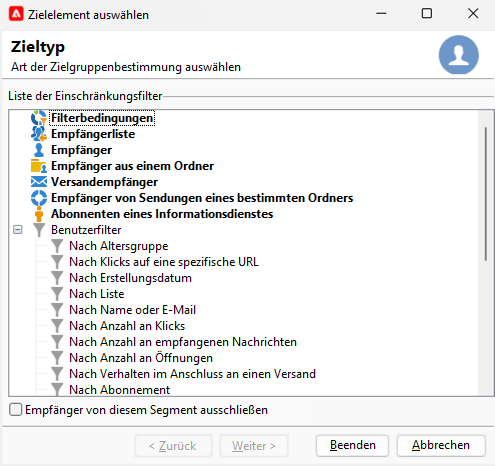
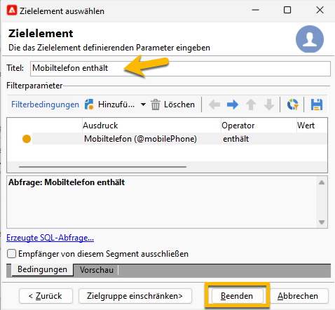
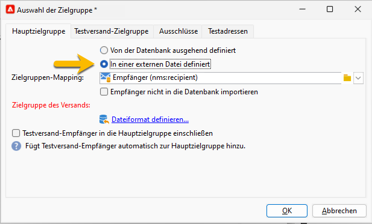

# Auswählen der Audience Ihres SMS-Versands {#sms-audience}

Bevor Sie Ihre Audience auswählen, erfahren Sie hier [ mehr über die Audience.](../../audiences/gs-audiences.md)

In den meisten Fällen wird die Hauptzielgruppe eines Versands aus der Adobe Campaign-Datenbank extrahiert (Standardmodus). Die Audience kann jedoch auch in einer externen Datei gespeichert werden. [Weitere Informationen finden Sie in diesem Abschnitt](#external-audience).

## Zielgruppe in Adobe Campaign

Gehen Sie wie folgt vor, um die Audience Ihres Versands auszuwählen:

1. Klicken Sie im Versand-Editor auf den Link **[!UICONTROL Bis]** . Sie haben ein Fenster zum Auswählen eines Ziels ]**geöffnet**[!UICONTROL 

1. Da die Audience in der Adobe Campaign-Datenbank gespeichert ist, wählen Sie auf der Registerkarte **[!UICONTROL Hauptziel]** die Option **[!UICONTROL In der Datenbank definiert]** .

   {zoomable="yes"}

1. Wählen Sie die **[!UICONTROL Zielzuordnung]** in der Dropdown-Liste aus. Das standardmäßige Adobe Campaign-Zielgruppen-Mapping ist Empfänger, basierend auf dem Schema **[!UICONTROL nms:recipient]** .

   Es sind weitere Zielgruppen-Zuordnungen verfügbar, von denen sich einige auf Ihre spezifische Konfiguration beziehen können. Weitere Informationen zu Zielgruppen-Mappings finden Sie unter [Arbeiten mit Zielgruppen-Mappings](../../audiences/target-mappings.md).

1. Wählen Sie zur Konfiguration von Einschränkungsfiltern die Schaltfläche **[!UICONTROL Hinzufügen]** aus.

   Sie haben die Wahl zwischen verschiedenen Filtertypen:

   {zoomable="yes"}

   Um einen Zieltyp zu verwenden, wählen Sie ihn aus und klicken Sie auf die Schaltfläche **[!UICONTROL Weiter]** .

   Im Folgenden finden Sie die standardmäßig angebotenen Zieltypen:

   * **[!UICONTROL Filterbedingungen]**: ermöglicht die Definition einer Abfrage und die Anzeige des Ergebnisses.
   * **[!UICONTROL Eine Empfängerliste]**: ermöglicht die Auswahl einer Liste, die Sie vorbereitet haben und die Ihre Audience enthält
   * **[!UICONTROL Empfänger]**: ermöglicht die direkte Auswahl eines Empfängers in der Tabelle.
   * **[!UICONTROL In einem Ordner enthaltene Empfänger]**: ermöglicht die Auswahl eines Ordners in der Navigationsstruktur des Explorers
   * **[!UICONTROL Empfänger eines Versands]**: ermöglicht die Auswahl der Audience eines früheren Versands
   * **[!UICONTROL Empfänger von Sendungen, die zu einem Ordner gehören]**: ermöglicht die Auswahl der Audience aller Sendungen in einem bestimmten Ordner
   * **[!UICONTROL Abonnenten eines Informationsdienstes]**: Angabe des Newsletters, den die Empfänger abonniert haben müssen, um in die Zielgruppe des Versands aufgenommen zu werden.
   * **[!UICONTROL Benutzerfilter]**: ermöglicht die Verwendung der vordefinierten Filter.

   Mit der Option **[!UICONTROL Empfänger aus diesem Segment ausschließen]** können Sie Empfänger als Zielgruppe auswählen, die nicht den definierten Zielkriterien entsprechen. Um diese Option zu verwenden, wählen Sie das entsprechende Feld aus und wenden Sie dann die Zielgruppenbestimmung an (wie zuvor definiert), um die resultierenden Profile auszuschließen.

1. Geben Sie den Namen Ihrer Audience in das Titelfeld ein und klicken Sie auf die Schaltfläche **[!UICONTROL Beenden]** , um Ihre Audience zu validieren.

   {zoomable="yes"}

   Sie können die benötigte Zielpopulation durch erneutes Klicken auf die Schaltfläche **[!UICONTROL Hinzufügen]** hinzufügen. Sie können auch einige löschen, indem Sie auf das Kreuz nach dem Titel klicken.

## Zielgruppe in einer externen Datei {#external-audience}

Sie können Adobe Campaign verwenden, um einen Versand an eine Audience durchzuführen, die nicht in der Datenbank, sondern in einer externen Datei enthalten ist.

Gehen Sie dazu wie folgt vor:

1. Klicken Sie im Versand-Editor auf den Link **[!UICONTROL Bis]** . Sie haben ein Fenster zum Auswählen eines Ziels ]**geöffnet**[!UICONTROL 

1. Wählen Sie die Option **[!UICONTROL In einer externen Datei definiert]** aus.

   {zoomable="yes"}

1. Standardmäßig werden Empfänger in die Datenbank importiert. In diesem Fall müssen Sie die **[!UICONTROL Zielzuordnung]** auswählen. Weitere Informationen zu Zielgruppen-Mappings finden Sie unter [Arbeiten mit Zielgruppen-Mappings](../../audiences/target-mappings.md).

   Andernfalls können Sie auch **[!UICONTROL Empfänger nicht in die Datenbank importieren]** auswählen.

1. Klicken Sie beim Import Ihrer Datei auf den Link **[!UICONTROL Dateiformat definieren...]** , um die externe Datei auszuwählen und zu konfigurieren.

1. Klicken Sie auf die Schaltfläche **[!UICONTROL Beenden]** , um Ihre Audience zu validieren.
