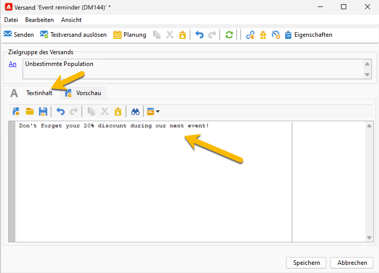
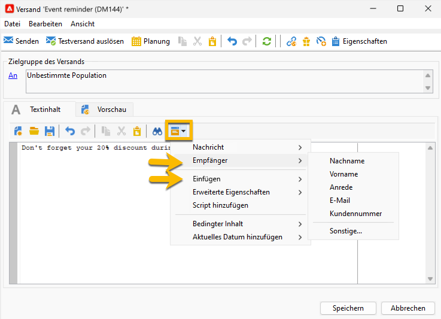
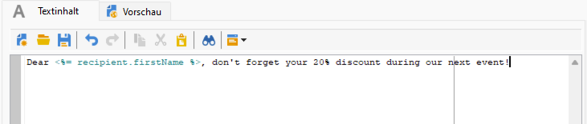
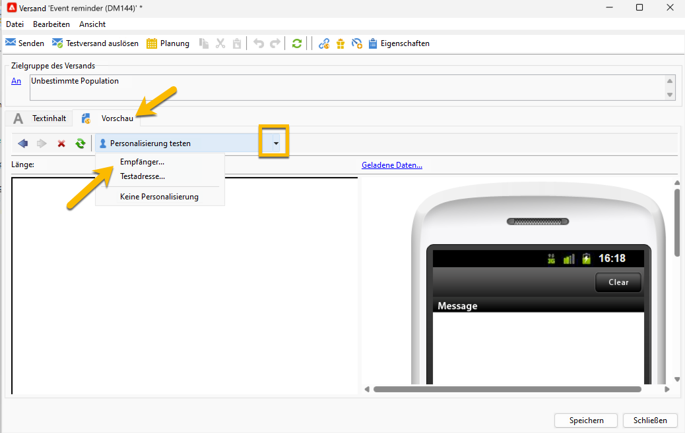
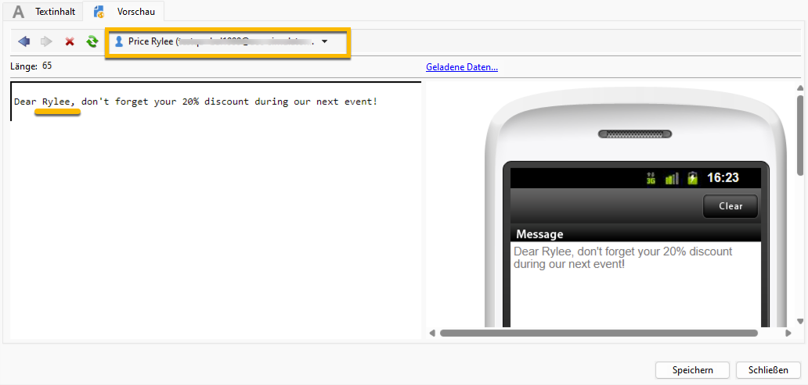

# SMS-Inhalt erstellen {#sms-content}

So konfigurieren Sie den Inhalt Ihres SMS-Versands:

1. Geben Sie den Inhalt Ihrer Nachricht auf der Registerkarte **[!UICONTROL Textinhalt]** ein.

   {zoomable="yes"}

1. Sie können Ihre Nachricht personalisieren, indem Sie Personalisierungsfelder (z. B. den Vornamen) oder vordefinierte Personalisierungsblöcke (z. B. Grußformeln) einfügen. Klicken Sie auf die Schaltfläche „Personalisierung“, um diese hinzuzufügen:

   {zoomable="yes"}

   Nachdem Sie beispielsweise auf **[!UICONTROL Empfänger]** > **[!UICONTROL Vorname]** geklickt haben, wird der SMS-Inhalt mit dem Feld „Personalisierung“ wie folgt personalisiert:

   {zoomable="yes"}

   Weitere Informationen zur Personalisierung in Adobe Campaign finden Sie in [diesem Abschnitt](../personalize.md).

1. Sie können eine Vorschau des Versandinhalts auf der Registerkarte **[!UICONTROL Vorschau]** anzeigen. Um Ihre Personalisierungseinstellungen zu überprüfen, klicken Sie auf die Dropdown-Liste **[!UICONTROL Personalisierung testen]** und wählen Sie eine Empfängerin oder einen Empfänger aus.

   {zoomable="yes"}

   Anschließend können Sie die Vorschau Ihrer SMS mit der Personalisierung überprüfen:

   {zoomable="yes"}

>[!NOTE]
>
>* SMS-Nachrichten sind auf eine Länge von 160 Zeichen beschränkt, wenn die Code-Seite Latin-1 (ISO-8859-1) verwendet wird. Wenn die Nachricht in Unicode geschrieben ist, darf sie 70 Zeichen nicht überschreiten. Bestimmte Sonderzeichen können sich auf die Nachrichtenlänge auswirken. Weitere Informationen zur Nachrichtenlänge finden Sie im Abschnitt [Transliteration von SMS-Zeichen](smpp-external-account.md#smpp-channel-settings).
>
>* Wenn Personalisierungsfelder oder bedingte Inhaltsfelder vorhanden sind, variiert die Größe der Nachricht von einem Empfänger zum anderen. Die Länge der Nachricht muss nach der Personalisierung ausgewertet werden.
>
>*Während der Analysephase wird die Nachrichtenlänge geprüft und im Falle eines Überschreitens ein Warnhinweis erzeugt.

Nachdem Sie den Inhalt Ihres Versands erstellt haben, können Sie [Ihre Zielgruppe auswählen](sms-audience.md).
