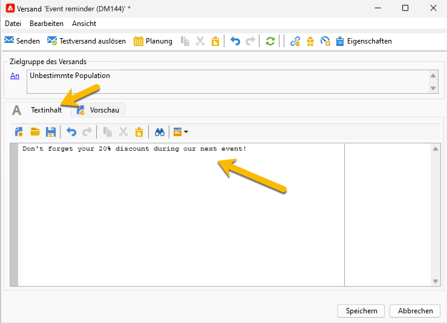

# SMS-Inhalt {#sms-content}

So konfigurieren Sie den Inhalt Ihres SMS-Versands:

1. Geben Sie den Inhalt Ihrer Nachricht im Assistenten für den **[!UICONTROL Textinhalt]** ein.

   {zoomable="yes"}

1. Sie können Ihre Nachricht personalisieren, indem Sie Personalisierungsfelder (z. B. den Vornamen) oder vordefinierte Personalisierungsblöcke (z. B. Grußformeln) einfügen. Sie können auf die Schaltfläche „Personalisierung“ klicken, um diese hinzuzufügen:

   {zoomable="yes"}

   Nachdem Sie auf **[!UICONTROL Empfänger]** > **[!UICONTROL Vorname]** geklickt haben, wird die Personalisierung wie folgt aussehen:

   {zoomable="yes"}

1. Sie können eine Vorschau Ihres Versands anzeigen, indem Sie auf der Registerkarte **[!UICONTROL Vorschau]** auf die Dropdown-Liste **[!UICONTROL Personalisierung testen]** klicken und in der Tabelle **[!UICONTROL Empfänger]** einen eine Empfängerin oder einen Empfänger auswählen.

   {zoomable="yes"}

   Dann wird die Vorschau Ihrer SMS mit der Personalisierung angezeigt:

   {zoomable="yes"}

>[!NOTE]
>
>* Bei Verwendung der Code-Seite „Latin-1 (ISO-8859-1)“ ist die Länge von SMS auf 160, bei Unicode auf 70 Zeichen begrenzt. Gewisse Sonderzeichen können sich auf die Länge der Nachricht auswirken. Weitere Informationen zur Nachrichtenlänge finden Sie im Abschnitt [Transliteration von SMS-Zeichen](smpp-external-account.md#smpp-channel-settings).
>
>* Wenn die Nachricht Personalisierungsfelder oder bedingte Inhalte enthält, kann die Länge von Empfänger zu Empfänger variieren. Daher sollte die Länge jeweils nach erfolgter Personalisierung ausgewertet werden.
>
>*Während der Analysephase wird die Nachrichtenlänge geprüft und im Falle eines Überschreitens ein Warnhinweis erzeugt.

Nachdem Sie den Inhalt Ihres Versands erstellt haben, können Sie [Ihre Zielgruppe auswählen](sms-audience.md).
