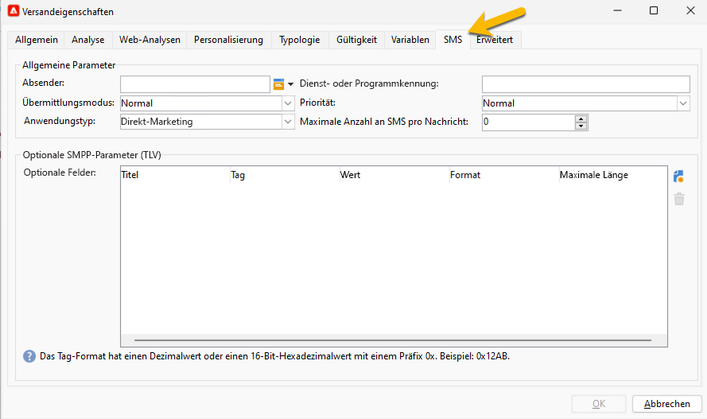
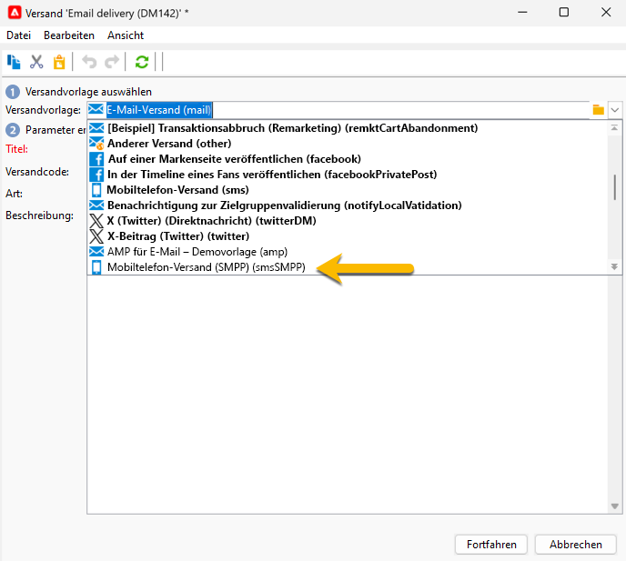
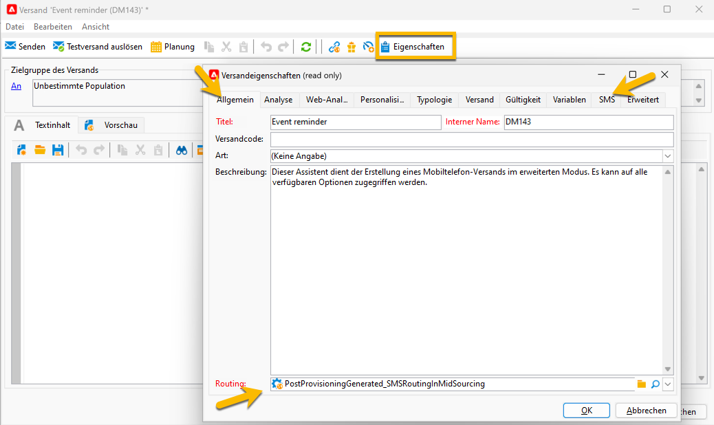

# SMS-Versandeinstellungen {#sms-settings}

>[!IMPORTANT]
>
>Diese Dokumentation gilt für Adobe Campaign v8.7.2 und höher.
>
>Für ältere Versionen lesen Sie die [Dokumentation zu Campaign Classic v7](https://experienceleague.adobe.com/de/docs/campaign-classic/using/sending-messages/sending-messages-on-mobiles/sms-set-up/sms-set-up).

Die folgenden technischen Einstellungen werden für einen SMS-Versand benötigt:

* Das Routing: [das externe SMPP-Konto](smpp-external-account.md#smpp-connection-settings)

* 

Sie können all diese Einrichtungen in einer Versandvorlage vornehmen, sodass Sie die Einstellungen nicht für jede SMS-Versanderstellung festlegen müssen.

## Konfigurieren der Registerkarte **[!UICONTROL SMS]** {#sms-tab}

{zoomable="yes"}

Hier finden Sie die Informationen, die Sie zum Ausfüllen dieses Formulars benötigen. Jedes Feld wird nachfolgend erläutert:

* **[!UICONTROL Absenderadresse]**

  Dieses Feld ist optional. Es ermöglicht das Überschreiben der Absenderadresse (oADC). Der Inhalt dieses Felds wird im Feld *source_addr* der SUBMIT_SM-PDU eingefügt.

  Das Feld ist durch die SMPP-Spezifikation auf 21 Zeichen begrenzt, einige Provider können jedoch längere Werte zulassen. Beachten Sie auch, dass in einigen Ländern sehr strenge Einschränkungen gelten können (Länge, Inhalt, zulässige Zeichen usw.), sodass Sie möglicherweise nochmals prüfen müssen, ob der von Ihnen hier platzierte Inhalt legal ist. Seien Sie besonders vorsichtig bei der Verwendung personalisierter Felder.

  Bleibt das entsprechende Feld leer, wird stattdessen der im externen Konto festgelegte Wert des Felds „Anrufernummer“ verwendet. Wenn beide Werte leer sind, bleibt das Feld *source_addr* leer.

* **[!UICONTROL Dienst- oder Programm-ID]**

  >[!NOTE]
  >
  >Von der Verwendung dieser Funktion wird abgeraten. Optionale SMPP-Parameter bieten eine wesentlich flexiblere Implementierung.
  >
  >Die beiden Funktionen können nicht gleichzeitig verwendet werden.

  Ermöglicht in Kombination mit der entsprechenden Einstellung des externen Kontos das Senden eines optionalen Parameters mit jedem MT. Dieses Feld definiert den Werteteil des TLV.

* **[!UICONTROL Übermittlungsmodus]**

  Dieses Feld gibt die Art der SMS an, die Sie übertragen möchten: Normale oder Flash-Nachrichten, Speicherung auf dem Mobilgerät oder der SIM-Karte. Diese Einstellung wird im optionalen Feld „dest_addr_subunit“ in der SUBMIT_SM-PDU übertragen.

   * **Flash** setzt den Wert auf 1. Es wird eine Flash-Nachricht gesendet, die auf dem Mobiltelefon angezeigt und nicht im Speicher abgelegt wird.
   * **Normal** setzt den Wert auf 0. Es wird eine normale Nachricht gesendet.
   * **Auf Mobilgerät speichern** setzt den Wert auf 2. Das Telefon wird angewiesen, die SMS im internen Speicher abzulegen.
   * **Auf Gerät speichern** setzt den Wert auf 3. Das Telefon wird angewiesen, die SMS auf der SIM-Karte zu speichern.

* **[!UICONTROL Priorität, Kommunikationstyp]**

  Diese Felder werden vom erweiterten SMPP-Connector ignoriert.

* **[!UICONTROL Maximale Anzahl an SMS pro Nachricht]**

  Diese Einstellung funktioniert nur, wenn die Einstellung „Nachrichten-Payload“ deaktiviert ist (weitere Informationen finden Sie in den Einstellungen für das externe Konto). Wenn die Nachricht mehr SMS erfordert, als dieser Wert angibt, wird ein Fehler ausgelöst.

  Das SMS-Protokoll begrenzt SMS auf 255 Teile. Allerdings haben einige Mobiltelefone Probleme, lange Nachrichten mit mehr als zehn Teilen zusammenzustellen (die Begrenzung hängt vom genauen Modell ab). Wenn Sie sicher gehen möchten, überschreiten Sie nicht fünf Teile pro Nachricht.

  Aufgrund der Funktionsweise personalisierter Nachrichten in Adobe Campaign können die Nachrichtengrößen variieren. Daher kann eine Vielzahl sehr langer Nachrichten die Versandkosten erheblich erhöhen: Durch die Festlegung eines angemessenen Werts können diese Kosten gesenkt werden.

  Wenn Sie den Wert 0 angeben, wird der Grenzwert deaktiviert.

* **[!UICONTROL Optionale SMPP-Parameter (TLV)]**
Sie können zusätzliche Felder angeben, die als optionale SMPP-Parameter (TLV) gesendet werden sollen. Diese zusätzlichen Felder werden mit jedem MT gesendet und personalisierte Felder ermöglichen es, unterschiedliche Werte für jeden MT zu haben.
Die Tabelle enthält optionale Parameter, die mit jeder Nachricht gesendet werden können. Spalten enthalten die folgenden Informationen:
   * **Titel**: Dies ist ein optionaler, frei formulierter Titel. Er wird nicht an den Provider übermittelt. Sie können eine Textbeschreibung des Parameters angeben.
   * **Tag**: der Tag-Wert im Dezimalformat (z. B. 12345) oder im Hexadezimalformat mit 0x-Präfix (z. B. 0x12ab). Tags können zwischen 0 und 65535 liegen. Fragen Sie den SMPP-Dienstleister, welche Tags unterstützt werden
   * **Wert**: Der Wert, der im optionalen Parameter gesendet werden soll. Dies ist ein personalisiertes Feld.
   * **Format**: Für den Parameter verwendete Codierung. Sie können eine beliebige unterstützte Textcodierung oder die gängigsten Binärformate auswählen. Erfragen Sie das benötigte Format beim SMPP-Dienstleister.
   * **Maximale Länge**: Die maximale Anzahl an Bytes für diesen Parameter. Diese wird bei binären Feldern ignoriert, da binäre Felder eine feste Größe haben.

* **[!UICONTROL Verwenden von Binärformaten für TLV]**

  Campaign unterstützt das Senden von TLV im Binärformat. Die Binärdatei ist auf das Senden von Nummern beschränkt.

  Da bei personalisierten Feldern immer Text ausgegeben wird, muss das personalisierte Feld eine Dezimaldarstellung der Zahl enthalten (eine beliebige Zeichenfolge ist zulässig, solange sie nur Ziffern enthält). Die Werte können sowohl signiert als auch nicht signiert sein. Die Personalisierungs-Engine konvertiert sie einfach in die richtige binäre Darstellung.

  Bei Verwendung von Binärformaten deaktivieren die Sonderwerte „(leere Zeichenfolge)“, „null“ und „undefined“ das Feld vollständig, ohne einen Fehler auszulösen. In diesen 3 Sonderfällen wird das Tag überhaupt nicht übergeben. Dies ermöglicht die Übergabe eines bestimmten TLV nur für einige Nachrichten, wenn sorgfältig erstelltes JavaScript im Personalisierungsfeld verwendet wird.

  >[!NOTE]
  >
  >Binärformate werden immer in Big-Endian-Form codiert.

## Erstellen eines SMS-Versands {#sms-delivery}

Gehen Sie wie folgt vor, um einen neuen SMS-Versand zu erstellen:

1. Erstellen Sie einen neuen Versand, beispielsweise über das Versand-Dashboard oder im Ordner „Versand“ im **[!UICONTROL Explorer]**.  Er wird standardmäßig mit „E-Mail-Versand“ bezeichnet.

1. Wählen Sie die für Ihre SMS-Sendungen erstellte Versandvorlage aus. [Weitere Informationen finden Sie hier](sms-mid-sourcing.md#sms-delivery-template).

   {zoomable="yes"}

<!-- * For standalone instance,  [learn more here](sms-standalone-instance.md#sms-delivery-template).
* For mid-sourcing infrastructure, -->

1. Benennen Sie Ihren Versand im Feld **[!UICONTROL Titel]** um und fügen Sie Informationen im Feld **[!UICONTROL Versandcode]** und in der Liste **[!UICONTROL Art]** hinzu, falls dies für das Tracking erforderlich ist. Sie können auch eine **[!UICONTROL Beschreibung]** zu Ihrem Versand hinzufügen.

1. Klicken Sie auf die Schaltfläche **[!UICONTROL Weiter]** . Jetzt haben Sie alle Einstellungen Ihrer Vorlage in Ihrem Versand.

1. Sie können über die Schaltfläche **[!UICONTROL Eigenschaften]** prüfen, ob alles nach Bedarf eingerichtet ist. [Weitere Informationen zur Registerkarte „SMS“](#sms-tab)

{zoomable="yes"}

Jetzt können Sie Ihren [SMS-Inhalt](sms-content.md) konfigurieren.
