# SMS in einer Mid-Sourcing-Infrastruktur {#sms-mid}

>[!AVAILABILITY]
>
>Diese Funktion steht allen Campaign FDA-Umgebungen zur Verfügung. Sie **nicht** für Campaign FFDA-Bereitstellungen verfügbar. Diese Dokumentation gilt für Adobe Campaign Version 8.7.2 und höher. Informationen zum Wechsel vom alten zum neuen SMS-Connector finden Sie in dieser [Technote](https://experienceleague.adobe.com/docs/campaign/technotes-ac/tn-new/sms-migration){target="_blank"}
>
>Für ältere Versionen lesen Sie die [Dokumentation zu Campaign Classic v7](https://experienceleague.adobe.com/de/docs/campaign-classic/using/sending-messages/sending-messages-on-mobiles/sms-set-up/sms-set-up){target="_blank"}.

Für SMS-Sendungen mit einer Mid-Sourcing-Infrastruktur ist Folgendes erforderlich:

1. Eine SMS-Benutzerin oder ein SMS-Benutzer auf dem Mid-Server. [Hier erfahren Sie, wie Sie sie oder ihn erstellen.](#sms-operator-mid)
1. Ein externes SMS-Konto auf dem Marketing-Server, das die zuvor erstelle Benutzerin bzw. den zuvor erstellten Benutzer verwendet. [Hier erfahren Sie, wie Sie es erstellen.](#sms-external-account)
1. Ein externes SMPP-Konto auf dem Mid-Server, das den Kanal und den Mid-Sourcing-Versandmodus angibt. [Hier erfahren Sie, wie Sie es erstellen.](#smpp-external-account-mid)
1. Eine Versandvorlage, die auf das externe Konto verweist, um den Versandprozess zu optimieren. [Hier erfahren Sie, wie Sie sie erstellen.](#sms-delivery-template)

## Erstellen der SMS-Benutzerin oder des SMS-Benutzers auf dem Mid-Server {#sms-operator-mid}

Sie müssen zunächst eine SMS-Benutzerin oder einen SMS-Benutzer auf dem Mid-Server erstellen, die bzw. der vom externen SMS-Konto auf dem Marketing-Server verwendet wird.

Um einen eine neue SMS-Benutzerin oder einen neuen SMS-Benutzer zu erstellen, gehen Sie wie folgt vor:

1. Klicken Sie unter **[!UICONTROL Administration]** > **[!UICONTROL Zugriffsverwaltung]** > **[!UICONTROL Benutzer]** auf **[!UICONTROL Neu]** und füllen Sie das Formular im neu geöffneten Fenster aus.

   * **[!UICONTROL Name (Login)]** und **[!UICONTROL Titel]** sind obligatorisch.
   * Das Kennwort ist nicht obligatorisch, wird aber aus Gründen der Sicherheit dringend empfohlen.

   Beachten Sie, dass „Name (Login)“ später verwendet wird, um Ihr externes SMPP-Konto auf dem Mid-Server zu benennen.

   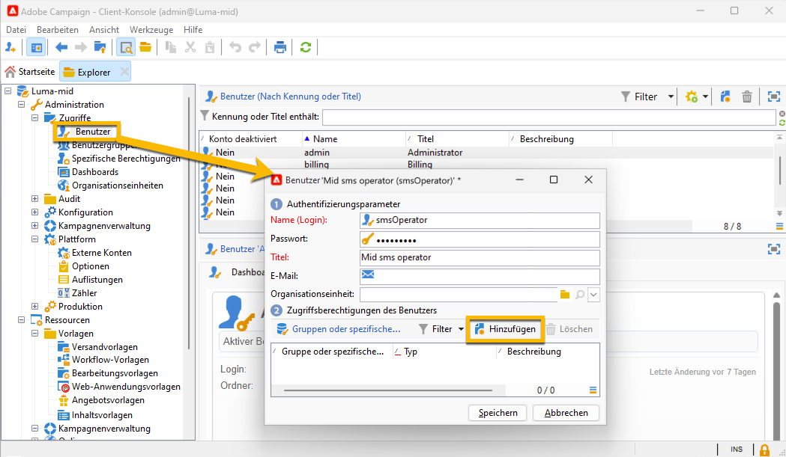{zoomable="yes"}

1. Klicken Sie im Teil **[!UICONTROL Gruppen und spezifische Berechtigungen]** auf die Schaltfläche **[!UICONTROL Hinzufügen]**.
Wählen Sie im sich öffnenden neuen Fenster in der Liste **[!UICONTROL Ordner]** die Option **[!UICONTROL Spezifische Berechtigungen]** und dann in der rechten Liste **[!UICONTROL ADMINISTRATION]** aus.

1. Klicken Sie auf die Schaltfläche **[!UICONTROL OK]**.

   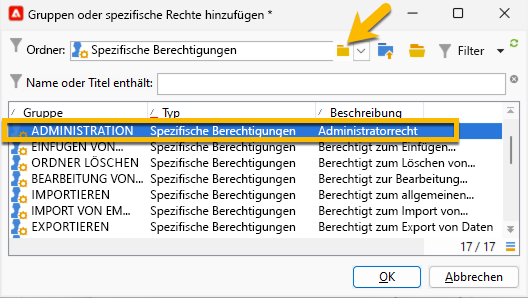{zoomable="yes"}

1. Klicken Sie auf die Schaltfläche **[!UICONTROL Speichern]**, um die Erstellung der SMS-Benutzerin bzw. des SMS-Benutzers abzuschließen.

   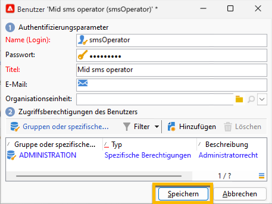{zoomable="yes"}

Sie können sie bzw. ihn jetzt in der Benutzerliste sehen.

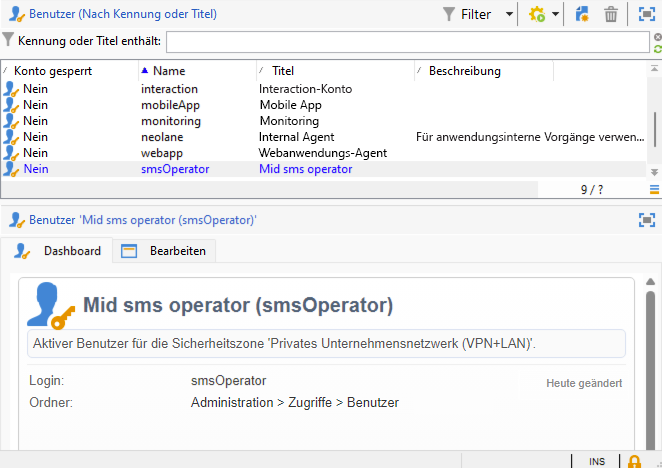{zoomable="yes"}

## Erstellen eines externen SMS-Kontos auf dem Marketing-Server {#sms-external-account}

In einer Mid-Infrastruktur müssen Sie wie unten gezeigt ein externes SMS-Konto auf dem Marketing-Server erstellen

>[!IMPORTANT]
>
>Die Verwendung desselben Kontos und Kennworts für mehrere externe SMS-Konten kann zu Konflikten und Überschneidungen zwischen den Konten führen. Weitere Informationen finden Sie auf der [Seite „SMS-Fehlerbehebung“](smpp-connection.md#sms-troubleshooting).

1. Klicken Sie unter **[!UICONTROL Administration]** > **[!UICONTROL Plattform]** > **[!UICONTROL Externe Konten]** auf das Symbol **[!UICONTROL Neu]**.

   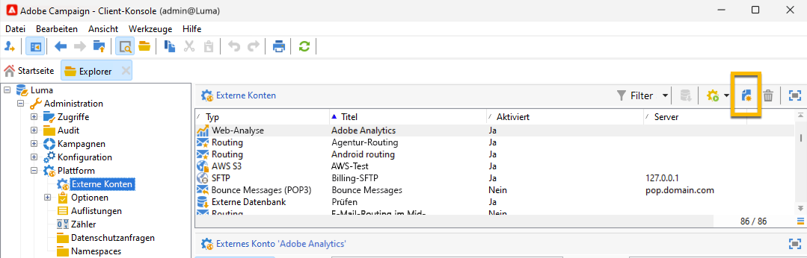{zoomable="yes"}

1. Legen Sie den **[!UICONTROL Titel]** und den **[!UICONTROL internen Namen]** Ihres externen Kontos fest. Definieren Sie den Kontotyp als **[!UICONTROL Routing]**, aktivieren Sie das Feld **[!UICONTROL Aktiviert]** und wählen Sie **[!UICONTROL Mobiltelefon (SMS)]** als Kanal sowie **[!UICONTROL Mid-Sourcing]** als Versandmodus aus.

   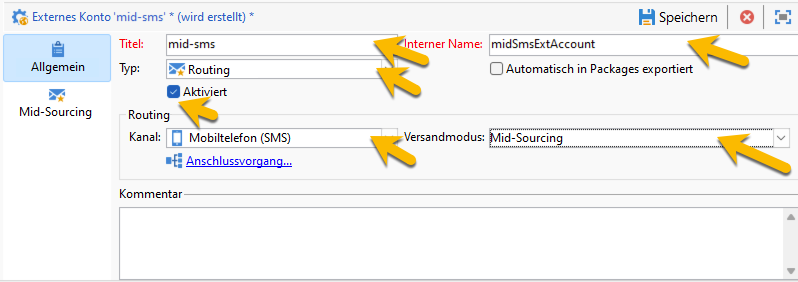{zoomable="yes"}

1. Füllen Sie auf der Registerkarte **[!UICONTROL Mid-Sourcing]** das Formular mit der URL des Mid-Sourcing-Servers und der bzw. dem zuvor auf dem Mid-Sourcing-Server erstellten SMS-Benutzerin bzw. SMS-Benutzer aus.

   Bestätigen Sie die Verbindung, indem Sie auf die Schaltfläche **[!UICONTROL Verbindung testen]** klicken.

   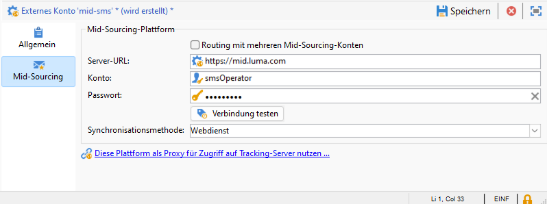{zoomable="yes"}

1. Klicken Sie auf **[!UICONTROL Speichern]**.

## Erstellen eines externen SMPP-Kontos auf dem Mid-Server {#smpp-external-account-mid}

>[!IMPORTANT]
>
>Die Verwendung desselben Kontos und Kennworts für mehrere externe SMS-Konten kann zu Konflikten und Überschneidungen zwischen den Konten führen. Siehe die [Seite zur SMS-Fehlerbehebung](smpp-connection.md#sms-troubleshooting).

Das Ziel besteht nun darin, Ihr externes SMPP-Konto auf dem Mid-Server einzurichten.

Gehen Sie dazu wie folgt vor:

1. Klicken Sie auf dem Mid-Server unter **[!UICONTROL Administration]** > **[!UICONTROL Plattform]** > **[!UICONTROL Externe Konten]** auf das Symbol **[!UICONTROL Neu]**.

1. Legen Sie den **[!UICONTROL Titel]** und den **[!UICONTROL internen Namen]** Ihres externen Kontos fest.

   >[!WARNING]
   >
   >Beim Zuweisen eines internen Namens müssen Sie die angegebene Namenskonvention befolgen: `SMS Operator Name_Internal Name of the Marketing SMS external account`.
   >

   Definieren Sie den Kontotyp als **[!UICONTROL Routing]**, aktivieren Sie das Feld **[!UICONTROL Aktiviert]** und wählen Sie **[!UICONTROL Mobiltelefon (SMS)]** als Kanal sowie **[!UICONTROL Gebündelter Versand]** als Versandmodus aus.
   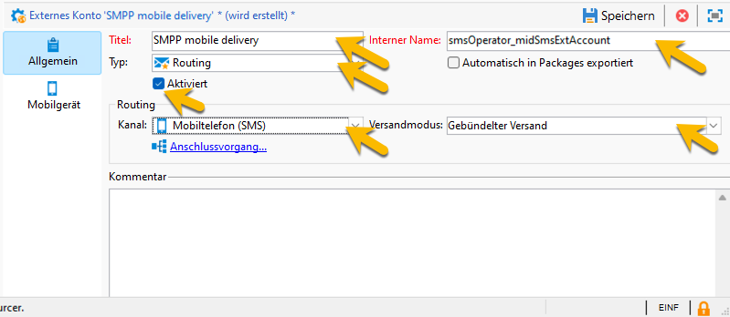{zoomable="yes"}

1. Wählen Sie auf der Registerkarte **[!UICONTROL Mobiltelefon]** aus der Dropdown-Liste **[!UICONTROL Connector]** die Option **[!UICONTROL Erweitertes allgemeines SMPP]** aus.

   Das Feld **[!UICONTROL Nachrichten über einen speziellen Prozess senden]** ist standardmäßig aktiviert.

   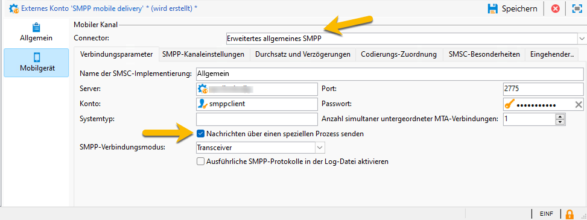{zoomable="yes"}

   Um die Verbindung einzurichten, müssen Sie die Registerkarten dieses Formulars ausfüllen. Weitere Informationen über das externe SMPP-Konto finden Sie [hier](smpp-external-account.md#smpp-connection-settings).

## Konfigurieren der Versandvorlage {#sms-delivery-template}

Um die Erstellung Ihres SMS-Versands zu erleichtern, erstellen Sie eine SMS-Versandvorlage, in der auf alle Ihre Einstellungen verwiesen wird.

Klicken Sie auf dem Marketing-Server unter **[!UICONTROL Ressourcen]** > **[!UICONTROL Vorlagen]** > **[!UICONTROL Versandvorlagen]** mit der rechten Maustaste auf die vorhandene Mobile-Versandvorlage und wählen Sie **[!UICONTROL Duplizieren]** aus.

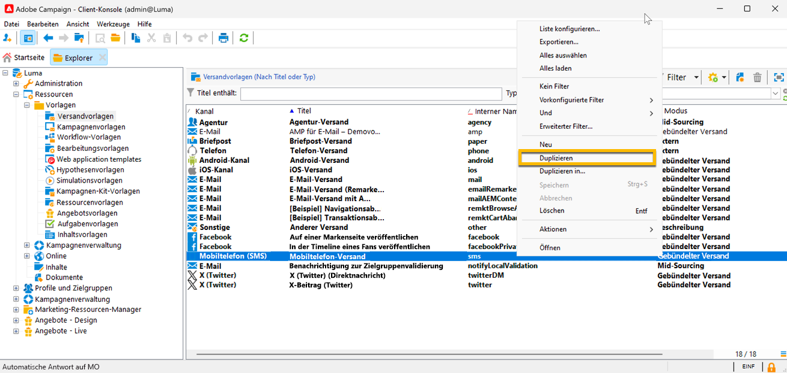{zoomable="yes"}

Ändern Sie den **[!UICONTROL Titel]** und den **[!UICONTROL internen Namen]** Ihrer Vorlage, um sie leicht zu erkennen, und klicken Sie auf die Schaltfläche **[!UICONTROL Eigenschaften]**.

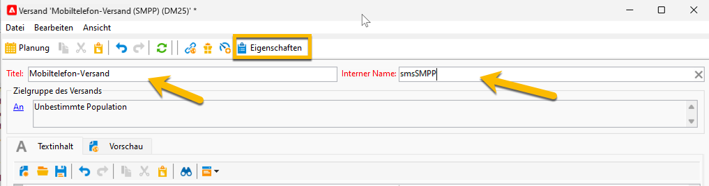{zoomable="yes"}

Wählen Sie auf der Registerkarte **[!UICONTROL Allgemein]** unter **[!UICONTROL Routing]** Ihr externes SMPP-Konto aus.

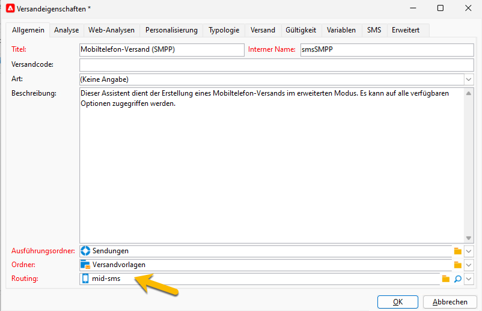{zoomable="yes"}

Auf der Registerkarte **[!UICONTROL SMS]** können Sie optionale Parameter zu Ihrer Vorlage hinzufügen.

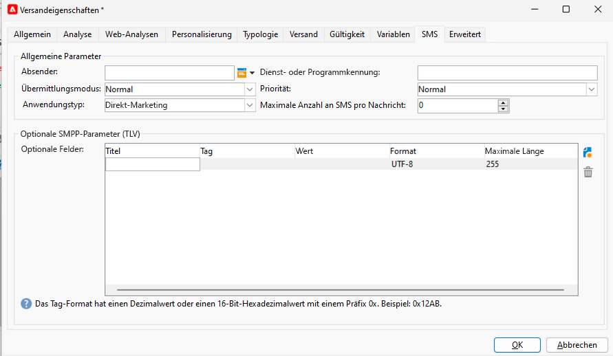{zoomable="yes"}

[Erfahren Sie mehr über die Konfiguration dieser SMS-Registerkarte](sms-delivery-settings.md).
