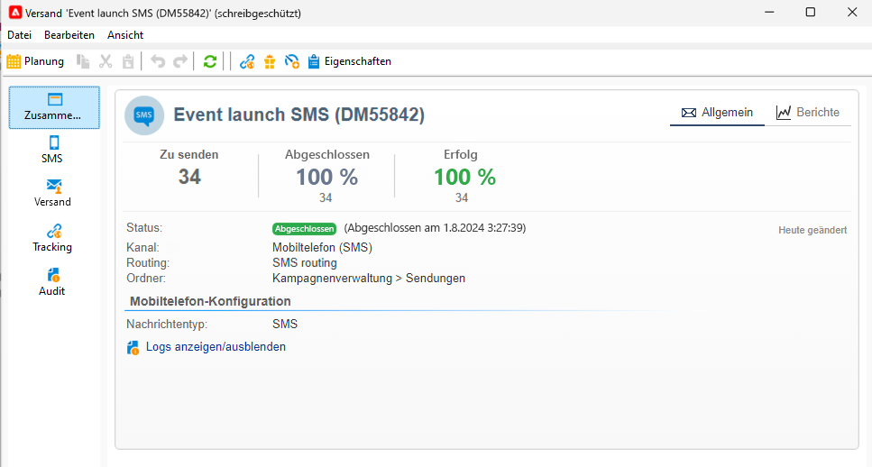
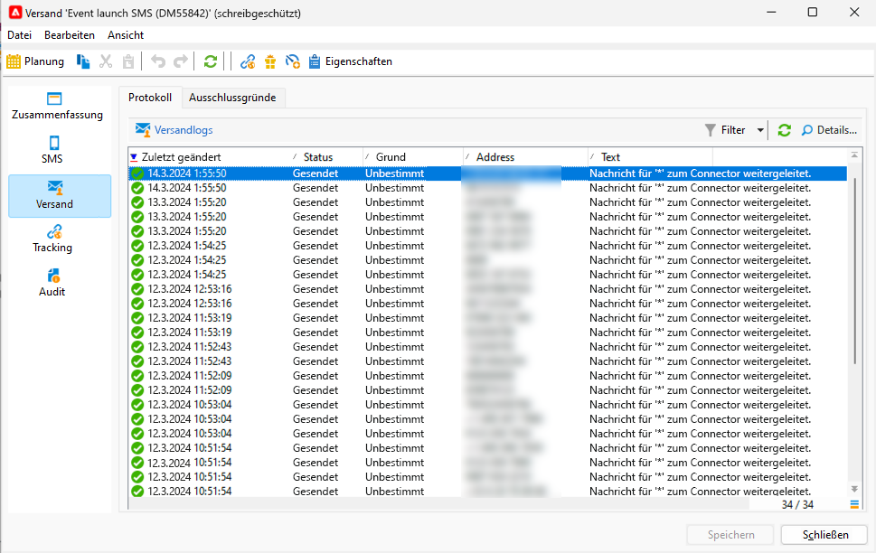
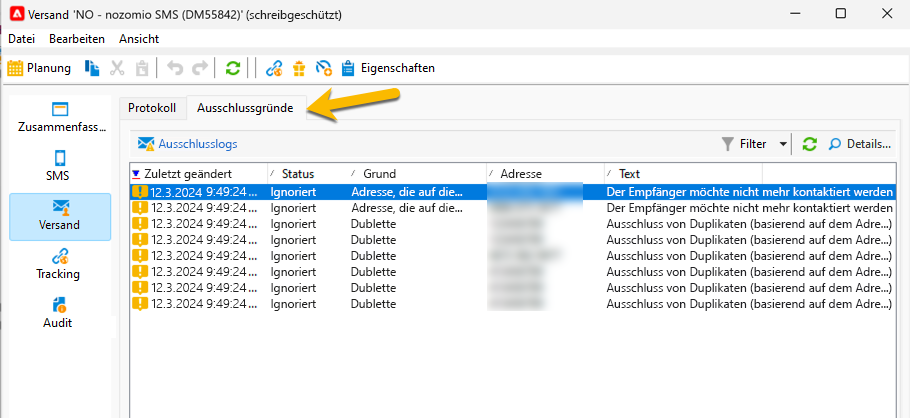
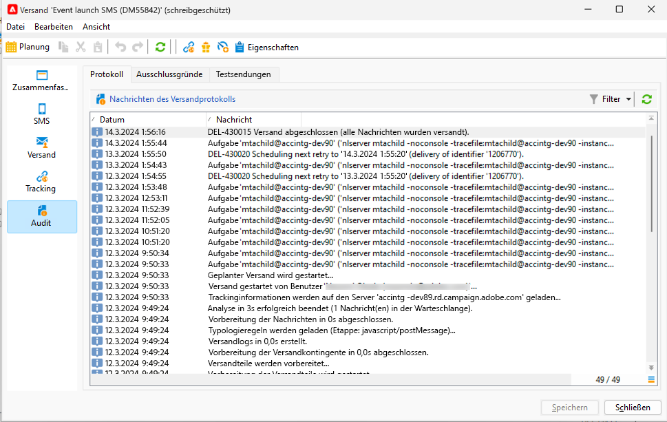

# Überwachen und Verfolgen von SMS

Es ist wichtig, den Versand Ihrer SMS zu überwachen, um die Effizienz Ihrer Marketing-Kampagnen sicherzustellen.

Hier sind die Möglichkeiten, wie Sie wissen können, was nach dem Versand geschieht.

## Verstehen des SMS-Versand-Dashboards

Das Versand-Dashboard bietet Ihnen zahlreiche Informationen zu Ihrer SMS.

Doppelklicken Sie in der Versandliste auf Ihren Versand, um auf das Dashboard zuzugreifen.

Auf der Registerkarte **[!UICONTROL Zusammenfassung]** befinden sich die Hauptdaten wie die Anzahl der verarbeiteten Nachrichten und die Erfolgsanzahl.

{zoomable="yes"}

Nach dem Versand der SMS ist die Registerkarte **[!UICONTROL SMS]**, die sich auf den Inhalt des Versands bezieht, nicht mehr für Änderungen zugänglich.

Auf der Registerkarte **[!UICONTROL Versand]** finden Sie Informationen zu den Versandlogs. Sie können für jede kontaktierte Adresse sehen, ob die SMS gesendet wurde oder nicht.

{zoomable="yes"}

Auf der Registerkarte **[!UICONTROL Ausschlüsse]** finden Sie Details dazu, warum einige Adressen aus der Zielgruppe ausgeschlossen wurden.

{zoomable="yes"}

Auf der Registerkarte **[!UICONTROL Tracking]** finden Sie Informationen zum Tracking. Nachfolgend finden Sie ein Beispiel für eine verfolgte URL im SMS-Inhalt.

{zoomable="yes"}

Und abschließend die Registerkarte **[!UICONTROL Audit]** mit allen Details während des Starts des Versands:

{zoomable="yes"}

## Verstehen von SMS-Fehlschlägen

Die Typen und Ursachen für das Fehlschlagen von SMS sind dieselben wie für E-Mails.

Erfahren Sie mehr über [Versandfehler](../delivery-failures.md) und insbesondere über [SMS-Quarantänen](../delivery-failures.md#sms-quarantines).
