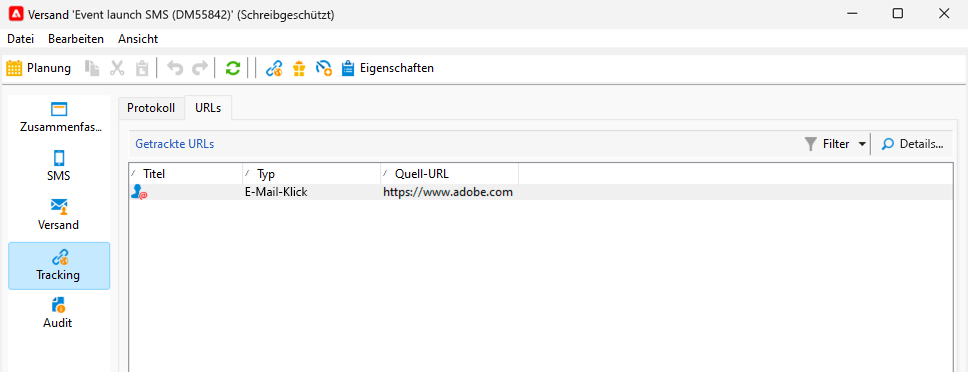

# SMS überwachen und tracken

Es ist wichtig, den SMS-Versand zu überwachen, um sicherzustellen, dass Ihre Marketing-Kampagnen effizient sind.

Hier erfahren Sie, was nach dem Versand der Nachrichten geschieht.

## Das Dashboard des SMS-Versands

Im Versand-Dashboard finden Sie viele Informationen zu Ihrer SMS.

Doppelklicken Sie auf Ihren Versand in der Versandliste, um auf das Dashboard zuzugreifen.

Auf der Registerkarte **[!UICONTROL Zusammenfassung]** befinden sich die Hauptdaten wie die Anzahl der verarbeiteten Nachrichten und die Erfolgsanzahl.

{zoomable="yes"}

Nach dem Versand der SMS ist der Tab **[!UICONTROL SMS]**, der sich auf den Inhalt des Versands bezieht, für eine Änderung nicht mehr zugänglich.

Auf dem Tab **[!UICONTROL Versand]** finden Sie Informationen zu den Versandlogs. Für jede kontaktierte Adresse können Sie sehen, ob die SMS gesendet wurde oder nicht

{zoomable="yes"}

Im Tab **[!UICONTROL Ausschlüsse]** finden Sie Details dazu, warum einige Adressen aus der Zielgruppe ausgeschlossen sind.

{zoomable="yes"}

Auf der Registerkarte **[!UICONTROL Tracking]** wird das Tracking beschrieben. Nachfolgend finden Sie ein Beispiel für eine im SMS-Inhalt getrackte URL.

{zoomable="yes"}

Schließlich enthält der Tab **[!UICONTROL Audit]** alle Details während des Starts des Versands:

{zoomable="yes"}

## Fehlgeschlagene SMS verstehen

Die Fehlertypen und -ursachen für SMS sind dieselben wie für E-Mails.

Erfahren Sie mehr über [Versandfehler](../delivery-failures.md) und insbesondere über [SMS-Quarantänen](../delivery-failures.md#sms-quarantines).

