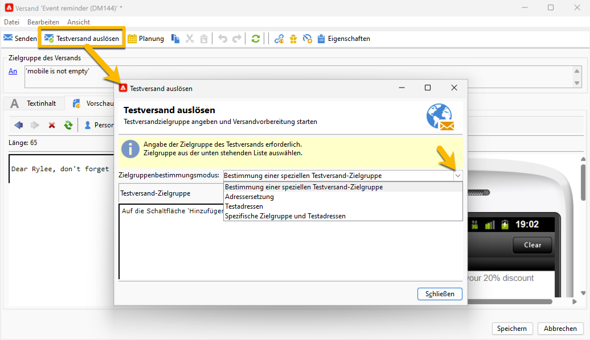
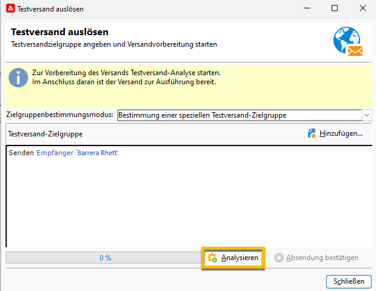
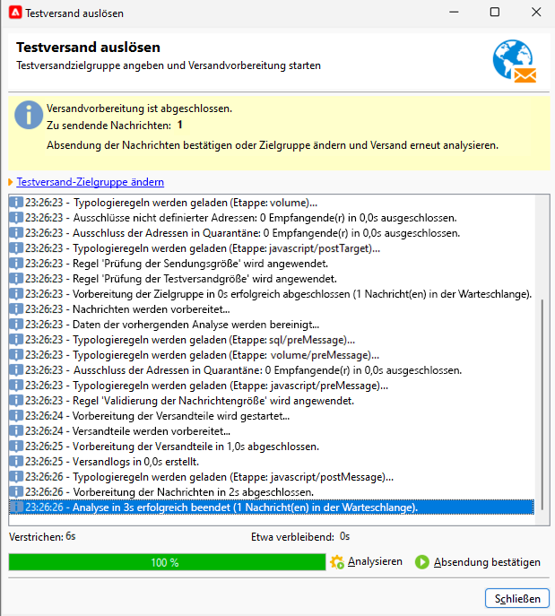

# Durchführen eines SMS-Testversands {#sms-proof}

Adobe empfiehlt ausdrücklich, einen Validierungszyklus für Sendungen einzurichten. Vergewissern Sie sich, dass Ihr Inhalt genehmigt wurde, bevor dieser an Ihre Zielgruppe gesendet wird.

Sie können einen Testversand für Ihren SMS-Versand durchführen, um ihn zu validieren:

1. Klicken Sie dazu auf die Schaltfläche **[!UICONTROL Testversand erzeugen]**. Daraufhin wird das folgende Fenster geöffnet:

   {zoomable="yes"}

   Es stehen mehrere Modi für einen Testversand zur Verfügung:

   * **[!UICONTROL Bestimmung einer speziellen Testversand-Zielgruppe]**: Ermöglicht Abfragen, die die Adressen in der Datenbank als Testversand-Zielgruppe filtern.
   * **[!UICONTROL Adressersetzung]**: Ermöglicht die Eingabe von Testadressen und Validierung des Inhalts mithilfe der Zielgruppen-Empfängerdaten. Die Ersatzadressen können manuell eingegeben oder aus der Dropdown-Liste ausgewählt werden. Die zugehörige Auflistung ist die **[!UICONTROL Ersatzadresse (rcpAddress)]**.
Standardmäßig wird die Ersetzung nach dem Zufallsprinzip durchgeführt. Sie können jedoch über das **[!UICONTROL Detail]**-Symbol eine bestimmte Empfängerin oder einen bestimmten Empfänger aus der Hauptzielgruppe auswählen.
   * **[!UICONTROL Testadressen]**: Ermöglicht den Zugriff auf Testadressen als Testversand-Zielgruppe. Diese Adressen können aus einer Datei importiert oder manuell eingegeben werden.
   * **[!UICONTROL Spezifische Zielgruppe und Testadressen]**: Ermöglicht die Kombination von Testadressen und Adressen von Empfängerinnen und Empfängern.

1. Fügen Sie nach Auswahl des gewünschten **[!UICONTROL Zielgruppenbestimmungsmodus]** Ihre Testadressen entsprechend hinzu.

   Im folgenden Beispiel wird **[!UICONTROL Bestimmung einer speziellen Testversand-Zielgruppe]** ausgewählt und eine Empfängerin bzw. ein Empfänger hinzugefügt:

   {zoomable="yes"}

1. Wählen Sie die Schaltfläche **[!UICONTROL Analysieren]** aus.
Adobe Campaign führt die gesamte Kontrolle aus, bevor der Testversand validiert wird. Am Ende der Analyse kann auf die Schaltfläche **[!UICONTROL Absendung bestätigen]** geklickt werden.

   {zoomable="yes"}

1. Um den SMS-Testversand durchzuführen, klicken Sie auf die Schaltfläche **[!UICONTROL Absendung bestätigen]**.

Wenn alles in Ordnung ist, können Sie fortfahren und [den SMS-Versand an die Zielgruppe durchführen](sms-audience.md).
