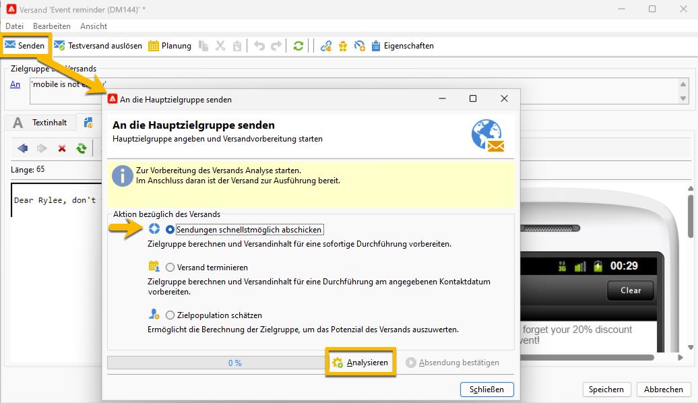
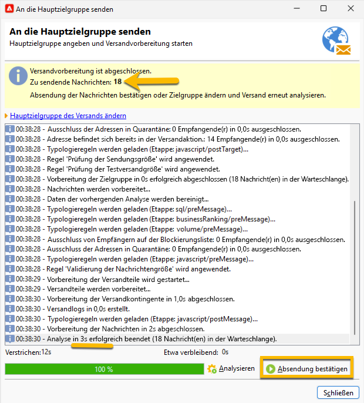

# SMS-Versand an die Audience senden {#sms-send-audience}

Nach Validierung Ihrer SMS können Sie diese nun an die Audience senden.

1. Klicken Sie auf die Schaltfläche **[!UICONTROL Senden]** .
Wählen Sie im sich öffnenden Fenster die für Sie geeignete Aktion aus.

   Im folgenden Beispiel wählen wir **[!UICONTROL Senden Sie es so bald wie möglich]**, die Schaltfläche **[!UICONTROL Analysieren]** wurde angezeigt. Wir klicken auf die Schaltfläche **[!UICONTROL Analysieren]**.

   {zoomable="yes"}

   Adobe Campaign führt die gesamte Kontrolle aus, bevor der Testversand validiert wird. Dort sehen Sie die tatsächliche Menge der Audience. Am Ende der Analyse ist die Schaltfläche **[!UICONTROL Versand bestätigen]** angeklickt.

   {zoomable="yes"}

1. Um Ihren SMS-Versand an die Audience zu senden, wählen Sie die Schaltfläche **[!UICONTROL Versand bestätigen]** aus.
