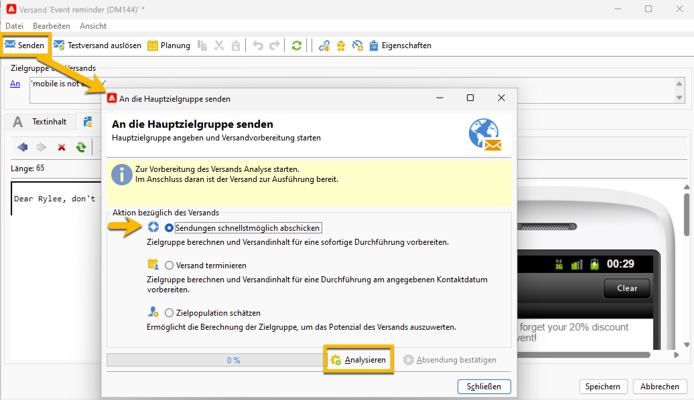
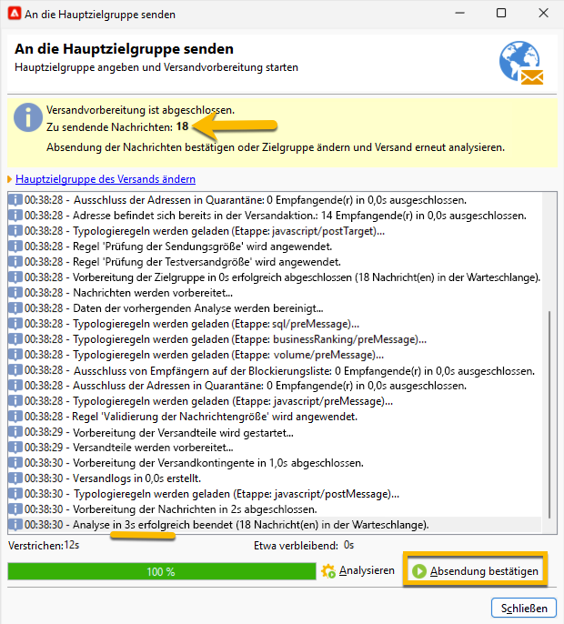

# Durchführen eines SMS-Versands an die Zielgruppe {#sms-send-audience}

Nach Validierung Ihrer SMS können Sie diese nun an die entsprechende Zielgruppe senden.

1. Klicken Sie auf die Schaltfläche **[!UICONTROL Senden]**.
Wählen Sie im daraufhin geöffneten Fenster die für Sie geeignete Aktion aus.

   Im folgenden Beispiel wird durch Auswahl von **[!UICONTROL Sendungen schnellstmöglich abschicken]** die Schaltfläche **[!UICONTROL Analysieren]** angezeigt. Klicken Sie auf die Schaltfläche **[!UICONTROL Analysieren]**.

   {zoomable="yes"}

   Adobe Campaign führt die gesamte Kontrolle aus, bevor der Testversand validiert wird. Es wird dabei der tatsächliche Umfang der Zielgruppe angezeigt. Am Ende der Analyse kann auf die Schaltfläche **[!UICONTROL Absendung bestätigen]** geklickt werden.

   {zoomable="yes"}

1. Um den SMS-Versand an die Zielgruppe durchzuführen, klicken Sie auf die Schaltfläche **[!UICONTROL Absendung bestätigen]**.
