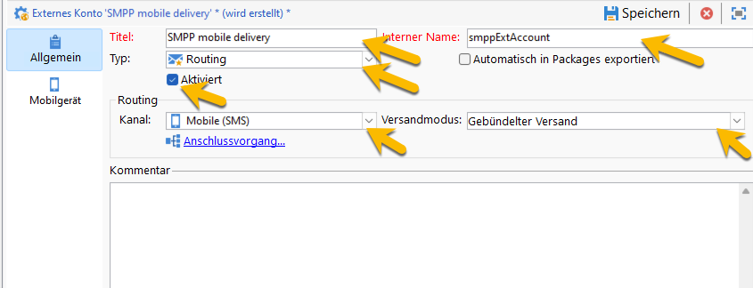
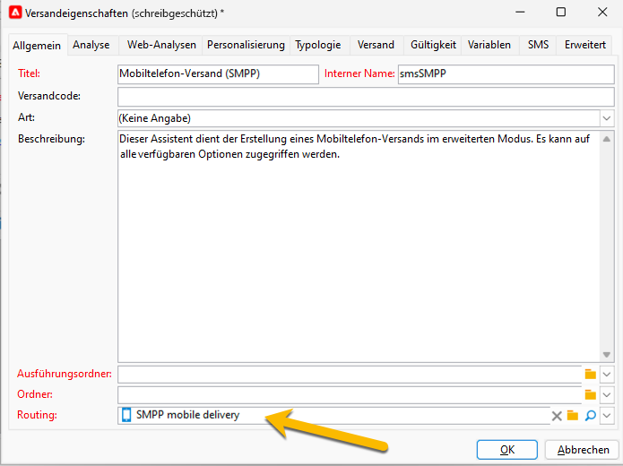

# SMS in einer eigenständigen Instanz {#sms-standalone}

>[!IMPORTANT]
>
>Diese Dokumentation gilt für Adobe Campaign v8.7.2 und höher.
>
>Für ältere Versionen lesen Sie die [Dokumentation zu Campaign Classic v7](https://experienceleague.adobe.com/de/docs/campaign-classic/using/sending-messages/sending-messages-on-mobiles/sms-set-up/sms-set-up).

In einer eigenständigen Instanz erfordert das Senden eines SMS-Versands Folgendes:

1. Ein **externes Konto**, das einen Connector und den Nachrichtentyp angibt. [Weitere Informationen finden Sie hier](#external-account).

1. Eine **Versandvorlage**, die auf das externe Konto Bezug nimmt. [Weitere Informationen finden Sie hier](#sms-delivery-template).

## Erstellen eines externen Kontos {#external-account}

>[!IMPORTANT]
>
>Die Verwendung desselben Kontos und Kennworts für mehrere externe SMS-Konten kann zu Konflikten und Überschneidungen zwischen den Konten führen. Weitere Informationen finden Sie auf der [Seite „SMS-Fehlerbehebung“](smpp-connection.md#sms-troubleshooting).

Im Folgenden werden die Schritte zum Erstellen Ihres externen SMPP-Kontos beschrieben:

1. Klicken Sie unter **[!UICONTROL Administration]** > **[!UICONTROL Plattform]** > **[!UICONTROL Externe Konten]** auf das Symbol **[!UICONTROL Neu]**.

   {zoomable="yes"}

1. Legen Sie den **[!UICONTROL Titel]** und den **[!UICONTROL internen Namen]** Ihres externen Kontos fest. Definieren Sie den Kontotyp als **[!UICONTROL Routing]**, aktivieren Sie das Feld **[!UICONTROL Aktiviert]**, wählen Sie **[!UICONTROL Mobiltelefon (SMS)]** als Kanal und **[!UICONTROL Gebündelter Versand]** als Versandmodus aus.

   {zoomable="yes"}

1. Wählen Sie auf der Registerkarte **[!UICONTROL Mobiltelefon]** aus der Dropdown-Liste **[!UICONTROL Connector]** die Option **[!UICONTROL Erweitertes allgemeines SMPP]** aus.
Das Kästchen **[!UICONTROL Nachrichten über einen speziellen Prozess senden]** ist standardmäßig aktiviert.

   {zoomable="yes"}

   Um die Verbindung einzurichten, müssen Sie die Registerkarten dieses Formulars ausfüllen. Weitere Informationen über das externe SMPP-Konto finden Sie [hier](smpp-external-account.md#smpp-connection-settings).

## Konfigurieren der Versandvorlage {#sms-delivery-template}

Um die Erstellung Ihres SMS-Versands zu erleichtern, erstellen Sie eine SMS-Versandvorlage, in der auf Ihr externes SMPP-Konto verwiesen wird.

Klicken Sie unter **[!UICONTROL Ressourcen]** > **[!UICONTROL Vorlagen]** > **[!UICONTROL Versandvorlagen]** mit der rechten Maustaste auf die vorhandene Mobiltelefon-Versandvorlage und wählen Sie **[!UICONTROL Duplizieren]** aus.

{zoomable="yes"}

Ändern Sie den **[!UICONTROL Titel]** und den **[!UICONTROL internen Namen]** Ihrer Vorlage, um sie leicht zu erkennen, und klicken Sie auf die Schaltfläche **[!UICONTROL Eigenschaften]**.

{zoomable="yes"}

Wählen Sie auf der Registerkarte **[!UICONTROL Allgemein]** unter **[!UICONTROL Routing]** Ihr externes SMPP-Konto aus.

{zoomable="yes"}

Auf der Registerkarte **[!UICONTROL SMS]** können Sie optionale Parameter zu Ihrer Vorlage hinzufügen.

{zoomable="yes"}

[Erfahren Sie mehr über die Konfiguration dieser SMS-Registerkarte](sms-delivery-settings.md).
