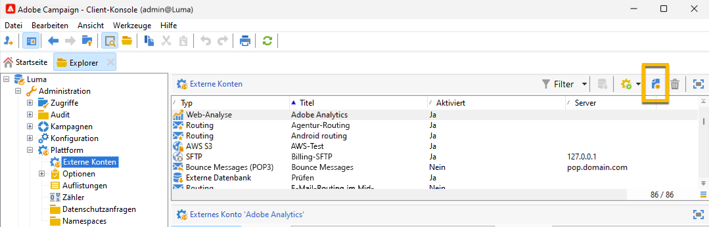

# SMS in einer eigenständigen Instanz {#sms-standalone}

>[!IMPORTANT]
>
>Diese Dokumentation gilt für Adobe Campaign v8.7.2 und höher.
>
>Für ältere Versionen lesen Sie bitte die [Campaign Classic v7-Dokumentation](https://experienceleague.adobe.com/en/docs/campaign-classic/using/sending-messages/sending-messages-on-mobiles/sms-set-up/sms-set-up).

In einer eigenständigen Instanz erfordert das Senden eines SMS-Versands Folgendes:

1. Ein **externes Konto**, das einen Connector und den Nachrichtentyp angibt, [Weitere Informationen finden Sie hier](#external-account)

1. Eine **Versandvorlage**, in der auf dieses externe Konto verwiesen wird, [Weitere Informationen finden Sie hier](#sms-delivery-template) .

## Externes Konto erstellen {#external-account}

>[!IMPORTANT]
>
>Die Verwendung desselben Kontos und Kennworts für mehrere externe SMS-Konten kann zu Konflikten und Überschneidungen zwischen den Konten führen. Weitere Informationen finden Sie auf der Seite [SMS-Fehlerbehebung](smpp-connection.md#sms-troubleshooting).

Im Folgenden finden Sie die Schritte zum Erstellen Ihres externen SMPP-Kontos:

1. Klicken Sie in **[!UICONTROL Administration]** > **[!UICONTROL Plattform]** > **[!UICONTROL Externe Konten]** auf das Symbol **[!UICONTROL Neu]** .

   {zoomable="yes"}

1. Richten Sie den **[!UICONTROL Titel]** und den **[!UICONTROL internen Namen]** Ihres externen Kontos ein. Definieren Sie den Kontotyp als &quot;**[!UICONTROL Routing]**&quot;, aktivieren Sie das Feld &quot;**[!UICONTROL Aktiviert]**&quot;, wählen Sie &quot;**[!UICONTROL Mobiltelefon (SMS)]**&quot; für den Kanal und &quot;**[!UICONTROL Gebündelter Versand]**&quot; für den Versandmodus.

   {zoomable="yes"}

1. Behalten Sie auf der Registerkarte **[!UICONTROL Mobil]** den Eintrag **[!UICONTROL Erweitertes allgemeines SMPP]** in der Dropdownliste **[!UICONTROL Connector]** bei.
Das Kontrollkästchen **[!UICONTROL Nachrichten über einen dedizierten Prozess senden]** ist standardmäßig aktiviert.

   {zoomable="yes"}

   Um die Verbindung einzurichten, müssen Sie die Registerkarten dieses Formulars ausfüllen. Weitere Informationen finden Sie unter [ mehr über das externe SMPP-Konto](smpp-external-account.md#smpp-connection-settings).

## Versandvorlage konfigurieren {#sms-delivery-template}

Um die Erstellung Ihres SMS-Versands zu erleichtern, erstellen Sie eine SMS-Versandvorlage, in der auf Ihr externes SMPP-Konto verwiesen wird.

Klicken Sie in &quot;**[!UICONTROL Ressourcen]**&quot;> &quot;**[!UICONTROL Vorlagen]**&quot;> &quot;**[!UICONTROL Versandvorlagen]**&quot; mit der rechten Maustaste auf die vorhandene Vorlage für den mobilen Versand und wählen Sie &quot;**[!UICONTROL Duplizieren]**&quot;.

{zoomable="yes"}

Ändern Sie die **[!UICONTROL Beschriftung]** und den **[!UICONTROL internen Namen]** Ihrer Vorlage, um sie leicht zu erkennen, und klicken Sie auf die Schaltfläche **[!UICONTROL Eigenschaften]** .

{zoomable="yes"}

Wählen Sie auf der Registerkarte **[!UICONTROL Allgemein]** in **[!UICONTROL Routing]** Ihr externes SMPP-Konto aus.

{zoomable="yes"}

Auf der Registerkarte **[!UICONTROL SMS]** können Sie optionale Parameter zu Ihrer Vorlage hinzufügen.

{zoomable="yes"}

[Erfahren Sie mehr über diese Konfiguration der Registerkarte &quot;SMS&quot;](sms-delivery-settings.md).
