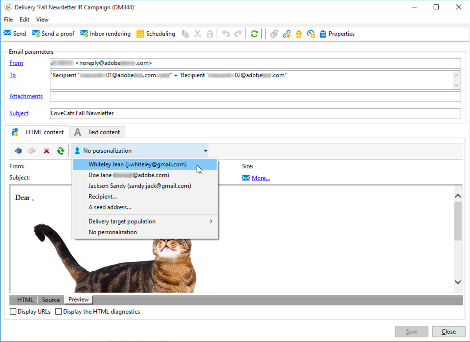
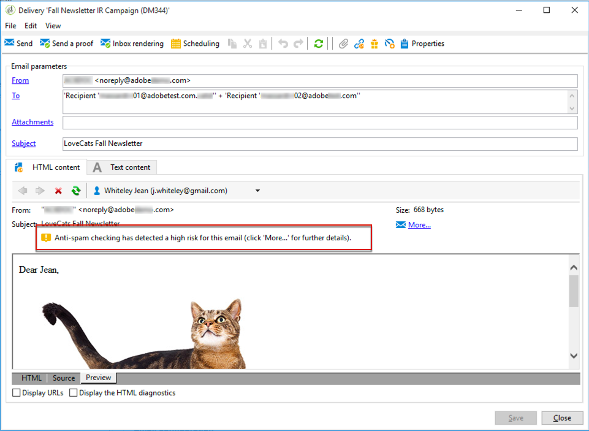
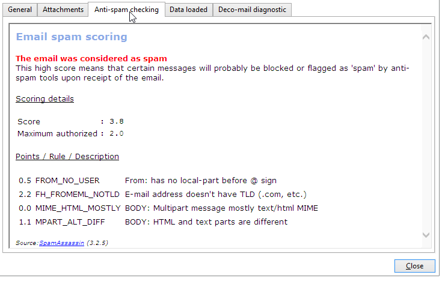

# SpamAssassin{#spamassassin}

Adobe Campaign kann für die Verwendung mit [SpamAssassin](https://spamassassin.apache.org){target="_blank"} konfiguriert werden, einem Drittanbieterdienst, der zum Filtern von E-Mail-Spam verwendet wird. Auf diese Weise können Sie E-Mails bewerten, um festzustellen, ob bei einer Nachricht das Risiko besteht, dass sie von den Anti-Spam-Tools, die beim Empfang verwendet werden, als Spam eingestuft wird.

SpamAssassin nutzt eine Vielzahl von Spam-Erkennungs-Methoden, darunter:

* Spam-Erkennung auf der Basis des DNS und der unscharfen Prüfsumme
* Bayes&#39;sche Filtertechnologie
* Externe Programme
* Blockierungslisten
* Online-Datenbanken

>[!NOTE]
>
>SpamAssassin muss auf dem Adobe Campaign-Anwendungs-Server installiert und konfiguriert werden. Weitere Informationen erhalten Sie von Ihrem Adobe-Support-Mitarbeiter.
>
>Die Regeln, mit denen bestimmt wird, ob ein Element Spam ist oder nicht, werden über SpamAssassin verwaltet und können von einem Administrator mit den entsprechenden Berechtigungen bearbeitet werden.

## Verwenden von SpamAssassin in Campaign {#using-spamassassin}

Nachdem Sie Ihren E-Mail-Versand erstellt und seinen Inhalt definiert haben, folgen Sie den unten stehenden Schritten, um die Risiken auszuwerten.

Weiterführende Informationen zum Erstellen und Entwerfen eines Versands finden Sie auf dieser [Seite](defining-the-email-content.md).

1. Gehen Sie zum Tab **[!UICONTROL Vorschau]**.
1. Wählen Sie einen Empfänger aus, um Ihren Versand in der Vorschau zu betrachten.

   

   >[!NOTE]
   >
   >Wenn Sie keinen Empfänger auswählen, kann die Anti-Spam-Prüfung nicht durchgeführt werden.

1. Eine Warnmeldung gibt das Ergebnis des Tests aus. Wenn ein hohes Risiko festgestellt wird, wird die folgende Warnmeldung angezeigt:

   

1. Wählen Sie den Link **[!UICONTROL Details...]** neben dem Warnhinweis aus.
1. Wählen Sie den Tab **[!UICONTROL Anti-Spam-Prüfung]** aus.
1. Gehen Sie zum Bereich **[!UICONTROL Punktzahl/Regel/Beschreibung]**, um sich die Gründe für das Risiko anzusehen.

   

>[!NOTE]
>
>Jedes Mal, wenn Sie auf **[!UICONTROL Anti-Spam-Überprüfung]** klicken, wird der SpamAssassin-Dienst aufgerufen und die Nachricht wird erneut auf Anti-Spam-Erkennung analysiert. Stellen Sie sicher, dass Sie Ihren Inhalt geändert haben, bevor Sie die Anti-Spam-Analyse erneut ausführen.
