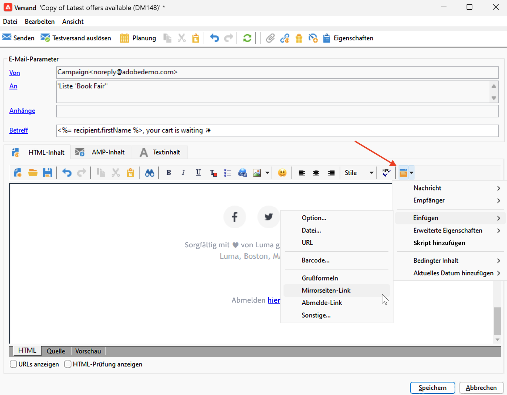

# Testen des Nachrichten-Trackings {#testing-tracking}

Bevor Sie den Versand an Ihre gesamte Zielgruppe senden, müssen Sie die Tracking-Funktion testen, um sicherzustellen, dass alle Links ordnungsgemäß funktionieren und Tracking-Daten ordnungsgemäß erfasst werden. Dieser Verifizierungsprozess hilft Ihnen, Tracking-Probleme zu identifizieren und zu beheben, bevor Ihre Kampagne live geht, und verhindert potenzielle Probleme mit Linkumleitungen, dem Laden von Tracking-Pixeln oder der Datenerfassung.

Durch das Testen des Trackings haben Sie folgende Möglichkeiten:

* Stellen Sie sicher, dass alle Links in Ihrer Nachricht korrekt getrackt und ordnungsgemäß umgeleitet werden
* Bestätigen Sie, dass der Mirrorseiten-Link funktioniert und verfolgt wird
* Sicherstellen, dass die Tracking-Pixel für das Öffnungs-Tracking korrekt geladen werden
* Überprüfen, ob personalisierte Parameter in URLs korrekt erfasst werden
* Überprüfen, ob der technische Tracking-Workflow Daten korrekt verarbeitet

Gehen Sie wie folgt vor, um das Tracking auf Mirrorseiten, E-Mail-Protokollen und Links zu testen:

## Schritt 1: Erstellen eines Testversands {#create-test-delivery}

1. Erstellen Sie einen neuen E-Mail-Versand, der zum Testen verwendet wird. [Weitere Informationen zum Erstellen eines Versands](../start/create-message.md)
1. Gestalten Sie Ihren E-Mail-Inhalt mit Links, die Sie verfolgen möchten. [Erfahren Sie mehr über das Design von E-Mail-Inhalten](defining-the-email-content.md)
1. Fügen Sie dem E-Mail-Inhalt einen Gestaltungsbaustein für die Mirrorseite hinzu. [Erfahren Sie mehr über Gestaltungsbausteine](personalization-blocks.md)

   

1. Geben Sie den Empfänger der E-Mail an. Da dieser Benutzer die E-Mail öffnen und auf die darin enthaltenen Links klicken muss, müssen Sie sicherstellen, dass Sie eine Testempfängeradresse auswählen, die Sie steuern. [Erfahren Sie mehr über Testprofile](../audiences/test-profiles.md)

## Schritt 2: Durchführen des Testversands {#send-test}

1. Stellen Sie sicher, dass das Tracking in den Versandeinstellungen aktiviert ist:
   * Öffnen Sie **[!UICONTROL Eigenschaften]** Ihres Versands
   * Gehen Sie zum Abschnitt **[!UICONTROL Tracking und Bilder]**
   * Stellen Sie sicher **[!UICONTROL dass „Tracking aktivieren]** aktiviert ist
   * Stellen Sie sicher **[!UICONTROL dass „Öffnungs-]**&quot; aktiviert ist, wenn Sie Öffnungen verfolgen möchten

   

[Weitere Informationen zu URL-Tracking-Optionen](url-tracking.md)

1. Senden Sie den Versand an die Empfängerin bzw. den Empfänger des Tests. [Erfahren Sie mehr über das Senden von Sendungen](configure-and-send.md)

## Schritt 3: Tracking-Funktion überprüfen {#verify-tracking}

1. Öffnen Sie die E-Mail nach Erhalt und klicken Sie auf den Link Mirrorseite . [Erfahren Sie mehr über Mirrorseiten](mirror-page.md)
1. Klicken Sie auf verschiedene Links in der E-Mail, um Tracking-Daten zu generieren.
1. Wenn Sie korrekt zur Mirrorseite umgeleitet wurden, greifen Sie auf den Ordner **[!UICONTROL Administration > Produktion > Technische Workflows]** zu. [Erfahren Sie mehr über Workflows](../config/workflows.md)
1. Öffnen Sie den **[!UICONTROL Tracking]**-Workflow.
1. Starten Sie den Workflow oder klicken Sie mit der rechten Maustaste auf die Aktivität **[!UICONTROL Planung]** und wählen Sie **[!UICONTROL Aufgabe jetzt ausführen]**.
1. Warten Sie etwa 30 Sekunden, bis der Workflow die Trackinglogs verarbeitet.
1. Wählen Sie die **[!UICONTROL Audit]** des Workflows aus. Stellen Sie sicher, dass mindestens ein Trackinglog-Eintrag gefunden wird. Falls Sie keine neuen Logs sehen, klicken Sie auf **[!UICONTROL Aktualisieren]**.

1. Überprüfen Sie die Trackinglogs im Versand:
   * Zurück zum Versand
   * Wählen Sie die Registerkarte **[!UICONTROL Tracking]** aus
   * Überprüfen Sie, ob die Liste der Trackinglogs mit den angeklickten URLs und anderen Trackingereignissen angezeigt wird.

   

## Schritt 4: Registerkarte „Empfängerverfolgung“ überprüfen {#check-recipient-tracking}

1. Navigieren Sie zur Profilseite des Empfängers, den Sie für den Test verwendet haben. [Erfahren Sie mehr über das Anzeigen von Profilen](../audiences/view-profiles.md)
   * Standardmäßig befindet sich die Profilseite des Empfängers im Ordner **[!UICONTROL Profile und Zielgruppen > Empfänger]**.

1. Wählen Sie die Registerkarte **[!UICONTROL Tracking]** aus. [Erfahren Sie mehr über Trackinglogs](tracking-logs.md)

   

1. Vergewissern Sie sich, dass Tracking-Datensätze angezeigt werden mit:
   * Der Wert **[!UICONTROL Mirrorseite]** in der Spalte **[!UICONTROL Typ]**
   * **[!UICONTROL Öffnen]**-Werte in der Spalte **[!UICONTROL Typ]** für E-Mail-Öffnungen
   * **[!UICONTROL E-Mail]** Klick-Werte in der Spalte **[!UICONTROL Typ]** für Link-Klicks

## Fehlerbehebung bei Tracking-Tests {#troubleshooting-tracking-test}

Wenn die Trackinglogs nicht angezeigt werden:

1. **Versandeinstellungen überprüfen**: Wechseln Sie zum Versand und greifen Sie auf dessen **[!UICONTROL Eigenschaften]** zu, um sicherzustellen, dass **[!UICONTROL Tracking aktivieren]** und **[!UICONTROL Tracking öffnen]** aktiviert sind. [Erfahren Sie mehr über URL-Tracking-Optionen](url-tracking.md)

1. **Tracking-Workflow überprüfen**: Stellen Sie sicher, **[!UICONTROL der technische Workflow Tracking]** fehlerfrei ausgeführt wird. [Erfahren Sie mehr über die Fehlerbehebung beim Tracking-Workflow](tracking-logs.md#check-tracking-workflow)

1. **URL-Format überprüfen**: Überprüfen Sie, ob Ihre URLs korrekt formatiert sind und in Trennzeichen eingeschlossen sind. [Erfahren Sie mehr über die Konfiguration getrackter Links](tracked-links.md)

1. **Verhalten des E-Mail-Clients überprüfen**: Einige E-Mail-Clients blockieren möglicherweise Tracking-Pixel oder ändern Links. Versuchen Sie, mit verschiedenen E-Mail-Clients zu testen. [Erfahren Sie mehr über Best Practices beim Versand](../start/delivery-best-practices.md)

1. **Auf Verarbeitung warten**: Der Tracking-Workflow wird standardmäßig stündlich ausgeführt. Wenn Sie sie manuell Trigger durchführen, lassen Sie der Ergebnisprüfung genügend Zeit für die Verarbeitung. [Erfahren Sie mehr über Trackinglogs](tracking-logs.md)

## Verwandte Themen {#related-topics}

* [Erfahren Sie, wie Sie verfolgte Links konfigurieren](tracked-links.md)
* [Erfahren Sie, wie Sie auf Trackinglogs zugreifen](tracking-logs.md)
* [Verstehen von Tracking-Berichten](../reporting/delivery-reports.md#tracking-indicators)

