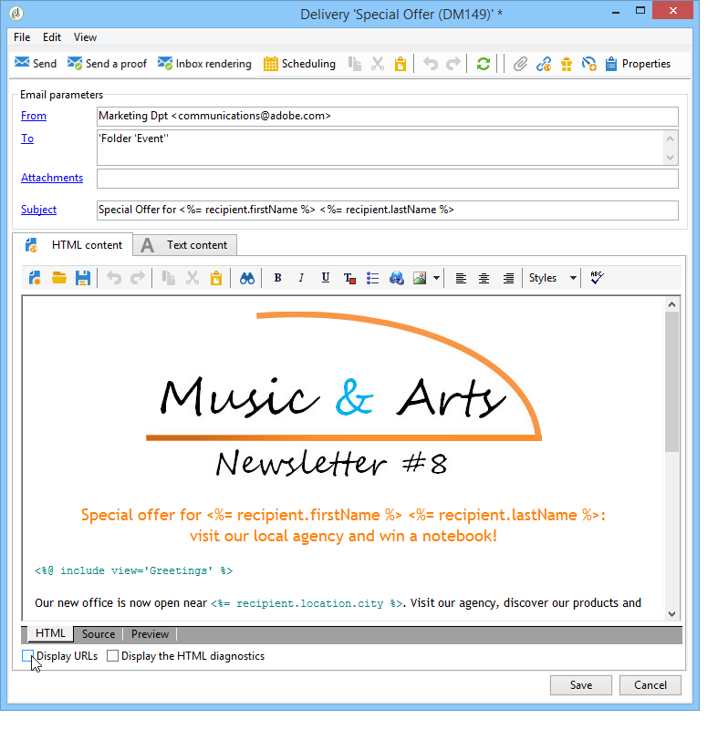
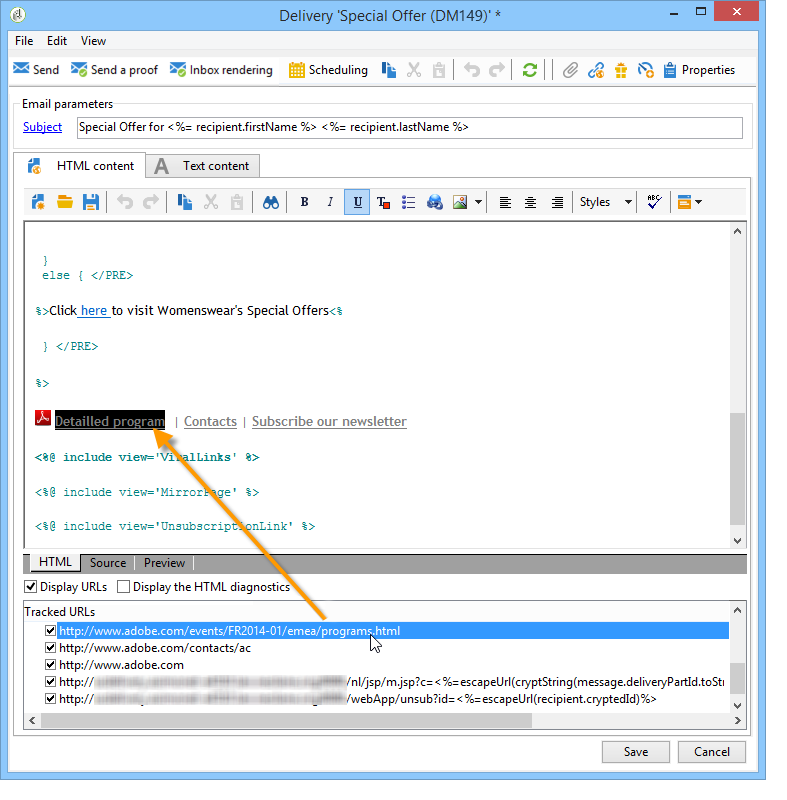
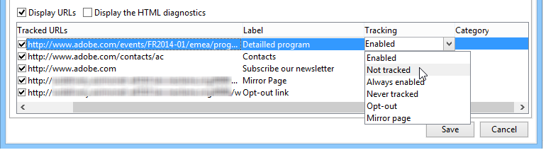

# Konfigurieren getrackter Links {#how-to-configure-tracked-links}

Für jeden Versand können Sie den Empfang von Nachrichten und die Aktivierung der im Nachrichteninhalt eingefügten Links verfolgen. Auf diese Weise können Sie das Verhalten von Empfängern verfolgen, die den Aktionen folgen, auf die sie abzielten.

>[!NOTE]
>
>Die Links in E-Mail-Inhalten, die eine Personalisierung enthalten, benötigen eine bestimmte Syntax, um nachverfolgt zu werden. Weitere Informationen dazu, wie Sie Links in personalisierbaren E-Mails hinzufügen, die das Tracking unterstützen, finden [ in diesem Abschnitt](personalized-links.md).

Das Nachverfolgen von Nachrichten ist standardmäßig aktiviert. Gehen Sie wie folgt vor, um das Tracking von URLs zu personalisieren:

1. Wählen Sie die Option **[!UICONTROL URLs anzeigen]** im unteren Bereich des Versandassistenten unter dem Nachrichtentext aus.

   

   Sobald Sie eine URL in der Liste der getrackten URLs markieren, wird sie im Versandinhalt optisch hervorgehoben. (Dies gilt nicht für den Mirrorseite-Link und den Abmelde-Link, die zum Standard-Package der Anwendung gehören.)

   

1. Aktivieren oder deaktivieren Sie das Tracking für jede in der Nachricht enthaltene URL.

   >[!IMPORTANT]
   >
   >Wenn die URL des Links als Titel verwendet wird, empfiehlt es sich, das Tracking zu deaktivieren, damit die Nachricht nicht wegen des Verdachts auf Phishing zurückgewiesen wird.
   >
   >Wenn beispielsweise die URL www.adobe.com in die Nachricht eingefügt und das Tracking dafür aktiviert wird, wird der Inhalt des Hypertext-Links in https://nlt.adobe.net/r/?id=xxxxxx geändert. Dies bedeutet, dass es von Empfänger-Nachrichten-Clients als betrügerisch betrachtet werden kann.

1. Der Tracking-Titel kann angepasst werden. Doppelklicken Sie auf den zu ändernden Titel und geben Sie den neuen Titel ein.

   >[!NOTE]
   >
   >Die Kennzeichnungen der getrackten URLs und der Kennzeichnungen können geändert werden, um das Lesen von Informationen beim Verfolgen von Sendungen zu vereinfachen. Bei der Berechnung der Klickanzahl werden zwei URLs oder zwei Bezeichnungen mit demselben Namen hinzugefügt.

1. Sie können den gewünschten Tracking-Modus in der Spalte **[!UICONTROL Tracking]** ändern. Wählen Sie dazu einen neuen Modus wie unten dargestellt aus.

   

   Für jede einzelne URL können Sie den Tracking-Modus auf einen dieser Werte festlegen.

   * **[!UICONTROL Aktiviert]**: Aktiviert das Tracking dieser URL.
   * **[!UICONTROL Nicht aktiviert]** Deaktiviert das Tracking dieser URL.
   * **[!UICONTROL Immer aktiviert]** Das Tracking dieser URL wird immer aktiviert. Diese Informationen werden gespeichert, sodass das Tracking der URL automatisch aktiviert wird, wenn sie das nächste Mal in einem zukünftigen Nachrichteninhalt erneut angezeigt wird.
   * **[!UICONTROL Nie verfolgt]**: Das Tracking dieser URL wird nie aktiviert. Diese Informationen werden gespeichert, sodass das Tracking der URL automatisch deaktiviert wird, wenn sie in einer zukünftigen Nachricht erneut angezeigt wird.
   * **[!UICONTROL Opt-out]**: Diese URL wird als Opt-out-URL behandelt.
   * **[!UICONTROL Mirrorseite]**: Diese URL wird als Mirrorseite behandelt.

1. Zusätzlich können Sie für jede getrackte URL in der Dropdown-Liste der Spalte **[!UICONTROL Kategorie]** eine Kategorie auswählen. Diese Kategorien können in Berichten angezeigt werden, wie z. B. im Bericht **[!UICONTROL URLs und Clickstreams]** (siehe [diesen Abschnitt](../reporting/delivery-reports.md#urls-and-click-streams)). Kategorien werden in einer bestimmten Auflistung definiert: **[!UICONTROL urlCategory]**. Weitere Informationen zum Arbeiten mit Auflistungen finden Sie in [ Abschnitt ](../config/enumerations.md).

## Best Practices für URL-Trennzeichen {#url-delimiters}

Es wird dringend empfohlen, URLs auf der Registerkarte **[!UICONTROL Textinhalt]** in Trennzeichen einzuschließen, bevor Sie die Tracking-Formel anwenden. Die URL-Trennzeichen, die Sie auf dieser Registerkarte eingeben, werden von Adobe Campaign verwendet, um URLs in Zeichenfolgen zu identifizieren. Sie können diese Trennzeichen-Paare verwenden:

* Runde Klammern ( )
* Eckige Klammern [ ]
* Geschweifte Klammern { }

In diesem Beispiel folgt auf die URL https://www.adobe.com ein Semikolon. Das Semikolon kann von E-Mail-Clients der Empfänger als Teil der URL interpretiert werden. Daher kann der Link beschädigt sein. Um dieses Problem zu vermeiden, können Sie die URL auf eine der folgenden Arten in Trennzeichen einschließen:

* (https://www.adobe.com);
* [https://www.adobe.com];
* {https://www.adobe.com};
