# Erstellen und Veröffentlichen einer Vorlagen für Transaktionsnachrichten{#template-transactional-messages}

Jedes Ereignis kann eine personalisierte Nachricht auslösen. Dazu müssen Sie für jeden Ereignistyp eine passende Nachrichtenvorlage erstellen. Vorlagen enthalten die notwendigen Informationen zur Personalisierung der Transaktionsnachricht. Sie können Vorlagen auch verwenden, um die Vorschau der Nachricht zu testen und einen Testversand an Testadressen zu senden, bevor Sie an die endgültige Zielgruppe versenden.

## Vorlage erstellen{#create-message-template}

Gehen Sie wie folgt vor, um eine Nachrichtenvorlage zu erstellen:

1. Wechseln Sie zum Knoten **[!UICONTROL Message Center > Transaktionsnachrichten-Vorlagen]** im Adobe Campaign-Navigationsbaum.
1. Klicken Sie mit der rechten Maustaste in die Liste der Vorlagen und wählen Sie **[!UICONTROL Neu]** im Kontextmenü aus oder klicken Sie direkt auf die Schaltfläche **[!UICONTROL Neu]** oberhalb der Liste.

   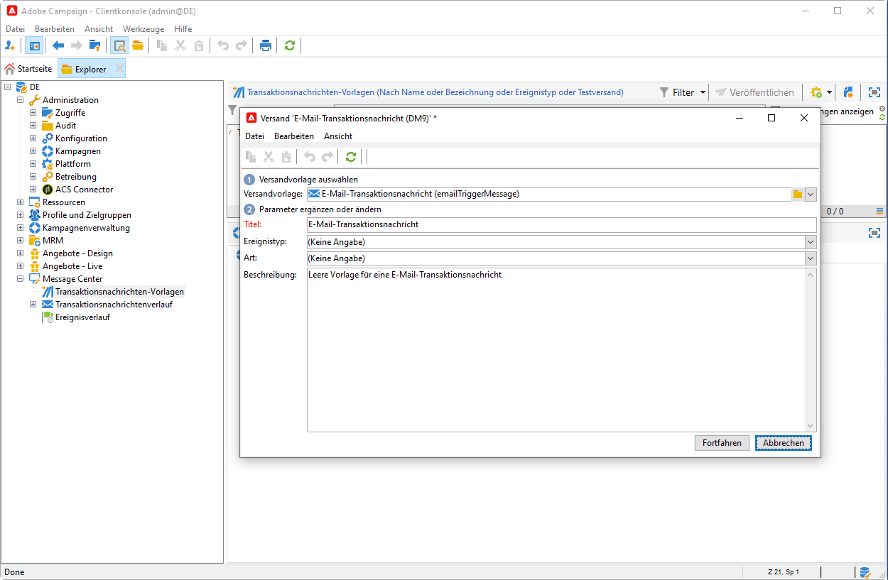

1. Wählen Sie im Versand-Assistenten die Versandvorlage aus, die dem gewünschten Kommunikationskanal entspricht.

   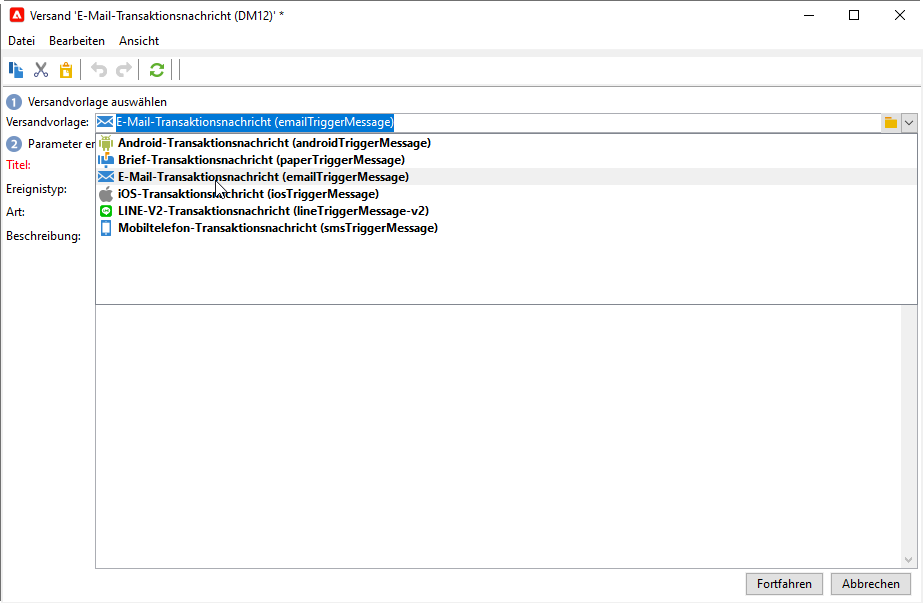

1. Ändern Sie bei Bedarf den Titel.
1. Wählen Sie den Ereignistyp aus, der der zu sendenden Nachricht entspricht. Ereignistypen, die zur Verarbeitung durch Adobe Campaign bestimmt sind, müssen zuvor erstellt werden. [Weitere Informationen](#create-event-types)

   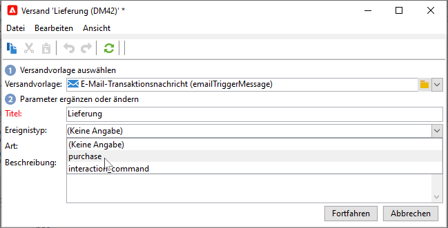

   >[!CAUTION]
   >
   >Ein Ereignistyp sollte nie mit mehr als einer Vorlage verknüpft werden.

1. Geben Sie die Art sowie eine Beschreibung der Vorlage an und klicken Sie auf **[!UICONTROL Fortfahren]**, um den Nachrichteninhalt zu erstellen.

## Inhalt erstellen{#create-message-content}

Die Definition des Inhalts der Transaktionsnachricht entspricht der für alle Sendungen in Adobe Campaign. So können Sie z. B. für einen E-Mail-Versand Inhalte im HTML- oder Textformat erstellen, Anhänge hinzufügen oder das Versandobjekt personalisieren. [Weitere Informationen](../start/create-message.md).

>[!CAUTION]
>
>In Nachrichten enthaltene Bilder müssen öffentlich zugänglich sein. Adobe Campaign verfügt über keinen Mechanismus zum Online-Stellen der Bilder für Transaktionsnachrichten.\
>Im Gegensatz zu JSSP oder webApp bietet `<%=` keine standardmäßige Escape-Funktion.
>
>In diesem Fall müssen Sie alle Daten, die aus dem Ereignis stammen, ordnungsgemäß maskieren. Dieses Escape-Sequenz hängt davon ab, wie dieses Feld verwendet wird. Verwenden Sie beispielsweise innerhalb einer URL encodeURIComponent. Für eine Anzeige im HTML-Code, können Sie escapeXMLString verwenden.

Integrieren Sie nach der Erstellung des Inhalts die Ereignisinformationen in den Nachrichten-Textkörper, um die Nachricht zu personalisieren. Verwenden Sie hierzu die zur Verfügung stehenden Personalisierungsfelder.

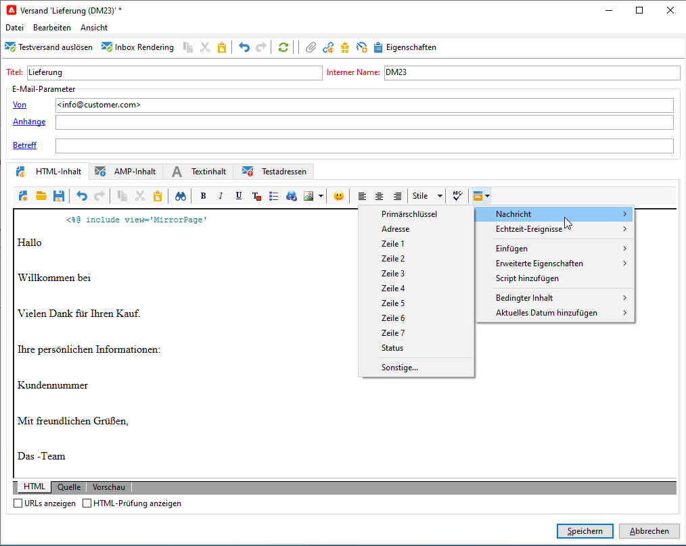

* Alle Personalisierungsfelder stammen aus der Payload.
* Es ist möglich, in einer Transaktionsnachricht auf einen oder mehrere Gestaltungsbausteine zu verweisen. <!--The block content will be added to the delivery content during the publication to the execution instance.-->

Gehen Sie wie folgt vor, um Personalisierungsfelder in einen E-Mail-Nachrichteninhalt einzufügen:

1. Klicken Sie in der Nachrichtenvorlage auf den Tab, der dem E-Mail-Format entspricht (HTML oder Text).
1. Verfassen Sie den Inhalt der Nachricht.
1. Fügen Sie das Personalisierungsfeld mithilfe des Menüs **[!UICONTROL Echtzeit-Ereignisse > Ereignis-XML]** ein.

   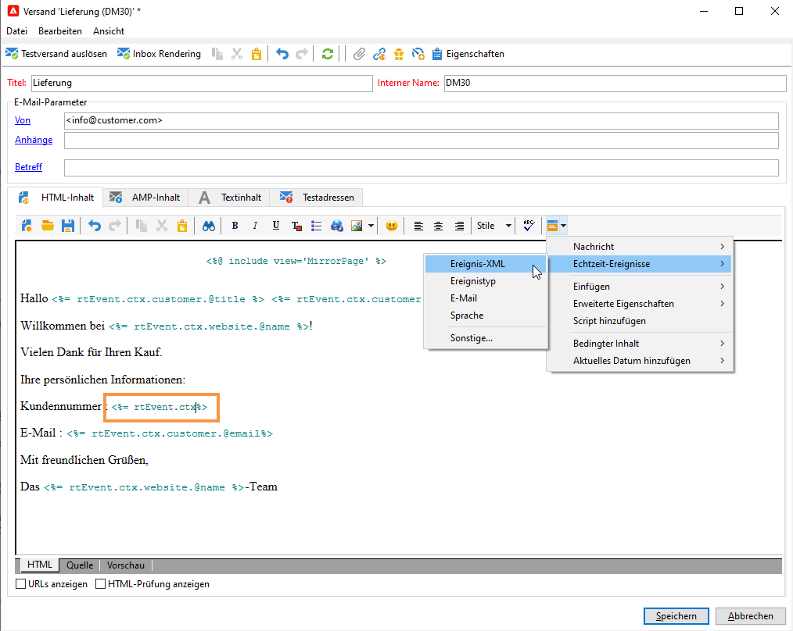

1. Ergänzen Sie das Feld unter Einhaltung folgender Syntax: .**Elementname**.@**Attributname**. Beispiel:

   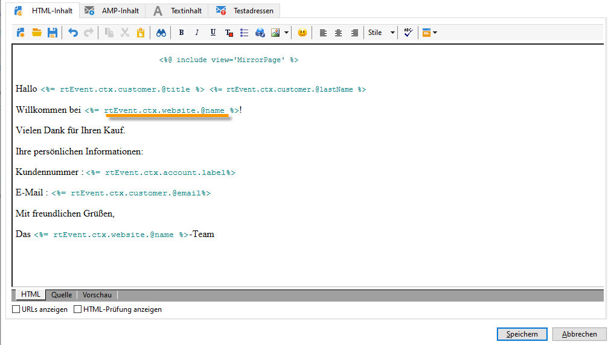

## Testen der Transaktionsnachrichtenvorlage {#test-message-template}

### Testadressen hinzufügen{#add-seeds}

Mit einer Testadresse können Sie eine Vorschau Ihrer Nachricht anzeigen, einen Testversand senden und die Personalisierung der Nachricht testen, bevor Sie die Nachricht senden. Testadressen sind mit dem Versand verknüpft und können nicht für andere Versände verwendet werden.

1. Klicken Sie in der Transaktionsnachrichten-Vorlage auf die Registerkarte **[!UICONTROL Testadressen]** und dann auf die Schaltfläche **[!UICONTROL Hinzufügen]**.

   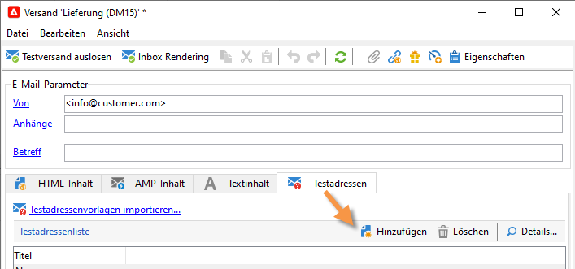

1. Weisen Sie eine Bezeichnung zur einfachen späteren Auswahl zu und geben Sie dann die Testadresse ein (E-Mail oder Mobiltelefon je nach Kommunikationskanal).

1. Geben Sie eine externe Kennung an. Dieses optionale Feld dient dazu, einen allen Anwendungen Ihrer Webseite gemeinsamen, benutzerdefinierten Schlüssel zu vergeben (eindeutige Kennung, Name + E-Mail etc.), um Ihre Profile zu identifizieren. Wenn dieses Feld auch in der Adobe Campaign-Datenbank vorhanden ist, haben Sie die Möglichkeit, Ereignisse mit Profilen der Datenbank abzustimmen.

   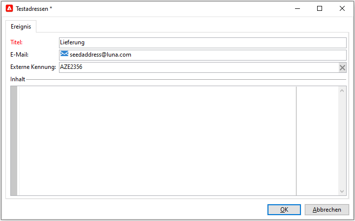

1. Fügen Sie Testdaten ein. Weitere Informationen finden Sie in [diesem Abschnitt](#personalization-data).

   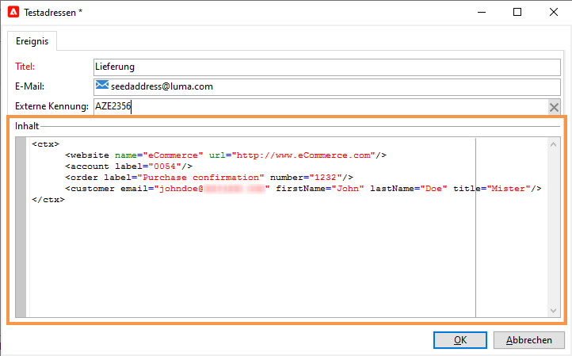

1. Klicken Sie auf **[!UICONTROL OK]**, um die Erstellung der Testadresse zu bestätigen.

1. Wiederholen Sie diesen Vorgang, um beliebig viele weitere Testadressen zu erstellen.

   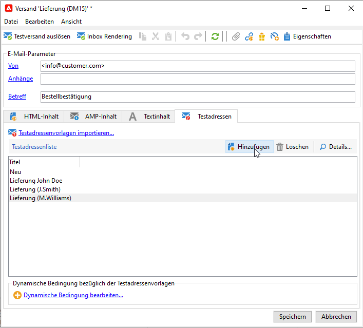

Sobald die Adressen erstellt wurden, können Sie eine Vorschau der Nachricht und ihrer Personalisierung erzeugen.

<!--

### Add personalization data{#personalization-data}

You can add data in the message template to test transactional message personalization. This will allow you to generate a preview or send a proof. If you install the **Deliverability** module, this data allows you to display a rendering of the messages for various desktop, web or mobile clients.

The purpose of this data is to test your messages before their final delivery. These messages do not coincide with actual data to be processed by Message Center.

However, the XML structure must be identical to that of the event stored in the execution instance, as shown below. 

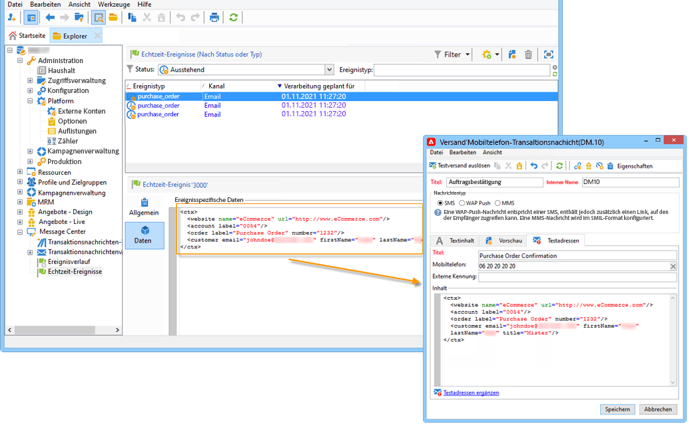

This information enables you to personalize message content using personalization tags.

1. In the message template, click the **[!UICONTROL Seed addresses]** tab.
1. In the event content, enter the test information in XML format.

   
-->

### Vorschau für Transaktionsnachricht anzeigen{#transactional-message-preview}

Nach der Erstellung einer oder mehrerer Testadressen sowie des Nachrichteninhalts können Sie eine Vorschau Ihrer Nachricht erzeugen und ihre Personalisierung überprüfen:

1. Klicken Sie in der Nachrichtenvorlage auf die Registerkarte **[!UICONTROL Vorschau]** und wählen Sie dann in der Dropdown-Liste eine **[!UICONTROL Testadresse]** aus.

   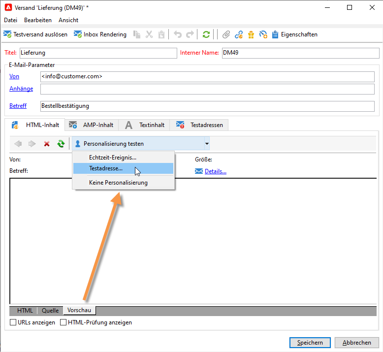

1. Wählen Sie eine der vorab erstellten Testadressen aus, um die personalisierte Nachrichtenvorschau zu erzeugen.

   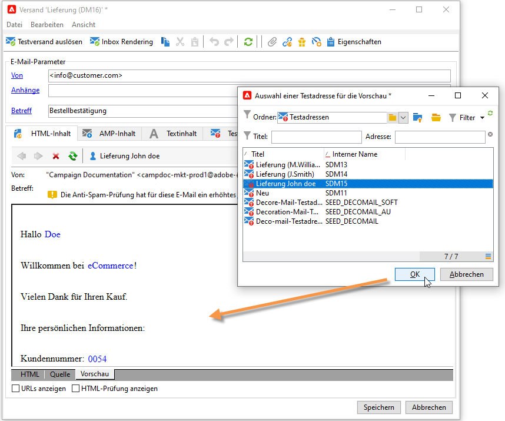

### Führen Sie einen Testversand durch.

Mithilfe von Testadressen haben Sie die Möglichkeit, vor dem eigentlichen Versand einen Testversand durchzuführen.

Das Senden eines Testversands erfolgt nach demselben Verfahren wie bei jedem Versand.

Weitere Informationen zu Testsendungen finden Sie in [diesem Abschnitt](../send/preview-and-proof.md#proofs-send).

Um jedoch einen Testversand einer Transaktionsnachricht zu senden, müssen Sie die folgenden Vorgänge ausführen:

* Erstellen Sie eine oder mehrere [Testadressen](#add-seeds) mit Personalisierungstestdaten.
* Nachrichteninhalt erstellen

Gehen Sie zur Durchführung des Testversands wie folgt vor:

1. Klicken Sie auf die Schaltfläche **[!UICONTROL Testversand]** im Versandfenster.
1. Analysieren Sie den Versand.
1. Korrigieren Sie eventuelle Fehler und bestätigen Sie den Versand.

   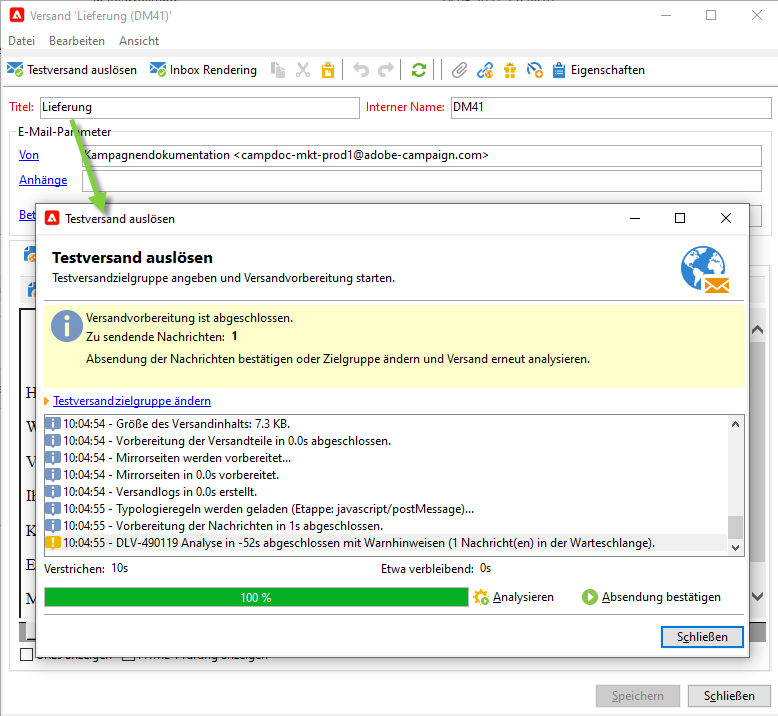

1. Stellen Sie sicher, dass die Nachricht an die Testadresse geschickt wurde und der Inhalt Ihren Konfigurationen entspricht.

   

Die Testsendungen können im Tab **[!UICONTROL Verfolgung]** jeder Vorlage eingesehen werden.

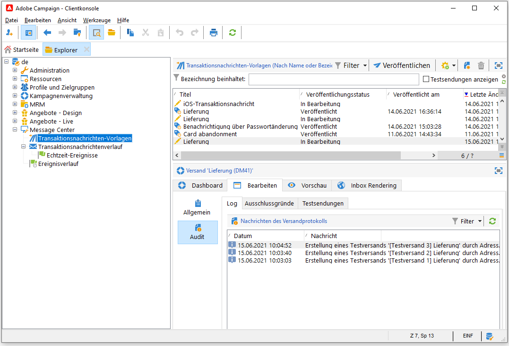

## Vorlage veröffentlichen {#publish-message-template}

Wenn die erstellte Nachrichtenvorlage<!-- on the control instance--> vollständig ist, können Sie sie veröffentlichen, wodurch Sie Nachrichten versenden können, die mit Echtzeit- und Batch-Ereignissen verknüpft sind.

<!--This process will also publish it on all execution instances.

NOTE: When publishing transactional message templates, typology rules are also automatically published on the execution instances.

Publication lets you automatically create two message templates on the execution instances, which will allow you to send messages linked to real-time and batch events.-->

>[!CAUTION]
>
>Wenn Sie an einer Vorlage Änderungen vornehmen, müssen Sie sie erneut veröffentlichen, damit diese Änderungen während des Versands der Transaktionsnachricht wirksam werden.

1. Gehen Sie im Navigationsbaum zum Ordner **[!UICONTROL Message Center > Transaktionsnachrichtenvorlagen]**.
1. Wählen Sie die Vorlage aus, die Sie veröffentlichen möchten<!--on your execution instances-->.
1. Klicken Sie auf **[!UICONTROL Veröffentlichen]**.

   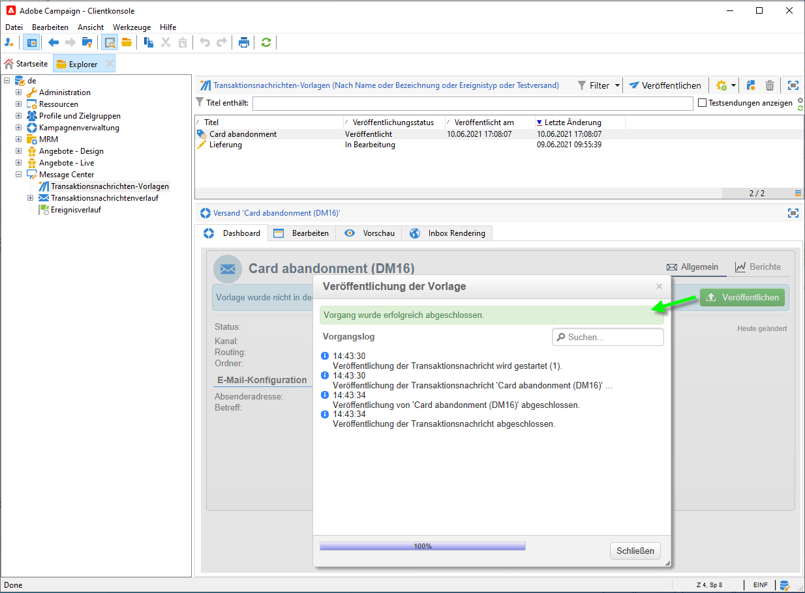

Nach Abschluss der Veröffentlichung werden die beiden Nachrichtenvorlagen, die auf die Echtzeit- und Batch-Ereignisse angewendet werden, im Ordner **[!UICONTROL Administration > Produktion > Message Center-Ausführung > Standard > Transaktionsnachrichten-Vorlagen]** erstellt.

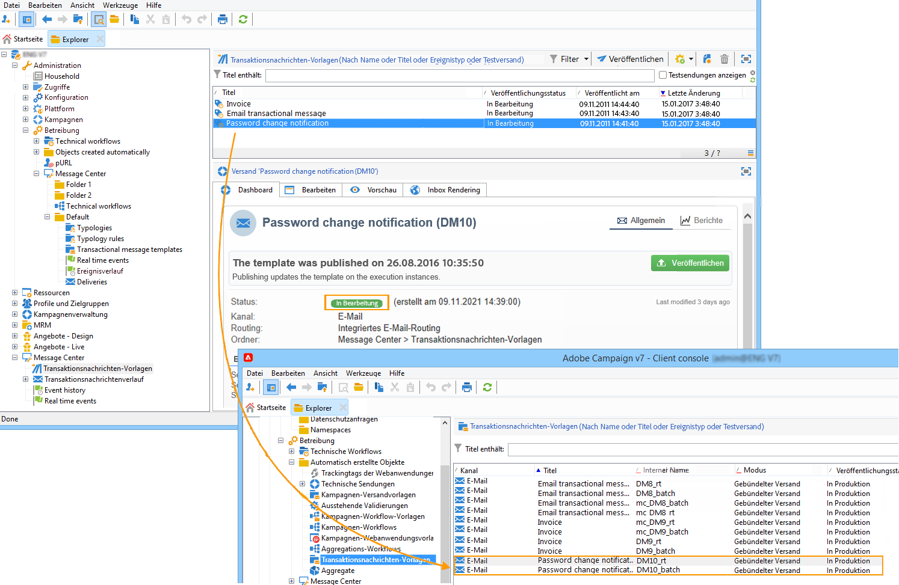

Sobald eine Vorlage veröffentlicht wurde und das entsprechende Ereignis ausgelöst wird, erhält Adobe Campaign<!--execution instance--> das Ereignis, verknüpft es mit der Transaktionsvorlage und sendet die entsprechende Transaktionsnachricht an jeden Empfänger.

<!--
>[!NOTE]
>
>If you replace an existing field of the transactional message template, such as the sender address, with an empty value, the corresponding field on the execution instance(s) will not be updated once the transactional message is published again. It will still contain the previous value.
>
>However, if you add a non-empty value, the corresponding field will be updated as usual after the next publication.
-->

## Veröffentlichung einer Vorlage aufheben

Sobald eine Nachrichtenvorlage <!--on the execution instances--> veröffentlicht wurde, kann die Veröffentlichung aufgehoben werden.

* Eine veröffentlichte Vorlage kann weiterhin aufgerufen werden, wenn das entsprechende Ereignis ausgelöst wird. Wenn Sie eine Nachrichtenvorlage nicht mehr verwenden, wird deshalb empfohlen, deren Veröffentlichung aufzuheben. Damit wird verhindert, dass versehentlich unerwünschte Transaktionsnachrichten gesendet werden.

  Gehen wir beispielsweise davon aus, dass Sie eine Nachrichtenvorlage veröffentlicht haben, die Sie nur für Weihnachtskampagnen verwenden. Sie können die Veröffentlichung der Vorlage nach der Weihnachtszeit aufheben und im nächsten Jahr erneut veröffentlichen.

* Zudem können Sie keine Transaktionsnachrichten-Vorlagen löschen, die den Status **[!UICONTROL Veröffentlicht]** aufweisen. In diesem Fall müssen Sie die Veröffentlichung der Vorlage zuerst aufheben.

Gehen Sie wie folgt vor, um die Veröffentlichung einer Transaktionsnachrichten-Vorlage aufzuheben.

1. Navigieren Sie zum Ordner **[!UICONTROL Message Center > Transaktionsnachrichten-Vorlagen]**.
1. Wählen Sie die Vorlage aus, deren Veröffentlichung rückgängig gemacht werden soll.
1. Klicken Sie auf **[!UICONTROL Veröffentlichung aufheben]**.
1. Klicken Sie auf **[!UICONTROL Starten]**.

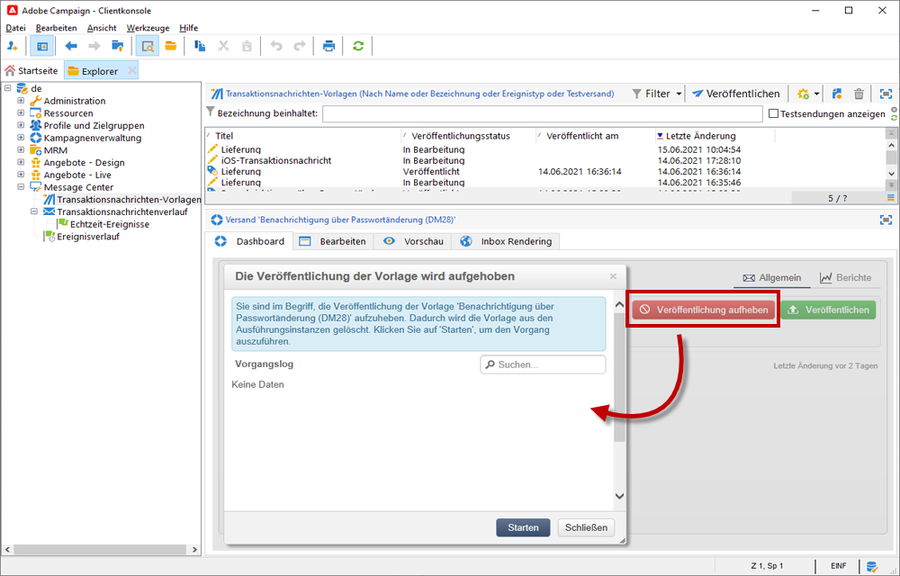

Der Status der Transaktionsnachrichten-Vorlage ändert sich von **[!UICONTROL Veröffentlicht]** in **[!UICONTROL In Bearbeitung]**.

Nach Abschluss der Aufhebung der Veröffentlichung:

* Beide Nachrichtenvorlagen (auf Batch- und Echtzeit-Ereignisse angewendet) werden gelöscht<!-- from each execution instance-->.

  Sie werden im Ordner **[!UICONTROL Administration > Produktion > Message Center > Standard > Transaktionsnachrichten-Vorlagen]** nicht mehr angezeigt.

* Nachdem die Veröffentlichung einer Vorlage aufgehoben wurde, können Sie sie löschen<!-- from the control instance-->.

  Wählen Sie dazu die gewünschte Vorlage aus der Liste aus und klicken Sie oben rechts im Bildschirm auf die Schaltfläche **[!UICONTROL Löschen]**.
