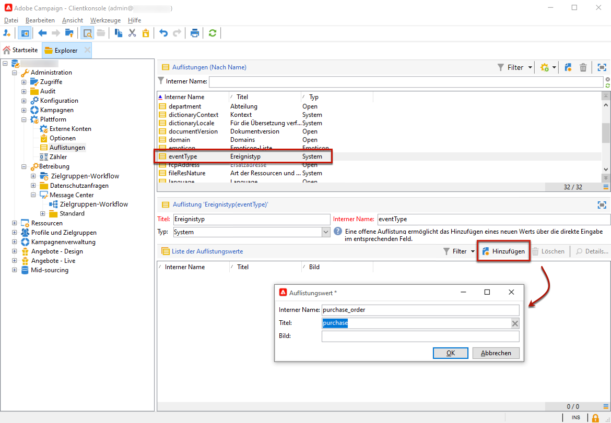

# Erste Schritte mit Transaktionsnachrichten{#send-transactional-messages}

Das Campaign-Modul &quot;Transaktionsnachricht (Message Center)&quot; wurde zum Verwalten von Trigger-Nachrichten entwickelt. Diese Benachrichtigungen werden von Ereignissen generiert, die von Informationssystemen ausgelöst werden und können sein: Rechnung, Auftragsbestätigung, Versandbestätigung, Passwortänderung, Benachrichtigung über die Nichtverfügbarkeit von Produkten, Kontoauszug, Einrichtung eines Website-Kontos usw.

>[!NOTE]
>
>Wenn Sie Benutzer oder Benutzerin von Managed Cloud Services sind, [kontaktieren Sie Adobe](../start/campaign-faq.md#support){target="_blank"}, um Campaign-Transaktionsnachrichten in Ihrer Umgebung zu konfigurieren.

Transaktionsnachrichten dienen zum Senden von:

* Benachrichtigungen, z. B. Bestellbestätigungen oder Zurücksetzungen von Passwörtern
* einer individuellen Echtzeit-Antwort auf eine Kundenaktion
* Inhalten, die keine Werbung sind

Die Einstellungen für Transaktionsnachrichten sind in [diesem Abschnitt](../config/transactional-msg-settings.md) beschrieben.

[Diese Seite](../architecture/architecture.md#transac-msg-archi) hilft Ihnen, die Architektur der Transaktionsnachrichten zu verstehen.

## Funktionsweise von Transaktionsnachrichten {#transactional-messaging-operating-principle}

Das Transaktionsnachrichtenmodul von Adobe Campaign ist in ein Informationssystem integriert, das Ereignisse zurückgibt, die in personalisierte Transaktionsnachrichten umgewandelt werden. Diese Nachrichten können einzeln oder in Batches per E-Mail, SMS oder Push-Benachrichtigungen gesendet werden.

Angenommen, Sie sind eine Firma mit einer Website, auf der Ihre Kunden Produkte kaufen können.

Mit Adobe Campaign können Sie eine Benachrichtigungs-E-Mail an Kunden senden, die ihrem Warenkorb Produkte hinzugefügt haben. Wenn ein Kunde Ihre Website verlässt, ohne seine Einkäufe zu tätigen (externes Ereignis, das ein Campaign-Ereignis auslöst), wird automatisch eine Warenkorbabbruchs-E-Mail an ihn gesendet (Versand einer Transaktionsnachricht).

Die wichtigsten Schritte für die Einrichtung sind nachfolgend beschrieben:

1. [Erstellen Sie einen Ereignistyp](#create-event-types).
1. [Erstellen und konzipieren Sie die Nachrichtenvorlage](transactional-template.md#create-message-template). Bei diesem Schritt müssen Sie ein Ereignis mit Ihrer Nachricht verknüpfen.
1. [Testen Sie die Nachricht](transactional-template.md#test-message-template).
1. [Veröffentlichen Sie die Nachrichtenvorlage](transactional-template.md#publish-message-template).

Wenn nach der Erstellung und Veröffentlichung der Transaktionsnachrichtenvorlage ein entsprechendes Ereignis ausgelöst wird, werden die relevanten Daten über die [SOAP-Methoden](../send/event-description.md) PushEvent und PushEvents an Campaign gesendet. Danach erfolgt der Versand an die ausgewählte Zielgruppe.

## Ereignistypen erstellen {#create-event-types}

Um sicherzustellen, dass die einzelnen Ereignisse in eine personalisierte Nachricht umgewandelt werden können, müssen Sie zunächst **Ereignistypen** erstellen.

Wählen Sie dazu beim [Erstellen einer Nachrichtenvorlage](#create-message-template) den für die zu versendende Nachricht passenden Ereignistyp aus.

>[!CAUTION]
>
>Um in Nachrichtenvorlagen Ereignistypen verwenden zu können, müssen Sie diese zunächst erstellen.

Gehen Sie wie folgt vor, um Ereignistypen für die Verarbeitung in Adobe Campaign zu erstellen:

1. Navigieren Sie zum Ordner **[!UICONTROL Administration > Plattform > Aufzählungen]** des Campaign-Explorers.
1. Wählen Sie die Aufzählung **[!UICONTROL Ereignistyp]** aus der Liste.
1. Klicken Sie auf **[!UICONTROL Hinzufügen]**, um einen Aufzählungswert zu erstellen. Hierbei kann es sich um eine Bestellbestätigung, eine Passwortänderung, eine Änderung des Bestellversands usw. handeln.

   

   >[!CAUTION]
   >
   >Jeder Ereignistyp muss mit einem Wert in der Aufzählung **[!UICONTROL Ereignistyp]** übereinstimmen.

1. Melden Sie sich nach der Erstellung der Auflistungswerte von Ihrer Instanz ab und wieder an, damit die Änderungen berücksichtigt werden.

>[!NOTE]
>
>Weitere Informationen über [Auflistungen](../config/enumerations.md).

Im nächsten Schritt erfahren Sie, wie Sie [Ihre Vorlage für Transaktionsnachrichten erstellen und veröffentlichen](transactional-template.md).
