# Erste Schritte mit Transaktionsnachrichten{#send-transactional-messages}

Transaktionsnachrichten (Message Center) sind ein Campaign-Modul zur Verwaltung von Trigger-Nachrichten. Diese Benachrichtigungen werden von Ereignissen generiert, die von Informationssystemen ausgelöst werden. Sie können: Rechnung, Bestellbestätigung, Lieferbestätigung, Passwortänderung, Benachrichtigung über die Nichtverfügbarkeit des Produkts, Kontoauszug, Erstellung des Website-Kontos usw.

  Als Benutzer von Managed Cloud Services [Adobe kontaktieren](../start/campaign-faq.md#support){target=&quot;_blank&quot;} zur Installation und Konfiguration von Campaign-Transaktionsnachrichten in Ihrer Umgebung.

Transaktionsnachrichten dienen zum Senden von:

* Benachrichtigungen, z. B. Bestellbestätigungen oder Zurücksetzungen von Passwörtern
* einer individuellen Echtzeit-Antwort auf eine Kundenaktion
* Inhalten, die keine Werbung sind

 Die Einstellungen für Transaktionsnachrichten sind in [diesem Abschnitt](../config/transactional-msg-settings.md) beschrieben.

 Grundlegendes zur Transaktionsnachrichten-Architektur in [diese Seite](../architecture/architecture.md).

## Funktionsweise von Transaktionsnachrichten {#transactional-messaging-operating-principle}

Das Transaktionsnachrichtenmodul von Adobe Campaign ist in ein Informationssystem integriert, das Ereignisse zurückgibt, die in personalisierte Transaktionsnachrichten umgewandelt werden. Diese Nachrichten können einzeln oder in Batches per E-Mail, SMS oder Push-Benachrichtigungen gesendet werden.

Angenommen, Sie sind eine Firma mit einer Website, auf der Ihre Kunden Produkte kaufen können.

Mit Adobe Campaign können Sie eine Benachrichtigungs-E-Mail an Kunden senden, die ihrem Warenkorb Produkte hinzugefügt haben. Wenn ein Kunde Ihre Website verlässt, ohne seine Einkäufe zu tätigen (externes Ereignis, das ein Campaign-Ereignis auslöst), wird automatisch eine Warenkorbabbruchs-E-Mail an ihn gesendet (Versand einer Transaktionsnachricht).

Die wichtigsten Schritte für die Umsetzung sind im Folgenden beschrieben:

1. [Erstellen Sie einen Ereignistyp](#create-event-types).
1. [Erstellen und konzipieren Sie die Nachrichtenvorlage](#create-message-template). Bei diesem Schritt müssen Sie ein Ereignis mit Ihrer Nachricht verknüpfen.
1. [Testen Sie die Nachricht](#test-message-template).
1. [Veröffentlichen Sie die Nachrichtenvorlage](#publish-message-template).

Wenn nach der Erstellung und Publikation der Transaktionsnachrichtenvorlage ein entsprechendes Ereignis ausgelöst wird, werden die relevanten Daten über PushEvent und PushEvents an Campaign gesendet [SOAP-Methoden](https://experienceleague.adobe.com/docs/campaign-classic/using/transactional-messaging/processing/event-description.html?lang=de){target=&quot;_blank&quot;} und der Versand an die Zielempfänger erfolgt.

## Ereignistypen erstellen {#create-event-types}

Um sicherzustellen, dass die einzelnen Ereignisse in eine personalisierte Nachricht umgewandelt werden können, müssen Sie zunächst **Ereignistypen** erstellen.

Wählen Sie dazu beim [Erstellen einer Nachrichtenvorlage](#create-message-template) den für die zu versendende Nachricht passenden Ereignistyp aus.

>[!IMPORTANT]
>
>Um in Nachrichtenvorlagen Ereignistypen verwenden zu können, müssen Sie diese zunächst erstellen.

Gehen Sie wie folgt vor, um Ereignistypen für die Verarbeitung in Adobe Campaign zu erstellen:

1. Melden Sie sich bei der **Kontrollinstanz** an.

1. Rufen Sie im Navigationsbaum den Ordner **[!UICONTROL Administration > Plattform > Auflistungen]** auf.

1. Wählen Sie **[!UICONTROL Ereignistyp]** aus der Liste aus.

1. Klicken Sie auf **[!UICONTROL Hinzufügen]**, um einen Auflistungswert zu erstellen. Hierbei kann es sich um eine Bestellbestätigung, eine Passwortänderung, eine Änderung des Bestellversands usw. handeln.

   <!---->

   >[!IMPORTANT]
   >
   >Jeder Ereignistyp muss mit einem Wert in der Auflistung **[!UICONTROL Ereignistyp]** übereinstimmen.

1. Melden Sie sich nach der Erstellung der Auflistungswerte von Ihrer Instanz ab und wieder an, damit die Änderungen berücksichtigt werden.

>[!NOTE]
>
>Weitere Informationen zu Auflistung finden Sie in [Dokumentation zu Campaign Classic v7](https://experienceleague.adobe.com/docs/campaign-classic/using/getting-started/administration-basics/managing-enumerations.html?lang=de){target=&quot;_blank&quot;}.

## Transaktionsnachrichtenvorlage definieren {#create-message-template}

Jedes Ereignis kann eine personalisierte Nachricht auslösen. Dazu müssen Sie für jeden Ereignistyp eine passende Nachrichtenvorlage erstellen. Vorlagen enthalten die notwendigen Informationen zur Personalisierung der Transaktionsnachricht. Sie können Vorlagen auch verwenden, um die Vorschau der Nachricht zu testen und einen Testversand an Testadressen zu senden, bevor Sie an die endgültige Zielgruppe versenden.

### Vorlage erstellen

Gehen Sie wie folgt vor, um eine Nachrichtenvorlage zu erstellen:

1. Wechseln Sie zum Knoten **[!UICONTROL Message Center > Transaktionsnachrichten-Vorlagen]** im Adobe Campaign-Navigationsbaum.
1. Klicken Sie mit der rechten Maustaste in die Liste der Vorlagen und wählen Sie **[!UICONTROL Neu]** im Kontextmenü aus oder klicken Sie direkt auf die Schaltfläche **[!UICONTROL Neu]** oberhalb der Liste.

   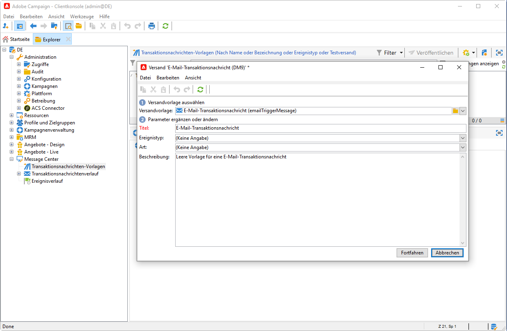

1. Wählen Sie im Versand-Assistenten die Versandvorlage aus, die dem gewünschten Kommunikationskanal entspricht.

   

1. Ändern Sie bei Bedarf den Titel.
1. Wählen Sie den Ereignistyp aus, der der zu sendenden Nachricht entspricht.

   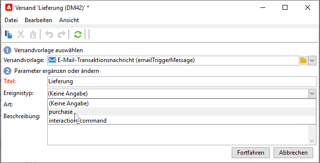

   Ereignistypen, die zur Verarbeitung durch Adobe Campaign bestimmt sind, müssen zuvor erstellt werden.

   >[!CAUTION]
   >
   >Ein Ereignistyp sollte nie mit mehr als einer Vorlage verknüpft werden.

1. Geben Sie die Art sowie eine Beschreibung der Vorlage an und klicken Sie auf **[!UICONTROL Fortfahren]**, um den Nachrichteninhalt zu erstellen. Siehe [Nachrichteninhalt erstellen](#create-message-content).

### Inhalt erstellen{#create-message-content}

Die Definition des Inhalts der Transaktionsnachricht entspricht der für alle Sendungen in Adobe Campaign. So können Sie z. B. für einen E-Mail-Versand Inhalte im HTML- oder Textformat erstellen, Anhänge hinzufügen oder das Versandobjekt personalisieren. Weiterführende Informationen hierzu finden Sie in [diesem Abschnitt](../start/create-message.md).

>[!CAUTION]
>
>In Nachrichten enthaltene Bilder müssen öffentlich zugänglich sein. Adobe Campaign verfügt über keinen Mechanismus zum Online-Stellen der Bilder für Transaktionsnachrichten.\
>Im Gegensatz zu JSSP oder webApp bietet `<%=` keine standardmäßige Escape-Funktion.
>
>In diesem Fall müssen Sie alle Daten, die aus dem Ereignis stammen, ordnungsgemäß maskieren. Dieses Escape-Sequenz hängt davon ab, wie dieses Feld verwendet wird. Verwenden Sie beispielsweise innerhalb einer URL encodeURIComponent. Für eine Anzeige im HTML-Code, können Sie escapeXMLString verwenden.

Integrieren Sie nach der Erstellung des Inhalts die Ereignisinformationen in den Nachrichten-Textkörper, um die Nachricht zu personalisieren. Verwenden Sie hierzu die zur Verfügung stehenden Personalisierungsfelder.

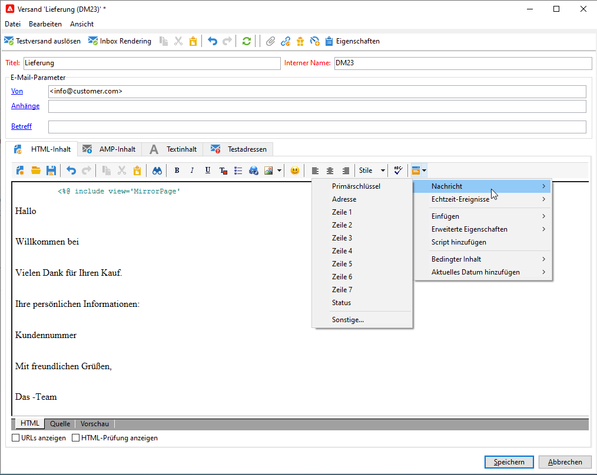

* Alle Personalisierungsfelder stammen aus der Payload.
* Es ist möglich, in einer Transaktionsnachricht auf einen oder mehrere Gestaltungsbausteine zu verweisen. Der Bausteininhalt wird während der Veröffentlichung in der Ausführungsinstanz zum Versandinhalt hinzugefügt.

Gehen Sie wie folgt vor, um Personalisierungsfelder in einen E-Mail-Nachrichteninhalt einzufügen:

1. Klicken Sie in der Nachrichtenvorlage auf den Tab, der dem E-Mail-Format entspricht (HTML oder Text).
1. Verfassen Sie den Inhalt der Nachricht.
1. Fügen Sie das Personalisierungsfeld mithilfe des Menüs **[!UICONTROL Echtzeit-Ereignisse > Ereignis-XML]** ein.

   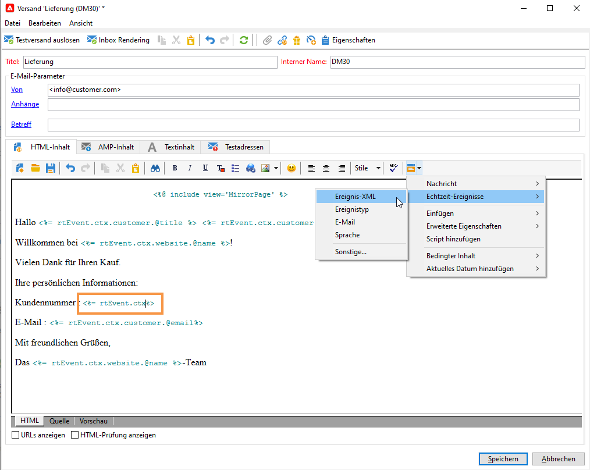

1. Ergänzen Sie das Feld unter Einhaltung folgender Syntax: .**Elementname**.@**Attributname**. Beispiel:

   

## Transaktionsnachrichtenvorlage testen {#test-message-template}

### Testadressen hinzufügen{#add-seeds}

Mit einer Testadresse können Sie eine Vorschau Ihrer Nachricht anzeigen, einen Testversand senden und die Personalisierung der Nachricht testen, bevor Sie die Nachricht senden. Testadressen sind mit dem Versand verknüpft und können nicht für andere Versände verwendet werden.

1. Klicken Sie in der Transaktionsnachrichten-Vorlage auf die Registerkarte **[!UICONTROL Testadressen]** und dann auf die Schaltfläche **[!UICONTROL Hinzufügen]**.

   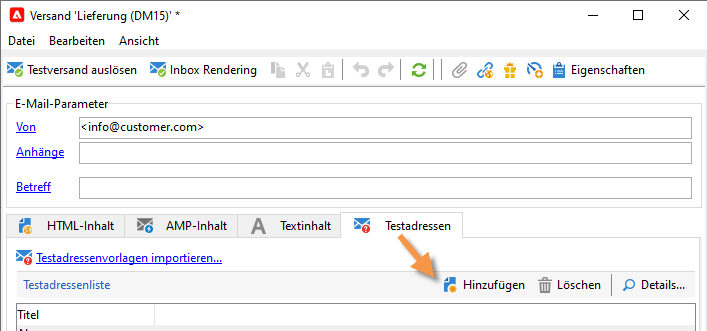

1. Weisen Sie eine Bezeichnung zur einfachen späteren Auswahl zu und geben Sie dann die Testadresse ein (E-Mail oder Mobiltelefon je nach Kommunikationskanal).

1. Geben Sie eine externe Kennung an. Dieses optionale Feld dient dazu, einen allen Anwendungen Ihrer Webseite gemeinsamen, benutzerdefinierten Schlüssel zu vergeben (eindeutige Kennung, Name + E-Mail etc.), um Ihre Profile zu identifizieren. Wenn dieses Feld auch in der Adobe Campaign-Datenbank vorhanden ist, haben Sie die Möglichkeit, Ereignisse mit Profilen der Datenbank abzustimmen.

   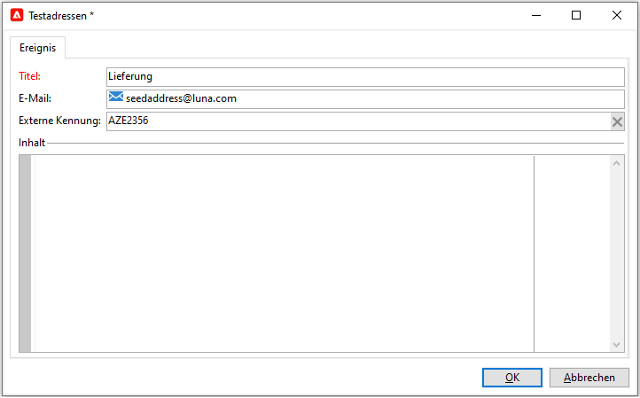

1. Fügen Sie Testdaten ein. Weitere Informationen finden Sie in [diesem Abschnitt](#personalization-data).

   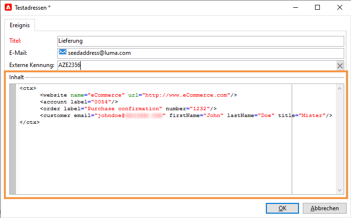

1. Klicken Sie auf **[!UICONTROL OK]**, um die Erstellung der Testadresse zu bestätigen.

1. Wiederholen Sie diesen Vorgang, um beliebig viele weitere Testadressen zu erstellen.

   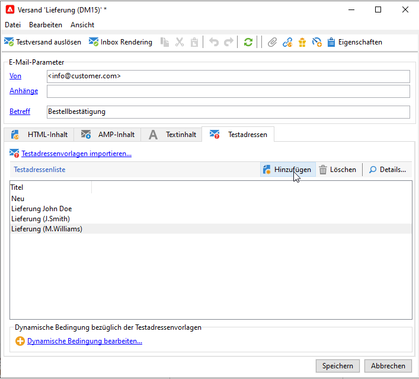

Sobald die Adressen erstellt wurden, können Sie eine Vorschau der Nachricht und ihrer Personalisierung erzeugen.

### Personalisierungsdaten hinzufügen{#personalization-data}

Sie können Daten in der Nachrichtenvorlage hinzufügen, um die Personalisierung der Transaktionsnachricht zu testen. Auf diese Weise können Sie eine Vorschau erstellen oder einen Testversand senden. Wenn Sie das Modul **Zustellbarkeit** installieren, können Sie mit diesen Daten ein Rendering der Nachrichten für verschiedene Desktop-, Web- oder Mobile-Clients anzeigen.

Diese Daten dienen nur dazu, die Nachrichten vor dem eigentlichen Versand zu testen und entsprechen nicht den tatsächlich von Message Center verarbeiteten Daten. Ihre XML-Struktur muss jedoch identisch mit der des in der Ausführungsinstanz gespeicherten Ereignisses sein, wie im folgenden Beispiel:

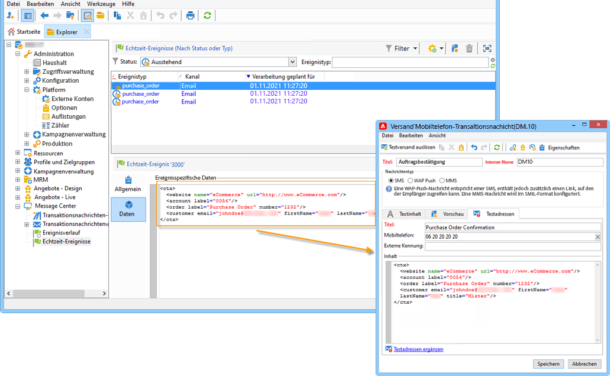

Mit diesen Informationen können Sie Nachrichteninhalte mithilfe von Personalisierungs-Tags personalisieren.

1. Klicken Sie in der Nachrichtenvorlage auf den Tab **[!UICONTROL Testadressen]**.
1. Geben Sie im Inhalt des Ereignisses die Testinformationen im XML-Format ein.

   

### Vorschau für Transaktionsnachricht anzeigen{#transactional-message-preview}

Nach der Erstellung einer oder mehrerer Testadressen sowie des Nachrichteninhalts können Sie eine Vorschau Ihrer Nachricht erzeugen und ihre Personalisierung überprüfen:

1. Klicken Sie in der Nachrichtenvorlage auf die Registerkarte **[!UICONTROL Vorschau]** und wählen Sie dann in der Dropdown-Liste eine **[!UICONTROL Testadresse]** aus.

   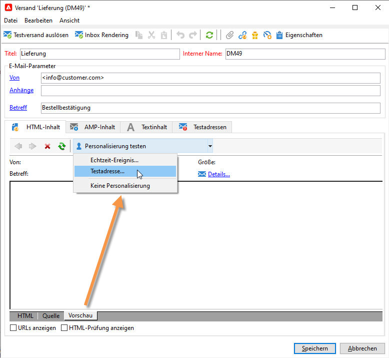

1. Wählen Sie eine der vorab erstellten Testadressen aus, um die personalisierte Nachrichtenvorschau zu erzeugen.

   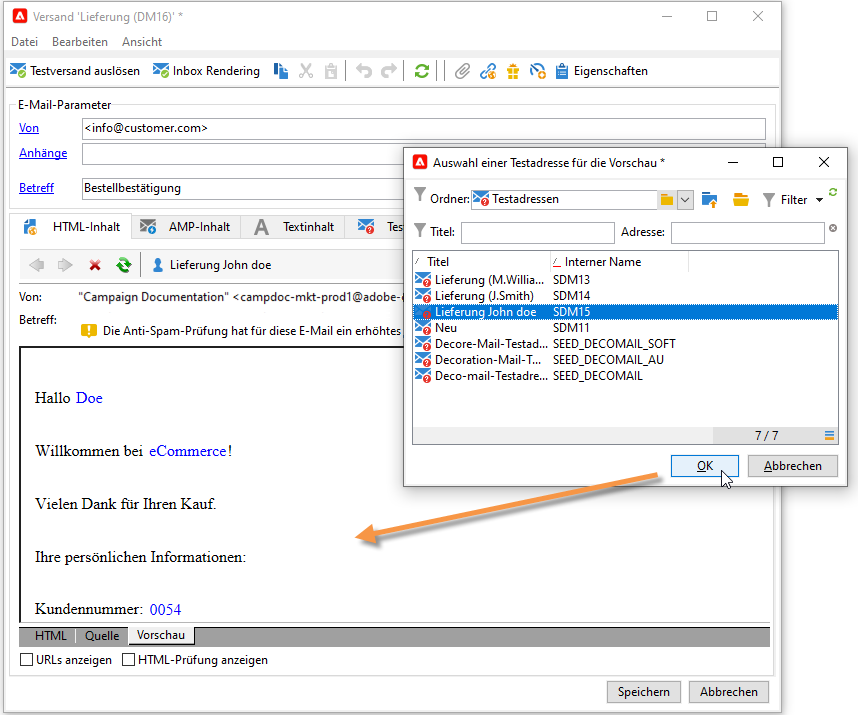

### Durchführen eines Testversands

Mithilfe von Testadressen haben Sie die Möglichkeit, vor dem eigentlichen Versand einen Testversand durchzuführen.

Das Senden eines Testversands erfolgt nach demselben Verfahren wie bei jedem Versand.

 Erfahren Sie mehr über den Testversand in der [Dokumentation zu Campaign Classic v7](https://experienceleague.adobe.com/docs/campaign-classic/using/sending-messages/key-steps-when-creating-a-delivery/steps-validating-the-delivery.html?lang=de){target=&quot;_blank&quot;}

Um jedoch einen Testversand einer Transaktionsnachricht zu senden, müssen Sie die folgenden Vorgänge ausführen:

* Erstellen Sie eine oder mehrere [Testadressen](#add-seeds) mit Personalisierungstestdaten.
* Nachrichteninhalt erstellen

Gehen Sie zur Durchführung des Testversands wie folgt vor:

1. Klicken Sie auf die Schaltfläche **[!UICONTROL Testversand]** im Versandfenster.
1. Analysieren Sie den Versand.
1. Korrigieren Sie eventuelle Fehler und bestätigen Sie den Versand.

   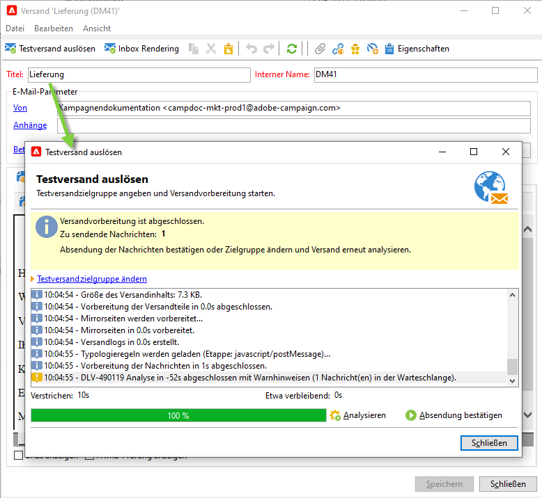

1. Stellen Sie sicher, dass die Nachricht an die Testadresse geschickt wurde und der Inhalt Ihren Konfigurationen entspricht.

   

Die Testsendungen können im Tab **[!UICONTROL Verfolgung]** jeder Vorlage eingesehen werden.

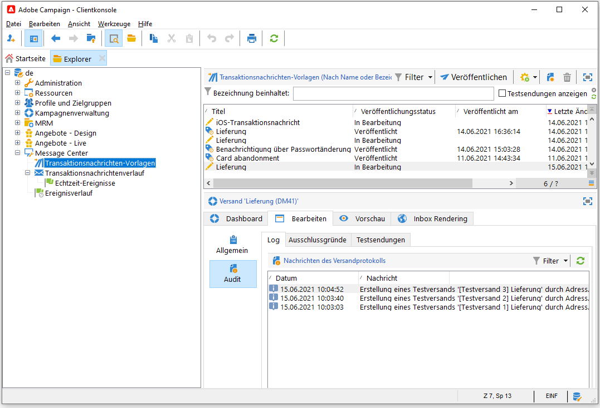

## Vorlage veröffentlichen {#publish-message-template}

Wenn die auf der Kontrollinstanz erstellte Nachrichtenvorlage vollständig ist, können Sie sie veröffentlichen. Dieser Vorgang wird auch auf allen Ausführungsinstanzen veröffentlicht.

>[!NOTE]
>
>Bei der Veröffentlichung der Transaktionsnachrichtenvorlagen werden auch die Typologieregeln automatisch auf den Ausführungsinstanzen veröffentlicht.

Bei der Veröffentlichung können Sie in den Ausführungsinstanzen automatisch zwei Nachrichtenvorlagen erstellen, um Nachrichten senden zu können, die mit Echtzeit- und Batch-Ereignissen verknüpft sind.

>[!CAUTION]
>
>Wenn Sie an einer Vorlage Änderungen vornehmen, stellen Sie sicher, dass Sie sie erneut veröffentlichen, damit diese Änderungen während des Versands der Transaktionsnachricht wirksam werden.

1. Gehen Sie in der Kontrollinstanz im Navigationsbaum zum Ordner **[!UICONTROL Message Center > Transaktionsnachrichtenvorlagen]**.
1. Wählen Sie die auf den Ausführungsinstanzen zu veröffentlichende Vorlage aus.
1. Klicken Sie auf **[!UICONTROL Veröffentlichen]**.

   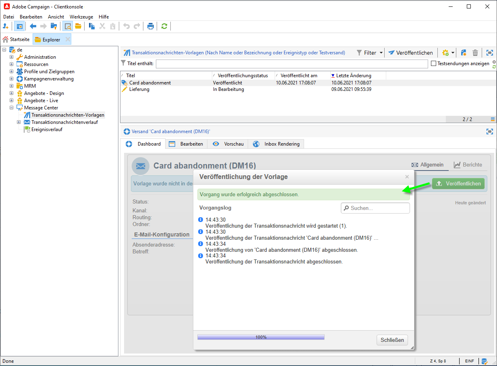

Nach Abschluss der Veröffentlichung werden die beiden Vorlagen, die auf die Echtzeit- und Batch-Ereignisse angewendet werden, im Navigationsbaum der Ausführungsinstanz im Ordner **[!UICONTROL Administration > Betreibung > Message Center > Standard > Transaktionsnachrichten-Vorlagen]** erstellt.

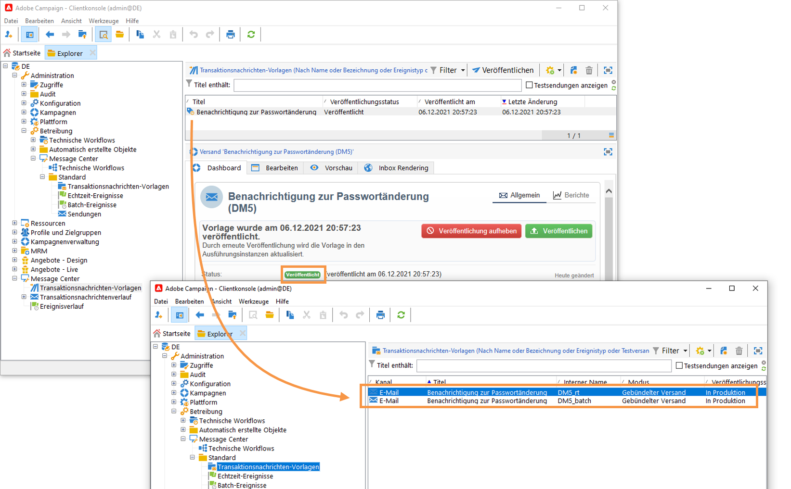

Sobald eine Vorlage veröffentlicht wurde und das entsprechende Ereignis ausgelöst wird, erhält die Ausführungsinstanz das Ereignis, verknüpft es mit der Transaktionsvorlage und sendet die entsprechende Transaktionsnachricht an jeden Empfänger.

>[!NOTE]
>
>Wenn Sie ein vorhandenes Feld der Transaktionsnachrichtenvorlage, z. B. die Absenderadresse, durch einen leeren Wert ersetzen, wird das entsprechende Feld auf der/den Ausführungsinstanz(en) nicht aktualisiert, sobald die Transaktionsnachricht erneut veröffentlicht wird. Es enthält weiterhin den vorherigen Wert.
>
>Wenn Sie jedoch einen nicht leeren Wert hinzufügen, wird das entsprechende Feld wie gewohnt nach der nächsten Veröffentlichung aktualisiert.

## Veröffentlichung einer Vorlage rückgängig machen

Sobald eine Nachrichtenvorlage in den Ausführungsinstanzen veröffentlicht wurde, kann ihre Veröffentlichung aufgehoben werden.

* Eine veröffentlichte Vorlage kann weiterhin aufgerufen werden, wenn das entsprechende Ereignis ausgelöst wird. Wenn Sie eine Nachrichtenvorlage nicht mehr verwenden, wird deshalb empfohlen, deren Veröffentlichung aufzuheben. Damit wird verhindert, dass versehentlich unerwünschte Transaktionsnachrichten gesendet werden.

   Gehen wir beispielsweise davon aus, dass Sie eine Nachrichtenvorlage veröffentlicht haben, die Sie nur für Weihnachtskampagnen verwenden. Sie können die Veröffentlichung der Vorlage nach der Weihnachtszeit aufheben und im nächsten Jahr erneut veröffentlichen.

* Zudem können Sie keine Transaktionsnachrichten-Vorlagen löschen, die den Status **[!UICONTROL Veröffentlicht]** aufweisen. In diesem Fall müssen Sie die Veröffentlichung der Vorlage zuerst aufheben.

Gehen Sie wie folgt vor, um die Veröffentlichung einer Transaktionsnachrichten-Vorlage aufzuheben.

1. Gehen Sie in der Kontrollinstanz im Navigationsbaum zum Ordner **[!UICONTROL Message Center > Transaktionsnachrichten-Vorlagen]**.
1. Wählen Sie die Vorlage aus, deren Veröffentlichung rückgängig gemacht werden soll.
1. Klicken Sie auf **[!UICONTROL Veröffentlichung aufheben]**.
1. Klicken Sie auf **[!UICONTROL Starten]**.

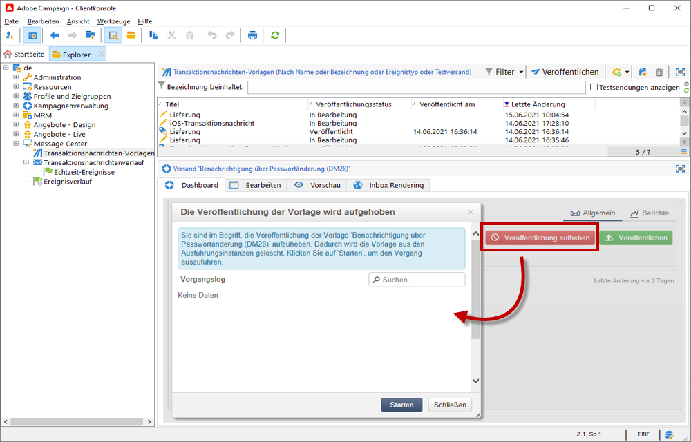

Der Status der Transaktionsnachrichten-Vorlage ändert sich von **[!UICONTROL Veröffentlicht]** in **[!UICONTROL In Bearbeitung]**.

Nach Abschluss der Aufhebung der Veröffentlichung:

* Beide Nachrichtenvorlagen (auf Batch- und Echtzeit-Ereignisse angewendet) werden aus jeder Ausführungsinstanz gelöscht.

   Sie werden im Ordner **[!UICONTROL Administration > Betreibung > Message Center > Standard > Transaktionsnachrichten-Vorlagen]** nicht mehr angezeigt.

* Sobald die Veröffentlichung einer Vorlage aufgehoben wurde, können Sie sie aus der Kontrollinstanz löschen.

   Wählen Sie dazu die gewünschte Vorlage aus der Liste aus und klicken Sie oben rechts im Bildschirm auf die Schaltfläche **[!UICONTROL Löschen]**.
