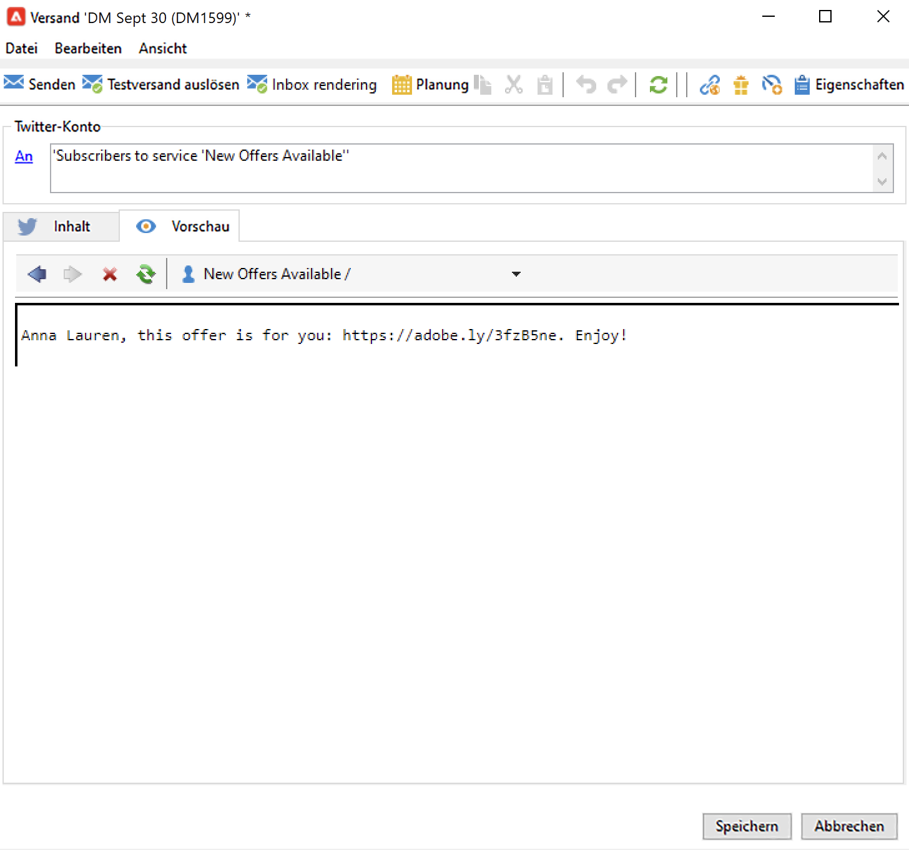

# Posten von Nachrichten auf Twitter mit Adobe Campaign {#post-tw-messages}

Adobe Campaign enthält das Modul **Social-Media-Marketing**, mit dem Sie über Twitter mit Ihren Kunden und potenziellen Kunden interagieren können.

Nach der Konfiguration der Integration haben Sie folgende Möglichkeiten:

* Senden von Direktnachrichten an Ihre Follower
* Posten von Tweets in Ihrem Twitter-Konto
* Sammeln Sie neue Kontakte, indem Sie die Profildaten abrufen, um auf der Basis dieser Daten Zielgruppen-Kampagnen durchzuführen und Cross-Channel-Strategien anzuwenden. Diese Aktion erfordert die Zustimmung des Benutzers.

Die Konfigurationsschritte zur Integration Ihres Twitter-Kontos mit Adobe Campaign werden auf [dieser Seite](../connect/ac-tw.md) beschrieben.

## Erstellen und Veröffentlichen eines Twitter-Postings (Tweet) {#publish-on-tw}

Gehen Sie wie folgt vor, um eine Nachricht auf Ihrem Twitter-Konto zu posten:

1. Erstellen eines Twitter-Versands

   Erstellen Sie einen neuen Versand anhand der Versandvorlage **[!UICONTROL Tweet (Twitter)]**.

   

1. Auswählen der Hauptzielgruppe      

   Wählen Sie die Konten aus, an die Sie Tweets senden möchten.

   

   1. Wählen Sie den Link **[!UICONTROL An]** aus.
   1. Klicken Sie auf die Schaltfläche **[!UICONTROL Hinzufügen]**.
   1. Wählen Sie **[!UICONTROL Twitter-Konto]** aus.
   1. Wählen Sie im Feld **[!UICONTROL Ordner]** den Dienstordner aus, der das Twitter-Konto enthält. Wählen Sie dann das Twitter-Konto aus, an das Sie Ihren Tweet senden möchten.

1. Auswählen der Zielgruppe für den Testversand

   Über den Tab **[!UICONTROL Testversand-Zielgruppe]** können Sie das Twitter-Konto festlegen, das Sie vor dem endgültigen Versand für Testsendungen verwenden möchten.

   Wie in den [Konfigurationsschritten](../connect/ac-tw.md#tw-test-account) beschrieben, müssen Sie ein privates Twitter-Test-Konto für den Testversand erstellen.

   >[!NOTE]
   >
   >Wenn Sie dasselbe Twitter-Konto für alle Sendungen verwenden, können Sie die Testversand-Zielgruppe in der Versandvorlage **[!UICONTROL Tweet]** speichern, auf die über den Knoten **[!UICONTROL Ressourcen > Vorlagen > Versandvorlagen]** zugegriffen werden kann. Die Testversand-Zielgruppe wird dann standardmäßig bei jedem neuen Versand eingegeben.

1. Definieren des Inhalts Ihres Tweets

   Geben Sie den Inhalt Ihres Tweets auf der Registerkarte **[!UICONTROL Inhalt]** ein.

   

   >[!CAUTION]
   >
   >Beim Posten auf Twitter gelten die folgenden Einschränkungen:
   >
   >* Die Nachricht darf nicht länger als 140 Zeichen sein.
   >* Das HTML-Format wird nicht unterstützt.

1. Vorschau des Tweets

   Durchsuchen Sie die Registerkarte **[!UICONTROL Vorschau]**, um das Rendering Ihres Tweets zu überprüfen.

   

   1. Klicken Sie auf den **[!UICONTROL Vorschau]**-Tab.
   1. Klicken Sie auf das Dropdown-Menü **[!UICONTROL Personalisierung testen]** und wählen Sie **[!UICONTROL Dienst]** aus.
   1. Wählen Sie im Feld **[!UICONTROL Ordner]** den Dienstordner aus, der Ihr Twitter-Konto enthält.

1. Durchführen eines Testversands

   Bevor Sie Ihren Tweet posten, überprüfen Sie ihn anhand eines Testversands. Sie erhalten dann ein exaktes Rendering des veröffentlichten Tweets auf einer privaten Twitter-Testseite.

1. Posten der Nachricht

   1. Nachdem der Inhalt validiert wurde, klicken Sie auf die Schaltfläche **[!UICONTROL Senden]**.
   1. Wählen Sie **[!UICONTROL Sendungen schnellstmöglich abschicken]** aus und klicken Sie auf die Schaltfläche **[!UICONTROL Analysieren]**.
   1. Überprüfen Sie nach Abschluss der Analyse das Ergebnis.
   1. Klicken Sie auf **[!UICONTROL Absendung bestätigen]** und dann auf **[!UICONTROL Ja]**.

## Senden von Direktnachrichten an Follower {#direct-tw-messages}

Der technische Workflow **[!UICONTROL Twitter-Konten synchronisieren]** erfasst die Liste der Twitter-Follower, sodass Sie ihnen Direktnachrichten senden können. [Weitere Informationen](../connect/ac-tw.md#synchro-tw-accounts)

Gehen Sie wie folgt vor, um Direktnachrichten an Ihre Follower zu senden:

1. Erstellen Sie einen Twitter-Versand unter Verwendung der integrierten Versandvorlage **[!UICONTROL Twittern (Direct Message)]**.

1. Wählen Sie die Hauptzielgruppe aus.

   

   1. Klicken Sie auf den Link **[!UICONTROL An]** und anschließend auf den Button **[!UICONTROL Hinzufügen]**.

   1. Wählen Sie den Typ der Zielgruppenbestimmung

      * Wählen Sie **[!UICONTROL Twitter-Abonnenten]** aus, um eine Direktnachricht an alle Ihre Follower zu senden.

      * Wählen Sie **[!UICONTROL Filterbedingungen]** aus, um eine Abfrage zu definieren und deren Ergebnis anzuzeigen. Erfahren Sie in [diesem Abschnitt](../audiences/create-filters.md#advanced-filters), wie Sie einen Filter erstellen können.

1. Wählen Sie auf der Registerkarte **[!UICONTROL Testversand-Zielgruppe]** die Zielgruppe für den Testversand aus: Dieses Konto wird den Testversand Ihrer Direktnachricht erhalten.

   Wie in den [Konfigurationsschritten](../connect/ac-tw.md#tw-test-account) beschrieben, müssen Sie ein privates Twitter-Test-Konto für den Testversand erstellen.

   >[!NOTE]
   >
   >Wenn Sie alle Ihre Testsendungen für Direktnachrichten an dasselbe Twitter-Konto senden möchten, können Sie die Testversand-Zielgruppe in der Versandvorlage **[!UICONTROL Tweet (Direktnachricht)]** speichern, auf die Sie über den Knoten **[!UICONTROL Ressourcen > Vorlagen > Versandvorlagen]** zugreifen können.

1. Geben Sie in der Registerkarte **[!UICONTROL Inhalt]** den Inhalt der Nachricht ein.

   

   Personalisierungsfelder können auf dieselbe Weise wie für E-Mail-Sendungen verwendet werden, um beispielsweise den Namen des Followers im Nachrichtentext hinzuzufügen. Weiterführende Informationen finden Sie in [diesem Abschnitt](../start/create-message.md#personalization).

1. Sehen Sie sich Ihre Nachricht in der Vorschau an.

   Durchsuchen Sie die Registerkarte **[!UICONTROL Vorschau]**, um das Rendering Ihres Tweets zu überprüfen.

   

   1. Klicken Sie auf die Registerkarte **[!UICONTROL Vorschau]**.
   1. Klicken Sie auf das Dropdown-Menü **[!UICONTROL Personalisierung testen]** und wählen Sie **[!UICONTROL Besucherabonnement]**.
   1. Wählen Sie das Twitter-Konto aus, mit dem Sie die Vorschau testen möchten.

1. Führen Sie einen Testversand durch.

   Validieren Sie Ihre Nachricht vor dem Versand durch einen Testversand an ein Testkonto. Sie erhalten dann ein exaktes Rendering der Nachricht in einem privaten Twitter-Konto und können Inhalt und Personalisierung überprüfen.

    [Wichtige Schritte zum Validieren eines Versands](https://experienceleague.adobe.com/docs/campaign-classic/using/sending-messages/key-steps-when-creating-a-delivery/steps-validating-the-delivery.html?lang=de){target=&quot;_blank&quot;}

1. Senden Sie die Direktnachricht.

   1. Nachdem der Inhalt validiert wurde, klicken Sie auf die Schaltfläche **[!UICONTROL Senden]**.
   1. Wählen Sie **[!UICONTROL Sendungen schnellstmöglich abschicken]** aus und klicken Sie auf die Schaltfläche **[!UICONTROL Analysieren]**.
   1. Überprüfen Sie nach Abschluss der Analyse das Ergebnis.
   1. Klicken Sie auf **[!UICONTROL Absendung bestätigen]** und dann auf **[!UICONTROL Ja]**.

>[!CAUTION]
>
>Sie können pro Tag maximal 250 Direktnachrichten senden. Um eine Überschreitung dieses Grenzwerts zu vermeiden, können Sie in mehreren Schüben senden. Mehr dazu finden Sie in der [Dokumentation zu Campaign Classic v7](https://experienceleague.adobe.com/docs/campaign-classic/using/sending-messages/key-steps-when-creating-a-delivery/steps-sending-the-delivery.html?lang=de?lang=de#sending-using-multiple-waves){target=&quot;_blank&quot;}.

## Zugriff auf Tracking-Daten {#tw-tracking}

In der integrierten Versandvorlage **[!UICONTROL Tweet]** ist Tracking standardmäßig aktiviert.

Tracking kann in den Versandberichten und in der Registerkarte **[!UICONTROL Bearbeiten > Tracking]** des Versands und des Services eingesehen werden.

Die Tracking-Konfiguration ist dieselbe wie bei einem E-Mail-Versand. Weitere Informationen finden Sie in der [Dokumentation zu Campaign Classic v7](https://experienceleague.adobe.com/docs/campaign-classic/using/sending-messages/monitoring-deliveries/about-delivery-monitoring.html?lang=de){target=&quot;_blank&quot;}.

