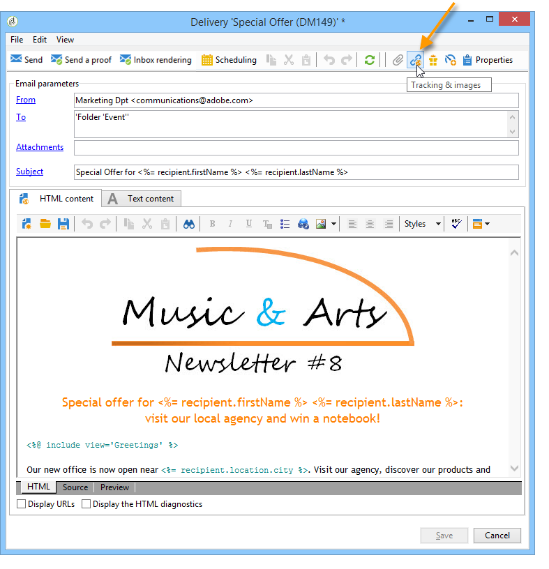
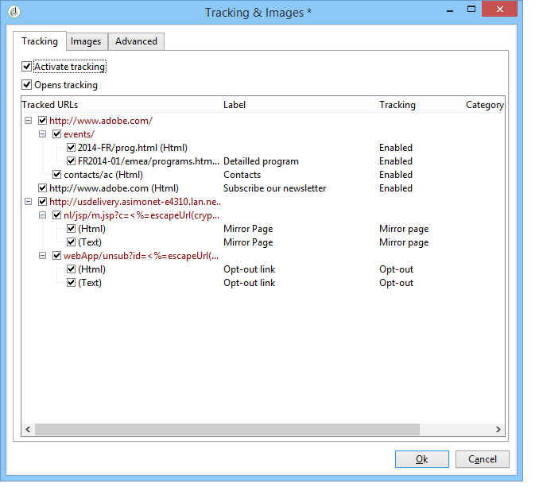
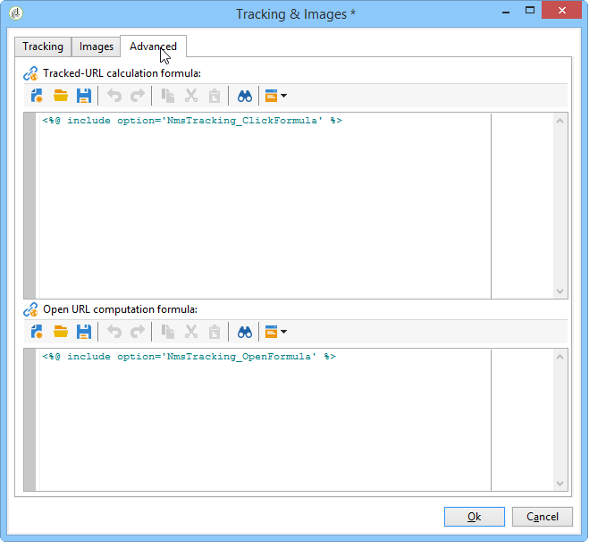

# Konfigurieren von URL-Tracking-Optionen {#personalizing-url-tracking}

Erweiterte Einstellungen für das Tracking von Nachrichten sind über das Symbol **[!UICONTROL Tracking und Bilder]** in der Symbolleiste des Versandassistenten zugänglich.

>[!NOTE]
>
>Die Verwaltung von Bildern in E-Mails wird ebenfalls in diesem Fenster konfiguriert. Siehe [Hinzufügen von Bildern](defining-the-email-content.md#adding-images).

Sie haben folgende Möglichkeiten:

* Aktivierung/Deaktivierung des URL-Trackings für alle Nachrichten;

  >[!CAUTION]
  >
  >Wenn beim Versand das Tracking nicht aktiviert ist (d. h. die Option **[!UICONTROL Tracking aktivieren]** nicht ausgewählt ist), sind keine Berichte und Daten zum Tracking verfügbar. In diesem Fall sind für Öffnungen, Klickposition und getrackte URLs keine Daten vorhanden und für den Versand werden keine **[!UICONTROL Trackinglogs]**-Tabs angezeigt.

* Aktivierung/Deaktivierung des Trackings bei Öffnung der Nachricht.

Die getrackten URLs werden im mittleren Bereich des Fensters in Form einer Baumstruktur angezeigt.

Sie können für jede URL separat das Tracking aktivieren oder deaktivieren. Weiterführende Informationen hierzu finden Sie in [diesem Abschnitt](tracked-links.md).

Im **[!UICONTROL Erweitert]**-Tab haben Sie die Möglichkeit, die Formeln zur Berechnung der getrackten URLs und der Öffnungs-URL zu personalisieren.

>[!CAUTION]
>
>Die Konfiguration der Parameter dieses Fensters sollte nur von erfahrenen Benutzern vorgenommen werden.

