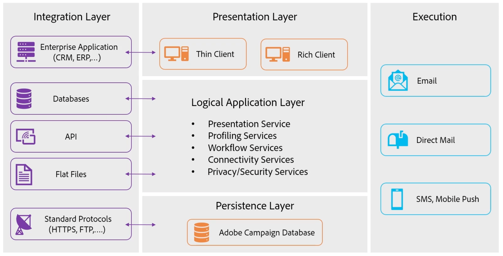
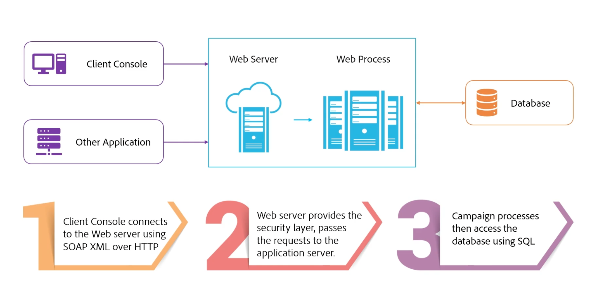
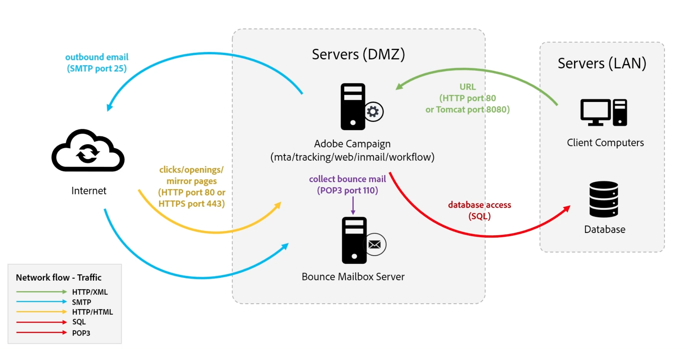

# Grundlegendes zu Komponenten und Prozessen in Campaign {#components-and-processes}

Adobe Campaign ist eine Cross-Channel-Marketing-Lösung, die E-Mail-, Mobile-, Social Media- und Offline-Kampagnen automatisiert. Adobe Campaign bietet eine zentrale Stelle für den Zugriff auf Ihre Kundendaten und -profile. Verwenden Sie Adobe Campaign, um konsistente Erlebnisse für Ihre Kunden zu orchestrieren, Ihre Marketing-Maßnahmen kanalübergreifend zu entwickeln, auszuführen und zu personalisieren und gleichzeitig die Kundenerlebnisse auf allen Geräten und an jedem Touchpoint zu verbessern. Mit Adobe Campaign können Sie mehrere Datenquellen verwalten, Zielgruppensegmente definieren und mehrstufige Cross-Channel-Kampagnen über eine visuelle Workflow-Oberfläche per Drag-and-Drop planen und ausführen.

Weitere Informationen zu Campaign finden Sie auf [dieser Seite](../start/get-started.md).

## Komponenten von Campaign {#ac-components}

Nachfolgend werden die Adobe Campaign-Komponenten und die globale Architektur beschrieben.

### Präsentationsebene{#presentation-layer}

Sie können über einen Rich-Client, einen Thin-Client oder eine API-Integration auf Adobe Campaign zugreifen.

* Rich-Client

  Der Campaign Rich-Client ist eine native Anwendung, die über Standard-Internetprotokolle wie SOAP und HTTP mit dem Adobe Campaign-Anwendungs-Server kommuniziert. [Erfahren Sie mehr über die Campaign-Client-Konsole](../start/connect.md).

* Thin-Client

  Mit den Web-basierten Adobe Campaign-Zugriffsfunktionen können Sie über eine HTML-Benutzeroberfläche mit einem Webbrowser auf eine Teilmenge von Campaign-Funktionen zugreifen. Verwenden Sie diese Web-Benutzeroberfläche, um auf Berichte zuzugreifen, Nachrichten zu steuern und zu validieren, auf Monitoring-Dashboards zuzugreifen und vieles mehr.  [Erfahren Sie mehr über den Web-basierten Zugriff auf Campaign](../start/connect.md).

* Externe Anwendungen mit APIs

  In bestimmten Fällen kann das System über die via SOAP-Protokoll bereitgestellten Web Services-APIs von einem externen Programm aus aufgerufen werden. [Erfahren Sie mehr über Campaign-APIs](../dev/api.md).

### Persistenzebene{#persistance-layer}

Campaign-Datenbanken werden als Persistenzebenen verwendet und enthalten fast alle von Adobe Campaign verwalteten Informationen und Daten. Dazu gehören: Funktionsdaten wie Profile, Abonnements, Inhalte, technische Daten wie Versandaufträge und -Logs, Trackinglogs; und Arbeitsdaten (Käufe, Leads).

Die Zuverlässigkeit der Datenbank ist von größter Bedeutung, da die meisten Adobe Campaign-Komponenten Zugriff auf die Datenbank benötigen, damit sie ihre Aufgaben ausführen können (mit Ausnahme des Umleitungsmoduls).

### Logische Anwendungsebene{#logical-app-layer}

Die logische Anwendungsebene von Campaign kann einfach konfiguriert werden, um komplexen geschäftlichen Anforderungen gerecht zu werden. Sie können Campaign als zentrale Plattform mit verschiedenen Anwendungen verwenden, die zu einer offenen und skalierbaren Architektur kombiniert werden. Jede Campaign-Instanz ist eine Sammlung von Prozessen in der Anwendungsebene, von denen einige freigegeben und einige dediziert sind.

## Campaign Managed Cloud Services{#ac-managed-services}

Adobe Campaign v8 wird als Managed Service bereitgestellt: Alle Komponenten von Adobe Campaign, einschließlich der Benutzeroberfläche, der Ausführungsverwaltungs-Engine und der Campaign-Datenbanken, werden vollständig von Adobe gehostet, einschließlich E-Mail-Ausführung, Mirrorseiten, Tracking-Server und nach außen gerichtete Web-Komponenten wie die Abmelde-Seite bzw. das Präferenzcenter und Landingpages.

## Prozesse in Campaign

Der Campaign-Webserver steuert den Zugriff auf Campaign-Web-Prozesse. JavaScript ist die Server-seitige Sprache, die für zentrale Produktfunktionen und die Anpassung verwendet wird. Tomcat ist die Back-End-Engine und im Rahmen des Web-Prozesses in das Campaign-Produkt eingebettet. JavaScript wird beispielsweise auf JSP- oder JSSP-Seiten zum Rendern dynamischer Inhalte verwendet.

Die Campaign Client-Konsole stellt eine Verbindung mit dem Webserver her, indem sie SOAP XML über HTTP verwendet. Der Webserver stellt die Sicherheitsebene bereit und übergibt die Anfragen mithilfe von JavaScript an die Anwendungsebene, und die internen Prozesse von Campaign greifen mithilfe von SQL auf die Datenbank zu.

<!--
The overall communication between Campaign processes are described in the following standalone deployment diagram: all Campaign components are installed in the same machine.

-->

Der Benutzer stellt mithilfe von HTTP eine Verbindung zum Campaign-Anwendungs-Server her. Alle Daten und Informationen werden in der Campaign-Datenbank verwaltet. Wenn ein Campaign-Entwickler Änderungen an der Konfiguration durchführt, werden diese in der Datenbank erfasst. Wenn ein Marketer eine neue Kampagne erstellt, werden alle mit dieser neuen Kampagne verbundenen Informationen und Daten ebenfalls in der Datenbank verwaltet. Wenn ein Marketer eine Kampagne ausführt, werden vom Campaign-Server über den SMTP-Server E-Mail-Sendungen an Profile durchgeführt. Wenn Profile mit E-Mail-Sendungen interagieren, wie etwa beim Öffnen einer E-Mail, werden Tracking-Daten an den Tracking-Server zurückgesendet.

[Erfahren Sie mehr über die Prozesse in Campaign](../architecture/general-architecture.md#dev-env).
