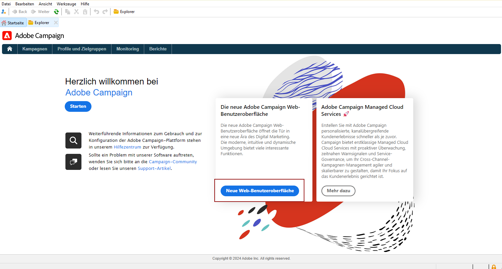
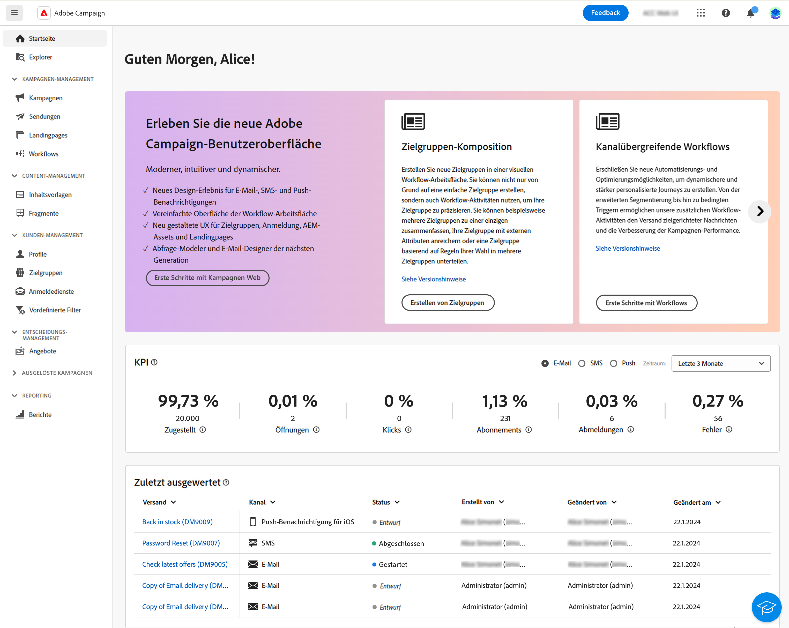

# Erkunden der Benutzeroberfläche {#ui-client-console}

Sie können über die Client-Konsole oder die Web-Benutzeroberfläche auf Adobe Campaign zugreifen. Sie können auch APIs verwenden, um Daten zu verwalten und Aufgaben in Ihrer Campaign-Plattform auszuführen.

>[!CAUTION]
>
>Diese Dokumentation konzentriert sich auf die Verwendung der Campaign-Client-Konsole. Weitere Informationen zur Verwendung der Campaign Web-Benutzeroberfläche finden Sie in [dieser Dokumentation](https://experienceleague.adobe.com/docs/campaign-web/v8/campaign-web-home.html?lang=de){target="_blank"}.

* **Client-Konsole**: Die Client-Konsole ist eine native Anwendung, die über Standard-Internet-Protokolle wie SOAP und HTTP mit dem Adobe Campaign-Anwendungs-Server kommuniziert. In der Campaign Client-Konsole sind alle Funktionen und Einstellungen verfügbar. Sie erfordert eine minimale Bandbreite, da sie auf einem lokalen Cache beruht. Die Campaign-Client-Konsole, die für eine einfache Bereitstellung entwickelt wurde, kann über einen Internet-Browser bereitgestellt werden sowie automatisch aktualisiert werden und erfordert keine spezielle Netzwerkkonfiguration, da sie nur HTTP(S)-Traffic erzeugt. [Weitere Informationen](#ui-access)

  Weitere Informationen dazu, wie Sie die Campaign Client-Konsole installieren und konfigurieren können, finden Sie in [diesem Abschnitt](../start/connect.md).

* **Web-Benutzeroberfläche**: Als Benutzerin oder Benutzer von Campaign v8 haben Sie jetzt ab v8.6.1 Zugriff auf eine Web-Umgebung, die über die zentrale Benutzeroberfläche von Adobe Experience Cloud verfügbar ist. Sie können dann über einen Webbrowser eine Verbindung zu Adobe Campaign herstellen. Auf dieser neuen Benutzeroberfläche können Sie wichtige Marketing-Aktionen erstellen, verwalten und ausführen. Es sind jedoch nicht alle Campaign-Funktionen verfügbar. [Weitere Informationen](#ac-web-ui).

  >[!AVAILABILITY]
  >
  >Die Web-Benutzeroberfläche von Campaign steht nur Benutzenden zur Verfügung, die über ihre Adobe ID eine Verbindung zu Adobe Campaign herstellen. Erfahren Sie mehr über das [Adobe Identity Management System (IMS)](https://helpx.adobe.com/de/enterprise/using/identity.html){target="_blank"}.
  >

* **Web-Zugriff**: Mit den Web-basierten Adobe Campaign-Zugriffsfunktionen können Sie über eine HTML-Benutzeroberfläche mit einem Webbrowser auf eine Teilmenge von Campaign-Funktionen zugreifen. Verwenden Sie diese Web-Benutzeroberfläche, um auf Berichte zuzugreifen, Nachrichten zu steuern und zu validieren, auf Monitoring-Dashboards zuzugreifen und vieles mehr. Weitere Informationen zum Web-basierten Zugriff auf Campaign finden Sie [in diesem Abschnitt](../start/connect.md#web-access).

* **APIs**: In bestimmten Fällen kann das System über die via SOAP-Protokoll bereitgestellten Web Services-APIs von einer externen Anwendung aus aufgerufen werden. Weitere Informationen zu Campaign-APIs finden Sie [auf dieser Seite](../dev/api.md).

## Arbeiten mit der Client-Konsole {#ui-access}

Die Campaign-Client-Konsole ist eine native Anwendung, die über Standard-Internet-Protokolle wie SOAP und HTTP mit dem Adobe Campaign-Anwendungs-Server kommuniziert. In der Campaign Client-Konsole sind alle Funktionen und Einstellungen verfügbar. Sie erfordert eine minimale Bandbreite, da sie auf einem lokalen Cache beruht. Die Campaign-Client-Konsole, die für eine einfache Bereitstellung entwickelt wurde, kann über einen Internet-Browser bereitgestellt werden sowie automatisch aktualisiert werden und erfordert keine spezielle Netzwerkkonfiguration, da sie nur HTTP(S)-Traffic erzeugt.  [Weitere Informationen zur Campaign-Client-Konsole](../start/connect.md). Sie können von der dedizierten Karte auf der Startseite der Client-Konsole zur Campaign Web-Benutzeroberfläche wechseln.

>[!NOTE]
>
>Wenn die neue Zugriffskarte nicht angezeigt wird, stellen Sie sicher, dass die folgenden Felder in Ihrem externen Adobe Experience Cloud-Konto nicht leer sind: **Server**, **Mandant**, **Callback-Server** und **Zuordnungsmarke**.

Sie können auch einen Webbrowser verwenden, um auf Campaign zuzugreifen. In diesem Zusammenhang ist nur ein Teil der Campaign-Funktionen verfügbar. [Weitere Informationen](#web-browser)

### Durchsuchen der Benutzeroberfläche {#ui-browse}

Sobald Sie mit der Client-Konsole von Campaign verbunden sind, gelangen Sie auf die Startseite. Klicken Sie auf die Links, um auf Funktionen zuzugreifen. Die in der Benutzeroberfläche verfügbaren Funktionen hängen von Ihren Optionen und Berechtigungen ab.

Über die Links im mittleren Bereich der Startseite können Sie auf die Hilfematerialien von Campaign, die Community und die Support-Website zugreifen. Verwenden Sie die zentralen Karten, um die neue Campaign Web-Benutzeroberfläche und das Campaign Control Panel zu durchsuchen.

Klicken Sie auf die Registerkarten im oberen Abschnitt, um auf die wichtigsten Funktionen von Campaign zuzugreifen:

>[!NOTE]
>
>Die Liste der Hauptfunktionen, auf die Sie zugreifen können, hängt von Ihren Berechtigungen und Ihrer Implementierung ab.

Im Abschnitt **[!UICONTROL Browsen]** können Sie für jede Funktion auf die wichtigsten Optionen zugreifen. Der Link **[!UICONTROL Mehr]** ermöglicht den Zugriff auf alle anderen Komponenten.

Wenn Sie beispielsweise zur Registerkarte **[!UICONTROL Profile und Zielgruppen]** gehen, können Sie auf die Empfängerlisten, Abonnements, existierende Zielgruppen-Workflows und die Verknüpfungen zur Erstellung dieser Komponenten zugreifen.

Wenn Sie ein Element auf dem Bildschirm auswählen, wird es in eine neue Registerkarte geladen, sodass Sie Inhalte einfach durchsuchen können.

### Erstellen eines Elements {#create-an-element}

Verwenden Sie im Abschnitt **[!UICONTROL Erstellen]** auf der linken Bildschirmseite Tastaturbefehle, um neue Elemente hinzufügen. Sie können auch den Button **[!UICONTROL Erstellen]** oberhalb der Liste verwenden, um der aktuellen Liste neue Elemente hinzuzufügen.

Nutzen Sie beispielsweise auf der Seite der Sendungen die Schaltfläche **[!UICONTROL Erstellen]**, um einen neuen Versand anzulegen.

<!--
## Use a web browser {#web-browser}

You can also access a subset of Campaign capabilities through the a web browser.

The web access interface is similar to the console interface. From a browser, you can use the same navigation and display features as in the console, but you can perform only a reduced set of actions on campaigns. For example, you can view and cancel campaigns, but you cannot modify campaigns. 

[Learn more about Campaign web access](../start/connect.md#web-access).-->

### Zugriff auf Campaign Explorer {#ac-explorer-ui}

Durchsuchen Sie den Campaign Explorer, um auf alle Funktionen und Einstellungen von Adobe Campaign zuzugreifen.

In diesem Arbeitsbereich können Sie auf die Explorer-Baumstruktur zugreifen, um alle Funktionen und Optionen zu durchsuchen.

* Im linken Bereich wird die Baumstruktur des Campaign-Explorers angezeigt. Dort können Sie basierend auf Ihren Berechtigungen alle Komponenten und Einstellungen Ihrer Instanz durchsuchen. Sie können Ordner hinzufügen und anpassen, wie auf [dieser Seite](../audiences/folders-and-views.md) beschrieben.

* Im oberen Bereich wird die Liste der Einträge des aktuellen Ordners angezeigt. Diese Listen können vollständig angepasst werden. [Weitere Informationen](../config/ui-settings.md)

* Im unteren Bereich werden die Details des ausgewählten Eintrags angezeigt.

## Campaign Web-Benutzeroberfläche {#ac-web-ui}

Als Benutzerin oder Benutzer der Campaign v8-Client-Konsole haben Sie ab v8.6.1 Zugriff auf eine Web-Umgebung, die über die zentrale Benutzeroberfläche von Adobe Experience Cloud verfügbar ist. Experience Cloud ist die integrierte Familie von Anwendungen, Produkten und Diensten von Adobe für das digitale Marketing. Über die intuitive Benutzeroberfläche können Sie schnell auf Ihre Cloud-Anwendungen, Produktfunktionen und Dienste zugreifen.

>[!AVAILABILITY]
>
>Die Web-Benutzeroberfläche von Campaign steht nur Benutzenden zur Verfügung, die über ihre Adobe ID eine Verbindung zu Adobe Campaign herstellen. Erfahren Sie mehr über das [Adobe Identity Management System (IMS)](https://helpx.adobe.com/de/enterprise/using/identity.html){target="_blank"}.
>

Weitere Informationen über die neue Campaign Web-Benutzeroberfläche finden Sie in [dieser Dokumentation](https://experienceleague.adobe.com/docs/campaign-web/v8/campaign-web-home.html?lang=de){target="_blank"}.

Zusätzliche und erweiterte Funktionen, Konfigurationen und Einstellungen sind nur in der Client-Konsole verfügbar. Weitere Informationen über die verfügbaren Funktionen in beiden Benutzeroberflächen finden Sie [in der Dokumentation der Campaign Web-Benutzeroberfläche](https://experienceleague.adobe.com/docs/campaign-web/v8/start/capability-matrix.html?lang=de){target="_blank"}.

## Unterstützte Sprachen {#languages}

Die unterstützten Sprachen hängen von der Benutzeroberfläche ab.

* Für die Benutzeroberfläche der Client-Konsole von Campaign v8 werden folgende Sprachen unterstützt:

   * Englisch (UK)
   * Englisch (US)
   * Französisch
   * Deutsch
   * Japanisch

  >[!CAUTION]
  >
  >Die Sprache wird während der Installation ausgewählt und kann danach nicht mehr geändert werden.

* Weitere Informationen zu den unterstützten Sprachen für die Campaign Web-Benutzeroberfläche finden Sie [auf dieser Seite](https://experienceleague.adobe.com/docs/campaign-web/v8/start/connect-to-campaign.html?lang=de#language-pref){target="_blank"}.

Die Sprachauswahl beeinflusst Datums- und Uhrzeitformate.

Die Hauptunterschiede zwischen US-amerikanischem Englisch und britischem Englisch sind:

<table> 
 <thead> 
  <tr> 
   <th> Formate  </th> 
   <th> Englisch (US)  </th> 
   <th> Englisch (EN)  </th> 
  </tr> 
 </thead> 
 <tbody> 
  <tr> 
   <td> Datum  </td> 
   <td> Woche beginnt am Sonntag  </td> 
   <td> Woche beginnt am Montag  </td> 
  </tr> 
  <tr> 
   <td> Kurzform des Datums  </td> 
   <td> 
%2M/%2D/%4Y

<strong>z. B.: 09/25/2018</strong>
 </td> 
   <td> 
%2D/%2M/%4Y

<strong>z. B.: 25/09/2018</strong>
 </td> 
  </tr> 
  <tr> 
   <td> Kurzform des Datums mit Uhrzeit  </td> 
   <td> 
%2M/%2D/%4Y %I:%2N:%2S %P

<strong>z. B.: 09/25/2018 10:47:25 PM</strong>
 </td> 
   <td> 
%2D/%2M/%4Y %2H:%2N:%2S

<strong>z. B.: 25/09/2018 22:47:25</strong>
 </td> 
  </tr> 
 </tbody> 
</table>
