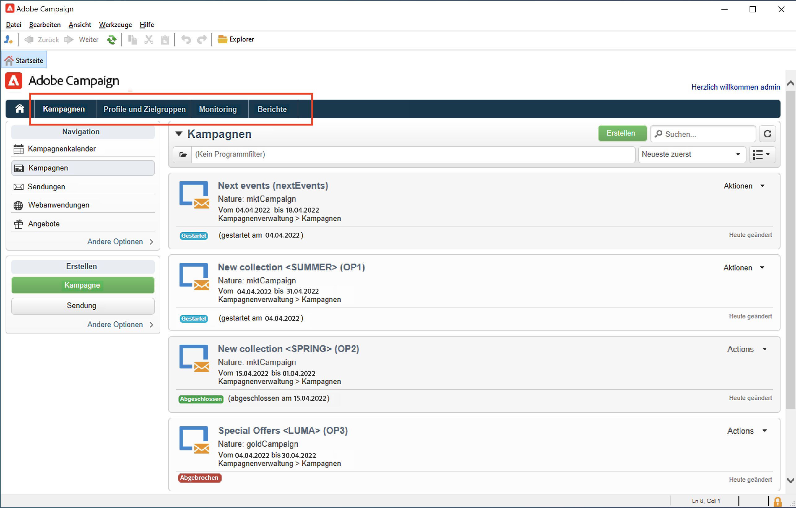
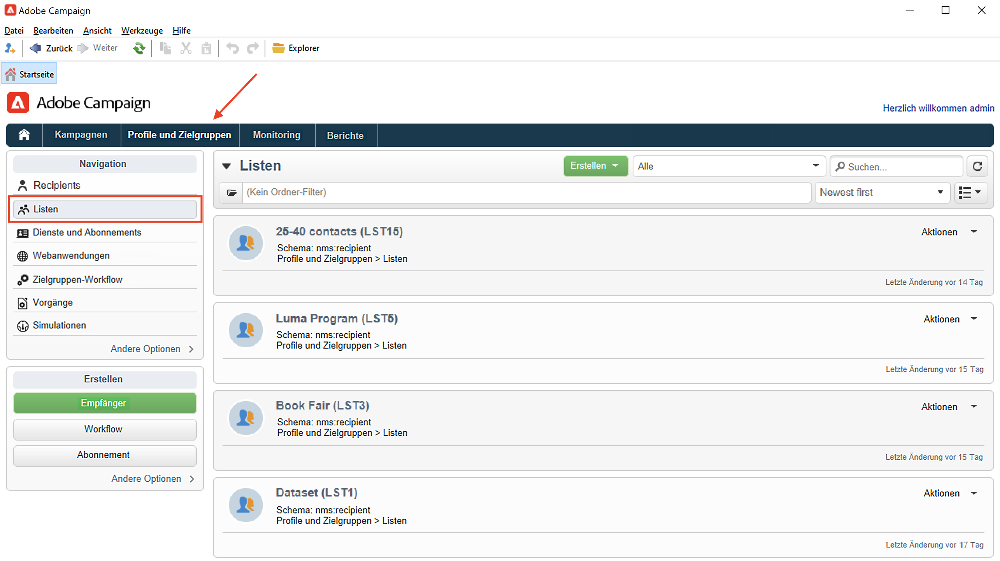
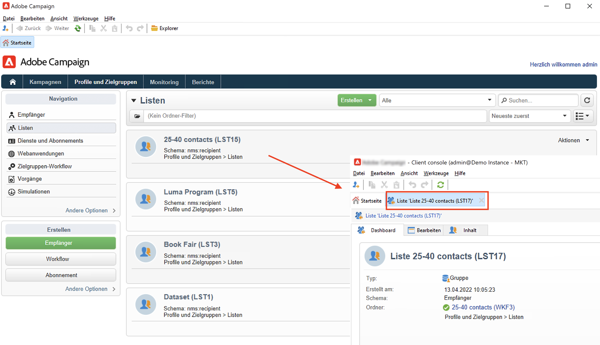
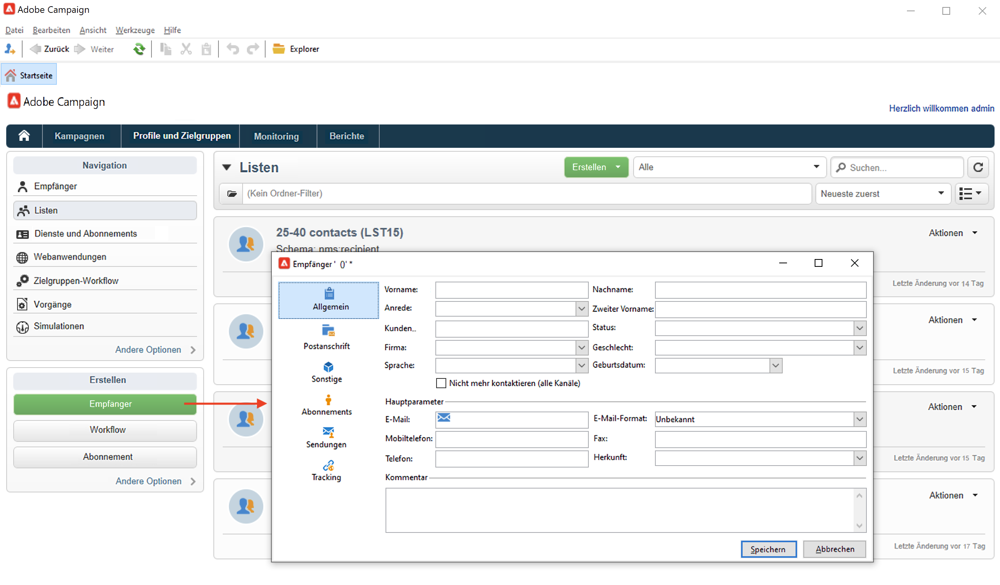
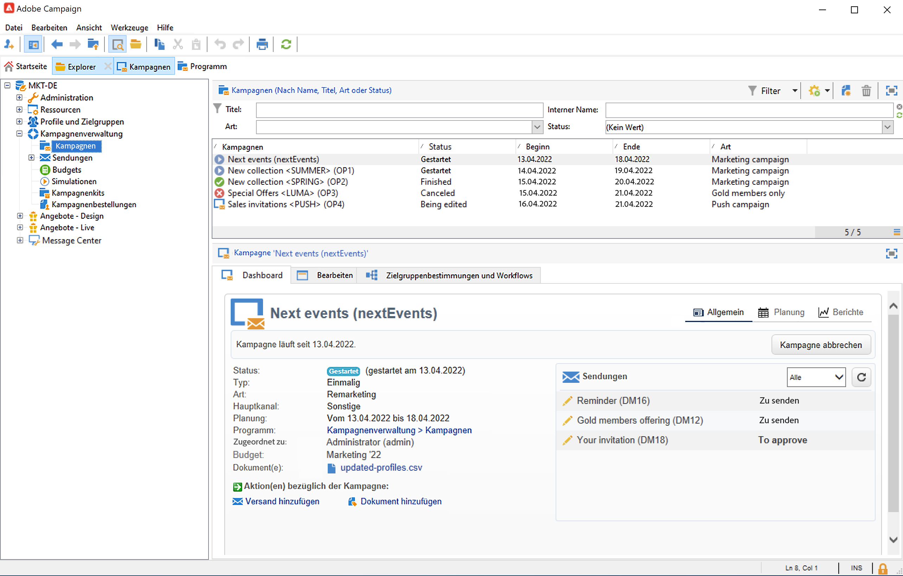

# Benutzeroberfläche von Campaign kennenlernen

## Zugriff auf die Campaign-Benutzeroberfläche

Der Campaign-Arbeitsbereich ist über die [Client-Konsole](../architecture/general-architecture.md) aufrufbar.

Weitere Informationen dazu, wie Sie die Campaign Client-Konsole installieren und konfigurieren können, finden Sie in [diesem Abschnitt](../start/connect.md).

Sie können auch einen Webbrowser verwenden, um auf Campaign zuzugreifen. In diesem Zusammenhang ist nur ein Teil der Campaign-Funktionen verfügbar. [Weitere Informationen](#web-browser)

## Durchsuchen der Benutzeroberfläche

Sobald Sie mit Campaign verbunden sind, gelangen Sie auf die Startseite. Durchsuchen Sie die Links, um auf Funktionen zuzugreifen. Die in der Benutzeroberfläche verfügbaren Funktionen hängen von Ihren Optionen und Berechtigungen ab.

Über die Links im mittleren Bereich der Startseite können Sie auf die Hilfematerialien von Campaign, die Community und die Support-Website zugreifen.

Über die Registerkarten im oberen Abschnitt können Sie die wichtigsten Funktionen von Campaign durchsuchen:

>[!NOTE]
>
>Die Liste der Hauptfunktionen, auf die Sie zugreifen können, hängt von Ihren Berechtigungen und Ihrer Implementierung ab.

Im Abschnitt **[!UICONTROL Browsen]** können Sie für jede Funktion auf die wichtigsten Optionen zugreifen. Der Link **[!UICONTROL Mehr]** ermöglicht den Zugriff auf alle anderen Komponenten.

Wenn Sie beispielsweise zur Registerkarte **[!UICONTROL Profile und Zielgruppen]** gehen, können Sie auf die Empfängerlisten, Abonnements, existierende Zielgruppen-Workflows und die Verknüpfungen zur Erstellung dieser Komponenten zugreifen.

Wenn Sie ein Element auf dem Bildschirm auswählen, wird es in eine neue Registerkarte geladen, sodass Sie Inhalte einfach durchsuchen können.

## Erstellen eines Elements {#create-an-element}

Verwenden Sie im Abschnitt **[!UICONTROL Erstellen]** auf der linken Bildschirmseite Tastaturbefehle, um neue Elemente hinzufügen. Sie können auch den Button **[!UICONTROL Erstellen]** oberhalb der Liste verwenden, um der aktuellen Liste neue Elemente hinzuzufügen.

Nutzen Sie beispielsweise auf der Seite der Sendungen die Schaltfläche **[!UICONTROL Erstellen]**, um einen neuen Versand anzulegen.

## Verwenden eines Webbrowsers {#web-browser}

Sie können auch über einen Webbrowser auf eine Untergruppe von Campaign-Funktionen zugreifen.

Die Benutzeroberfläche für den Web-Zugriff ähnelt der Benutzeroberfläche der Konsole. Von einem Browser aus können Sie dieselben Funktionen zum Navigieren und Anzeigen wie in der Konsole verwenden, aber Sie können nur einen reduzierten Satz von Aktionen für Kampagnen durchführen. Sie können beispielsweise Kampagnen anzeigen und abbrechen, aber keine Kampagnen ändern.

 [Erfahren Sie mehr über den Web-basierten Zugriff auf Campaign](../start/connect.md#web-access).

## Zugriff auf Campaign Explorer {#ac-explorer-ui}

Durchsuchen Sie den Campaign Explorer, um auf alle Funktionen und Einstellungen von Adobe Campaign zuzugreifen.

In diesem Arbeitsbereich können Sie auf die Explorer-Baumstruktur zugreifen, um alle Funktionen und Optionen zu durchsuchen.

Im linken Bereich wird die Campaign Explorer-Baumstruktur angezeigt. Dort können Sie basierend auf Ihren Berechtigungen alle Komponenten und Einstellungen Ihrer Instanz durchsuchen.

Im oberen Bereich wird die Liste der Einträge des aktuellen Ordners angezeigt. Diese Listen können vollständig angepasst werden. [Weitere Informationen](customize-ui.md)

Im unteren Bereich werden die Details des ausgewählten Eintrags angezeigt.

## Sprachen

Die Benutzeroberfläche von Campaign v8 ist in den folgenden Sprachen verfügbar:

* Englisch (UK)
* Englisch (US)
* Französisch
* Deutsch
* Japanisch

Die Sprache wird während des Installationsprozesses ausgewählt.

>[!CAUTION]
>
>Die Sprache kann nach der Instanzerstellung nicht mehr geändert werden.

Die Sprachauswahl beeinflusst Datums- und Uhrzeitformate.

Die Hauptunterschiede zwischen US-amerikanischem Englisch und britischem Englisch sind:

<table> 
 <thead> 
  <tr> 
   <th> Formate  </th> 
   <th> Englisch (US)  </th> 
   <th> Englisch (EN)  </th> 
  </tr> 
 </thead> 
 <tbody> 
  <tr> 
   <td> Datum  </td> 
   <td> Woche beginnt am Sonntag  </td> 
   <td> Woche beginnt am Montag  </td> 
  </tr> 
  <tr> 
   <td> Kurzform des Datums  </td> 
   <td> 
%2M/%2D/%4Y

<strong>z. B.: 09/25/2018</strong>
 </td> 
   <td> 
%2D/%2M/%4Y

<strong>z. B.: 25/09/2018</strong>
 </td> 
  </tr> 
  <tr> 
   <td> Kurzform des Datums mit Uhrzeit  </td> 
   <td> 
%2M/%2D/%4Y %I:%2N:%2S %P

<strong>z. B.: 09/25/2018 10:47:25 PM</strong>
 </td> 
   <td> 
%2D/%2M/%4Y %2H:%2N:%2S

<strong>z. B.: 25/09/2018 22:47:25</strong>
 </td> 
  </tr> 
 </tbody> 
</table>
