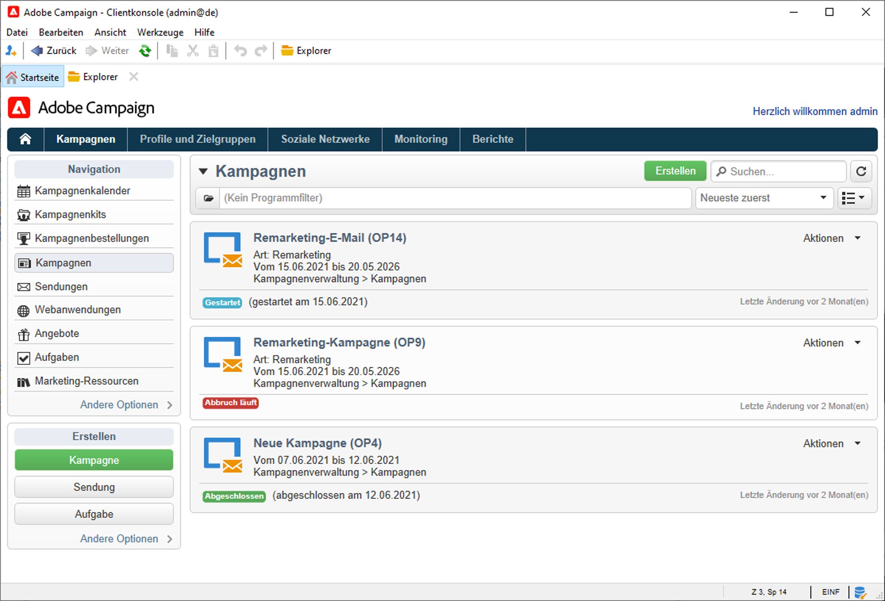
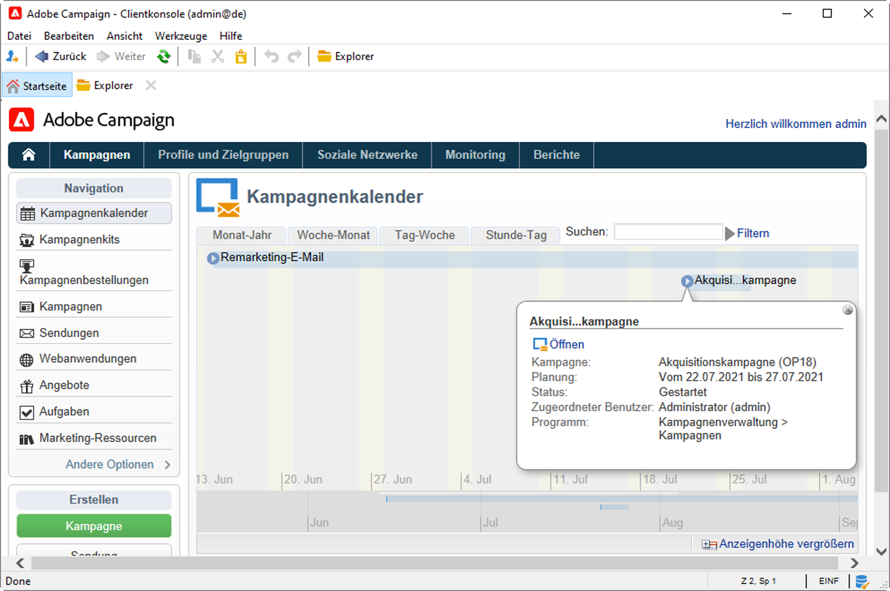
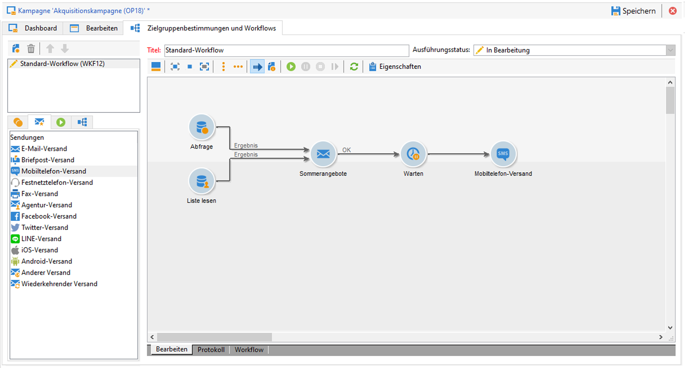
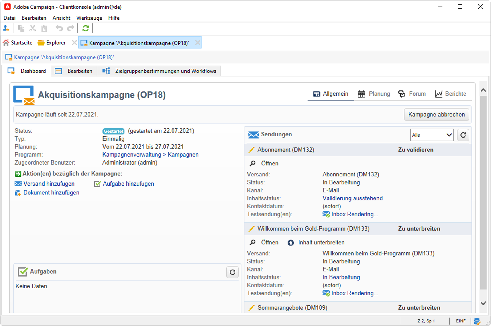

# Erste Schritte mit Marketing-Kampagnen{#gs-ac-campaigns}

Adobe Campaign umfasst mehrere Lösungen, mit denen Sie Kampagnen personalisieren und auf allen Online- und Offline-Kanälen versenden können. Sie können Marketing-Kampagnen erstellen, konfigurieren, ausführen und analysieren. Alle Marketing-Kampagnen können von einem einheitlichen Kontrollzentrum aus verwaltet werden. In diesem Abschnitt erfahren Sie, wie Sie Marketing-Kampagnen durchsuchen und erstellen können.

Kampagnen umfassen Aktionen (Sendungen) und Prozesse (Import oder Extraktion von Dateien) sowie Ressourcen (Marketing-Dokumente, Versandentwürfe). Sie werden in Marketing-Kampagnen verwendet. Kampagnen sind Teil eines Programms und Programme Teil eines Kampagnenplans.

## Kanalübergreifende Orchestrierung einer Kampagne

Adobe Campaign unterstützt Sie bei der Konzeption und Orchestrierung von zielgerichteten und personalisierten Kampagnen auf verschiedenen Kanälen: E-Mail, Briefpost, SMS und Push-Benachrichtigung. Über nur eine Oberfläche können Sie all Ihre Kampagnen und Kommunikationen planen, orchestrieren, konfigurieren, personalisieren, automatisieren, ausführen und messen.

### Grundbegriffe

Bevor Sie mit der Implementierung von Marketing-Kampagnen beginnen, müssen Sie mit den folgenden Begriffen vertraut sein:

* **Marketing-Kampagne**: Eine Kampagne zentralisiert alle Elemente im Zusammenhang mit einer Marketing-Kampagne: Versand, Zielgruppenbestimmungs-Regeln, Kosten, Exportdateien, zugehörige Dokumente usw. Jede Kampagne ist an ein Programm angehängt.

* **Programm**: Mit einem Programm können Sie Marketing-Aktionen für einen Zeitraum im Kalender definieren: Start, Canvassing, Treue usw. Jedes Programm enthält Kampagnen, die mit einem Kalender verknüpft sind, der eine Gesamtübersicht bietet.

* **Plan**: der Marketing-Plan kann mehrere Programm enthalten. Er ist an einen Zeitraum im Kalender gebunden, verfügt über zugewiesene Haushaltsmittel und kann auch mit Dokumenten und Zielen verknüpft werden.

* **Kampagnen-Workflow** ein Kampagnen-Workflow enthält Aktivitäten zum Aufbau der Kampagnen-Logik. Verwenden Sie Kampagnen-Workflows, um Audiences zu definieren und Sendungen für alle verfügbaren Kanäle zu erstellen.

* **Wiederkehrende Kampagnen**: wiederkehrende Kampagnen werden anhand einer bestimmten Vorlage erstellt, die die auszuführende Workflow-Vorlage definiert, und anhand der Ausführungsplanung.

* **Periodische Kampagnen**: eine periodische Kampagne ist eine Kampagne, die automatisch nach der Ausführungsplanung ihrer Vorlage erstellt wird.

## Marketing-Kampagnen-Arbeitsbereich

Adobe Campaign ermöglicht die Erstellung, Konfiguration, Ausführung und Analyse von Marketing-Kampagnen über ein einheitliches Kontrollzentrum.

[!DNL :arrow_upper_right:] In der [Dokumentation zu Campaign Classic v7](https://experienceleague.adobe.com/docs/campaign-classic/using/orchestrating-campaigns/about-marketing-campaigns/accessing-marketing-campaigns.html?lang=de#orchestrating-campaigns) erfahren Sie, wie Sie auf Marketing-Kampagnen zugreifen und diese implementieren können.{target=&quot;_blank&quot;}

## Wichtige Schritte zum Beginn

Die wichtigsten Schritte zur Erstellung einer Cross-Channel-Marketing-Kampagne sind:

1. **Planen und Entwerfen von Marketing-Programmen und -Kampagnen**

   Definieren Sie Hierarchie und Zeitplan, stellen Sie Budget ein, fügen Sie Ressourcen hinzu, wählen Sie Benutzer aus.

   [!DNL :arrow_upper_right:] In der [Dokumentation zu Campaign Classic v7](https://experienceleague.adobe.com/docs/campaign-classic/using/orchestrating-campaigns/orchestrate-campaigns/setting-up-marketing-campaigns.html?lang=de#creating-plan-and-program-hierarchy) erfahren Sie, wie Sie einen Marketing-Plan erstellen und Kampagnen konfigurieren.{target=&quot;_blank&quot;}

   Alle Marketing-Kampagnen basieren auf einer Vorlage, in der die Haupteinstellungen und -funktionen gespeichert sind. Es wird eine native Vorlage bereitgestellt, mit der Sie eine Kampagne erstellen können, für die keine bestimmte Konfiguration definiert wurde. Sie können Ihre Kampagnenvorlagen erstellen und konfigurieren und dann Kampagnen aus diesen Vorlagen erstellen.

   [!DNL :arrow_upper_right:] Wie Sie mit Kampagnenvorlagen arbeiten, erfahren Sie in der [Dokumentation zu Campaign Classic v7](https://experienceleague.adobe.com/docs/campaign-classic/using/orchestrating-campaigns/orchestrate-campaigns/marketing-campaign-templates.html?lang=de#orchestrating-campaigns).{target=&quot;_blank&quot;}

   [!DNL :arrow_upper_right:] Weitere Informationen zu wiederkehrenden Kampagnen und zu ihrer Konfiguration finden Sie in der [Dokumentation zu Campaign Classic v7](https://experienceleague.adobe.com/docs/campaign-classic/using/orchestrating-campaigns/orchestrate-campaigns/setting-up-marketing-campaigns.html?lang=de#recurring-and-periodic-campaigns){target=&quot;_blank&quot;}.

1. **Audiences definieren**

   Sie können die Audience in einem Workflow erstellen oder eine bestehende Gruppe auswählen, z. B. eine Empfänger-Liste, Abonnenten eines Newsletters, Empfänger eines vorherigen Versands oder eine beliebige Filterbedingung.

   

   [!DNL :arrow_upper_right:] In der [Dokumentation zu Campaign Classic v7](https://experienceleague.adobe.com/docs/campaign-classic/using/orchestrating-campaigns/orchestrate-campaigns/marketing-campaign-target.html?lang=de#orchestrating-campaigns) erfahren Sie, wie Sie die Audience für Ihre Nachrichten definieren.{target=&quot;_blank&quot;}

1. **Sendungen erstellen**

   Wählen Sie einen oder mehrere Kanäle aus, definieren Sie den Nachrichteninhalt und starten Sie Sendungen.

   

   [!DNL :arrow_upper_right:] In der [Dokumentation zu Campaign Classic v7](https://experienceleague.adobe.com/docs/campaign-classic/using/orchestrating-campaigns/orchestrate-campaigns/marketing-campaign-deliveries.html?lang=de#creating-deliveries) erfahren Sie, wie Sie Sendungen für Marketing-Kampagnen erstellen und starten.{target=&quot;_blank&quot;}

   Sie können einer Kampagne verschiedene Dokumente zuordnen: Bericht, Foto, Web-Seite, Diagramm usw.

   [!DNL :arrow_upper_right:] In der [Dokumentation zu Campaign Classic v7](https://experienceleague.adobe.com/docs/campaign-classic/using/orchestrating-campaigns/orchestrate-campaigns/marketing-campaign-assets.html?lang=de#adding-documents) erfahren Sie mehr über zugeordnete Dokumente.{target=&quot;_blank&quot;}

1. **Einrichten des Validierungsprozesses**

   Adobe Campaign ermöglicht den Einsatz von partizipativen Validierungsprozessen für die wichtigsten Etappen einer Marketing-Kampagne. Für jede Kampagne können Sie die Versandzielgruppe, den Inhalt und die Kosten validieren. Die für die Validierung zuständigen Adobe Campaign-Benutzer können per E-Mail benachrichtigt werden und eine Validierung über die Konsole oder eine Internet-Verbindung annehmen oder ablehnen.

   [!DNL :arrow_upper_right:] In der [Dokumentation zu Campaign Classic v7](https://experienceleague.adobe.com/docs/campaign-classic/using/orchestrating-campaigns/orchestrate-campaigns/marketing-campaign-approval.html?lang=de#orchestrating-campaigns) erfahren Sie, wie Sie Validierungen einrichten und verwalten können.{target=&quot;_blank&quot;}

