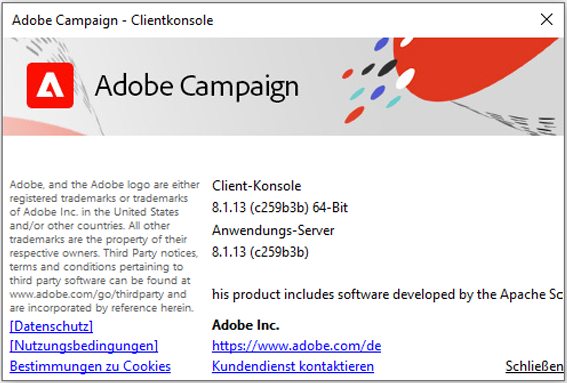

# Kompatibilitätsmatrix für Campaign v8

In diesem Dokument werden alle Systeme und Komponenten aufgelistet, die für den aktuellen Build von **Adobe Campaign v8** unterstützt werden. Sofern nicht anders angegeben, werden alle Nebenversionen unterstützt. Produkte und Versionen, die nicht in dieser Liste enthalten sind, sind nicht mit Adobe Campaign kompatibel.

Wenn bestimmte Versionen dieser Drittanbietersysteme und -Tools das Ende des Lebenszyklus (End of Life, EOL) erreichen, ist Adobe Campaign nicht mehr mit ihnen kompatibel. Diese Versionen werden daher mit der nächsten Produktversion aus unserer Kompatibilitätsmatrix entfernt. Verwenden Sie, um Probleme zu vermeiden, ausschließlich unterstützte Versionen von Systemen, die in der Kompatibilitätsmatrix aufgeführt sind.

>[!NOTE]
>
>Adobe Campaign Server und die Client-Konsole müssen dieselbe Version verwenden. [Erfahren Sie, wie Sie Ihre Version überprüfen](#version).

## Client-Konsole{#ClientConsoleoperatingsystems}

Für die Nutzung der Campaign-Client-Konsole sind die folgenden Betriebssysteme und Browser erforderlich. [Weitere Informationen](connect.md).

>[!NOTE]
>
>Beachten Sie, dass die 32-Bit-Version der Client Console in Version 8.5 nicht mehr unterstützt wird. Ab 8.6 ist die Client-Konsole nur noch in 64 Bit verfügbar. Weitere Informationen zum Upgrade Ihres Betriebssystems finden Sie in diesem [Technote](https://experienceleague.adobe.com/docs/campaign/technotes-ac/tn-new/console.html).

### Betriebssysteme{#op-systems}

* **Microsoft Windows Server** 2019, 2016, 2012
* **Microsoft Windows** 11, 10, 8

### Webbrowser{#web-browsers}

* **Microsoft Edge**

* **Microsoft Edge WebView2**, neueste Version. Sie kann von der [Microsoft Developer-Website](http://www.adobe.com/go/acc-ms-webview2-runtime-download_de){target="_blank"} heruntergeladen werden.

## CRM-Connectoren{#CRMconnectors}

Die folgenden CRM-Systeme (Customer Relationship Management) sind mit Adobe Campaign kompatibel. [Weitere Informationen](../connect/crm.md).

* **Salesforce**-Connector-API, Version 49
* **Microsoft Dynamic**-Connector, Web API: Dynamics 365 On-Premise und Online

## Federated Data Access (FDA){#FederatedDataAccessFDA}

Die folgenden externen Datenbanken sind mit dem Adobe Campaign Federated Data Access (FDA)-Modul kompatibel. [Weitere Informationen](../connect/fda.md).

* **Amazon Redshift**
* **[!DNL Google Big Query]**
* **[!DNL Snowflake]**
* **[!DNL Vertica]**

## Mobile SDK{#MobileSDK}

Zum Senden von [Push-Benachrichtigungen](../send/push.md) mit Campaign können Sie das Adobe Experience Platform Mobile SDK verwenden, indem Sie die Adobe Campaign-Erweiterung in der Benutzeroberfläche „Datenerfassung“ konfigurieren.

## Web-Zugriff{#web-access}

Die folgenden Browser sind mit Campaign für den [Web-Zugriff](connect.md#web-access) kompatibel.

* **Microsoft Edge**, **Mozilla Firefox**, **Google Chrome**, **Safari** (neueste Versionen)

## So überprüfen Sie Ihre Campaign-Version    und den Build{#version}

Öffnen Sie das Menü **Hilfe > Über...**, um Ihre Version zu überprüfen.

Sie erhalten folgende Informationen:

* **Versionsnummer** der Client-Konsole und des Anwendungs-Servers. Im obigen Beispiel wird Version 8.1.5 der Client-Konsole und des Anwendungs-Servers verwendet.
* Die SHA-Nummer zwischen Klammern
* Link zur Adobe-Kundenunterstützung
* Links zur Adobe-Datenschutzrichtlinie sowie zu Nutzungsbedingungen und Bestimmungen zu Cookies.
