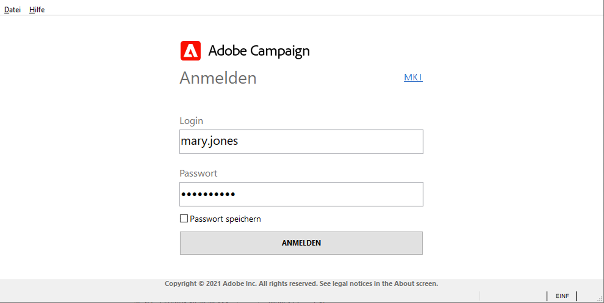

# Verbinden mit Adobe Campaign v8{#gs-ac-connect}

Die Campaign Client Console ist ein Rich-Client, mit dem Sie eine Verbindung zu Ihren Campaign-Anwendungsservern herstellen können.

Bevor Sie beginnen, müssen Sie:

* Überprüfen Sie die Kompatibilität Ihrer Systeme und Tools mit Adobe Campaign in der [Kompatibilitätsmatrix](compatibility-matrix.md) .
* Campaign-Server-URL abrufen
* Benutzeranmeldeinformationen abrufen

## Herunterladen und Installieren der Client Console

Wenn Sie Campaign zum ersten Mal verwenden oder auf eine neuere Version aktualisieren müssen, müssen Sie die Client Console herunterladen und installieren.

Dazu sind zwei Optionen verfügbar:

1. Als Campaign-Administrator stellen Sie eine Verbindung zur Adobe [Softwareverteilung](https://experience.adobe.com/#/downloads/content/software-distribution/encampaign.html) her und laden Sie das Installationsprogramm der Client Console herunter. Sie können es dann auf Ihrem lokalen Computer installieren.

1. Als Endbenutzer kann Adobe die Konsole für Sie bereitstellen: Sobald die Konsole aktualisiert wurde, werden Sie aufgefordert, die neueste Version der Client Console in einem Popup-Fenster herunterzuladen.

>[!CAUTION]
>
>Adobe empfiehlt, die Option **[!UICONTROL Diese Frage nicht mehr stellen]** nicht ausgewählt zu lassen, um sicherzustellen, dass alle Benutzer benachrichtigt werden, wenn eine neue Konsolenversion verfügbar ist.  Wenn diese Option aktiviert ist, wird der Benutzer nicht über neue verfügbare Versionen informiert.

## Verbindung erstellen

Nachdem die Client Console neu installiert wurde, führen Sie die folgenden Schritte aus, um die Verbindung zum Anwendungsserver herzustellen:

1. Starten Sie die Konsole über das Menü Windows **[!UICONTROL Start]** in der Programmgruppe **Adobe Campaign**.

1. Klicken Sie auf den Link in der oberen rechten Ecke der Berechtigungsfelder, um auf das Fenster zur Verbindungskonfiguration zuzugreifen.

1. Klicken Sie auf **[!UICONTROL Hinzufügen > Verbindung]** und geben Sie den Titel und die URL des Adobe Campaign-Anwendungsservers ein.

1. Geben Sie über eine URL eine Verbindung zu Ihrem Adobe Campaign-Anwendungsserver an. Verwenden Sie entweder ein DNS, einen Alias des Computers oder Ihre IP-Adresse.

   Sie können beispielsweise die URL [`https://<machine>.<domain>.com`](https://myserver.adobe.com) verwenden.

1. Wenn Adobe Identity Management System (IMS) für Ihr Unternehmen konfiguriert ist, aktivieren Sie die Option **[!UICONTROL Verbindung mit einer Adobe ID]** .

1. Klicken Sie auf **[!UICONTROL OK]**, um Ihre Einstellungen zu speichern.

Sie können so viele Verbindungen wie nötig hinzufügen, um beispielsweise eine Verbindung zu Ihren Test-, Staging- und Produktionsumgebungen herzustellen.

>[!NOTE]
>
>Die Schaltfläche **[!UICONTROL Hinzufügen]** erlaubt die Erstellung von **[!UICONTROL Ordnern]**, in die Sie Ihre verschiedenen Verbindungen per Drag&amp;Drop verschieben können.

## Bei Adobe Campaign anmelden

Gehen Sie wie folgt vor, um sich bei einer vorhandenen Instanz anzumelden:

1. Starten Sie die Konsole über das Menü Windows **[!UICONTROL Start]** in der Programmgruppe **Adobe Campaign**.

1. Klicken Sie auf den Link in der oberen rechten Ecke der Berechtigungsfelder, um auf das Fenster zur Verbindungskonfiguration zuzugreifen.

1. Wählen Sie die Campaign-Instanz aus, bei der Sie sich anmelden müssen.

1. Bestätigen Sie die Aktion mit der Schaltfläche **[!UICONTROL OK]**.

1. Geben Sie Ihre Anmeldedaten für den Benutzer ein und klicken Sie auf **[!UICONTROL LOG IN]**.

   

Je nach Konfiguration können Ihre Anmeldedaten wie folgt lauten:

* bereitgestellt von Ihrem Campaign-Administrator, der Ihnen Zugriff gewährt hat
* Ihre Adobe ID

## Benutzern Zugriff gewähren

Adobe Campaign ermöglicht es, die den unterschiedlichen Benutzern zugeteilten Rechte zu bestimmen und zu verwalten. Es handelt es sich um Berechtigungen und Beschränkungen folgender Aktivitäten:

* Zugriff auf bestimmte Funktionen (über spezifische Berechtigungen);
* Zugriff auf bestimmte Elemente,
* Elemente erstellen, ändern und/oder löschen (Versand, Kontakte, Kampagnen, Gruppen usw.).

Weitere Informationen zu Benutzern und zur Definition ihrer Berechtigungen finden Sie in [diesem Abschnitt](permissions.md).

Als Campaign-Administrator sind Sie für die Erstellung der Benutzer und die Freigabe ihrer Anmeldeinformationen für die Benutzer verantwortlich.

## Verbindung zu Campaign mit Ihrer Adobe ID herstellen{#connect-ims}

Campaign-Benutzer können über Adobe Identity Management System (IMS) über ihre Adobe ID eine Verbindung zur Adobe Campaign-Konsole herstellen. Diese Implementierung bietet die folgenden Vorteile:

* Verwendung ein und derselben ID für alle Adobe Experience Cloud-Lösungen;
* Speicherung der Verbindung bei der Verwendung von Adobe Campaign mit den verschiedenen Integrationen;
* Strengere Richtlinien zur Kennwortverwaltung.
* Verwendung von Konten des Typs Federated ID (externer Identity Provider).

:Sprache_Ballon: Als Benutzer von Managed Cloud Services kontaktieren Sie [Adobe](campaign-faq.md#support), um die Adobe IMS in Campaign zu implementieren.

## Verbindung zu Campaign mit Ihrer LDAP-Anmeldung herstellen

Adobe Campaign kann so konfiguriert werden, dass der Benutzer über seine LDAP-Authentifizierung auf die Plattform zugreift.

:Sprache_Ballon: Als Benutzer von Managed Cloud Services kontaktieren Sie [Adobe](campaign-faq.md#support), um die LDAP-Integration mit Campaign zu konfigurieren.

## Webzugriff{#web-access}

Bestimmte Teile der Anwendung können über einen einfachen Webbrowser über eine HTML-Benutzeroberfläche aufgerufen werden: Kampagnen-Dashboard, Cube-Reporting, Instanzüberwachung und mehr.

[!DNL :arrow_upper_right:] Weitere Informationen zum Webzugriff finden Sie in der Dokumentation zu  [Campaign Classic v7 .](https://experienceleague.adobe.com/docs/campaign-classic/using/getting-started/starting-with-adobe-campaign/campaign-workspace/adobe-campaign-workspace.html?lang=en#console-and-web-access)

Der Webzugriff wird auch für den Validierungsprozess verwendet: Benutzer können auf die E-Mail mit der Validierungsanfrage klicken und über ihren Webbrowser eine Verbindung zu Campaign herstellen, um Versandinhalte oder -budgets zu validieren oder abzulehnen.

[!DNL :arrow_upper_right:] Informationen zum Einrichten und Verwalten von Genehmigungen finden Sie in der Dokumentation zu  [Campaign Classic v7 .](https://experienceleague.adobe.com/docs/campaign-classic/using/orchestrating-campaigns/orchestrate-campaigns/marketing-campaign-approval.html?lang=en#orchestrating-campaigns)
