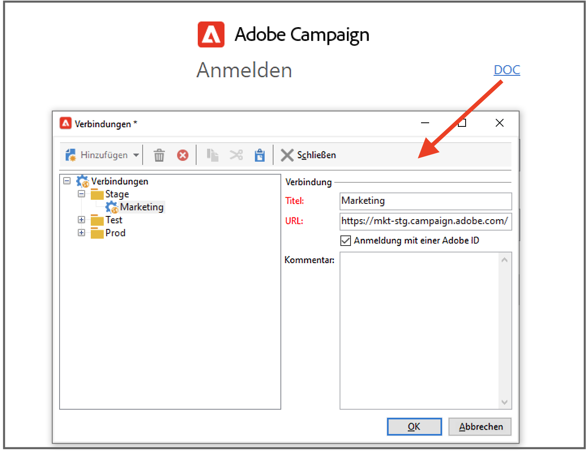
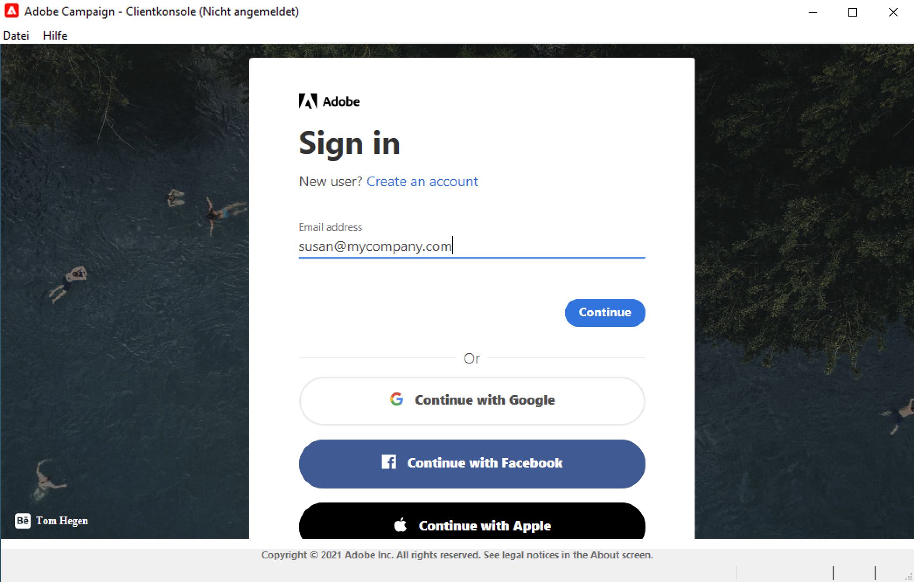
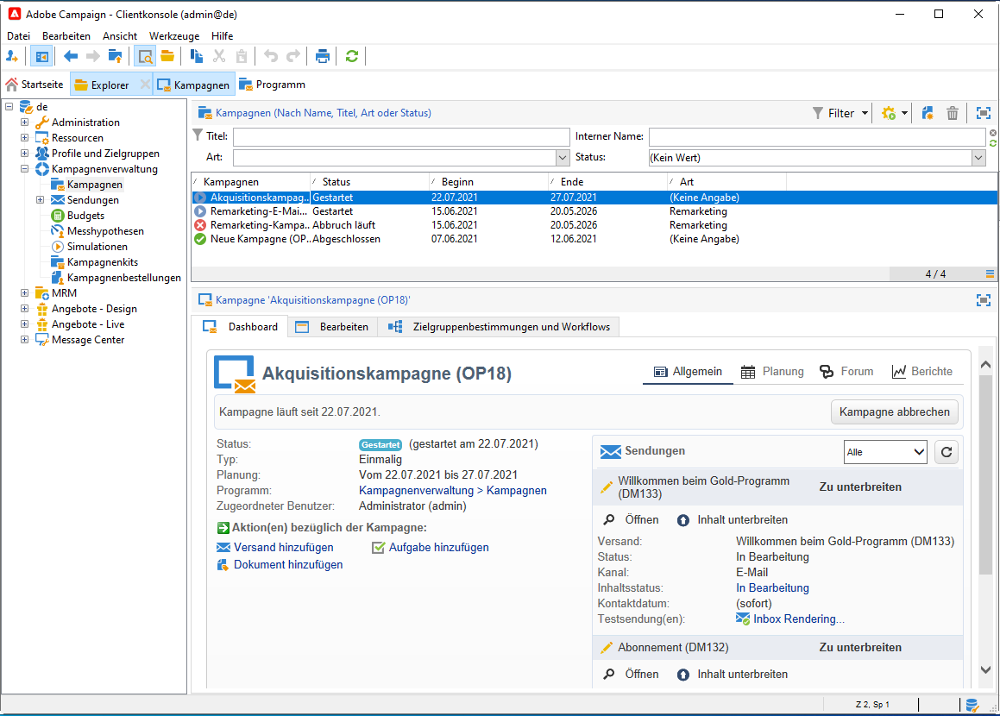
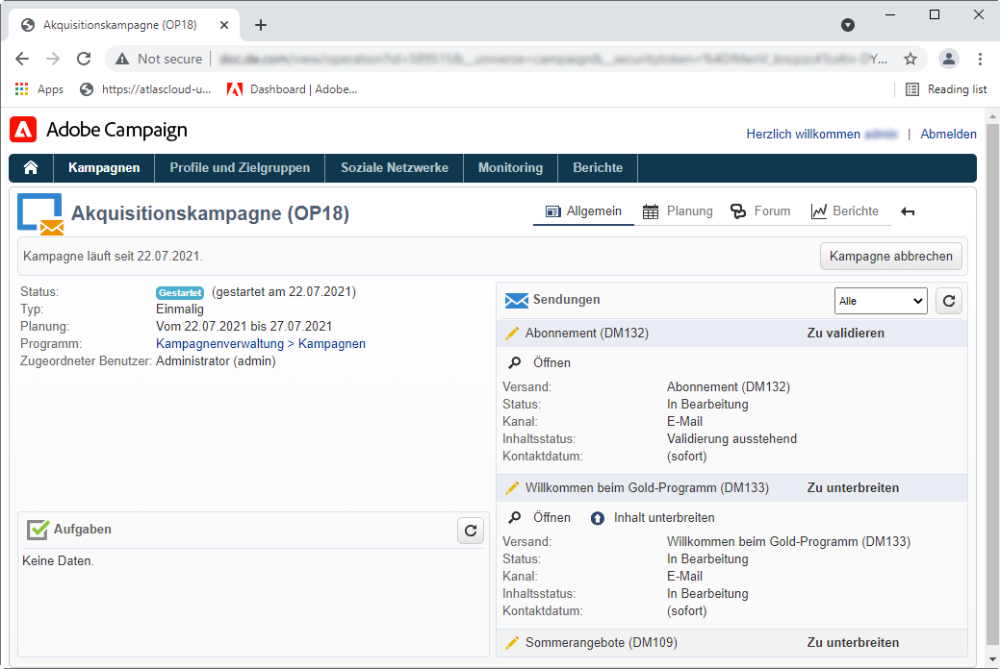

# Verbindung mit Adobe Campaign v8 herstellen{#gs-ac-connect}

Die Client-Konsole in Campaign ist ein Rich-Client, mit dem Sie eine Verbindung zu Ihren Campaign-Anwendungs-Servern herstellen können.

Bevor Sie beginnen, müssen Sie folgende Schritte ausführen:

* Überprüfen Sie die Kompatibilität Ihres Systems und Ihrer Tools mit Adobe Campaign in der [Kompatibilitätsmatrix](compatibility-matrix.md)
* Ermitteln Sie Ihre Campaign-Server-URL
* Erstellen Sie Adobe ID oder rufen Sie Ihre Benutzeranmeldeinformationen von Ihrem Unternehmen ab.

## Client-Konsole herunterladen und installieren

Wenn Sie Campaign zum ersten Mal verwenden oder auf eine neuere Version aktualisieren möchten, müssen Sie die Client-Konsole herunterladen und installieren.

Dazu sind zwei Optionen verfügbar:

1. Stellen Sie als Campaign-Administrator eine Verbindung zur Adobe [Software-Verteilung](https://experience.adobe.com/#/downloads/content/software-distribution/de/campaign.html) her und laden Sie das Installationsprogramm für die Client-Konsole herunter. Sie können die Konsole dann auf Ihrem lokalen Computer installieren.

1. Adobe kann die Konsole für Sie als Endanwender bereitstellen: Sobald die Konsole aktualisiert wird, werden Sie in einem Popup-Fenster aufgefordert, die neueste Version der Client-Konsole herunterzuladen.

>[!CAUTION]
>
>Adobe empfiehlt, die Option **[!UICONTROL Diese Frage nicht mehr stellen]** deaktiviert zu lassen, um sicherzustellen, dass alle Anwender benachrichtigt werden, wenn eine neue Version der Konsole verfügbar ist.  Wenn diese Option aktiviert ist, wird der Anwender nicht über neue verfügbare Versionen informiert.

## Verbindung erstellen

Nachdem die Client-Konsole neu installiert wurde, führen Sie die folgenden Schritte aus, um die Verbindung zum Anwendungs-Server herzustellen:

1. Starten Sie die Konsole über das Windows-**[!UICONTROL Start]**-Menü in der **Adobe Campaign**-Programmgruppe.

1. Klicken Sie in der oberen rechten Ecke der Felder mit den Anmeldedaten auf den Link, um das Fenster für die Verbindungskonfiguration aufzurufen.

1. Klicken Sie auf **[!UICONTROL Hinzufügen > Verbindung]** und geben Sie die Bezeichnung und URL des Adobe Campaign-Anwendungs-Servers ein.

1. Geben Sie per URL eine Verbindung zum Adobe Campaign-Anwendungs-Server an. Verwenden Sie entweder einen DNS oder einen Alias des Computers oder Ihre IP-Adresse.

   Sie können beispielsweise eine URL vom Typ [`https://<machine>.<domain>.com`](https://myserver.adobe.com) eingeben.

1. Aktivieren Sie die Option **[!UICONTROL Verbindung mit einer Adobe ID]**.

1. Klicken Sie auf **[!UICONTROL OK]**, um Ihre Einstellungen zu speichern.

Sie können so viele Verbindungen wie erforderlich hinzufügen, um z. B. Verbindungen zu Ihren Test-, Staging- und Produktionsumgebungen herzustellen.

>[!NOTE]
>
>Die Schaltfläche **[!UICONTROL Hinzufügen]** erlaubt die Erstellung von **[!UICONTROL Ordnern]**, in die Sie Ihre verschiedenen Verbindungen per Drag-and-Drop verschieben können.

## Bei Adobe Campaign anmelden

Gehen Sie wie folgt vor, um sich bei einer vorhandenen Instanz anzumelden:

1. Starten Sie die Konsole über das Windows-**[!UICONTROL Start]**-Menü in der **Adobe Campaign**-Programmgruppe.

1. Klicken Sie in der oberen rechten Ecke der Felder mit den Anmeldedaten auf den Link, um das Fenster für die Verbindungskonfiguration aufzurufen.

   

1. Wählen Sie die Campaign-Instanz aus, bei der Sie sich anmelden möchten.

1. Bestätigen Sie die Aktion mit der Schaltfläche **[!UICONTROL OK]**.

1. Sie können sich dann mit [Ihrer Adobe ID](#connect-ims) bei Campaign anmelden.

   

## Benutzern Zugriff gewähren

Adobe Campaign ermöglicht es, die den unterschiedlichen Benutzern zugeteilten Rechte zu bestimmen und zu verwalten. Es handelt es sich um Berechtigungen und Beschränkungen folgender Aktivitäten:

* Zugriff auf bestimmte Funktionen (über spezifische Berechtigungen);
* Zugriff auf bestimmte Elemente;
* Erstellen, Ändern und/oder Löschen von Elementen (Versand, Kontakte, Kampagnen, Gruppen usw.).

Weitere Informationen zu Anwendern und zum Definieren ihrer Berechtigungen finden Sie in [diesem Abschnitt](permissions.md).

Als Campaign-Administrator sind Sie dafür verantwortlich, die Benutzer zu erstellen und Anmeldedaten der Anwender mit ihnen zu teilen.

## Verbindung mit Campaign über Ihre Adobe ID herstellen{#connect-ims}

Campaign-Benutzer stellen über Adobe Identity Management System (IMS) über ihre Adobe ID eine Verbindung zur Adobe Campaign-Konsole her. Sie können für alle Adobe-Lösungen dieselbe ID verwenden. Die Verbindung wird bei Verwendung von Adobe Campaign mit anderen Lösungen gespeichert.

Weitere Informationen zur Adobe IMS finden Sie auf [dieser Seite](https://helpx.adobe.com/de/enterprise/using/identity.html).

## Web-Zugriff{#web-access}

Bestimmte Teile der Anwendung können über einen Webbrowser über eine HTML-Benutzeroberfläche aufgerufen werden: Reporting, Versandvalidierung, Instanzüberwachung und mehr.

Der Webzugriff bietet eine der Clientkonsole ähnliche Bedieneroberfläche mit eingeschränkten Funktionalitäten.

So wird z. B. für einen Benutzer eine Kampagne in der Client-Konsole mit folgenden Optionen angezeigt:

Beim Web-Zugriff ermöglichen die Optionen vor allem die Anzeige von:

Der Web-Zugriff wird auch für den Validierungsprozess verwendet: Benutzer können auf die E-Mail mit der Validierungsanfrage klicken und über ihren Webbrowser eine Verbindung zu Campaign herstellen, um Versandinhalte oder -budgets zu validieren oder abzulehnen.

Um über das Web auf Ihre Campaign-Instanz zuzugreifen, lautet die URL:  `https://<your adobe campaign server>:<port number>/view/home`.
