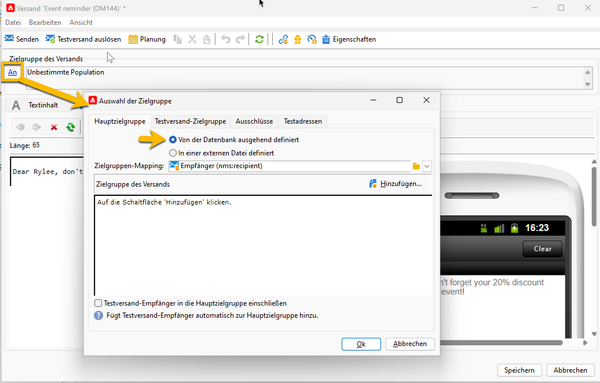
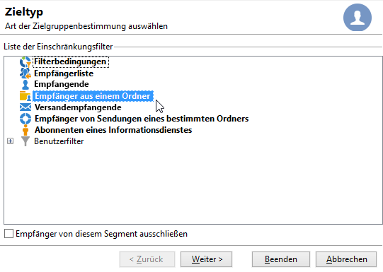
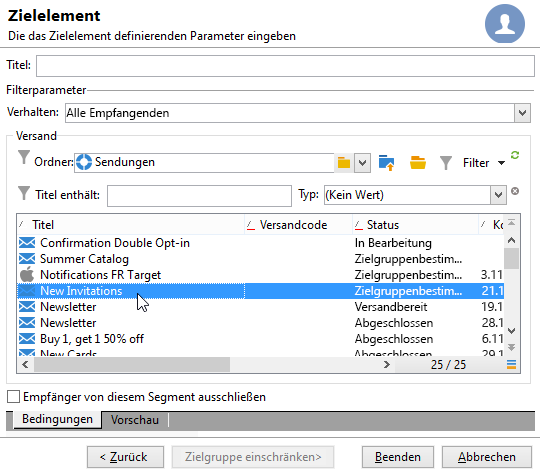
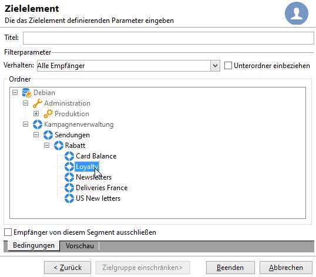
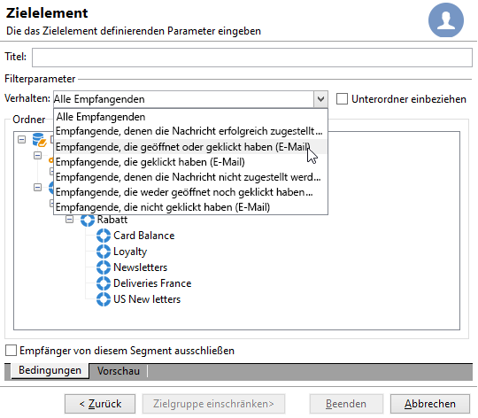
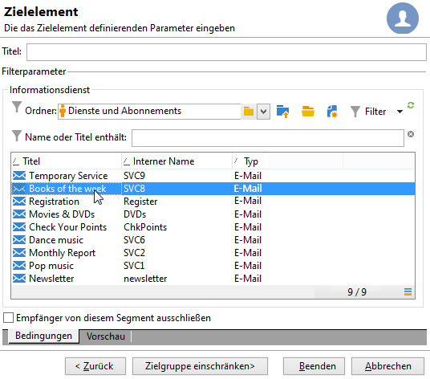
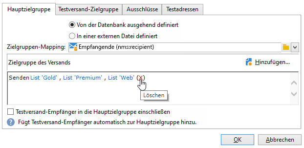
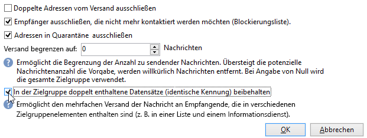

# Erstversand erstellen {#create-a-msg}

Auf dieser Seite erfahren Sie, wie Sie einen einmaligen Versand erstellen. Sie können weitere Versandtypen erstellen, um Ihre Anwendungsfälle zu erstellen. Weitere Informationen zu den verschiedenen Versandtypen und deren Erstellung finden Sie auf [dieser Seite](gs-message.md).

Die wichtigsten Schritte bei der Erstellung eines einmaligen Versands sind:

1. **Erstellen Sie einen neuen Versand**. [mehr dazu](#create-the-delivery)

1. **Versandinhalt festlegen**. [Weitere Informationen](#content-of-the-delivery)

1. **Wählen Sie die Zielpopulation** aus. [Weitere Informationen](#target-population)

Anschließend können Sie Ihre Nachrichten mit Adobe Campaign vorbereiten, testen, senden und überwachen.

>[!NOTE]
>
>Bei den in diesem Abschnitt beschriebenen Schritten wird davon ausgegangen, dass alle Zielgruppenempfänger und ihre Profile in der Datenbank gespeichert sind, ausgenommen externe Sendungen. Siehe [Auswählen externer Empfänger](#selecting-external-recipients).

## Erstellen des Versands {#create-the-delivery}

Gehen Sie wie folgt vor, um einen Versand zu erstellen:

1. Navigieren Sie zur Liste der Sendungen und klicken Sie auf **[!UICONTROL Erstellen]**.
1. Wählen Sie den Versandkanal aus. Wählen Sie dazu die entsprechende Versandvorlage aus der Dropdown-Liste aus.

   

   Für jeden installierten Kanal ist eine integrierte Vorlage verfügbar: E-Mail, Telefon, Mobiltelefon (Push/SMS), Briefpost, X (Twitter) usw. Die in der Liste verfügbaren Kanäle hängen von Ihrem Lizenzvertrag ab.

   Sie können neue Versandvorlagen erstellen, um spezifische Parameter entsprechend Ihren Anforderungen vorab zu konfigurieren.  [Weitere Informationen](../send/create-templates.md).

1. Geben Sie im Feld **[!UICONTROL Titel]** einen Namen für den Versand ein.

   (Optional) Dem Versand kann auch ein Versandcode zugewiesen werden. Der Versandname und der Versandcode werden in der Versandliste angezeigt, sind aber nicht den Empfängern zugänglich.

1. (optional) Fügen Sie im Feld **[!UICONTROL Beschreibung]** eine Beschreibung hinzu.
1. (optional) Wählen Sie im entsprechenden Feld die Versandart aus. Diese Information ist insbesondere für die Versandverfolgung nützlich, da Sie die Sendungen in Listen und Abfragen nach diesem Kriterium filtern können.
1. Klicken Sie auf **[!UICONTROL Weiter]** , um das Fenster mit dem Nachrichteninhalt anzuzeigen.

## Versandinhalt definieren {#content-of-the-delivery}

Der Versandinhalt ist bereit zur Konfiguration. Die Definition des Versandinhalts erfolgt für jeden Kanal einzeln. Weiterführende Informationen dazu finden Sie im entsprechenden Abschnitt:

* [Definieren des E-Mail-Inhalts](../send/email.md)
* [Definieren des SMS-Inhalts](../send/sms/sms-content.md)
* [Definieren des Direkt-Mail-Inhalts](../send/direct-mail.md)
* [Inhalt der Push-Benachrichtigung definieren](../send/push.md)

## Zielgruppe definieren {#target-population}

Für jeden Versand können mehrere Zielgruppentypen definiert werden:

* **Hauptzielgruppe**: Profile, die Nachrichten erhalten. [Weitere Informationen](#select-the-main-target)
* **Testversand-Zielgruppe**: Profile, die Testversandnachrichten erhalten. Ein Testversand dient der Validierung einer Nachricht, bevor sie an die Hauptzielgruppe gesendet wird. [Weitere Informationen](#select-the-proof-target)

Zusätzlich können Sie im Rahmen einer Marketingkampagne Folgendes hinzufügen:

* **Testadressen**: Empfänger, die nicht zur Versandzielgruppe gehören, aber den Versand erhalten. [Weitere Informationen](../audiences/test-profiles.md)
* **Kontrollgruppen**: Population, die den Versand nicht erhält, zur Nachverfolgung von Verhalten und Kampagnenauswirkungen. [Weitere Informationen](../../automation/campaigns/marketing-campaign-target.md#add-a-control-group).

### Auswahl der Hauptempfänger des Versands {#select-the-main-target}

Meistens wird die Hauptzielgruppe aus der Adobe Campaign-Datenbank extrahiert (Standardmodus). Empfänger können jedoch auch in einer [externen Datei](#selecting-external-recipients) gespeichert werden.

Um die Versandempfänger auszuwählen, gehen Sie wie folgt vor:

1. Wählen Sie im Versand-Editor **[!UICONTROL An]** aus.
1. Wählen Sie die erste Option, wenn Ihre Empfänger in der Datenbank gespeichert sind.

   {zoomable="yes"}

1. Wählen Sie das [Zielgruppen-Mapping](../audiences/target-mappings.md) in der Dropdownliste **[!UICONTROL Zielgruppen-Mapping]** aus.
1. Wählen Sie zur Konfiguration von Einschränkungsfiltern die Schaltfläche **[!UICONTROL Hinzufügen]** aus.

   {width="60%" align="left" zoomable="yes"}

   Wählen Sie einen Filtertyp aus und klicken Sie auf **[!UICONTROL Weiter]** , um die Bedingungen zu definieren. Sie können die gefilterten Empfänger über die Registerkarte **[!UICONTROL Vorschau]** anzeigen. Je nach Zieltyp können Sie mit der Schaltfläche **[!UICONTROL Ziel einschränken]** mehrere Targeting-Kriterien kombinieren.

   Die folgenden Zieltypen sind verfügbar:

   * **[!UICONTROL Filterbedingungen]**: Verwenden Sie diese Option, um eine Abfrage zu definieren und das Ergebnis anzuzeigen. Erfahren Sie, wie Sie eine Abfrage in [diesem Abschnitt](../../automation/workflow/query.md) erstellen.
   * **[!UICONTROL Empfängerliste]**: Verwenden Sie diese Option, um eine Profilliste auszuwählen. Weitere Informationen zu Listen finden Sie in [diesem Abschnitt](../audiences/create-audiences.md).
   * **[!UICONTROL Empfänger]**: Verwenden Sie diese Option, um ein bestimmtes Profil in der Datenbank auszuwählen.
   * **[!UICONTROL In einem Ordner enthaltene Empfänger]**: Verwenden Sie diese Option, um alle Profile in einem bestimmten Ordner als Ziel auszuwählen.
   * **[!UICONTROL Empfänger eines Versands]**: Verwenden Sie diese Option, um die Zielgruppe aus den Empfängern eines Versands zu erstellen. Wählen Sie dann den Versand in der Liste aus:

     

   * **[!UICONTROL Empfänger eines Versands, die zu einem Ordner gehören]**: Verwenden Sie diese Option, um die Zielgruppe aus den in einem bestimmten Ordner enthaltenen Empfänger-Sendungen zu erstellen.

     

     Sie können außerdem die Liste der Empfänger nach deren Verhalten beim Empfang früherer E-Mails einschränken:

     

     >[!NOTE]
     >
     >Die Option **[!UICONTROL Unterordner einbeziehen]** dehnt den Kreis der Empfänger auf die in Unterordnern des ausgewählten Knotens enthaltenen Sendungen aus.

   * **[!UICONTROL Abonnenten eines Informationsdienstes]**: Angabe des Newsletters, den die Empfänger abonniert haben müssen, um in die Zielgruppe des Versands aufgenommen zu werden.

     

   * **[!UICONTROL Benutzerfilter]**: Mit dieser Option können Sie auf die vorkonfigurierten Filter zugreifen und diese als Filterkriterien für Profile in der Datenbank verwenden. Weiterführende Informationen zu Benutzerfiltern finden Sie in [diesem Abschnitt](../audiences/create-filters.md#default-filters).
   * Mit der Option **[!UICONTROL Empfänger aus diesem Segment ausschließen]** können Sie Empfänger als Zielgruppe auswählen, die nicht den definierten Zielgruppenkriterien entsprechen. Um diese Option zu verwenden, aktivieren Sie das entsprechende Kontrollkästchen und wenden Sie dann die Zielgruppenbestimmung an (wie zuvor definiert), um die resultierenden Profile auszuschließen.

1. Geben Sie im Feld **[!UICONTROL Titel]** einen Namen für dieses Targeting ein. Standardmäßig entspricht der Titel dem Titel der ersten Zielgruppenbestimmung. Bei der Kombination von Filterkriterien wird empfohlen, einen expliziten Namen zu verwenden.
1. Klicken Sie auf **[!UICONTROL Beenden]** , um die Targeting-Optionen zu überprüfen.

   Die derart festgelegten Zielbestimmungskriterien werden im mittleren Bereich des Hauptzielgruppe-Tabs zusammengefasst. Durch Klick auf ein Kriterium können Sie seinen Inhalt (Konfiguration und Vorschau) prüfen. Klicken Sie auf das rote Kreuz rechts, um das Kriterium zu löschen.

   

### Auswahl externer Empfänger {#selecting-external-recipients}

Sie können Nachrichten an Profile senden, die nicht in der Datenbank, sondern in einer externen Datei gespeichert sind. Gehen Sie wie folgt vor, um beispielsweise einen Versand an Empfänger zu senden, die aus einer Textdatei importiert wurden:

1. Wählen Sie den Link **[!UICONTROL An]** aus, um die Empfänger Ihres Versands festzulegen.
1. Wählen Sie die Option **[!UICONTROL In einer externen Datei definiert]** aus.
1. Wählen Sie die die Empfänger enthaltende Datei aus.
1. Wählen Sie beim Import der Empfänger den Link **[!UICONTROL Dateiformat definieren...]** aus, um die externe Datei auszuwählen und zu konfigurieren.

   Weitere Informationen zum Datenimport finden Sie in der [Campaign Classic v7-Dokumentation](https://experienceleague.adobe.com/en/docs/campaign-classic/using/getting-started/importing-and-exporting-data/generic-imports-exports/executing-import-jobs#step-2---source-file-selection){target="_blank"}.

1. Wählen Sie **[!UICONTROL Beenden]** und konfigurieren Sie Ihren Versand als Standardversand.

>[!CAUTION]
>
>Schließen Sie bei der Definition des Inhalts der Nachricht für den E-Mail-Versand an externe Empfänger den Link zur Mirrorseite nicht ein: Er kann in diesem Versandmodus nicht erstellt werden.

### Ausschlussparameter {#define-exclusion-settings}

Bei der Definition der [Audience eines Versands](#target-population) wird der Tab **[!UICONTROL Ausschlüsse]** verwendet, um die Anzahl der Nachrichten zu begrenzen. Die Standardparameter werden empfohlen, Sie können die Einstellungen nach Bedarf anpassen. Diese Optionen sollten jedoch nur von einem Experten geändert werden, um Missbrauch und Fehler zu vermeiden.

>[!CAUTION]
>
>Erfahrene Benutzer können diese Einstellungen für bestimmte Anwendungsfälle ändern. Adobe empfiehlt jedoch, die Standardkonfiguration beizubehalten.

Sie können Adressen ausschließen, die eine bestimmte Anzahl aufeinander folgender Fehler erreicht haben oder deren Qualitätsbewertung unter der in diesem Fenster angegebenen Schwelle liegt. Sie können auch festlegen, ob nicht qualifizierte Adressen zugelassen werden sollen, für die keine Daten zurückgegeben wurden.

Um die Standardkonfiguration zu ändern, klicken Sie auf den Link **[!UICONTROL Bearbeiten...]** .

+++ Verfügbare Optionen anzeigen

* **[!UICONTROL Doppelte Adressen während des Versands ausschließen]**: Diese Option ist standardmäßig aktiviert und entfernt doppelte E-Mail-Adressen während des Versands. Die angewendete Strategie kann je nach Verwendung von Adobe Campaign und Datentyp in der Datenbank variieren. Der Wert der Option kann für jede Versandvorlage konfiguriert werden.
* **[!UICONTROL Schließen Sie Empfänger aus, die nicht mehr kontaktiert]** werden möchten, d. h. Empfänger, deren E-Mail-Adressen sich auf einer Blockierungsliste (&quot;Opt-out&quot;) befinden. Diese Option muss ausgewählt bleiben, um die Berufsethik des E-Marketing zu beachten.
* **[!UICONTROL Empfänger in Quarantäne ausschließen]**: Mit dieser Option können Sie alle Profile mit einer Adresse, die in Quarantäne ist, aus der Zielgruppe ausschließen. Es wird dringend empfohlen, diese Option aktiviert zu lassen. Weitere Informationen zur Quarantäneverwaltung finden Sie in [diesem Abschnitt](../send/quarantines.md).
* **[!UICONTROL Begrenzen Sie den Versand]** auf eine bestimmte Anzahl von Nachrichten. Geben Sie die maximale Anzahl an zu sendenden Nachrichten an. Wenn die Zielgruppe die angegebene Anzahl von Nachrichten überschreitet, wird eine zufällige Auswahl auf die Zielgruppe angewendet. Behalten Sie den Wert &quot;0&quot; bei, um alle Nachrichten zu senden.
* **[!UICONTROL Duplizierte Datensätze beibehalten (identische Kennung)]**: Mit dieser Option können mehrere Sendungen an Empfänger gesendet werden, die verschiedene Targeting-Kriterien erfüllen.
+++

### Auswählen der Empfänger von Testversandnachrichten {#select-the-proof-target}

Bei E-Mail-Sendungen können Sie Testsendungen durchführen, um Ihren Nachrichteninhalt zu überprüfen. Mit Testsendungen können Sie den Abmelde-Link, die Mirrorseite und andere Links testen, die Nachricht validieren, die Anzeige von Bildern überprüfen, mögliche Fehler erkennen etc. Außerdem können Sie Ihr Design und die Darstellung auf verschiedenen Geräten testen.

Ein Testversand dient der Validierung einer Nachricht, bevor sie an die Haupt-Zielgruppe gesendet wird. Die Empfängerinnen und Empfänger des Testversands sind für die Validierung der Nachricht verantwortlich: Rendering, Inhalt, Personalisierungseinstellungen, Konfiguration.

Weiterführende Informationen zu Testversand-Empfängern und -sendungen finden Sie in [diesem Abschnitt](../send/preview-and-proof.md#send-proofs).

#### Anleitungsvideo {#seeds-and-proofs-video}

In diesem Video erfahren Sie, wie Sie einer vorhandenen E-Mail Testadressen und Testsendungen hinzufügen und diese ausführen.

>[!VIDEO](https://video.tv.adobe.com/v/333404?quality=12)

Weitere Anleitungsvideos zu Campaign Classic finden Sie [hier](https://experienceleague.adobe.com/docs/campaign-classic-learn/tutorials/overview.html?lang=de).

## Versand vorbereiten und validieren {#validate-the-delivery}

Der erstellte und konfigurierte Versand muss vor dem Senden an die Hauptzielgruppe validiert werden.

Gehen Sie dazu wie folgt vor:

1. **Versand analysieren** – hier erfolgt die Vorbereitung der zu sendenden Nachrichten. [Weitere Informationen](../send/delivery-analysis.md).

1. **Testsendungen durchführen** – hier erfolgt die Überprüfung von Inhalt, URLs, Personalisierung usw. [Weitere Informationen](../send/preview-and-proof.md).

>[!IMPORTANT]
>
>Die beiden Schritte über **müssen** nach jeder Änderung des Nachrichteninhalts ausgeführt werden.

## Konfigurieren und Durchführen des Versands {#configuring-and-sending-the-delivery}

Greifen Sie auf die Versandparameter zu, um weitere Einstellungen zu konfigurieren und festzulegen, wie Ihre Nachrichten gesendet werden. Sie können die Versandpriorität festlegen, Schübe einrichten, Einstellungen für Neuversuche konfigurieren und den Versand testen. Nach Abschluss dieser Konfiguration können Sie den Versand bestätigen. Nachrichten werden dann sofort oder entsprechend der Versandplanung gesendet.

Erfahren Sie, wie Sie Ihre Versandeinstellungen auf [dieser Seite](../send/configure-and-send.md) konfigurieren.
