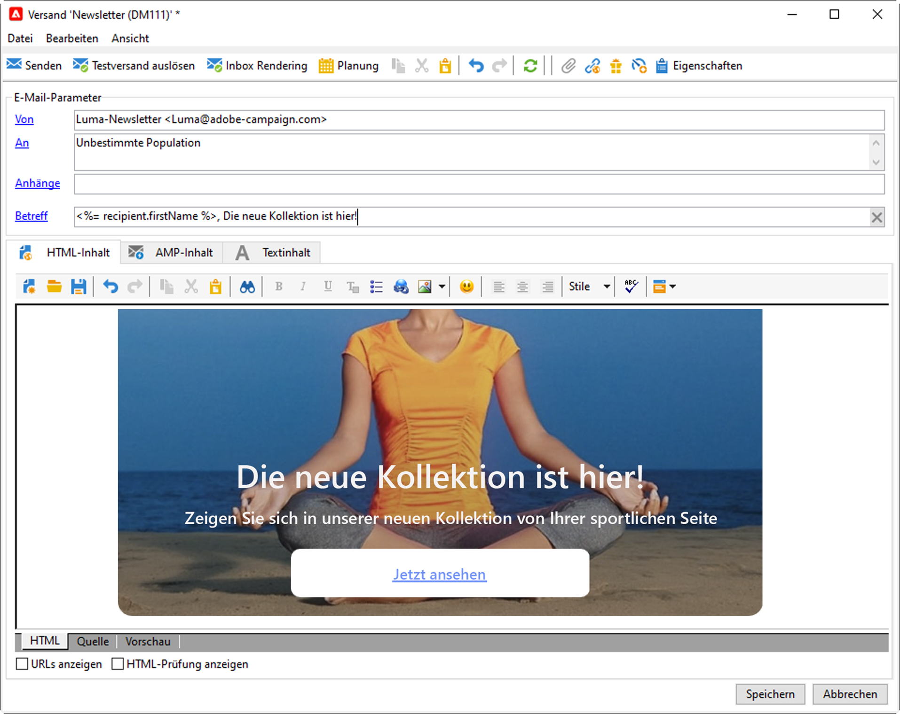
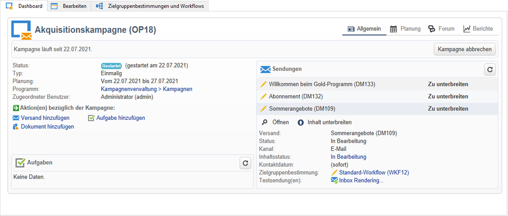
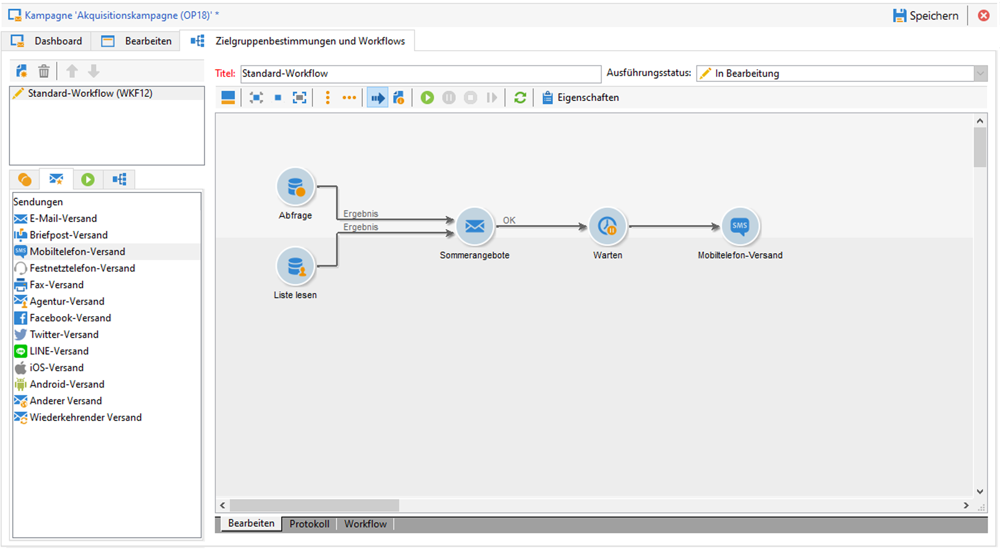
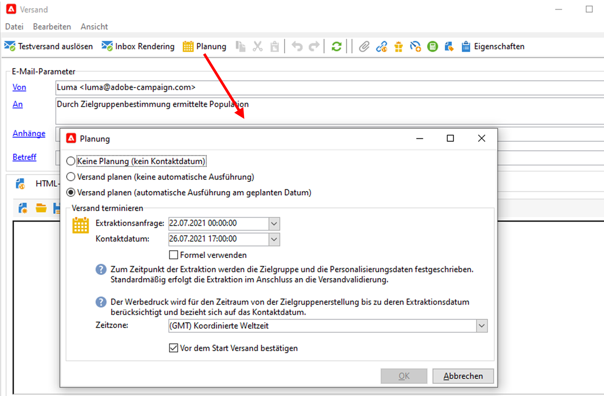

# Erste Schritte mit Nachrichten{#gs-ac-audiences}

Mit Adobe Campaign können Sie Cross-Channel-Kampagnen wie E-Mails, SMS, Push-Benachrichtigungen und Briefpost senden und deren Effektivität mithilfe verschiedener dedizierter Berichte messen. Diese Nachrichten werden mittels Sendungen entworfen und gesendet und können für jeden Empfänger personalisiert werden.

Zu den Kernfunktionen zählen Zielgruppenbestimmung, Definition und Personalisierung von Nachrichten, Ausführung der Kommunikation und die damit verbundenen operativen Berichte. Der wichtigste funktionale Zugangspunkt ist der Versandassistent. Dieser Zugriffspunkt führt zu mehreren Funktionen, die von Adobe Campaign abgedeckt werden.

In der [Dokumentation zu Campaign Classic v7](https://experienceleague.adobe.com/docs/campaign-classic/using/sending-messages/key-steps-when-creating-a-delivery/steps-about-delivery-creation-steps.html?lang=de#sending-messages) lernen Sie die wichtigsten Schritte zur Erstellung eines Versands kennen.

Adobe Campaign v8 enthält die folgenden Versandkanäle:

* **E-Mail-Kanal**: Ein E-Mail-Versand richtet personalisierte elektronische Nachrichten an eine zuvor bestimmte Zielpopulation. Weiterführende Informationen finden Sie auf [dieser Seite](../send/email.md).

* **Briefpost-Kanal**: Ein Briefpost-Versand erzeugt eine Ausgabedatei, die die Daten der Zielpopulation enthält.  Weiterführende Informationen finden Sie auf [dieser Seite](../send/direct-mail.md)

* **Mobile-Kanal**: Ein Versand über den Mobile-Kanal richtet personalisierte SMS an eine zuvor bestimmte Zielpopulation.  Weiterführende Informationen finden Sie auf [dieser Seite](../send/sms.md)

* **Mobile-App-Kanal**: Mit Mobile-App-Sendungen können Sie Benachrichtigungen an iOS- und Android-Systeme senden.  Weiterführende Informationen finden Sie auf [dieser Seite](../send/push.md)

<!--
* **LINE channel**: LINE deliveries let you send messages on LINE, an instant messaging application available on all smartphones. Learn more in [this page](../send/line.md)
-->

## Auswahl der Versandart für Ihre Nachrichten

Sobald Ihre Nachricht erstellt und ihr Inhalt entworfen und getestet wurde, können Sie wählen, wie Sie sie versenden möchten. Campaign bietet eine Reihe von Funktionen, um:

* Manuelles Senden von Nachrichten an die Hauptzielgruppe

   

    Informationen zum Senden von Nachrichten finden Sie in der [Dokumentation zu Campaign Classic v7](https://experienceleague.adobe.com/docs/campaign-classic/using/sending-messages/sending-emails/sending-an-email/sending-messages.html?lang=de#sending-messages){target=&quot;_blank&quot;}.

* Senden von Nachrichten, die einer [Marketing-Kampagne](campaigns.md) zugeordnet sind

   

    Informationen zum Senden von Nachrichten im Kontext einer Kampagne finden Sie in der [Dokumentation zu Campaign Classic v7](https://experienceleague.adobe.com/docs/campaign-classic/using/orchestrating-campaigns/orchestrate-campaigns/marketing-campaign-deliveries.html?lang=de){target=&quot;_blank&quot;}.

* Senden von Nachrichten über einen [Workflow](../config/workflows.md)

   

    Informationen zum Automatisieren von E-Mail-Sendungen finden Sie in der [Dokumentation zu Campaign Classic v7](https://experienceleague.adobe.com/docs/campaign-classic/using/automating-with-workflows/action-activities/delivery.html?lang=de){target=&quot;_blank&quot;}.

* [Auslösen von Nachrichten durch ein Ereignis](../send/transactional.md)
    [Anwendungsfall: Erfahren Sie, wie Sie eine Transaktions-E-Mail mit einem Anhang senden.](https://experienceleague.adobe.com/docs/campaign-classic/using/transactional-messaging/transactional-email-with-attachments.html?lang=de){target=&quot;_blank&quot;}

* Planen eines Nachrichtenversandes

   

    [Anwendungsfall: Erfahren Sie, wie Sie eine Geburtstags-E-Mail planen und senden.](https://experienceleague.adobe.com/docs/campaign-classic/using/automating-with-workflows/use-cases/deliveries/sending-a-birthday-email.html?lang=de){target=&quot;_blank&quot;}

## Personalisierung hinzuzufügen

Nachrichten, die von Adobe Campaign versendet werden, können auf verschiedene Weise personalisiert werden.

Sie haben folgende Möglichkeiten:

* Dynamische Personalisierungsfelder einfügen.
    Erfahren Sie in der [Dokumentation zu Campaign Classic v7](https://experienceleague.adobe.com/docs/campaign-classic/using/sending-messages/personalizing-deliveries/personalization-fields.html?lang=de), wie Sie Personalisierungsfelder verwenden können.{target=&quot;_blank&quot;}
* Vordefinierte Personalisierungsbausteine einfügen.
    Erfahren Sie in der [Dokumentation zu Campaign Classic v7](https://experienceleague.adobe.com/docs/campaign-classic/using/sending-messages/personalizing-deliveries/personalization-blocks.html?lang=de), was ein Gestaltungsbaustein ist und wie Sie ihn verwenden.{target=&quot;_blank&quot;}
* Bedingte Inhalte erstellen.
    Erfahren Sie in der [Dokumentation zu Campaign Classic v7](https://experienceleague.adobe.com/docs/campaign-classic/using/sending-messages/personalizing-deliveries/conditional-content.html?lang=de), wie Sie bedingte Inhalte einfügen können.{target=&quot;_blank&quot;}

## Senden von Transaktionsnachrichten

Das Campaign-Modul &quot;Transaktionsnachricht (Message Center)&quot; wurde zum Verwalten von Trigger-Nachrichten entwickelt.

 Weitere Informationen zur Funktion für Transaktionsnachrichten finden Sie in [diesem Abschnitt](../dev/architecture.md#transac-msg-archi).

 Die Schritte zum Konfigurieren und Senden von Transaktionsnachrichten werden auf [dieser Seite](../send/transactional.md) ausführlich beschrieben.

 In der [Dokumentation zu Campaign Classic v7](https://experienceleague.adobe.com/docs/campaign-classic/using/transactional-messaging/transactional-email-with-attachments.html?lang=de) können Sie diese Funktion in einem End-to-End-Anwendungsfall kennenlernen.{target=&quot;_blank&quot;}

## Versand- und Trackinglogs

Die Überwachung Ihrer Sendungen nach deren Versand ist ein wichtiger Schritt, um sicherzustellen, dass Ihre Marketing-Kampagnen effizient sind und Ihre Kunden erreichen. Sie können nach dem Versand überwachen sowie nachvollziehen, wie Zustellungsfehler und Quarantänen gehandhabt werden.

 Informationen zum Überwachen Ihrer Sendungen finden Sie in der [Dokumentation zu Campaign Classic v7](https://experienceleague.adobe.com/docs/campaign-classic/using/sending-messages/monitoring-deliveries/about-delivery-monitoring.html?lang=de#sending-messages){target=&quot;_blank&quot;}.

**Verwandte Themen** in der Dokumentation zu Campaign Classic v7:

* [Best Practices für den Versand](https://experienceleague.adobe.com/docs/campaign-classic/using/sending-messages/key-steps-when-creating-a-delivery/delivery-bestpractices/delivery-best-practices.html?lang=de){target=&quot;_blank&quot;}

* [E-Mail testen und senden](https://experienceleague.adobe.com/docs/campaign-classic/using/sending-messages/sending-emails/sending-an-email/sending-messages.html){target=&quot;_blank&quot;}

* [Testsendungen durchführen](https://experienceleague.adobe.com/docs/campaign-classic/using/sending-messages/key-steps-when-creating-a-delivery/steps-validating-the-delivery.html?lang=de){target=&quot;_blank&quot;}
