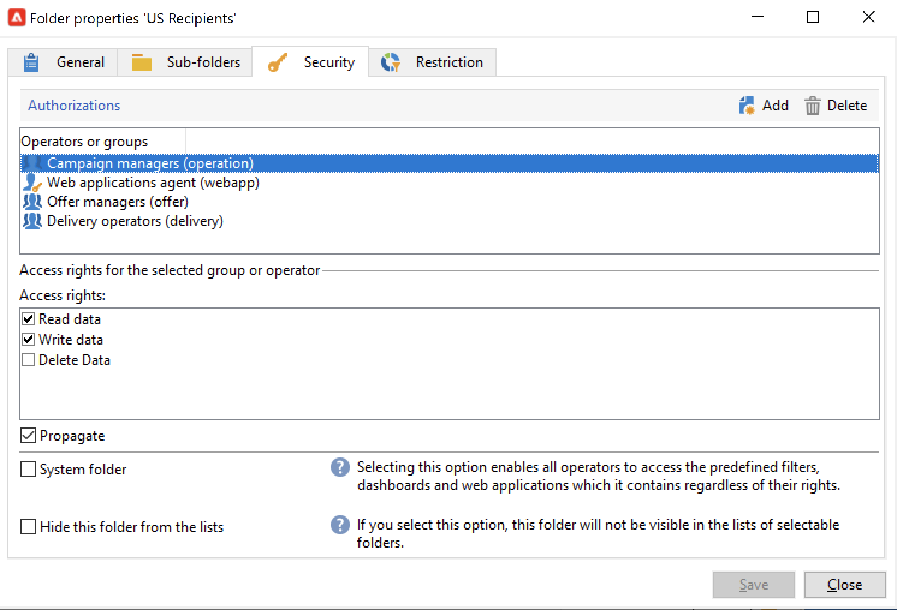

# Verwalten von Ordnerberechtigungen{#manage-folder-permissions}

## Beschränken des Zugriffs auf einen Ordner{#restrict-access-to-a-folder}

Verwenden Sie Berechtigungen für Ordner, um den Zugriff auf Campaign-Daten zu organisieren und zu steuern.

Die Ordnerverwaltung wird auf [dieser Seite](../audiences/folders-and-views.md) beschrieben.

Gehen Sie wie folgt vor, um Berechtigungen für einen bestimmten Campaign-Ordner zu bearbeiten:

1. Klicken Sie mit der rechten Maustaste auf den entsprechenden Ordner und wählen Sie **[!UICONTROL Eigenschaften...]**.
1. Klicken Sie auf die Registerkarte **[!UICONTROL Sicherheit]**, um die Berechtigungen bezüglich des Ordners anzuzeigen.

   

* Um **eine Gruppe oder einen Benutzer zu autorisieren**, klicken Sie auf den Button **[!UICONTROL Hinzufügen]** und wählen Sie die Gruppe oder den Benutzer aus, denen Berechtigungen für diesen Ordner zugewiesen werden sollen.
* Um **einer Gruppe oder einem Benutzer den Zugriff zu verbieten**, klicken Sie auf **[!UICONTROL Löschen]** und wählen Sie die Gruppe oder den Benutzer aus, um deren Autorisierung für diesen Ordner zu entfernen.
* Um **Berechtigungen einer Gruppe oder eines Benutzers auszuwählen**, wählen Sie hierzu die betroffene Gruppe oder den Benutzer aus und wählen Sie die Zugriffsrechte aus, die Sie gewähren möchten, und heben Sie die Auswahl der anderen auf.

>[!NOTE]
>
>Sie sollten kein Objekt erstellen können, für das Sie nicht über mindestens einen Ordner mit Schreibrechten verfügen.
>
>Sie müssen nicht Teil des Admin-Teams sein, um Fragmente zu erstellen, benötigen aber Schreibrechte für mindestens einen Ordner „Inhalt – Visuelle Fragmente“. Andernfalls können Sie kein visuelles Fragment erstellen.

## Ausdehnen von Berechtigungen {#propagate-permissions}

Um Berechtigungen und Zugriffsberechtigungen auszudehnen, wählen Sie in den Ordnereigenschaften die Option **[!UICONTROL Ausdehnen]**.

Die in diesem Fenster definierten Berechtigungen werden dann auf alle Unterordner des aktuellen Knotens angewendet. Sie können zu jeder Zeit diese Berechtigungen für jeden Unterordner überschreiben.

>[!NOTE]
>
>Wenn Sie die Option **[!UICONTROL Ausdehnen]** für einen Ordner abwählen, ist sie nicht automatisch auch für alle Unterordner dieses Ordners abgewählt. Sie muss für jeden Unterordner einzeln abgewählt werden.

## Allen Benutzern Zugriff gewähren {#grant-access-to-all-operators}

Wählen Sie auf der Registerkarte **[!UICONTROL Sicherheit]** den **[!UICONTROL Systemordner]** aus, um allen Benutzern ungeachtet ihrer Berechtigungen Zugriff zu gewähren.

Wenn diese Option abgewählt ist, müssen Sie den Benutzer (oder seine Gruppe) explizit wieder in die Liste der Berechtigungen aufnehmen, damit er Zugriff erhält.
