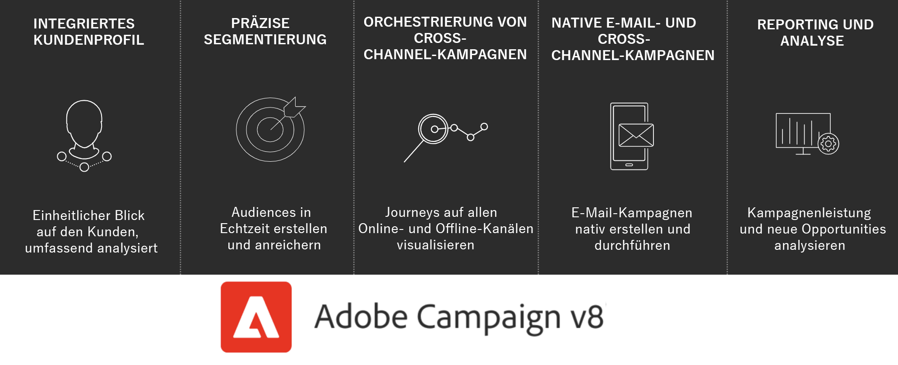

# Erste Schritte mit Adobe Campaign{#gs-ac-v8}

Adobe Campaign bietet eine Plattform für die Gestaltung kanalübergreifender Kundenerlebnisse und eine Umgebung für die visuelle Kampagnenorchestrierung, die Verwaltung von Interaktionen in Echtzeit und die kanalübergreifende Ausführung.

Mit Campaign haben Sie folgende Möglichkeiten:

* **Personalisierung und Interaktion mit der Hilfe einer umfassenden, zentralen Sicht auf den Kunden fördern**
* **E-Mail-, Mobile-, Online- und Offline-Kanäle in die Customer Journey integrieren**
* **Zielführende, zeitlich optimal abgestimmte Nachrichten und Angebote automatisch versenden**

## Integriertes Kundenprofil {#integrated-customer-profile}

Profile werden in einer funktionsstarken Cloud-Datenbank zentralisiert. Die Akquise von Profilen und die Datenbankerstellung können auf viele verschiedene Weisen erfolgen: Online-Akquise über Web-Formulare, manueller oder automatisierter Import von Textdateien, Replikation von bereits existierenden Datenbanken oder Informationssystemen des Unternehmens. Mit Adobe Campaign können Sie Marketing-Verlauf, Kaufinformationen, Voreinstellungen, CRM-Daten und alle relevanten PII-Daten in eine konsolidierte Ansicht integrieren, um sie zu analysieren und Maßnahmen zu ergreifen.

In Adobe Campaign sind Empfänger die Standardprofile, an die Sendungen übermittelt werden (E-Mails, SMS usw.). Dank der in der Datenbank gespeicherten Empfängerdaten können Sie die Zielgruppe filtern, die eine bestimmte Sendung erhält, und Personalisierungsdaten in Ihren Versandinhalten hinzufügen. In der Datenbank sind weitere Profiltypen vorhanden. Sie sind für andere Verwendungszwecke gedacht. Beispielsweise dienen Testprofile zum Testen von Sendungen, bevor sie tatsächlich an das endgültige Ziel übermittelt werden.

 Die Grundlagen zur Verwaltung von Profilen werden in [diesem Abschnitt](audiences.md) erläutert.

 Näheres dazu, wie Sie in Campaign Profile hinzufügen, finden Sie in [diesem Abschnitt ](import.md).

## Zielgruppensegmentierung {#targeted-segmentation}

Adobe Campaign enthält leistungsstarke Analyse- und Zielgruppenbestimmungsfunktionen, die es Ihnen ermöglichen, sehr spezifische, dem Kundenprofil entsprechende Angebote zu erstellen. Dank der deskriptiven Analysefunktionen können Sie Informationen vor und nach Ihren Marketing-Kampagnen detailliert betrachten. Außerdem ermöglichen es Filter und ein benutzerfreundliches Abfrage-Tool, registrierte Kontakte mithilfe unzähliger Kriterien zu kategorisieren und extrem genaue Zielgruppen zu definieren.

Fortschrittliche Funktionen für das Daten-Management erweitern die Datenverarbeitungskapazitäten. Sie vereinfachen und optimieren den Zielgruppenbestimmungsprozess, indem sie nicht modellierte Daten in den Datamart einschließen.

 Weitere Informationen zur Segmentierung, Erstellung und Personalisierung von Audiences finden Sie in [diesem Abschnitt](audiences.md).

## Kanalübergreifende Orchestrierung einer Kampagne {#cross-channel-campaign-orchestration}

Adobe Campaign unterstützt Sie bei der Konzeption und Orchestrierung von zielgerichteten und personalisierten Kampagnen auf verschiedenen Kanälen: E-Mail, Briefpost, SMS und Push-Benachrichtigung. Über nur eine Oberfläche können Sie all Ihre Kampagnen und Kommunikationen planen, orchestrieren, konfigurieren, personalisieren, automatisieren, ausführen und messen.

 Näheres dazu, wie Sie eine Kampagne planen und ausführen, finden Sie in [diesem Abschnitt](campaigns.md).

## Workflows

Adobe Campaign bietet eine umfassende grafische Oberfläche, die den Entwurf komplexer Arbeitsabläufe ermöglicht. Diese umfassen die Segmentierung von Zielgruppen, die Ausführung von Kampagnen, die Verarbeitung von Dateien usw. Erstellen Sie zum Beispiel einen Workflow, um eine Datei von einem Server herunterzuladen, sie zu entkomprimieren und die Datensätze in die Adobe Campaign-Datenbank zu importieren.

Oder fordern Sie andere Benutzer auf, Aufgaben auszuführen oder zu validieren. Auf diese Weise ist es möglich, anderen Benutzern Aufgaben wie Inhaltsgestaltung, Zielgruppenbestimmung und Validierung von Testsendungen zuzuweisen, bevor eine Nachricht an die Empfänger verschickt wird.

Workflows können in unterschiedlichsten Kontexten zum Einsatz kommen:

* Zielgruppenbestimmung für Audiences oder zum Versand von Nachrichten.
* Daten-Management (ETL) zum Bearbeiten von Daten.
* Import von Daten in die Campaign-Datenbank.
* Technische Prozesse wie Datenbankbereinigung (Cleanup), Abruf von Tracking-Informationen etc.

 Näheres dazu, wie Sie Workflows erstellen und ausführen, finden Sie in [diesem Abschnitt](../config/workflows.md).

## Reporting und Analysen {#analysis-and-reporting}

Adobe Campaign ermöglicht es Ihnen, das Verhalten Ihrer Kunden zu verfolgen und besser zu verstehen, indem Sie Daten und Profile kontinuierlich anreichern. Dank der Reporting- und Analyse-Tools trägt jede neue Kampagne zur Optimierung Ihrer Datenbestände bei. Marketing-Maßnahmen können besser auf die jeweiligen Zielgruppen abgestimmt werden und Wirksamkeit sowie ROI werden gesteigert.

Adobe Campaign bietet nicht nur leistungsstarke native Reporting-Vorlagen, sondern ermöglicht auch die Erstellung benutzerdefinierter Berichte auf Versand-, Kampagnen-, Benutzer- oder Segmentebene. Führen Sie eine deskriptive Analyse durch, ermitteln Sie den Gesamt-ROI oder exportieren Sie Daten in Adobe Analytics und andere Lösungen, um eine weitere Datenvisualisierung und -analyse zu ermöglichen.

Die Berichtsfunktion für Kampagnen vereinfacht die Erstellung von dynamischen Berichten. Sie können per Drag &amp; Drop Variablen verwenden, um Berichte anzupassen und den Erfolg Ihrer Kampagnen zu analysieren. Je nach der Komplexität Ihrer Abfragen und Berechnungen können Sie die Daten in einer Listenansicht zusammenfassen oder in einem Format darstellen, das die Erstellung von Marketinganalyseberichten vereinfacht.

 Weitere Informationen zu den Reporting- und Tracking-Funktionen finden Sie in [diesem Abschnitt](../reporting/gs-reporting.md).

## Integration mit Adobe Experience Cloud {#adobe-experience-cloud-integrations}

Sie können die Funktionen für Versand und erweiterte Kampagnenverwaltung von Adobe Campaign mit einer Reihe von Lösungen kombinieren, anhand derer Sie das Benutzererlebnis personalisieren können, darunter z. B. Adobe Experience Manager, Adobe Analytics, Adobe Target oder Adobe Experience Cloud Triggers.

 Näheres dazu, wie Sie Adobe-Services und -Lösungen integrieren können, finden Sie in [diesem Abschnitt](../connect/integration.md).

## Weitere Informationen zu den Funktionen von Campaign {#core-capabilities-and-add-ons}

Adobe Campaign bietet verschiedenste Funktionen, die eine Ihren Bedürfnissen und Ihrer Architektur entsprechende Implementierung und Optimierung von dialogorientiertem Marketing ermöglichen. Einige davon sind Kernfunktionen, andere wiederum erfordern die Installation eines Package in Ihrer Konfiguration. Eine ausführliche Produktbeschreibung finden Sie hier: [Produktbeschreibung zu Adobe Campaign v8](https://helpx.adobe.com/de/legal/product-descriptions/adobe-campaign-managed-cloud-services.html)

 Sie sind bereits vertraut mit Campaign Classic? Eine Erläuterung der wichtigsten Unterschiede zwischen Campaign Classic und Campaign v8 finden Sie auf [dieser Seite](v7-to-v8.md).

**Siehe auch**

* [Campaign-Arbeitsbereich](campaign-ui.md)
* [Kompatibilitätsmatrix für Campaign v8](compatibility-matrix.md)
* [Herstellen einer Verbindung zu Campaign](connect.md)
* [Häufig gestellte Fragen](campaign-faq.md)