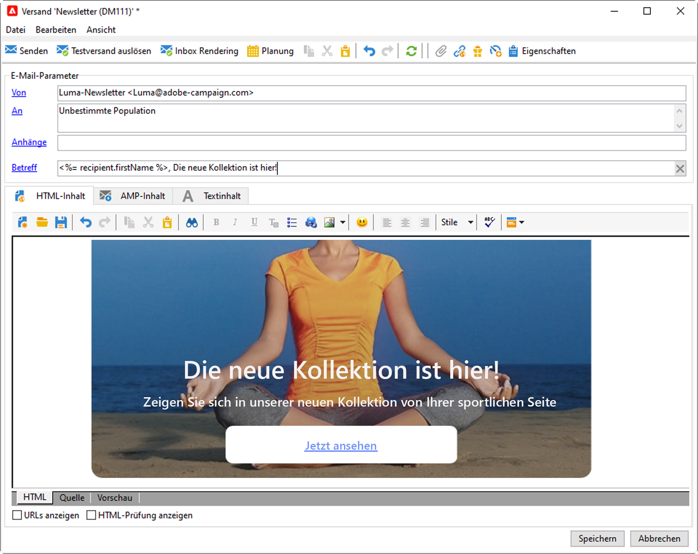
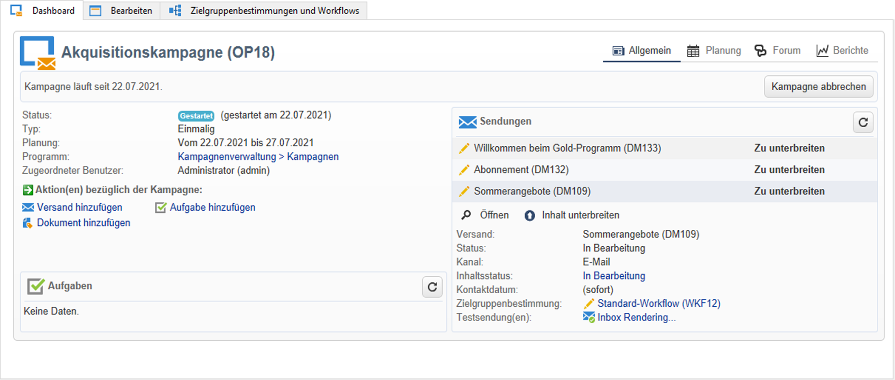
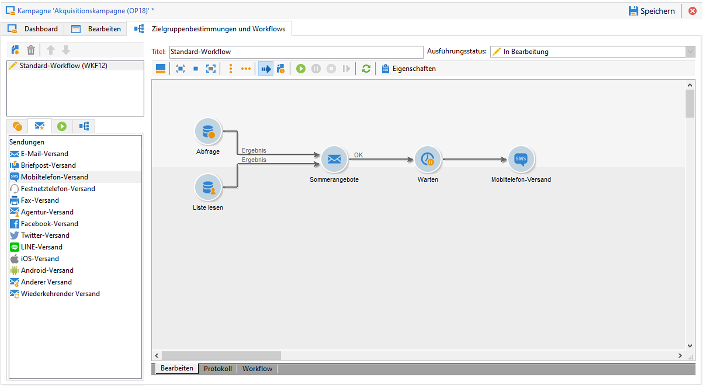

# Erste Schritte mit Nachrichten {#gs-ac-msg}

Mit Adobe Campaign können Sie Cross-Channel-Kampagnen wie E-Mails, SMS, Push-Benachrichtigungen und Briefpost senden und deren Effektivität mithilfe verschiedener dedizierter Berichte messen. Diese Nachrichten werden mittels Sendungen entworfen und gesendet und können für alle Empfangenden personalisiert werden.

Zu den Kernfunktionen zählen Zielgruppenbestimmung, Definition und Personalisierung von Nachrichten, Ausführung der Kommunikation und die damit verbundenen operativen Berichte.

## Anwendungsfälle {#gs-ac-delivery}

Um Nachrichten zu senden, müssen Sie einen Versand erstellen. Der Modus der Versanderstellung hängt von Ihrem Anwendungsfall ab.

>[!NOTE]
>
>Beim Erstellen eines Versands müssen Sie eine Vorlage auswählen. Es stehen Standardvorlagen für jeden Kanal zur Verfügung. Weiterführende Informationen zu Versandvorlagen finden Sie auf [dieser Seite](../send/create-templates.md).

1. **Einmalige Nachrichten**: Sie können einmalige Nachrichten an eine Zielgruppe senden. In [diesem Abschnitt](create-message.md) erfahren Sie, wie Sie Ihre erste Nachricht senden.

   

1. **Nachrichten in einer Marketing-Kampagne**: Sie können Nachrichten im Kontext einer [Marketing-Kampagne](campaigns.md) senden, einen Validierungsprozess definieren und sie in einem konsolidierten Dashboard senden und verfolgen. Weitere Informationen dazu finden Sie in [diesem Abschnitt](../../automation/campaigns/marketing-campaign-deliveries.md).

   

1. **Nachrichten in einem Workflow**: Sie können Nachrichten über einen [Workflow](../config/workflows.md) senden und Ihre Sendungen automatisieren. Weitere Informationen dazu finden Sie auf [dieser Seite](../../automation/workflow/delivery.md).

   

1. **Ausgelöste Nachrichten**: Sie können [Trigger-Nachrichten](../send/transactional.md) über ein Ereignis auslösen. Das Campaign-Modul „Transaktionsnachricht (Message Center)“ wurde zum Verwalten von Trigger-Nachrichten entwickelt. Die Schritte zum Konfigurieren und Senden von Transaktionsnachrichten werden auf [dieser Seite](../send/transactional.md) ausführlich beschrieben.

## Kommunikationskanäle {#gs-channel}

Adobe Campaign v8 enthält die unten aufgeführten Versandkanäle. Die in Ihrer Umgebung verfügbaren Kanäle hängen von Ihrem Vertrag ab. Prüfen Sie diesbezüglich Ihren Lizenzvertrag.

* **E-Mail-Kanal**: Ein E-Mail-Versand richtet personalisierte elektronische Nachrichten an eine zuvor bestimmte Zielpopulation. [Weitere Informationen](../send/email.md)

* **Mobile-Kanäle**: Beim Versand über Mobile-Kanäle können Sie personalisierte Nachrichten auf Mobilgeräten an die Zielpopulation senden. Sie können [SMS](../send/sms/sms.md)- und [LINE](../send/line/line.md)-Nachrichten an Mobilgeräte senden.

* **Mobile-App-Kanal**: Sie können mit Adobe Campaign über spezielle Apps personalisierte und segmentspezifische [Push-Benachrichtigungen](../send/push.md) an iOS- und Android-Mobilgeräte senden. Nach der Durchführung von Konfigurations- und Integrationsschritten können iOS- und Android-Sendungen mit Adobe Campaign erstellt und gesendet werden. Sie können auch Rich-Benachrichtigungen mit Bildern oder Videos erstellen und an Android-Geräte senden.

* **Briefpost-Kanal**: [Briefpost](../send/direct-mail.md) ist ein Offline-Kanal, über den Sie eine externe Datei erstellen, personalisieren und erzeugen und dann für Ihre Briefpost-Dienstleister freigeben können. Verwenden Sie diesen Kanal, um Online- und Offline-Kanäle in Ihren Customer Journeys zu koordinieren.

  Wenn Sie einen Briefpost-Versand vorbereiten, erzeugt Adobe Campaign eine Datei, die alle Zielgruppenprofile und die ausgewählte Kontaktinformationen (z. B. Postanschrift) enthält. Anschließend können Sie diese Datei an Ihren Briefpost-Dienstleister senden, der den tatsächlichen Versand vornimmt.

* **Andere Kanäle**: Adobe Campaign enthält außerdem eine Vorlage für den Festnetztelefon-Versand, die zur Erstellung von externen Sendungen dient. Um diesen Kanal verwenden zu können, müssen Sie spezielle Methoden zur Verarbeitung von Ausgabedateien implementieren. Die Konfigurationsschritte sind mit denen des [Briefpost-Kanals](../send/direct-mail.md) identisch.

  >[!NOTE]
  >
  >Der Telefon-Kanal ist kein nativer Kanal. Seine Implementierung erfordert die Einbindung von Adobe Consulting oder einem Adobe-Partner. Wenden Sie sich für weitere Informationen an Ihren Adobe-Support-Mitarbeiter.

  Sendungen vom Typ „Sonstige“ verwenden eine spezifische technische Vorlage, die keinen Vorgang auslöst. Dies ermöglicht beispielsweise die Verwaltung von außerhalb der Adobe Campaign-Plattform durchgeführten Marketing-Aktionen.

  Dieser Kanal besitzt keinen bestimmten Mechanismus. Er ist ein allgemeiner Kanal, der wie jeder andere Kommunikationskanal in Adobe Campaign über eine eigene externe Konto-Routing-Möglichkeit, Kampagnen-Workflow-Aktivität und einen eigenen Versandvorlagentyp verfügt. Dieser Kanal ist nur für informative Zwecke konzipiert, wie etwa um Zielgruppeninformationen zu Kampagnen zu speichern, die mit anderen Tools als Adobe Campaign durchgeführt wurden.

## Versandtypen {#types-of-deliveries}

In Campaign gibt es drei Typen von Versandobjekten:

### Einzelversand {#single-delivery}

Ein **delivery** ist ein eigenständiges Versandobjekt, das einmal ausgeführt wird. Sie kann dupliziert und erneut vorbereitet werden, aber solange sie sich in ihrem endgültigen Zustand (abgebrochen, gestoppt, beendet) befindet, kann sie nicht wiederverwendet werden.

Sendungen können entweder in der Versandliste oder innerhalb eines Workflows über die Aktivität [Versand](../../automation/workflow/delivery.md) erstellt werden.

Workflows bieten abhängig vom zu verwendeten Kanal auch spezifische Versandaktivitäten. Weiterführende Informationen zu diesen Aktivitäten erhalten Sie in [diesem Abschnitt](../../automation/workflow/cross-channel-deliveries.md).

### Wiederkehrender Versand {#recurring-delivery}

Ein **wiederkehrender Versand** ist im Kontext eines Workflows verfügbar. Mit diesem Versandtyp können Sie jedes Mal, wenn die Aktivität ausgeführt wird, einen neuen Versand erstellen. Dadurch müssen Sie für sich wiederholende Aufgaben nicht jedes Mal erneut einen Versand erstellen. Wenn Sie diese Aktivität beispielsweise einmal im Monat ausführen, ergibt das im Jahr 12 Sendungen.

Wiederkehrende Sendungen werden über Workflows mit der Aktivität Wiederkehrender Versand erstellt. Ein Beispiel für diese Aktivität finden Sie im Abschnitt [Erstellen eines wiederkehrenden Versands in einem Zielgruppen-Workflow](../../automation/workflow/send-a-birthday-email.md).

### Versand (fortlaufend) {#continuous-delivery}

Ein **fortlaufender Versand** ist im Kontext eines Workflows verfügbar. Mit diesem Versandtyp können Sie einem bestehenden Versand neue Empfangende hinzufügen, sodass Sie nicht jedes Mal einen neuen Versand erstellen müssen.

Wenn sich eine Information im Versand ändert (Inhalt, Name usw.), wird bei der Versandausführung ein neues Versandobjekt erstellt. Wenn keine Informationen geändert wurden, wird dasselbe Versandobjekt wiederverwendet und die Versand- und Trackinglogs werden in demselben Objekt hinzugefügt.

Wenn Sie diese Aktivität beispielsweise einmal im Monat ausführen, ergibt das eine einzige Sendung im Jahr (vorausgesetzt Sie haben am Versand keine Änderung vorgenommen).

Fortlaufende Sendungen werden in Workflows über die Aktivität [Versand (fortlaufend)](../../automation/workflow/continuous-delivery.md) erstellt.

## Personalisierungsfunktionen {#personalization}

Nachrichten, die von Adobe Campaign versendet werden, können auf verschiedene Weise personalisiert werden. [Weitere Informationen zu Personalisierungsfunktionen](../send/personalize.md)

Sie haben folgende Möglichkeiten:

* Dynamische Personalisierungsfelder einfügen. [Weitere Informationen](../send/personalization-fields.md)
* Vordefinierte Gestaltungsbausteine einfügen. [Weitere Informationen](../send/personalization-blocks.md)
* Bedingte Inhalte erstellen. [Weitere Informationen](../send/conditions.md)

## Tracking und Monitoring {#gs-tracking-logs}

Die Überwachung Ihrer Sendungen nach deren Versand ist ein wichtiger Schritt, um sicherzustellen, dass Ihre Marketing-Kampagnen effizient sind und Ihre Kunden erreichen. Sie können nach dem Versand überwachen sowie nachvollziehen, wie Zustellungsfehler und Quarantänen gehandhabt werden.

Erfahren Sie, wie [ Sendungen verfolgen und überwachen](../send/tracking.md)
