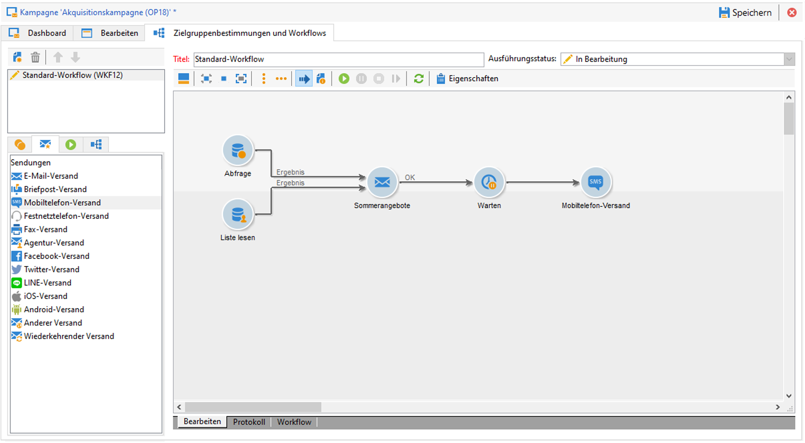

# Erste Schritte mit Nachrichten {#gs-ac-msg}

Mit Adobe Campaign können Sie Cross-Channel-Kampagnen wie E-Mails, SMS, Push-Benachrichtigungen und Briefpost senden und deren Effektivität mithilfe verschiedener dedizierter Berichte messen. Diese Nachrichten werden mittels Sendungen entworfen und gesendet und können für jeden Empfänger personalisiert werden.

Zu den Kernfunktionen gehören die Zielgruppenbestimmung, Definition und Personalisierung von Nachrichten, die Ausführung von Mitteilungen und die damit verbundenen operativen Berichte.

## Anwendungsfälle {#gs-ac-delivery}

Um Nachrichten zu senden, müssen Sie einen Versand erstellen. Der Erstellungsmodus des Versands hängt von Ihrem Anwendungsfall ab.

>[!NOTE]
>
>Bei der Erstellung eines Versands müssen Sie eine Vorlage auswählen. Für jeden Kanal stehen Standardvorlagen zur Verfügung. Weiterführende Informationen zu Versandvorlagen finden Sie auf [dieser Seite](../send/create-templates.md).

### einmalige Nachrichten {#msg-single}

Sie können einmalige Nachrichten manuell an die Hauptzielgruppe senden. In [diesem Abschnitt](create-message.md) erfahren Sie, wie Sie Ihre erste Nachricht senden.

### Nachrichten in einer Marketing-Kampagne {#msg-campaign}

Sie können Nachrichten im Rahmen einer [Marketing-Kampagne](campaigns.md) versenden, einen Validierungsprozess definieren, sie senden und tracken. Erfahren Sie mehr in [diesem Abschnitt](../../automation/campaigns/marketing-campaign-deliveries.md)

### Nachrichten in einem Workflow {#msg-wf}

Sie können Nachrichten über einen [Workflow](../config/workflows.md) versenden und Ihre Sendungen automatisieren. Erfahren Sie, wie Sie auf [dieser Seite](../../automation/workflow/delivery.md)

### Ausgelöste Nachrichten {#msg-trigger}

Sie können [Trigger messages](../send/transactional.md) aus einem Ereignis auswählen. Transaktionsnachrichten (Message Center) sind das Campaign-Modul zur Verwaltung von Trigger-Nachrichten.  Weitere Informationen zur Funktion für Transaktionsnachrichten finden Sie in [diesem Abschnitt](../architecture/architecture.md#transac-msg-archi).

Die Schritte zum Konfigurieren und Senden von Transaktionsnachrichten werden auf [dieser Seite](../send/transactional.md) ausführlich beschrieben.

## Auswählen des Kanals {#gs-channel}

Adobe Campaign v8 enthält die folgenden Versandkanäle:

* **E-Mail-Kanal**: Ein E-Mail-Versand richtet personalisierte elektronische Nachrichten an eine zuvor bestimmte Zielpopulation. [Weitere Informationen](#gs-channel-email)

* **Mobile-Kanäle**: Beim Versand über Mobile-Kanäle können Sie personalisierte Nachrichten auf Mobilgeräten an die Zielpopulation senden. [Weitere Informationen](#gs-channel-sms)

* **Mobile-App-Kanal**: Beim Mobile-App-Versand können Sie Benachrichtigungen an iOS- und Android-Geräte senden. [Weitere Informationen](#gs-channel-push)

* **Briefpost-Kanal**: Beim Briefpost-Versand können Sie eine Ausgabedatei erzeugen, die Daten zur Zielpopulation enthält. [Weitere Informationen](#gs-channel-direct)

  Sonstige Kanäle werden in [diesem Abschnitt](#other-channels) beschrieben.

  >[!NOTE]
  >
  >Die Anzahl der verfügbaren Kanäle hängt von Ihrem Vertrag ab. Prüfen Sie diesbezüglich Ihren Lizenzvertrag.

### E-Mail-Kanal {#gs-channel-email}

Der [E-Mail-Kanal](../send/direct-mail.md) ist einer der wichtigsten Kanäle in Adobe Campaign. Damit können Sie den Versand von personalisierten E-Mails an bestimmte Zielgruppen planen und durchführen.

Verschiedene Typen von E-Mails können gesendet werden:

* Einmalige E-Mails: E-Mails, die ein einziges Mal an eine definierte Zielgruppe gesendet werden. Sie werden zur Verbreitung spezifischer Inhalte verwendet, die nur ein einziges Mal vorbereitet und gesendet werden (Newsletter, Werbe-E-Mails etc.).
* Wiederkehrende E-Mails: In einer Kampagne wird ein und dieselbe E-Mail regelmäßig gesendet und die Sendungen und Berichte werden regelmäßig aggregiert. Die gesendete E-Mail bleibt unverändert, doch die Zielgruppe ändert sich je nach Versandtag. Ein Beispiel dafür sind Geburtstags-E-Mails. Weiterführende Informationen dazu finden Sie unter [Wiederkehrender Versand](../../automation/workflow/recurring-delivery.md).
* Transaktions-E-Mails: einzelne E-Mails, die auf der Basis des Kundenverhaltens ausgelöst werden. Siehe [Transaktionsnachrichten](../send/transactional.md).

Weitere Informationen sowie Empfehlungen zum Versand finden Sie in der Adobe Campaign Classic-Dokumentation unter [Best Practices beim Versand](https://experienceleague.adobe.com/docs/campaign-classic/using/sending-messages/key-steps-when-creating-a-delivery/delivery-bestpractices/delivery-best-practices.html?lang=de#sending-messages){target="_blank"}.

Weiterführende Informationen zu den unterschiedlichen Versandarten finden Sie in [diesem Abschnitt](#types-of-deliveries).

### Mobile-Kanal {#gs-channel-sms}

Adobe Campaign ermöglicht den Versand von Nachrichten per [SMS](../send/sms/sms.md) und [LINE](../send/line.md) auf Mobiltelefone.

Die Inhalt-Kachel von SMS bietet ebenfalls die Möglichkeit der Erstellung, Anpassung und Personalisierung von Nachrichteninhalten, jedoch ausschließlich im Textformat. Es ist außerdem möglich, vor dem Versand eine Vorschau der SMS zu erzeugen.

LINE-Nachrichten können Text, Bilder und Links enthalten.

Folgende Voraussetzungen müssen gegeben sein, um SMS- oder LINE-Nachrichten an Mobiltelefone zu senden:

* Ein externes Konto, das für den Kanal **[!UICONTROL Mobiltelefon (SMS)]** oder **[!UICONTROL LINE]** konfiguriert wurde.
* Eine SMS- oder LINE-Versandvorlage, die auf das externe Konto Bezug nimmt.

### Push-Benachrichtigungs-Kanal {#gs-channel-push}

Sie können mit Adobe Campaign über spezielle Apps personalisierte und segmentspezifische [Push-Benachrichtigungen](../send/push.md) an iOS- und Android-Mobilgeräte senden. Nach der Durchführung von Konfigurations- und Integrationsschritten können iOS- und Android-Sendungen mit Adobe Campaign erstellt und gesendet werden. Sie können auch Rich-Benachrichtigungen mit Bildern oder Videos erstellen und an Android-Geräte senden.

### Briefpost-Kanal {#gs-channel-direct}

[Briefpost](../send/direct-mail.md) ist ein Offline-Kanal, über den Sie eine externe Datei erstellen, personalisieren und erzeugen und dann für Ihren Briefpost-Dienstleister freigeben können. Verwenden Sie diesen Kanal, um Online- und Offline-Kanäle in Ihren Customer Journeys zu koordinieren.

Wenn Sie einen Briefpost-Versand vorbereiten, erzeugt Adobe Campaign eine Datei, die alle Zielgruppenprofile und die ausgewählte Kontaktinformationen (z. B. Postanschrift) enthält. Anschließend können Sie diese Datei an Ihren Briefpost-Dienstleister senden, der den tatsächlichen Versand vornimmt.

### Sonstige Kanäle {#other-channels}

Adobe Campaign enthält außerdem eine Vorlage für den Festnetztelefon-Versand, die zur Erstellung von externen Sendungen dient.  Um diesen Kanal verwenden zu können, müssen Sie spezielle Methoden zur Verarbeitung von Ausgabedateien implementieren.  Die Konfigurationsschritte sind mit denen des [Briefpost-Kanals](../send/direct-mail.md) identisch.

>[!NOTE]
>
>Der Telefon-Kanal ist kein nativer Kanal. Seine Implementierung erfordert die Einbindung von Adobe Consulting oder einem Adobe-Partner. Wenden Sie sich für weitere Informationen an Ihren Adobe-Support-Mitarbeiter.

Sendungen vom Typ „Sonstige“ verwenden eine spezifische technische Vorlage, die keinen Vorgang auslöst. Dies ermöglicht beispielsweise die Verwaltung von außerhalb der Adobe Campaign-Plattform durchgeführten Marketing-Aktionen.

Dieser Kanal besitzt keinen bestimmten Mechanismus. Er ist ein allgemeiner Kanal, der wie jeder andere Kommunikationskanal in Adobe Campaign über eine eigene externe Konto-Routing-Möglichkeit, Kampagnen-Workflow-Aktivität und einen eigenen Versandvorlagentyp verfügt.  Dieser Kanal ist nur für informative Zwecke konzipiert, wie etwa um Zielgruppeninformationen zu Kampagnen zu speichern, die mit anderen Tools als Adobe Campaign durchgeführt wurden.

## Auswählen des Versandtyps {#types-of-deliveries}

In Campaign gibt es drei Typen von Versandobjekten:

### Einzelversand {#single-delivery}

Ein **Versand** ist ein unabhängiges Versandobjekt, das ein einziges Mal ausgeführt wird. Es kann dupliziert und nochmals vorbereitet werden, doch sobald es in seinem finalen Zustand ist (abgebrochen, gestoppt, fertiggestellt), kann es nicht wiederverwendet werden.

Sendungen können entweder in der Versandliste oder innerhalb eines Workflows über die Aktivität [Versand](../../automation/workflow/delivery.md) erstellt werden.

Workflows bieten abhängig vom zu verwendeten Kanal auch spezifische Versandaktivitäten. Weiterführende Informationen zu diesen Aktivitäten erhalten Sie in [diesem Abschnitt](../../automation/workflow/cross-channel-deliveries.md).

### Wiederkehrender Versand {#recurring-delivery}

Ein **wiederkehrender Versand** ist im Kontext eines Workflows verfügbar. Mit diesem Versandtyp können Sie jedes Mal, wenn die Aktivität ausgeführt wird, einen neuen Versand erstellen. Dadurch müssen Sie für sich wiederholende Aufgaben nicht jedes Mal erneut einen Versand erstellen.  Wenn Sie diese Aktivität beispielsweise einmal im Monat ausführen, ergibt das im Jahr 12 Sendungen.

Wiederkehrende Sendungen werden über Workflows mit der Aktivität Wiederkehrender Versand erstellt. Ein Beispiel für diese Aktivität finden Sie im Abschnitt [Erstellen eines wiederkehrenden Versands in einem Zielgruppen-Workflow](../../automation/workflow/send-a-birthday-email.md).

### Fortlaufender Versand {#continuous-delivery}

Ein **fortlaufender Versand** ist im Kontext eines Workflows verfügbar. Mit diesem Versandtyp können Sie einem bestehenden Versand neue Empfangende hinzufügen, sodass Sie nicht jedes Mal einen neuen Versand erstellen müssen.

Wenn sich Daten im Versand ändern (Inhalt, Name etc.), wird bei der Ausführung des Versands ein neues Versandobjekt erstellt. Wenn keine Daten geändert wurden, wird dasselbe Versandobjekt erneut verwendet und die Versand- und Trackinglogs werden im selben Objekt hinzugefügt.

Wenn Sie diese Aktivität beispielsweise einmal im Monat ausführen, ergibt das eine einzige Sendung im Jahr (vorausgesetzt Sie haben am Versand keine Änderung vorgenommen).

Fortlaufende Sendungen werden in Workflows über die Aktivität [Versand (fortlaufend)](../../automation/workflow/continuous-delivery.md) erstellt.

## Hinzufügen von Personalisierung {#personalization}

Nachrichten, die von Adobe Campaign versendet werden, können auf verschiedene Weise personalisiert werden. [Weitere Informationen zu Personalisierungsfunktionen](../send/personalize.md)

Sie haben folgende Möglichkeiten:

* Dynamische Personalisierungsfelder einfügen. [Weitere Informationen](../send/personalization-fields.md)
* Vordefinierte Gestaltungsbausteine einfügen. [Weitere Informationen](../send/personalization-blocks.md)
* Bedingte Inhalte erstellen. [Weitere Informationen](../send/conditions.md)

## Senden und verfolgen {#gs-tracking-logs}

Die Überwachung Ihrer Sendungen nach deren Versand ist ein wichtiger Schritt, um sicherzustellen, dass Ihre Marketing-Kampagnen effizient sind und Ihre Kunden erreichen. Sie können nach dem Versand überwachen sowie nachvollziehen, wie Zustellungsfehler und Quarantänen gehandhabt werden.

Informationen zum Überwachen Ihrer Sendungen finden Sie in der [Dokumentation zu Campaign Classic v7](https://experienceleague.adobe.com/docs/campaign-classic/using/sending-messages/monitoring-deliveries/about-delivery-monitoring.html?lang=de#sending-messages){target="_blank"}.

