# Daten in Campaign importieren {#ootb-profiles}

Mit Campaign können Sie der Cloud-Datenbank Kontakte hinzufügen. Sie können eine Datei laden, mehrere Kontaktaktualisierungen planen und automatisieren, Daten im Internet sammeln oder Profilinformationen direkt in die Empfängertabelle eingeben.

Erste Schritte mit [Zielgruppen](audiences.md)

Grundlegendes zum [Datenmodell](../dev/datamodel.md) von Campaign

## Profile in einen Workflow importieren

Profilimporte werden in speziellen Vorlagen konfiguriert, die durch Workflows über die Aktivität **Importieren** ausgeführt werden. Sie können automatisch anhand eines Zeitplans wiederholt werden, um beispielsweise den Datenaustausch zwischen verschiedenen Informationssystemen zu automatisieren. Weiterführende Informationen finden Sie in [diesem Abschnitt](../../automation/workflow/recurring-import-workflow.md).

## Einheitlichen Importe ausführen

Erstellen Sie einen generischen Datenimportauftrag zum Laden von Kontakten in die Cloud-Datenbank und führen Sie ihn aus.

### Datenimport

Mit Adobe Campaign können Sie Daten aus einer oder mehreren Dateien im Text-, CSV-, TAB- oder XML-Format in die Datenbank importieren. Diese Dateien sind mit einer Tabelle (Haupttabelle oder verknüpfte Tabelle) verbunden; jedes Feld der Quelldateien ist mit einem Feld der Datenbank verknüpft.

>[!NOTE]
>
>Um Daten zu importieren, ohne sie mit Daten in der Datenbank zu mappen, steht die Funktion **[!UICONTROL Liste importieren]** zur Verfügung. Diese Daten können dann ausschließlich in Workflows mit dem Objekt **[!UICONTROL Liste lesen]** verwendet werden. Weitere Informationen hierzu finden Sie auf [dieser Seite](../../automation/workflow/read-list.md).

Mit dem Import-Assistenten können Sie einen Import konfigurieren, seine Optionen definieren (z. B. Formatierung) und die Ausführung starten. Es handelt sich dabei um eine Reihe von Bildschirmen, deren Inhalt von der Art des Imports (einfach oder mehrfach) und den Rechten der Benutzerin bzw. des Benutzers abhängt.

Der Import-Assistent wird nach der Erstellung eines neuen Importauftrags angezeigt.

>[!NOTE]
>
>Bei Verwendung eines IIS-Web-Servers ist möglicherweise eine zusätzliche Konfiguration erforderlich, um das Hochladen großer Dateien (mehr als 28 MB) zu ermöglichen.

#### Quelldatei {#source-file}

Jede Zeile der Quelldatei entspricht einem Datensatz. Die einzelnen Daten innerhalb des Datensatzes werden durch Trennzeichen (Leerzeichen, Tabstopp oder andere Zeichen) voneinander abgegrenzt. Die Daten werden somit in Form von Spalten abgerufen und jede Spalte wird einem Datenbankfeld zugeordnet.

## &#x200B;1. Schritt – Importvorlage auswählen {#step-1---choosing-the-import-template}

Beim Start des Import-Assistenten muss zunächst eine Vorlage ausgewählt werden. Um beispielsweise den Import von Empfangenden zu konfigurieren, die einen Newsletter erhalten haben, gehen Sie folgendermaßen vor:

1. Gehen Sie zum Ordner **[!UICONTROL Profile und Zielgruppen > Vorgang > Allgemeine Importe und Exporte]**.
1. Wählen Sie **Neu** und danach **Importieren**, um die Importvorlage zu erstellen.

   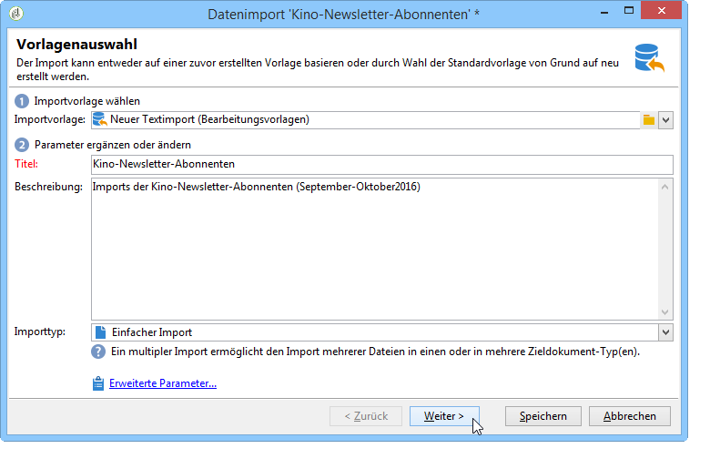

1. Klicken Sie zur Auswahl der gewünschten Vorlage rechts vom Feld **[!UICONTROL Importvorlage]** entweder auf den Pfeil oder auf **[!UICONTROL Verknüpftes Element auswählen]**, um den Navigationsbaum zu durchsuchen.

   Die native Vorlage lautet **[!UICONTROL Neuer Textimport]**. Diese Vorlage darf nicht geändert werden. Sie können sie jedoch duplizieren, um entsprechend Ihren Anforderungen eine neue Vorlage zu konfigurieren. Standardmäßig werden Importvorlagen im Knoten **[!UICONTROL Ressourcen > Vorlagen > Bearbeitungsvorlagen]** gespeichert.

1. Geben Sie im Feld **[!UICONTROL Titel]** einen Namen für diesen Import ein und fügen Sie eventuell eine Beschreibung hinzu.
1. Wählen Sie anschließend den Importtyp aus. Es gibt zwei mögliche Importtypen: **[!UICONTROL Einfacher Import]**, um nur eine Datei zu importieren, und **[!UICONTROL Mehrfacher Import]**, um mehrere Dateien in einer Ausführung zu importieren.

   Wählen Sie zum gleichzeitigen Importieren mehrerer Dateien im ersten Schritt des Import-Assistenten aus der Dropdown-Liste des Felds **[!UICONTROL Importtyp]** die Option **[!UICONTROL Multipler Import]** aus.

   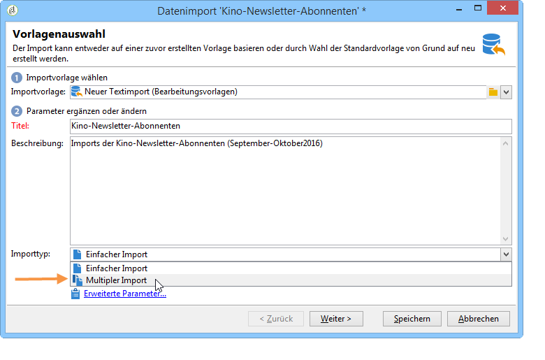

1. Geben Sie dann die zu importierenden Dateien an, indem Sie für jede Datei auf **[!UICONTROL Hinzufügen]** klicken.

   

   Jedes Mal, wenn eine Datei hinzugefügt wird, wird der Bildschirm des Assistenten **[!UICONTROL Zu importierende Datei auswählen]** angezeigt. Lesen Sie den Abschnitt [2. Schritt - Quelldatei auswählen](#step-2---source-file-selection) und befolgen Sie die Schritte im Assistenten, um die Importoptionen wie für einen einfachen Import zu definieren.

   >[!NOTE]
   >
   >Multiple Importe sollten nur in bestimmten Situationen durchgeführt werden und sind nicht empfehlenswert.

### Erweiterte Parameter {#advanced-parameters}

Der Link **[!UICONTROL Erweiterte Parameter...]** bietet Zugriff auf folgende Optionen:

* Im Tab **[!UICONTROL Allgemein]**

   * **[!UICONTROL Bei zu großer Anzahl an Zurückweisungen Ausführung stoppen]**

     Die Durchführung wird standardmäßig gestoppt, sollten die 100 ersten Zeilen zurückgewiesen werden. Wenn Sie mit dem Import unabhängig von der Zurückweisungsanzahl fortfahren wollen, können Sie die Option abwählen.

   * **[!UICONTROL Spurenmodus]**

     Kreuzen Sie diese Option an, um die Durchführung Zeile für Zeile zu verfolgen.

   * **[!UICONTROL Vorgang in einem separaten Prozess starten]**

     Diese Option ist standardmäßig ausgewählt. Sie ermöglicht es, den Importprozess separat auszuführen, um keine anderen, zur gleichen Zeit in der Datenbank laufenden Prozesse zu beeinträchtigen.

   * **[!UICONTROL Aufzählungen nicht aktualisieren]**

     Aktivieren Sie diese Option, wenn die Liste der Aufzählungswerte in der Datenbank nicht ergänzt werden soll. Weitere Informationen über [Auflistungen](../config/enumerations.md).

* Im Tab **[!UICONTROL Variablen]**

  Hier besteht die Möglichkeit, dem Vorgang zugeordnete Variablen zu definieren, auf die im Abfragetool und in berechneten Feldern zugegriffen werden kann. Klicken Sie hierfür auf **[!UICONTROL Hinzufügen]** und machen Sie im Variableneditor die entsprechenden Angaben.

  >[!IMPORTANT]
  >
  >Der Tab **[!UICONTROL Variablen]** sollte programmierten Verwendungen vom Typ Workflow sowie erfahrenen Benutzern vorbehalten bleiben.

## &#x200B;2. Schritt – Quelldatei auswählen {#step-2---source-file-selection}

Die Quelldatei kann entweder in Textformat (TXT, CSV, TAB, feste Spalten) oder in XML vorliegen.

Standardmäßig ist die Option **[!UICONTROL Datei auf den Server laden]** angekreuzt. Durchsuchen Sie Ihre lokale Festplatte, indem Sie auf das Ordnersymbol rechts vom Feld **[!UICONTROL Lokale Datei]** klicken und wählen Sie die zu importierende Datei aus. Sie haben die Möglichkeit, diese Option abzuwählen und den Pfad und Namen der Datei anzugeben, wenn sie sich bereits auf dem Server befindet.

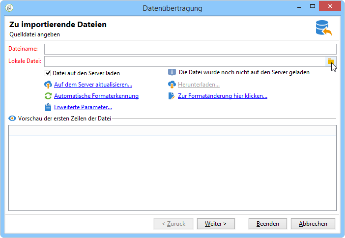

Nach Auswahl der Datei können Sie die Daten im unteren Bereich des Fensters ansehen. Klicken Sie hierfür auf **[!UICONTROL Automatische Formaterkennung]**: Die ersten 200 Zeilen der Quelldatei werden angezeigt.

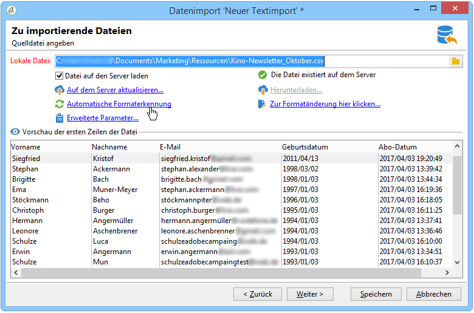

Verschiedene Optionen stehen zur Konfiguration des Imports zur Verfügung. Die hier festgelegten Parameter spiegeln sich in der Vorschau wieder.

* Die Option **[!UICONTROL Zur Formatänderung hier klicken...]** erlaubt die Überprüfung des Formats und eventuell seine Anpassung.
* **[!UICONTROL Auf dem Server aktualisieren...]** ermöglicht die Übertragung der lokalen Datei auf den Server. Diese Option ist nur verfügbar, wenn **[!UICONTROL Datei auf den Server hochladen]** ausgewählt ist.
* Die Option **[!UICONTROL Herunterladen]** ist nur verfügbar, wenn die Datei auf den Server geladen wurde.
* **[!UICONTROL Format automatisch erkennen]** wird verwendet, um das Format der Datenquelle neu zu initialisieren. Diese Option stellt das ursprüngliche Format von durch die Option **[!UICONTROL Zur Formatänderung hier klicken...]** formatierten Daten wieder her.
* Der Link **[!UICONTROL Erweiterte Parameter...]** bietet Filtermöglichkeiten der Quelldaten und weitere Optionen. So haben Sie beispielsweise die Möglichkeit, nur einen Teil einer Datei zu importieren oder nur bestimmte Kriterien erfüllende Datensätze (Empfänger vom Typ &#39;Interessent&#39; oder &#39;Kunde&#39;). Die Verwendung dieser Optionen ist in JavaScript bewanderten Benutzern vorbehalten.

### Dateiformat ändern {#changing-the-file-format}

Mithilfe der Option **[!UICONTROL Zur Formatänderung hier klicken...]** können die Quelldaten formatiert sowie Spalten-Trennzeichen und der Datentyp für jedes Feld angegeben werden. Diese Konfigurationen werden in folgendem Fenster vorgenommen:

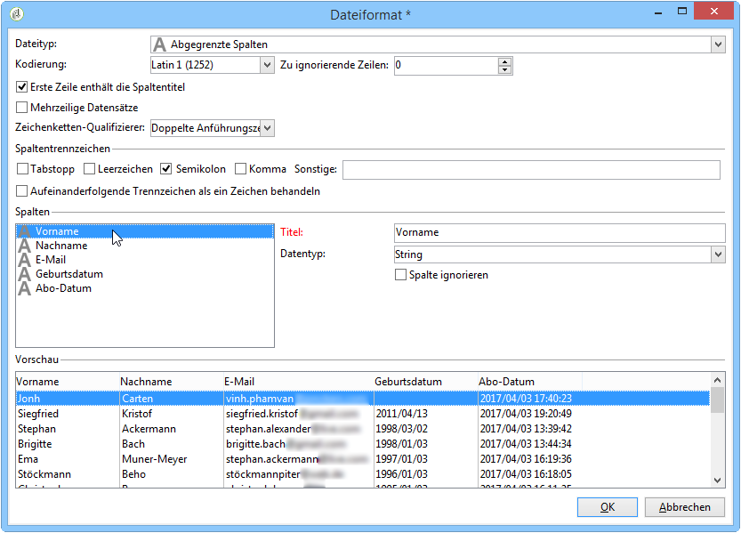

In diesem Schritt legen Sie fest, wie die Werte der Quellfelder zu interpretieren sind. So haben Sie z. B. die Möglichkeit, dem Datentyp &#39;Datum&#39; oder &#39;Datum + Uhrzeit&#39; ein Format (TT.MM.JJJJ, MM-TT-JJ usw.) zuzuordnen. Die nicht dem angegebenen Format entsprechenden Quelldaten werden beim Import zurückgewiesen.

Das Ergebnis der Konfigurationen wird im unteren Teil des Fensters angezeigt.

Klicken Sie auf **[!UICONTROL OK]**, um die Formatierung zu speichern, und anschließend auf **[!UICONTROL Weiter]**.

## &#x200B;3. Schritt – Felder zuordnen {#step-3---field-mapping}

Wählen Sie nun das Zielschema aus und ordnen Sie die Quellfelder den Datenbankfeldern zu.

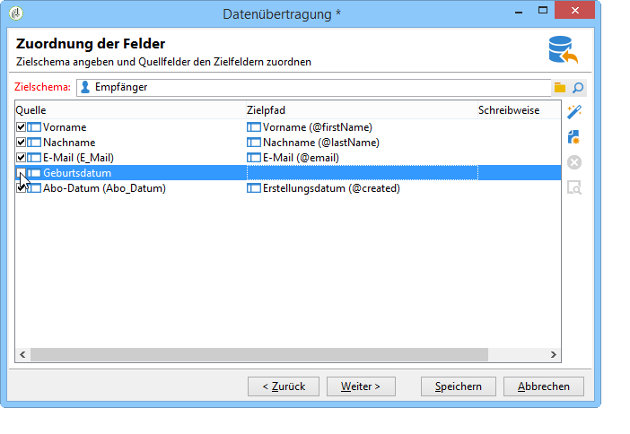

* Das Feld **[!UICONTROL Zielschema]** ermöglicht Ihnen die Auswahl des Schemas, in das die Daten importiert werden sollen. Diese Angabe ist obligatorisch. Klicken Sie auf das Symbol **[!UICONTROL Verknüpftes Element auswählen]**, um ein existierendes Schema auszuwählen. Klicken Sie auf **[!UICONTROL Verknüpftes Element öffnen]**, um die Struktur der zugrunde liegenden Tabelle anzusehen.
* Im mittleren Bereich des Fensters werden alle in der Quelldatei enthaltenen Felder angezeigt. Kreuzen Sie die zu importierenden Felder an und ordnen Sie ihnen ein Zielfeld zu. Dies kann manuell oder automatisch geschehen.

  Kreuzen Sie für eine manuelle Zuordnung das gewünschte Quellfeld an und klicken Sie dann in die zweite Spalte, um die zugehörige Zelle zu aktivieren. Klicken Sie auf **[!UICONTROL Ausdruck bearbeiten]**, um alle verfügbaren Felder der Tabelle anzuzeigen. Wählen Sie das Zielfeld aus und bestätigen Sie die Zuordnung mit **[!UICONTROL OK]**.

  Die Schaltfläche **[!UICONTROL Zielfelder automatisch zuordnen]** rechts im Fenster schlägt für jedes Quellfeld automatisch ein Zielfeld vor. Die getroffene Auswahl kann bei Bedarf geändert werden.

  >[!IMPORTANT]
  >
  >Prüfen Sie die ordnungsgemäße Zuordnung, bevor Sie zum nächsten Schritt übergehen.

* Es besteht die Möglichkeit, die Schreibweise der importierten Felder anzupassen. Klicken Sie hierfür in der Spalte **[!UICONTROL Schreibweise]** in die dem Feld entsprechende Zelle und wählen Sie die gewünschte Option aus.

  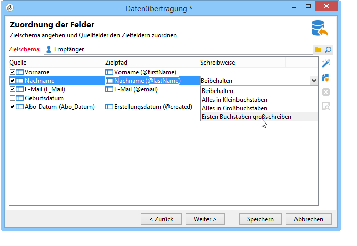

  >[!IMPORTANT]
  >
  >Die Anpassung der Schreibweise wird beim Import vorgenommen. Wurden zuvor für die Zielfelder bestimmte Formatierungen festgelegt (wie in unserem Beispiel für das Feld @lastname), sind diese prioritär.

* Bei Bedarf können Sie über die entsprechende Schaltfläche berechnete Felder hinzufügen. Letztere erlauben komplexe Umwandlungen, das Hinzufügen &quot;virtueller Spalten&quot; oder auch die Anzeige der Werte zweier Spalten in einer gemeinsamen Spalte. Im Folgenden werden die verschiedenen Optionen vorgestellt.

### Berechnete Felder {#calculated-fields}

Berechnete Felder werden der Quelldatei in Form zusätzlicher Spalten hinzugefügt. Sie enthalten Werte, die ausgehend von anderen Spalten berechnet werden. Beim Import können die berechneten Felder Feldern der Datenbank zugeordnet werden. Es ist jedoch nicht möglich, die Datensätze über berechnete Felder abzustimmen.

Vier verschiedene Feldtypen stehen zur Verfügung:

* **[!UICONTROL Unveränderliche Zeichenfolge]**: Der Wert des berechneten Feldes ist derselbe für jede Zeile der Quelldatei. Damit können Sie den Wert eines Feldes der eingefügten oder aktualisierten Datensätze festlegen. Sie können beispielsweise für alle importierten Datensätze &quot;Ja&quot; festlegen.
* **[!UICONTROL Zeichenfolge mit JavaScript-Fusion]**: Das berechnete Feld kombiniert eine Zeichenfolge mit JavaScript-Direktiven.
* **[!UICONTROL JavaScript-Ausdruck]**: Der Wert des berechneten Felds ist das Ergebnis der Auswertung einer JavaScript-Funktion. Der ausgegebene Wert kann einen bestimmten Typ aufweisen (Ziffer, Datum usw.).
* **[!UICONTROL Aufzählungen]**: Der Wert des Felds wird in Abhängigkeit eines Werts der Quelldatei zugeordnet. Der Editor erlaubt die Angabe der Aufzählungswerte je Quellspalte, wie in folgendem Beispiel dargestellt:

  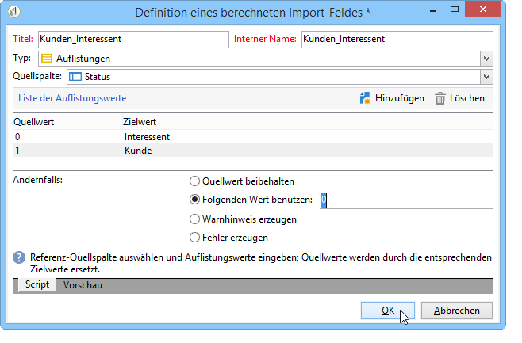

  Im **[!UICONTROL Vorschau]**-Tab können Sie das Ergebnis der Konfiguration ansehen. Im Beispiel wurde die Spalte **[!UICONTROL Abonnements]** hinzugefügt. Der Wert wird vom Feld **Status** ausgehend berechnet.

  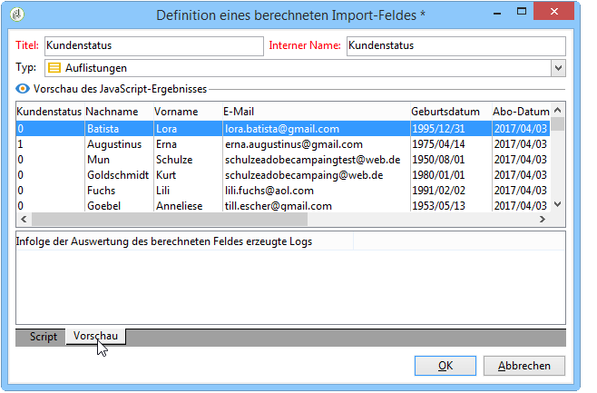

#### &#x200B;4. Schritt – Datensätze abstimmen {#step-4---reconciliation}

Der Import-Assistent bietet die Möglichkeit, durch die Angabe von Abstimmkriterien die Art der Zusammenführung von importierten und existierenden Daten sowie Prioritätsregeln zu definieren. Das Konfigurationsfenster sieht wie folgt aus:

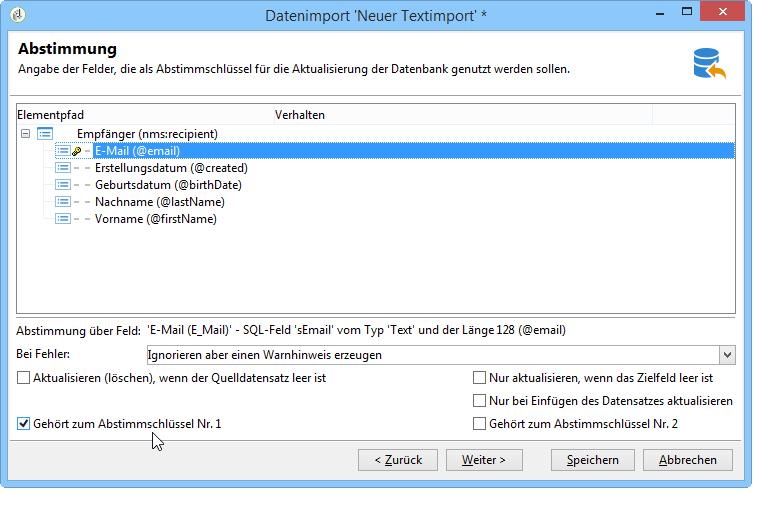

Der mittlere Bereich des dargestellten Bildschirms zeigt die Felder und Tabellen der Adobe Campaign-Datenbank an, in die die Daten importiert werden.

Für jeden Knoten (Tabelle oder Feld) stehen spezielle Optionen zur Verfügung. Wenn Sie auf den betreffenden Knoten in der Liste klicken, werden unten seine Parameter und eine kurze Beschreibung angezeigt. Für jedes Element werden in der Spalte **[!UICONTROL Verhalten]** die Auswirkungen der gewählten Optionen angegeben.

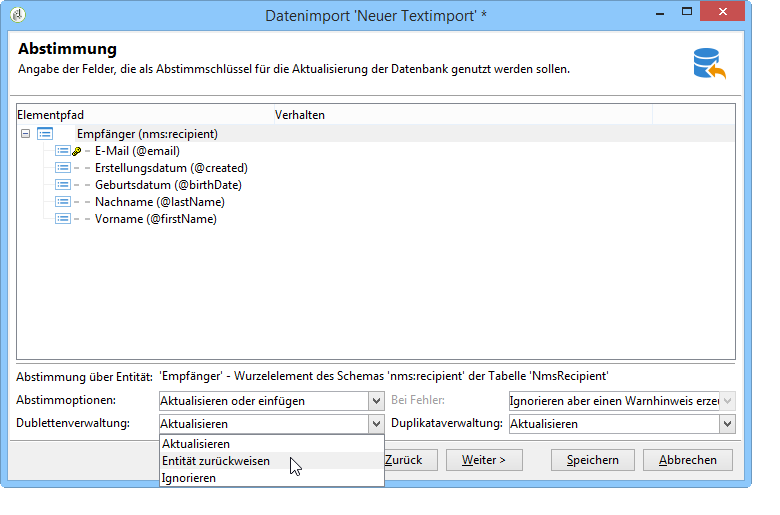

#### Vorgangstypen {#types-of-operation}

Für jede vom Import betroffene Tabelle ist anzugeben, was mit den Datensätzen geschehen soll. Für das Hauptelement der Datenbank bestehen folgende Möglichkeiten:

* **[!UICONTROL Aktualisieren oder einfügen]**: Aktualisiert Datensätze oder erstellt sie, falls sie noch nicht in der Datenbank existieren.
* **[!UICONTROL Einfügen]**: Erstellt neue Datensätze in der Datenbank.
* **[!UICONTROL Aktualisieren]**: Aktualisiert bestehende Datensätze, ignoriert alle anderen.
* **[!UICONTROL Nur abstimmen]**: Sucht den Datensatz in der Datenbank, ohne ihn zu aktualisieren. Dies ermöglicht beispielsweise die Zuordnung des zu importierenden Empfängerordners in Abhängigkeit von einer Spalte der Datei, ohne die Daten des Ordners zu aktualisieren.
* **[!UICONTROL Löschen]**: Löscht die Datensätze der Datenbank.

Für die Felder der vom Import betroffenen Tabellen stehen folgende Optionen zur Verfügung:

* **[!UICONTROL Aktualisieren (löschen), wenn der Quelldatensatz leer ist]**: Löscht den Wert des Datenbankfelds, wenn das Feld im Quelldokument leer ist. Ansonsten wird der Wert aus der Datenbank beibehalten.
* **[!UICONTROL Nur aktualisieren, wenn das Zielfeld leer ist]**: Wenn das Datenbankfeld bereits einen Wert enthält, wird dieser beibehalten. Ansonsten wird der Wert der Quelldatei eingefügt.
* **[!UICONTROL Nur bei Einfügen des Datensatzes aktualisieren]**: Bei Aktualisierungs- oder Ergänzungsvorgängen werden nur die Datensätze der Quelldatei importiert, die neu in der Datenbank sind.

>[!NOTE]
>
>Außer bei einem Import ohne Deduplizierung ist die Angabe eines Abstimmschlüssels **zwingend erforderlich**.

#### Abstimmschlüssel {#reconciliation-keys}

Für die Deduplizierung ist die Angabe von mindestens einem Abstimmschlüssel erforderlich.

Unter einem Abstimmschlüssel versteht man eine Kombination von Feldern, die die eindeutige Identifizierung eines Datensatzes ermöglicht. Beim Import von Empfängern können z. B. die Kundennummer, die E-Mail-Adresse oder eine Kombination aus Vor- und Nachname sowie Firma als Abstimmschlüssel verwendet werden.

Die Import-Engine vergleicht für jedes Feld des Abstimmschlüssels die Werte der Quelldatei mit denen der Datenbank, um bereits existierende Datensätze zu identifizieren. Je spezifischer die Felder für einen Datensatz sind, desto genauer lassen sich Quell- und Zieldaten vergleichen und desto besser kann die Integrität der Daten nach erfolgtem Import gewährleistet werden. Es besteht die Möglichkeit, einen zweiten Abstimmschlüssel für eine Tabelle anzugeben. Dieser kommt bei den Datensätzen zum Tragen, bei denen die Felder des ersten Schlüssels leer sind.

Um die Erstellung doppelter Datensätze zu vermeiden, dürfen im Abstimmschlüssel keine Felder verwendet werden, die beim Import verändert werden könnten.

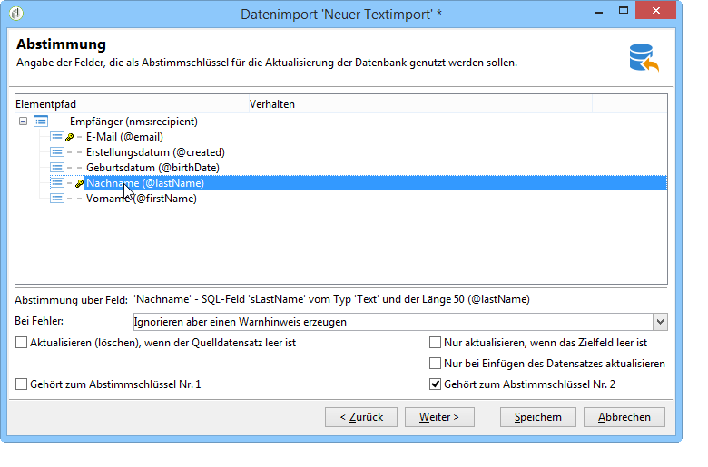

>[!NOTE]
>
>Bei einem Empfängerimport wird die Kennung des ausgewählten Ordners implizit zum Schlüssel hinzugefügt.
>
>Die Abstimmung wird daher nur für diesen Ordner durchgeführt (es sei denn, es ist kein Ordner ausgewählt).

#### Deduplizierung {#deduplication}

>[!NOTE]
>
>Eine Dublette ist ein Element, das mindestens zweimal in der zu importierenden Datei enthalten ist.
>
>Ein Duplikat ist ein Element, das sowohl in der Quelldatei als auch in der Datenbank enthalten ist.

Das Feld **[!UICONTROL Dublettenverwaltung]** dient der Konfiguration der Deduplizierung in Bezug auf Dubletten. Deduplizierung in Bezug auf Dubletten, d. h. Einträge, die wiederholt in der **Quelldatei** (oder den Quelldateien bei einem multiplen Import) vorkommen. Bei Dubletten sind die den Abstimmschlüssel bildenden Felder identisch.

* Im Modus **[!UICONTROL Aktualisieren]** löst die Duplikatverwaltung keine Deduplizierung aus. Dies bedeutet, dass der neueste Datensatz Priorität vor älteren Datensätzen hat. Demzufolge werden Duplikate in diesem Modus nicht gezählt.
* In den Modi **[!UICONTROL Ignorieren]** oder **[!UICONTROL Entität zurückweisen]** werden Duplikate beim Import durch die Duplikatverwaltung ausgeschlossen, d. h. keiner der wiederholt vorkommenden Datensätze wird importiert.
* Im Modus **[!UICONTROL Entität zurückweisen]** werden die entsprechenden Datensätze nicht importiert und im Importprotokoll wird ein Fehler ausgewiesen.
* Im Modus **[!UICONTROL Ignorieren]** werden die entsprechenden Datensätze ebenfalls nicht importiert, der Fehler wird jedoch nicht protokolliert. Dies optimiert die Performance der Anwendung.

>[!IMPORTANT]
>
>Die Deduplizierung erfolgt nur im Speicher, was die Größe eines Imports mit Deduplizierung limitiert. Die Limitierung hängt von diversen Parametern ab (Kapazität des Anwendungs-Servers, Aktivität, Anzahl der Felder im Schlüssel usw.). Als Richtlinie kann man von einer maximalen Größe von 1.000.000 Zeilen für einen Import mit Deduplizierung ausgehen.

Deduplizierung bezieht sich auf einen Datensatz, der sowohl in der Quelldatei als auch in der Datenbank vorhanden ist. Es kommt nur bei Importen mit Datenaktualisierung zum Tragen (**[!UICONTROL Aktualisieren und einfügen]** oder **[!UICONTROL Aktualisieren]**). Die Option **[!UICONTROL Duplikataverwaltung]** ermöglicht es, einen Datensatz entweder zu aktualisieren oder zu ignorieren, wenn er sowohl in der Quelldatei als auch der Datenbank vorkommt. Die Option **[!UICONTROL Je nach Herkunft aktualisieren oder hinzufügen]** ist Teil eines optionalen Moduls, sie steht im Standardkontext nicht zur Verfügung.

Die Optionen **[!UICONTROL Zurückweisen]** und **[!UICONTROL Ignorieren]** arbeiten auf die gleiche Weise wie zuvor beschrieben.

### Beim Auftreten von Fehlern {#behavior-in-the-event-of-an-error}

Beim Datentransfer treten häufig Fehler auf, die von verschiedener Natur sein können (inkohärentes Zeilenformat, ungültige E-Mail-Adresse usw.). Alle von der Import-Engine erzeugten Fehlermeldungen und Warnhinweise werden gespeichert und mit der Importinstanz verknüpft.

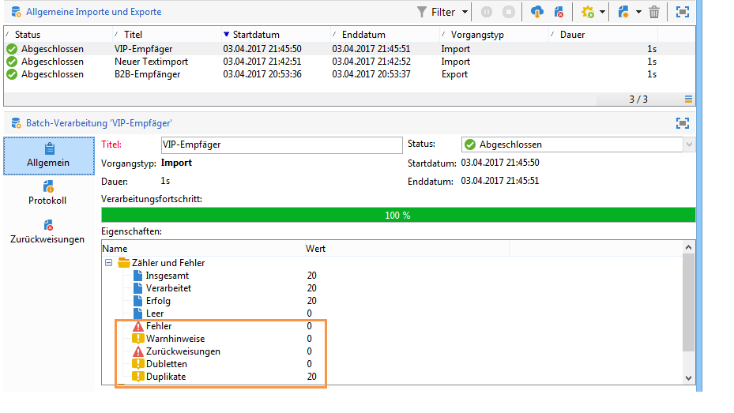

Im Tab **[!UICONTROL Zurückweisungen]** können Details eingesehen werden.

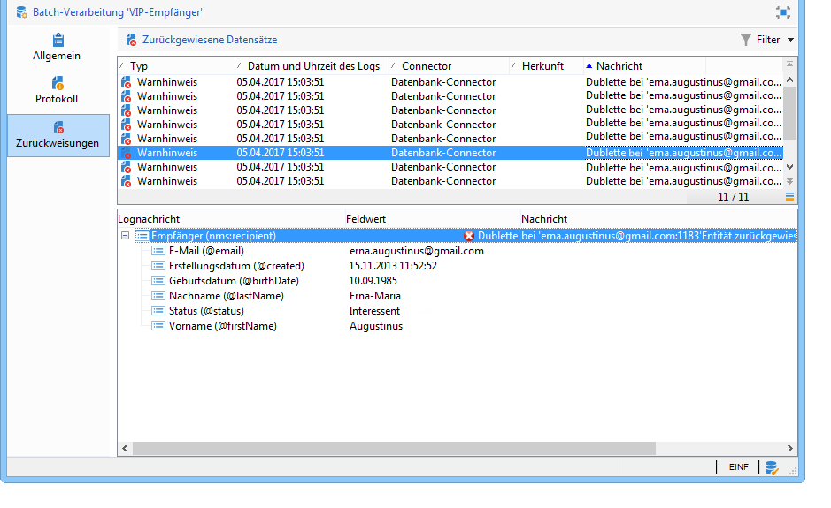

Zurückweisungen können zwei verschiedenen, in der Spalte **[!UICONTROL Connector]** angezeigten Typen zugeordnet werden:

* Zurückweisungen des Text-Connectors beziehen sich auf Fehler, die bei der Verarbeitung einer Zeile auftreten (berechnetes Feld, Datumsanalyse usw.). In diesem Fall wird die gesamte Zeile zurückgewiesen.
* Zurückweisungen des Datenbank-Connectors beziehen sich auf Fehler, die bei der Abstimmung oder beim Schreiben der Daten in die Datenbank auftreten. Bei Importen in mehrere Tabellen betrifft die Zurückweisung u. U. nur einen Teil des Datensatzes. So kann beispielsweise beim Import von Empfängern und zugeordneten Ereignissen ein Fehler die Aktualisierung eines Ereignisses verhindern, ohne jedoch den Empfänger zurückzuweisen.

Auf der Abstimmungsseite besteht die Möglichkeit, für jedes Feld und jede Tabelle gesondert den Umgang mit Fehlern festzulegen.

* **[!UICONTROL Ignorieren aber einen Warnhinweis erzeugen]**: Es werden alle Felder in die Datenbank importiert, ausgenommen das Feld, das den Fehler erzeugt hat.
* **[!UICONTROL Übergeordnetes Element zurückweisen]**: Die gesamte Zeile wird zurückgewiesen (nicht nur das den Fehler auslösende Feld).

* **[!UICONTROL Alle Elemente zurückweisen]**: Der Import wird gestoppt und alle Elemente des Datensatzes werden zurückgewiesen.

  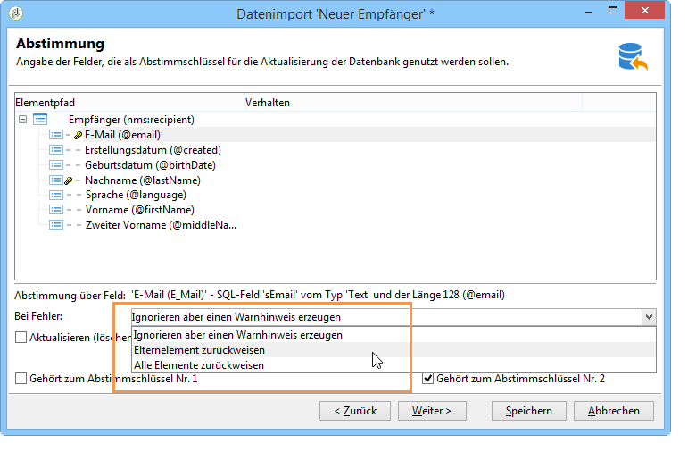

Der Navigationsbaum im Zurückweisungsbildschirm einer Importinstanz zeigt die zurückgewiesenen Felder und aufgetretene Fehler an.

Über das Symbol **[!UICONTROL Zurückweisungen exportieren]** können Sie eine Datei mit den entsprechenden Informationen erzeugen.

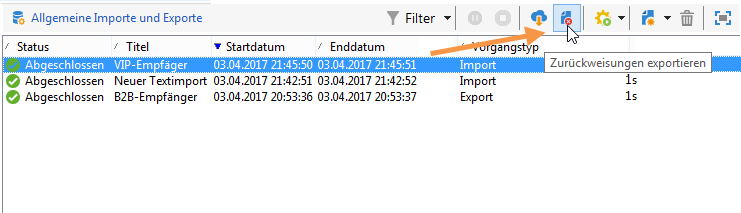

#### Schritt 5 – Zusätzlicher Schritt beim Import von Empfängern {#step-5---additional-step-when-importing-recipients}

Der folgende Schritt im Import-Assistenten ermöglicht die Auswahl oder Erstellung eines Importordners, die automatische Zuordnung der importierten Empfangenden zu einer neuen oder existierenden Liste und ihre Anmeldung für Informationsdienste.

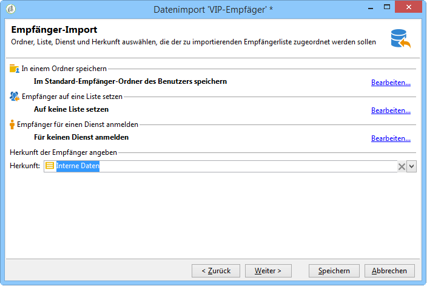

>[!NOTE]
>
>Dieser Schritt wird nur beim Importieren von Empfängern und bei Verwendung der standardmäßigen Adobe Campaign-Empfängertabelle (**nms:recipient**) angezeigt.

* Klicken Sie auf den **[!UICONTROL Bearbeiten]**-Link, um den Ordner, die Liste oder den Dienst auszuwählen, mit denen die Empfänger verknüpft werden sollen.

   1. In einem Ordner speichern

      Der **[!UICONTROL Bearbeiten...]**-Link der Option **[!UICONTROL In einen Ordner importieren]** ermöglicht die Auswahl oder die Erstellung des Ordners, in den die Empfänger importiert werden sollen. Falls nicht anders angegeben, werden die Daten in den Standard-Ordner des Benutzers eingefügt.

      >[!NOTE]
      >
      >Der Standardordner des Benutzers entspricht dem ersten Ordner, für den der Benutzer Schreibzugriff hat. Weitere Informationen finden Sie unter [Verwalten von Ordnern und Ansichten](../audiences/folders-and-views.md).

      Klicken Sie zur Auswahl des Importordners auf den Pfeil rechts des **[!UICONTROL Ordner]**-Feldes und wählen Sie den gewünschten Ordner aus. Über das Symbol **[!UICONTROL Verknüpftes Element auswählen]** können Sie den Navigationsbaum in einem neuen Fenster anzeigen und einen neuen Ordner erstellen.

      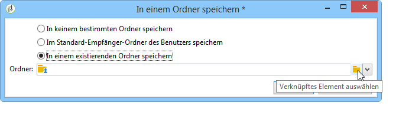

      Wählen Sie zur Erstellung eines neuen Ordners den Knoten aus, in den der Ordner eingefügt werden soll, und klicken Sie mit der rechten Maustaste. Wählen Sie **[!UICONTROL Empfänger-Ordner hinzufügen]**.

      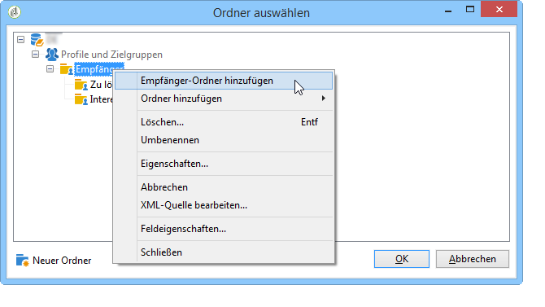

      Der Ordner wird als Unterordner des aktuellen Knotens eingefügt. Geben Sie den Namen des neuen Ordners an, drücken Sie zum Bestätigen die Enter-Taste und klicken Sie auf **[!UICONTROL OK]**.

      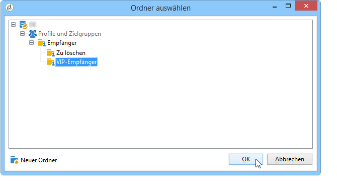

   1. Einer Liste zuordnen

      Der **[!UICONTROL Bearbeiten...]**-Link der Option **[!UICONTROL Empfänger auf eine Liste setzen]** ermöglicht die Auswahl oder die Erstellung der Liste, zu der die Empfänger hinzugefügt werden sollen.

      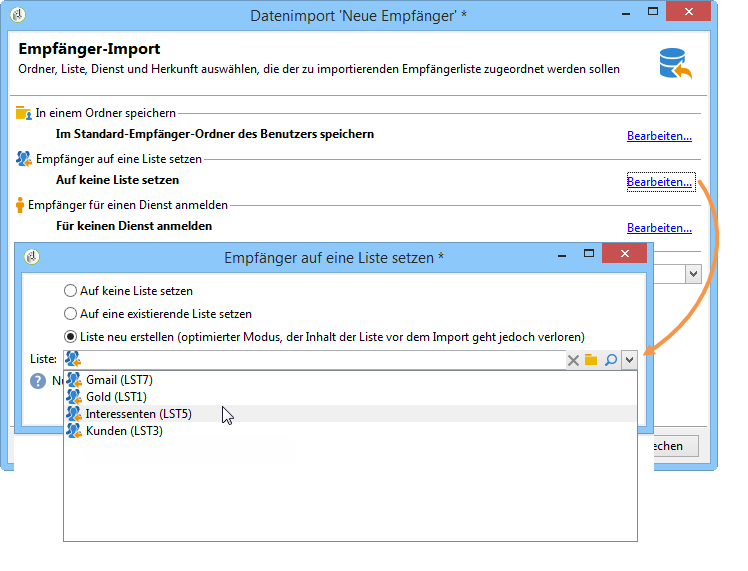

      Sie können eine neue Liste für diese Empfängerinnen und Empfänger erstellen, indem Sie auf **[!UICONTROL Verknüpftes Element auswählen]** und dann auf **[!UICONTROL Erstellen]** klicken. 

      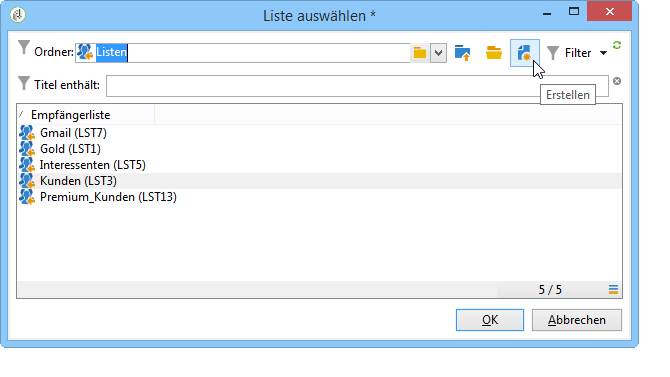

      Es besteht die Möglichkeit, eine Liste um die neuen Empfänger zu ergänzen oder ihren Inhalt zu löschen und durch die importierten Daten zu ersetzen.

   1. Anmeldung für einen Dienst

      Um alle importierten Empfänger für einen Informationsdienst anzumelden, klicken Sie auf den Link **[!UICONTROL Bearbeiten...]** der Option **[!UICONTROL Empfänger für einen Dienst anmelden]**, um den Informationsdienst auszuwählen oder zu erstellen, für den die Empfänger angemeldet werden sollen. Aktivieren Sie **[!UICONTROL Benachrichtigung versenden]**, wenn die Empfänger von der Anmeldung in Kenntnis gesetzt werden sollen. Der Benachrichtigungsinhalt wird in den die An- und Abmeldungen betreffenden Versandvorlagen bestimmt.

      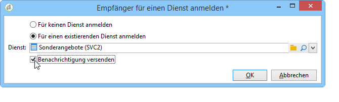

      Sie haben auch die Möglichkeit, einen neuen Informationsdienst für diese Empfängerinnen und Empfänger zu erstellen. Klicken Sie hierfür auf **[!UICONTROL Verknüpftes Element auswählen]** und dann auf das Symbol **[!UICONTROL Erstellen]**. Informationsdienste werden in [diesem Abschnitt](../start/subscriptions.md) näher erläutert.

* Das Feld **[!UICONTROL Herkunft]** bietet die Möglichkeit, eine Information bezüglich der Empfängerherkunft im Profil zu hinterlegen. Dies ist insbesondere bei multiplen Importen empfehlenswert.

Klicken Sie auf **[!UICONTROL Weiter]**, um die in diesem Schritt vorgenommenen Konfigurationen zu bestätigen.

## &#x200B;6. Schritt – Import starten {#step-6---launching-the-import}

Im letzten Schritt des Assistenten wird der Datenimport ausgelöst. Klicken Sie hierfür auf die Schaltfläche **[!UICONTROL Starten]**.

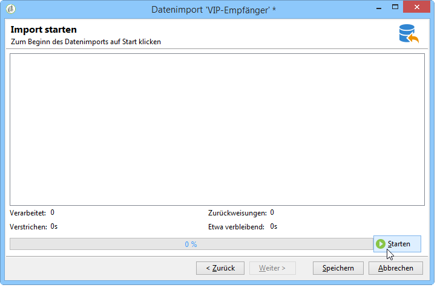

Anschließend können Sie die Ausführung des Importauftrages überwachen (siehe [Überwachen der Workflow-Ausführung](../../automation/workflow/monitor-workflow-execution.md)).

### Exportieren von Daten

Mit Exportaufträgen können Sie Daten aus der Datenbank aufrufen und extrahieren: Kontakte, Kundinnen und Kunden, Listen, Segmente usw.

So kann es sinnvoll sein, Tracking-Daten von Kampagnen (Tracking-Verlauf usw.) in einer Tabelle zu verwenden. Die Ausgabedaten können in den Formaten *.txt, *.csv, *.tab oder *.xml vorliegen.

Mit dem Export-Assistenten können Sie einen Export konfigurieren, seine Optionen definieren und die Ausführung starten. Es handelt sich dabei um eine Reihe von Bildschirmen, deren Inhalt von der Art des Exports (einfach oder mehrfach) und den Rechten des Benutzers abhängt.

Der Export-Assistent wird nach dem Erstellen eines neuen Exportauftrags angezeigt.

#### &#x200B;1. Schritt – Exportvorlage auswählen {#step-1---choosing-the-export-template}

Beim Start des Export-Assistenten muss zunächst eine Vorlage ausgewählt werden. Um beispielsweise den Export von Empfangenden zu konfigurieren, die sich kürzlich angemeldet haben, gehen Sie folgendermaßen vor:

1. Gehen Sie zum Ordner **[!UICONTROL Profile und Zielgruppen > Vorgang > Allgemeine Importe und Exporte]**.
1. Wählen Sie **Neu** und danach **Exportieren** aus, um die Exportvorlage zu erstellen.

   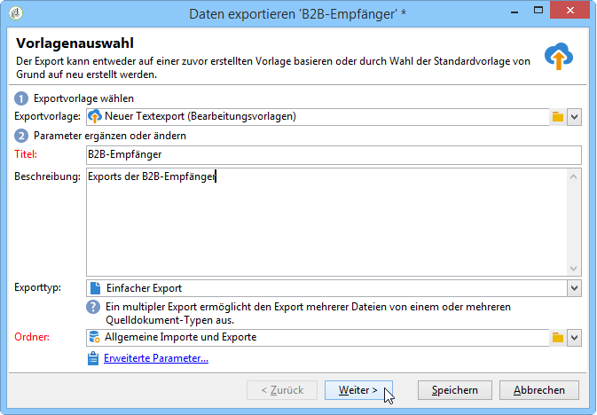

1. Klicken Sie zur Auswahl der gewünschten Vorlage rechts vom Feld **[!UICONTROL Exportvorlage]** entweder auf den Pfeil oder auf **[!UICONTROL Verknüpftes Element auswählen]**, um den Navigationsbaum zu durchsuchen.

   Die native Vorlage lautet **[!UICONTROL Neuer Textexport]**. Diese Vorlage darf nicht geändert werden. Sie können sie jedoch duplizieren, um eine neue Vorlage zu konfigurieren. Standardmäßig werden Exportvorlagen im Knoten **[!UICONTROL Ressourcen > Vorlagen > Bearbeitungsvorlagen]** gespeichert.

1. Geben Sie im Feld **[!UICONTROL Titel]** einen Namen für den Export ein und fügen Sie eventuell eine Beschreibung hinzu.
1. Wählen Sie den Exporttyp aus. Es gibt zwei mögliche Exporttypen: **[!UICONTROL Einfacher Export]**, um nur eine Datei zu exportieren, und **[!UICONTROL Mehrfacher Export]**, um mehrere Dateien in einer Ausführung zu exportieren, u. U. mit verschiedenen Quelldokumenttypen.

## &#x200B;2. Schritt – Dateityp zum exportieren auswählen {#step-2---type-of-file-to-export}

Wählen Sie den Typ des zu exportierenden Dokuments aus, d. h. das Schema der zu exportierenden Daten.

Bei einem vom Knoten **[!UICONTROL Vorgänge]** ausgehenden Export wird standardmäßig die Empfängertabelle vorgeschlagen. Wenn der Export von einer Liste ausgehend gestartet wird (durch **[!UICONTROL Rechtsklick > Export]**), wird der **[!UICONTROL Dokumenttyp]** in der Tabelle, zu der die Daten gehören, automatisch ausgefüllt.

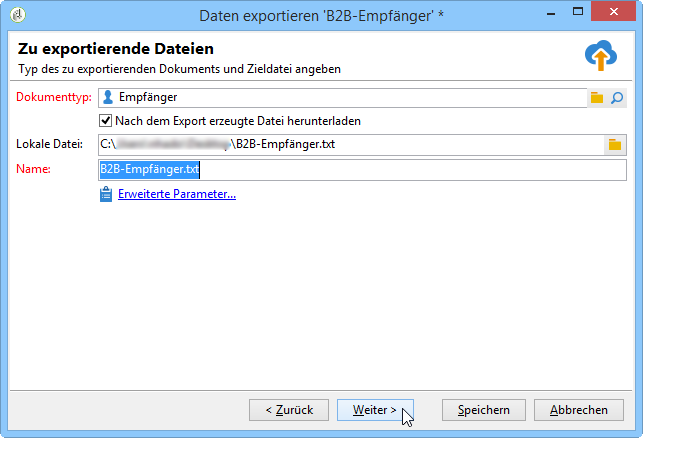

* Standardmäßig ist die Option **[!UICONTROL Nach dem Export erzeugte Datei herunterladen]** aktiviert: Geben Sie in diesem Fall den Namen der zu erstellenden Datei im Feld **[!UICONTROL Lokale Datei]** an oder durchsuchen Sie Ihre lokale Festplatte, indem Sie auf das Ordnersymbol rechts vom Feld klicken. Sie haben die Möglichkeit, diese Option abzuwählen und den Pfad und Namen der Ausgabedatei auf dem Server anzugeben.

  >[!NOTE]
  >
  >Automatische Im- und Exporte werden stets auf dem Server durchgeführt.
  >
  >Sollten Sie nur einen Teil der Daten exportieren wollen, klicken Sie auf **[!UICONTROL Erweiterte Parameter...]** und geben Sie die Anzahl der zu exportierenden Zeilen an.

* Sie können einen Differenzexport erstellen, um nur Einträge zu exportieren, die seit der letzten Ausführung geändert wurden. Klicken Sie hierfür auf **[!UICONTROL Erweiterte Parameter...]** und aktivieren Sie auf der Registerkarte **[!UICONTROL Differenzexport]** die Option **[!UICONTROL Differenzexport aktivieren]**.

  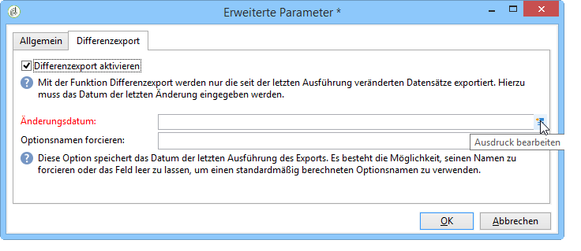

  Hier ist die Angabe des Datums der letzten Änderung erforderlich. Dies geschieht durch Abruf aus einem Feld oder durch Berechnung.

### &#x200B;3. Schritt – Ausgabeformat bestimmen {#step-3---defining-the-output-format}

Wählen Sie nun das Ausgabeformat der Exportdatei aus. Mögliche Formate sind Text, Text in festen Spalten, CSV und XML.

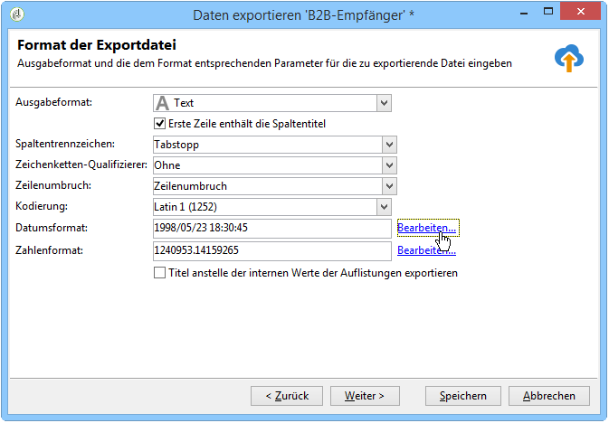

* Beim Format **[!UICONTROL Text]** sind die Spaltentrennzeichen (Tabstopp, Komma, Semikolon oder Sonstige) sowie die Zeichenfolgen-Qualifizierer (Ohne, Doppelte Anführungszeichen, Einfache Anführungszeichen) anzugeben.
* Bei den Formaten **[!UICONTROL Text]** und **[!UICONTROL CSV]** besteht die Möglichkeit, die Option **[!UICONTROL Erste Zeile enthält die Spaltentitel]** anzukreuzen.
* Geben Sie das Format von Datum und Zahl an. Klicken Sie dazu auf die Schaltfläche **[!UICONTROL Bearbeiten]** für das entsprechende Feld und verwenden Sie den Editor.
* Bei Feldern, die Aufzählungswerte enthalten, können Sie **[!UICONTROL Titel anstelle der internen Werte der Auflistungen exportieren]** auswählen. Beispielsweise kann der Titel im Formular gespeichert werden **1 = Herr**, **2 = Fräulein**, **3 = Frau**. Wenn diese Option ausgewählt wird, werden **Mr.**, **Miss** und **Mrs.** exportiert.

#### &#x200B;4. Schritt – Daten auswählen {#step-4---data-selection}

Wählen Sie die zu exportierenden Felder aus. Gehen Sie dazu folgendermaßen vor:

1. Wählen Sie per Doppelklick die gewünschten Felder in der Liste **[!UICONTROL Verfügbare Felder]** aus, um sie zum Bereich **[!UICONTROL Ausgabespalten]** hinzuzufügen.
1. Mit den Pfeilen rechts neben der Liste können Sie die Reihenfolge der Felder in der Ausgabedatei festlegen.

   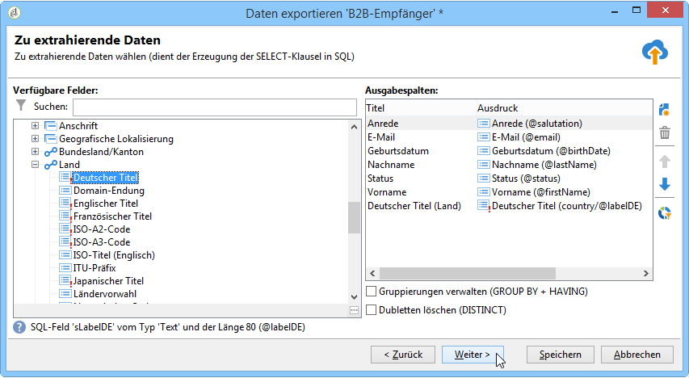

1. Klicken Sie auf die Schaltfläche **[!UICONTROL Hinzufügen]**, um Funktionen aufzurufen. 

#### &#x200B;5. Schritt – Spalten sortieren {#step-5---sorting-columns}

An dieser Stelle kann die Sortierreihenfolge der einzelnen Spalten festgelegt werden.

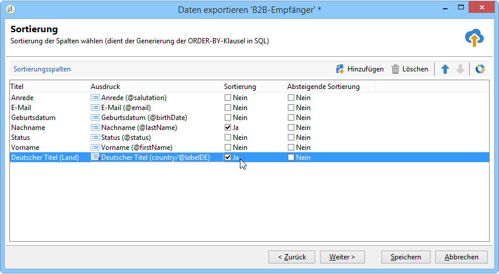

#### &#x200B;6. Schritt – Filterbedingungen {#step-6---filter-conditions-}

Um nicht alle Datensätze zu exportieren, haben Sie die Möglichkeit, Filterbedingungen zu konfigurieren. Die Vorgehensweise beim Filtern entspricht der Zielgruppenbestimmung im Versandassistenten. 

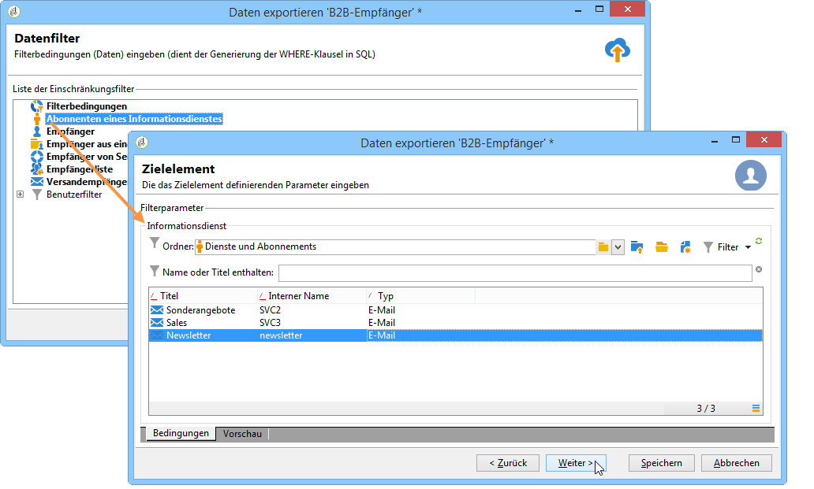

#### &#x200B;7. Schritt – Daten formatieren {#step-7---data-formatting}

An dieser Stelle können die Reihenfolge der Spalten in der Ausgabedatei und ihre Titel festgelegt sowie die Schreibweise der Quelldaten angepasst werden.

* Die Reihenfolge der zu exportierenden Spalten lässt sich mithilfe der blauen Pfeile rechts von der Tabelle ändern.
* Der Titel eines Felds lässt sich ändern, indem Sie in die Zelle der **[!UICONTROL Titel]**-Spalte klicken, die dem zu ändernden Feld entspricht. Nun können Sie den neuen Titel eingeben. Bestätigen Sie die Eingabe durch Enter.
* In der Spalte **[!UICONTROL Schreibweise]** haben Sie die Möglichkeit, Groß- und Kleinschreibung zu verändern. Wählen Sie zwischen:

   * Alles in Großbuchstaben
   * Alles in Kleinbuchstaben
   * Ersten Buchstaben großschreiben

  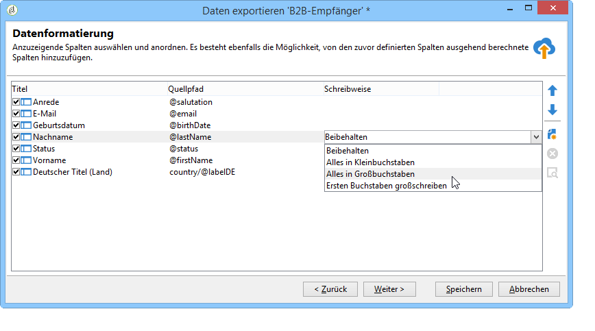

* Verwenden Sie die Schaltfläche **[!UICONTROL Berechnetes Feld hinzufügen]**, um eine neue Spalte zu erstellen (z. B. eine Spalte mit Vor- und Nachnamen). Weiterführende Informationen hierzu finden Sie im Abschnitt „Datenimport“.

Wenn Sie eine Sammlung von Elementen exportieren (beispielsweise Abonnements von Empfängerinnen und Empfängern, Listen, denen sie angehören usw.), müssen Sie angeben, wie viele Elemente der Sammlung exportiert werden sollen.

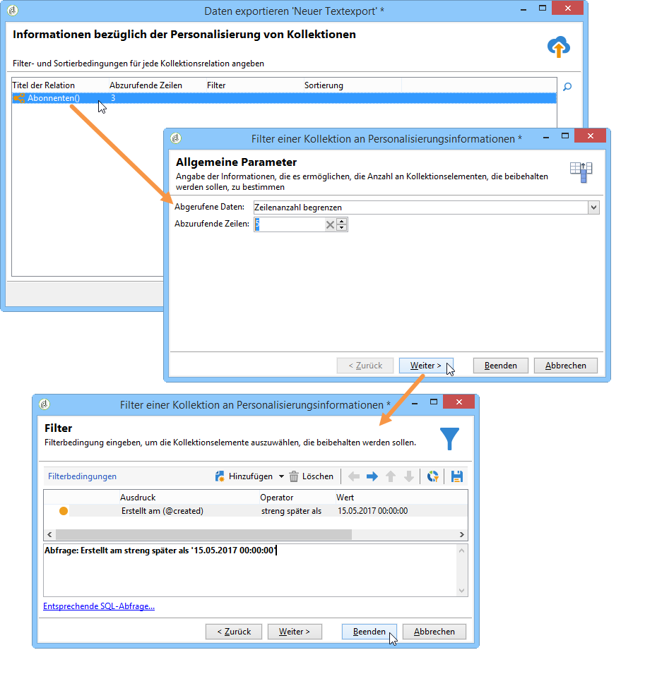

#### &#x200B;8. Schritt – Datenvorschau {#step-8---data-preview}

Klicken Sie auf **[!UICONTROL Datenvorschau starten]**. Standardmäßig werden die ersten 200 Zeilen des Ergebnisses des Exports angezeigt. Durch Eingabe eines anderen Werts im Feld **[!UICONTROL Angezeigte Zeilen]** können Sie die Liste Ihren Bedürfnissen gemäß anpassen.

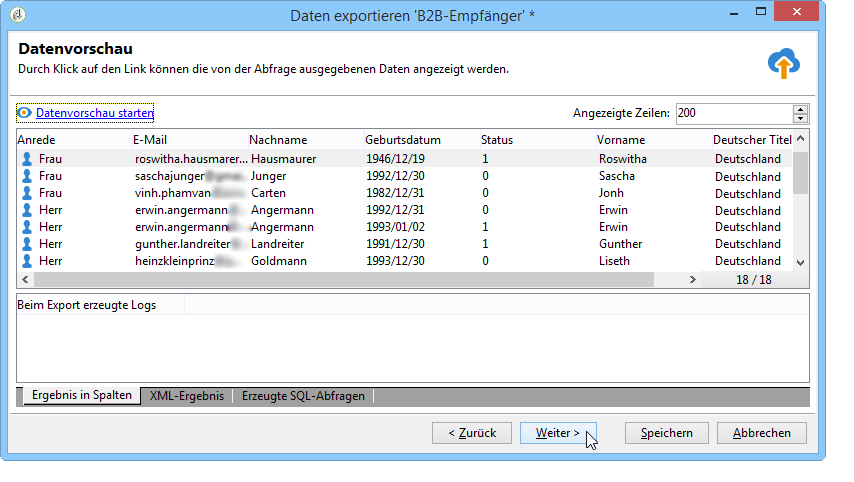

Durch Klick auf die Registerkarten unten im Fenster können Sie von der Ergebnisansicht in Spalten zur XML-Anzeige wechseln. Sie können außerdem die generierten SQL-Abfragen anzeigen.

#### &#x200B;9. Schritt – Export starten {#step-9---launching-the-export}

Klicken Sie auf die Schaltfläche **[!UICONTROL Starten]**, um den Exportprozess zu beginnen.

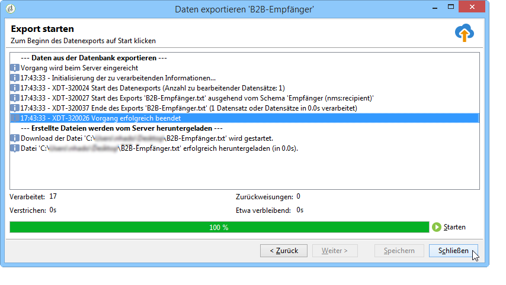

Anschließend können Sie die Ausführung des Importauftrages überwachen.

## Erfassen von Profilen über Web-Anwendungen

Verwenden Sie Campaign, um Web-Formulare zu erstellen und Profilinformationen einfach und effizient zu erfassen und zu verwalten. Sie können diese Formulare auf Ihrer Website freigeben, sodass Ihre Kontakte ihre Informationen einfach bereitstellen können. Ihre Informationen werden an Campaign gesendet, um ein Profil zu erstellen oder dessen Daten zu aktualisieren, sofern diese bereits in der Datenbank vorhanden sind.

In der [Dokumentation zu Campaign Classic v7](https://experienceleague.adobe.com/docs/campaign-classic/using/designing-content/web-forms/about-web-forms.html?lang=de){target="_blank"} erfahren Sie, wie Sie Web-Formulare erstellen.

**Verwandte Themen**

* [Erstellen von Zielgruppen](audiences.md)
* [Profile deduplizieren](../../automation/workflow/deduplication-merge.md)
* [Profildaten anreichern](../../automation/workflow/enrich-data.md)
