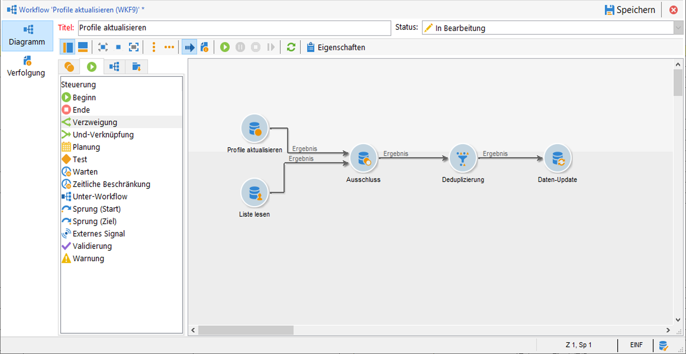
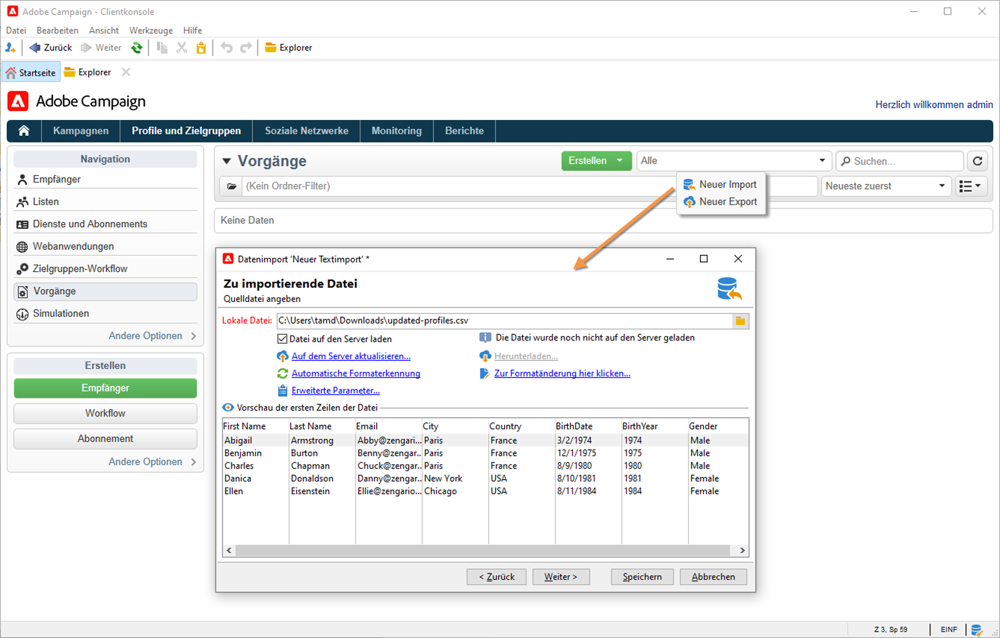
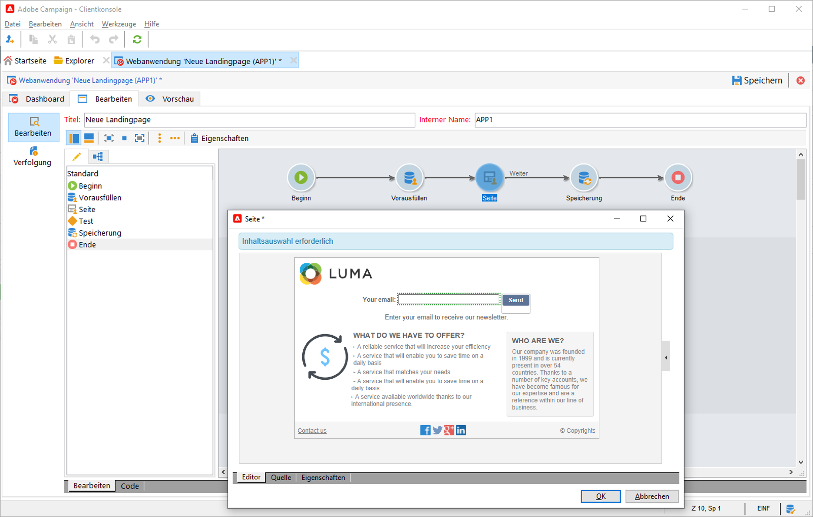

# Importieren von Daten in Campaign {#ootb-profiles}

Campaign unterstützt Sie beim Hinzufügen von Kontakten zur Cloud-Datenbank. Sie können eine Datei laden, mehrere Kontaktaktualisierungen planen und automatisieren, Daten im Web erfassen oder Profilinformationen direkt in die Empfängertabelle eingeben.

:bulb: Erste Schritte mit [Zielgruppen](audiences.md)
:bulb: Erläuterung von Campaign [Datenmodell](../dev/datamodel.md)

## Profile in einen Workflow importieren

Profilimporte werden in dedizierten Vorlagen konfiguriert, die über Workflows über die Aktivität **Import** ausgeführt werden. Sie können automatisch anhand eines Zeitplans wiederholt werden, um beispielsweise den Datenaustausch zwischen verschiedenen Informationssystemen zu automatisieren. Weitere Informationen finden Sie in der [Campaign Classic v7-Dokumentation](https://experienceleague.adobe.com/docs/campaign-classic/using/getting-started/importing-and-exporting-data/import-export-workflows.html).

Weitere Informationen finden Sie in der Campaign Classic v7-Dokumentation:

:arrow_upper_right: [Erste Schritte mit Importen und Exporten](https://experienceleague.adobe.com/docs/campaign-classic/using/getting-started/importing-and-exporting-data/get-started-data-import-export.html)

:arrow_upper_right: [Best Practices beim Import und Export](https://experienceleague.adobe.com/docs/campaign-classic/using/getting-started/importing-and-exporting-data/best-practices/import-export-best-practices.html)

:arrow_upper_right: [Import konfigurieren und ausführen](https://experienceleague.adobe.com/docs/campaign-classic/using/getting-started/importing-and-exporting-data/generic-imports-exports/executing-import-jobs.html)

## Einzelimport ausführen

Erstellen Sie einen generischen Datenimportauftrag und führen Sie ihn aus, um Kontakte in die Cloud-Datenbank zu laden.

:arrow_upper_right: Erfahren Sie in der [Campaign Classic v7-Dokumentation](https://experienceleague.adobe.com/docs/campaign-classic/using/getting-started/importing-and-exporting-data/generic-imports-exports/about-generic-imports-exports.html) , wie Sie Einzelimport-Aufträge ausführen, um Ihre Datenbank zu versorgen.

## Erfassen von Profilen über Web-Apps

Verwenden Sie Campaign, um Webformulare zu erstellen und Profilinformationen einfach und effizient zu erfassen und zu verwalten. Sie können diese Formulare auf Ihrer Website freigeben, sodass Ihre Kontakte ihre Informationen einfach bereitstellen können. Ihre Informationen werden an Campaign gesendet, um ein Profil zu erstellen oder dessen Daten zu aktualisieren, sofern diese bereits in der Datenbank vorhanden sind.

:arrow_upper_right: Erfahren Sie, wie Sie Webformulare in der [Campaign Classic v7-Dokumentation](https://experienceleague.adobe.com/docs/campaign-classic/using/designing-content/web-forms/about-web-forms.html) erstellen.

**Verwandte Themen**

* [Erstellen von Zielgruppen](audiences.md)
* [Profile deduplizieren](https://experienceleague.adobe.com/docs/campaign-classic/using/automating-with-workflows/use-cases/data-management/deduplication-merge.html)
* [Profildaten anreichern](https://experienceleague.adobe.com/docs/campaign-classic/using/automating-with-workflows/use-cases/data-management/enriching-data.html)
